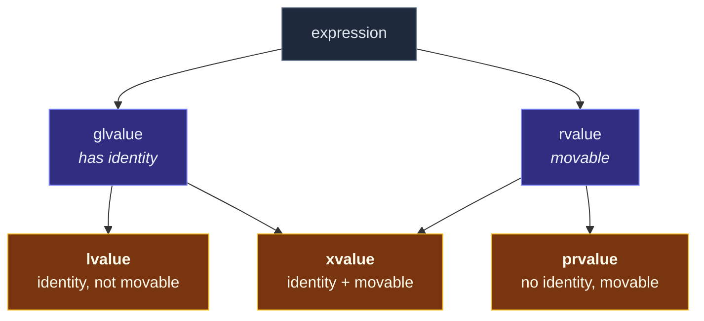

# Value Categories

> [!essence]
> Every expression has a **type** and a **value category**. The category answers two questions: *does the expression denote something with an identity you could refer to again?* and *may its resources be taken?* The three primary categories (**lvalue**, **xvalue**, **prvalue**) are the valid combinations of those two answers. Overload resolution uses them to decide between copying and moving.

## The Problem

C inherited a simple split. An *lvalue* could appear on the left of `=`, and anything else was just a value. For C that was enough: values were small, and copying them was free. C++ changed the economics. Objects now own resources (heap buffers, file handles, sockets), and copying them can cost a memory allocation per element.

> [!principle] Constraint → Consequence → Design
> 1. **Constraint:** Copying a resource-owning object means duplicating the resource. That is slow, and sometimes impossible (a mutex, a socket).
> 2. **Consequence:** Many copies are made *from objects that are about to die*: the temporary returned by a function, a local variable in its `return`. Duplicating a resource only to destroy the original a moment later is pure waste.
> 3. **Requirement:** The compiler must be able to tell, *from the expression alone*, whether its object may be **pilfered** (its resources stolen) or must be left intact. Otherwise a function cannot choose between a cheap move and a safe copy.
> 4. **Design:** Classify every expression along two independent properties: **identity** (it refers to a specific object you could name again) and **movability** (its resources may be reused). Let references bind by category: `T&&` binds only to movable expressions. Then overload resolution routes each argument to a copy or a move.
> 5. **Price:** A five-name taxonomy (lvalue, xvalue, prvalue, glvalue, rvalue) that is famously confusing, and a standard function, `std::move`, whose name describes a *permission* but reads like an *action*.

> [!tension] value ⟷ identity
> Value categories are where C++ reconciles the two ways of seeing an object. As a **value**, it is interchangeable, and its contents can be moved elsewhere. As an **identity**, it is a unique thing at an address that someone else may still be using. The category of an expression tells the compiler which view is safe *at that point in the program*.

## Mental Model

Two yes/no questions give three meaningful answers. The fourth combination (no identity, not movable) serves no purpose, so C++ has no category for it.

```text
                         may its resources be taken?  (movable)
                          no                     yes
                    ┌─────────────────────┬─────────────────────┐
   has identity?    │                     │                     │
   (can be named    │      lvalue         │      xvalue         │  ◀── glvalue
    again, has an   │  "a named object"   │  "an expiring       │      (has identity)
    address)   yes  │   x, *p, a[i]       │   object" move(x)   │
                    ├─────────────────────┼─────────────────────┤
               no   │     (unused)        │      prvalue        │
                    │                     │  "a pure value"     │
                    │                     │   42, x + 1, f()    │
                    └─────────────────────┴─────────────────────┘
                                                    ▲
                                            rvalue (movable) = xvalue ∪ prvalue
```

The two *mixed* categories are just unions of the grid:



> [!model] The house analogy, and where it breaks
> An **lvalue** is a house with a street address: you can visit it again, so you must not strip it. An **xvalue** is a house with an address and a demolition notice: it still exists, but you may take the furniture. A **prvalue** is furniture on a truck with no address yet. It gets an address only when it is delivered somewhere (in C++17 terms, *materialized*).
> **Where it breaks:** categories describe **expressions, not objects**. The same object is an lvalue when you write `s` and an xvalue when you write `std::move(s)`. The demolition notice is on the *expression*, not the house.

## Mechanics

The Standard defines the categories in `[basic.lval]`. The practical rules:

| Expression | Category | Why |
|---|---|---|
| **Name** of a variable, function, or data member: `x`, `r`, `f` | lvalue | Names always have identity, **even if the variable's type is `T&&`**. |
| String literal `"abc"` | lvalue | It is an array object in static storage. |
| Other literals `42`, `3.0`, `true`, `nullptr` | prvalue | Pure values, no object. |
| Call returning `T&` · `T&&` · `T` | lvalue · xvalue · prvalue | The return type encodes the category. |
| `std::move(x)` = `static_cast<T&&>(x)` | xvalue | A cast to rvalue reference grants permission to pilfer. |
| `++x`, `x = y`, `*p`, `a[i]` (built-in) | lvalue | They yield the object itself. |
| `x++`, `x + y`, `&x`, `-x` (built-in) | prvalue | They yield a new value. |
| `a.m` where `a` is an rvalue and `m` a non-static, non-reference data member | xvalue | A member of an expiring object is expiring. |
| Lambda expression, `this` | prvalue | Pure values. |

**How categories drive binding.** Reference binding is where categories have visible consequences:

| Parameter type | Accepts lvalues | Accepts rvalues | Typical role |
|---|---|---|---|
| `T&` | ✓ | ✗ (ill-formed) | modify the caller's object |
| `const T&` | ✓ | ✓ (lifetime-extends temporaries) | read-only, "copy if needed" |
| `T&&` | ✗ | ✓ | take ownership / move from |
| `T` (by value) | ✓ copies | ✓ moves (or elides) | "sink" parameters |

When both `const T&` and `T&&` overloads exist, an rvalue argument prefers `T&&` (`[over.ics.rank]`). That single tie-breaker is the entire routing mechanism of [[Move Semantics]].

> [!standard] C++17: prvalues are not objects
> Since C++17 (P0135), a prvalue is a *recipe for initializing an object*, not a temporary object. It becomes an object only when **materialized**: for example, when it is bound to a reference, when a member is accessed, or when it is discarded (the *temporary materialization conversion*, `[conv.rval]`). When a prvalue initializes an object of the same type, it initializes that object **directly**. That is why [[Copy Elision and RVO|copy elision]] of returned prvalues is guaranteed, not an optimization.

**Asking the compiler.** `decltype((e))` (note the double parentheses) reports the category of `e` in its type: `T&` for an lvalue, `T&&` for an xvalue, plain `T` for a prvalue. The second example below uses this to build a category probe. See [[decltype and decltype(auto)]].

## Under the Hood

> [!machine] Categories cost nothing at run time
> Value categories exist only in the compiler's type checker. No bit in memory marks an object as "movable". Everything happens at compile time: the category picks an overload, and the chosen function does the work. So `std::move` compiles to **no instructions**: it is a cast, and GCC emits the same code for returning `x` as an lvalue or as an xvalue (GCC 13, `-O2`, x86-64):
> ```nasm
> as_lvalue(int&):        ; int&  as_lvalue(int& x) { return x; }
>         mov  rax, rdi   ; return the address you were given
>         ret
> as_xvalue(int&):        ; int&& as_xvalue(int& x) { return std::move(x); }
>         mov  rax, rdi   ; identical: the "move" is only a type change
>         ret
> ```

The **prvalue-initializes-directly** rule is visible in the calling convention. A function returning a `std::string` by value never builds a temporary and copies it out. The caller reserves storage for the *result object* and passes its address in a hidden register (`rdi` on the System V ABI). The callee constructs the string straight into it:

```text
 caller's frame                                 callee  make(const char*)
┌───────────────────────────────┐
│ std::string s  (result object)│◀── rdi ────  constructs directly here:
│  ┌─────────────────────────┐  │               mov QWORD PTR [rdi], r13
│  │ ptr ●─▶ local SSO buffer │  │                (r13 = rdi+16, the inline buffer)
│  │ size                    │  │
│  │ buffer[16]              │  │               no temporary, no copy, no move
│  └─────────────────────────┘  │
└───────────────────────────────┘
```

## In Code

**1 · Watching overload resolution sort by category**

```cpp
#include <iostream>
#include <string>
#include <utility>

std::string make() { return "temporary"; }

void probe(std::string&)  { std::cout << "lvalue overload\n"; }  // ①
void probe(std::string&&) { std::cout << "rvalue overload\n"; }  // ②

int main() {
    std::string s = "named";
    probe(s);               // ③
    probe(make());          // ④
    probe(std::move(s));    // ⑤
    std::string&& r = make();
    probe(r);               // ⑥
}
// expect: lvalue overload
// expect: rvalue overload
```
1. Binds lvalues only.
2. Binds rvalues (xvalues and prvalues) only.
3. `s` is a name → lvalue → ①.
4. A call returning by value is a prvalue → ②.
5. `std::move(s)` is an xvalue → ②. Nothing has moved yet; `probe` merely *could* move.
6. **The classic surprise:** `r` has type `std::string&&`, but the *expression* `r` is a name, so it is an lvalue → ①. A named rvalue reference is an lvalue. To pass it on as an rvalue you must say `std::move(r)` again.

**2 · A category probe built from `decltype((e))`**

```cpp
#include <iostream>
#include <type_traits>
#include <utility>

template <typename T>
constexpr const char* category() {
    if constexpr (std::is_lvalue_reference_v<T>) return "lvalue";
    else if constexpr (std::is_rvalue_reference_v<T>) return "xvalue";
    else return "prvalue";
}
#define CATEGORY(...) category<decltype((__VA_ARGS__))>()   // ① double parentheses

struct Point { int x, y; };
Point origin() { return {0, 0}; }

int main() {
    int n = 0;
    int* p = &n;
    std::cout << CATEGORY(n) << ' ' << CATEGORY(42) << ' ' << CATEGORY(n + 1) << ' '
              << CATEGORY(*p) << ' ' << CATEGORY(std::move(n)) << ' '
              << CATEGORY(origin()) << ' ' << CATEGORY(origin().x) << ' '   // ②
              << CATEGORY(++n) << ' ' << CATEGORY(n++) << '\n';             // ③
}
// expect: lvalue prvalue prvalue lvalue xvalue prvalue xvalue lvalue prvalue
```
1. `decltype(e)` on a plain name reports the *declared* type. The extra parentheses make it an ordinary expression, so the result encodes the category.
2. `origin()` is a prvalue. Accessing `.x` materializes it, and a member of an expiring object is an **xvalue**.
3. Pre-increment returns the object itself (lvalue). Post-increment returns a copy of the old value (prvalue).

**3 · A prvalue is not an object until it must be (C++17)**

```cpp
#include <mutex>

std::mutex make_mutex() { return std::mutex{}; }   // ① std::mutex: no copy, no move

int main() {
    std::mutex m = make_mutex();                     // ② OK since C++17
    m.lock();
    m.unlock();
}
```
1. `std::mutex` is neither copyable nor movable. Before C++17 this function was ill-formed, because returning required an accessible copy or move constructor even when the copy was elided.
2. The prvalue `make_mutex()` initializes `m` *directly*. No intermediate object ever exists, so nothing needs to be moved.

**4 · Categories are enforced: a non-const lvalue reference refuses prvalues**

```cpp
// cc: ill-formed
#include <string>

std::string make();
void edit(std::string& text);

int main() {
    edit(make());   // error: cannot bind non-const lvalue reference to an rvalue
}
```
Allowing this would let `edit` modify a temporary that dies at the semicolon. The compiler rejects it because the change could never be observed, which almost always means a bug.

## Pitfalls

> [!trap] `std::move` does not move
> It is an unconditional cast to `T&&`. The move happens only if the receiving overload moves. Moving from a `const` object silently **copies**, because `const T&&` doesn't bind to `T&&` but does bind to `const T&`: `std::move(const_str)` selects the copy constructor. See [[move and forward — Casts, Not Actions]].

> [!trap] Pessimizing moves
> `return std::move(local);` turns a name (eligible for NRVO and implicit move) into an xvalue of reference type, which *disables* copy elision. Write `return local;`. GCC and Clang warn with `-Wpessimizing-move`.

> [!ub] References to members of temporaries
> Lifetime extension applies only when a reference binds *directly* to a prvalue (or its member). `const std::string& r = std::string("a").append("b");` binds to the lvalue returned by `append`, so there is no extension. The temporary dies at the `;`, and `r` dangles. See [[Temporaries and Lifetime Extension]] and [[Dangling Pointers and References]].

> [!trap] Using a moved-from object
> After `T y = std::move(x);`, `x` is in a *valid but unspecified* state for standard types: use only operations that have no preconditions, such as assigning to it, destroying it, or calling `clear()` or `size()`. Never assume its value. See [[The Moved-From State]].

## Evolution

| Standard | Change | Why |
|---|---|---|
| C / C++98 | Two categories: *lvalue* and *rvalue*; `const T&` binds rvalues | Assignment targets vs values; cheap by-reference passing of temporaries |
| **C++11** | *xvalue*, *prvalue*, *glvalue* introduced; rvalue references `T&&` (N3055) | Move semantics needed "identity + movable" as a separate category |
| **C++17** | Prvalues are no longer temporaries; guaranteed copy elision; temporary materialization (P0135) | Remove the cost and the copy/move requirement of returning by value |
| C++20 | Implicit move extended to more return/throw forms (P1825) | Fewer needless copies from locals |
| C++23 | Move-eligible names in `return` are treated as xvalues (P2266, "simpler implicit move") | Makes returning `T&&` parameters and move-only locals behave consistently |

## Connections

- **Prerequisites:** [[Object Lifetime]] (what "expiring" means) · [[Anatomy of an Expression]] (every expression has a type and a category — see [[Map — Expressions & Control]] for the grammar this category system labels).
- **Enables:** [[Rvalue References]] → [[Move Semantics]] → [[move and forward — Casts, Not Actions]] → [[Forwarding References and Reference Collapsing]].
- **Explains:** [[Copy Elision and RVO]] (prvalues initialize directly) · [[Temporaries and Lifetime Extension]] · [[decltype and decltype(auto)]].
- **Hazards:** [[Dangling Pointers and References]] · [[The Moved-From State]].
- **Domain:** [[Map — Objects, Memory & Lifetime]].
- **Practice:** *Continuum #22 Rule-of-Five Resource Manager*: instrument your move constructor and watch which call sites pick it. *Continuum #25 Smart Pointer Refactor Lab*: `unique_ptr` can only be passed on through an rvalue.

## Check Yourself

> [!quiz]- What two questions define the three primary value categories, and which combination has no category?
> *Does it have identity?* and *may its resources be taken?* lvalue = identity, not movable. xvalue = identity and movable. prvalue = no identity, movable. "No identity, not movable" would be useless, so no category exists for it.

> [!quiz]- `void f(std::string&& s) { g(s); }`: which overload of `g` is called, `g(const std::string&)` or `g(std::string&&)`? Why?
> `g(const std::string&)`. Inside `f`, `s` is a *name*, so the expression `s` is an lvalue, whatever its declared type. To forward the permission to pilfer, write `g(std::move(s))`, or `std::forward` in a template.

> [!quiz]- Predict: `int n = 1; std::cout << CATEGORY(n = 2) << CATEGORY(std::move(n) + 0);` using the probe from example 2.
> `lvalue` then `prvalue`. Built-in assignment yields the left operand itself (an lvalue). `std::move(n)` is an xvalue, but `+` produces a new value, so the result is a prvalue.

> [!quiz]- Why could a function return a `std::mutex` by value in C++17 but not in C++14?
> In C++14 a returned temporary was conceptually copied or moved into the result, so an accessible copy or move constructor was required even when elided. In C++17 the prvalue *is* the recipe for the result object and initializes it directly. No copy or move is ever notionally performed.

## Sources

- Primer §4.1.1 "Lvalues and Rvalues" (p. 135): the C++11-era two-category rules and which operators yield lvalues.
- Primer §13.6.1 "Rvalue References" (pp. 532–533): binding rules; "lvalues persist, rvalues are ephemeral"; why a named rvalue reference is an lvalue.
- Tour §6.2 "Copy and Move" (p. 74): the design rationale for moving from expiring objects.
- PPP §17.4 "Copying and moving" (ch. 17 "Essential Operations"): copy vs move built up from first principles.
- cppreference, *Value categories*: https://en.cppreference.com/w/cpp/language/value_category
- Draft standard `[basic.lval]` (categories) and `[conv.rval]` (temporary materialization): https://eel.is/c++draft/basic.lval · https://eel.is/c++draft/conv.rval
- P0135R1, *Guaranteed copy elision through simplified value categories*: https://wg21.link/p0135r1
- C++ Core Guidelines ES.56 (use `std::move` only to move to another scope), F.48 (don't return `std::move(local)`): https://isocpp.github.io/CppCoreGuidelines/CppCoreGuidelines
