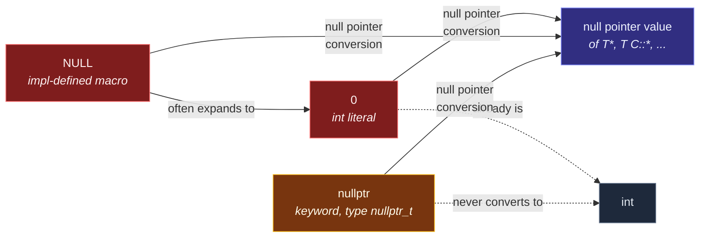

# nullptr and Null Pointers

> [!essence]
> `nullptr` is C++11's one keyword for writing a null pointer value: a prvalue of its own type, `std::nullptr_t`, that converts to the null pointer value of any pointer or pointer-to-member type and to nothing else. It exists to replace `0` and the `NULL` macro — both ordinary integers that only *sometimes* behave like pointers, which is exactly what makes them dangerous in overload resolution and template argument deduction.

## The Problem

[[Pointers|A pointer]] can hold a dedicated "names nothing" value, one of its four possible states. Before C++11, the only way to *write* that value was the integer literal `0`, or the `NULL` macro that expands to it. The Standard grants `0` a special conversion — call it a *null pointer conversion* — that lets it become the null pointer value of any pointer type. But until that conversion fires, `0` is, unavoidably, an `int`.

> [!principle] Constraint → Consequence → Requirement → Design → Price
> 1. **Constraint.** The only available spelling for "no pointer" is the integer literal `0` (or `NULL`, a macro for essentially the same thing), and a literal `0` is an `int` first, a null pointer constant only by a conversion that the Standard permits in pointer contexts.
> 2. **Consequence.** Whenever a `0` could plausibly be read as *either* an integer *or* a pointer — an overload set with both `int` and `T*` candidates, a variadic argument, a template parameter whose type is deduced from the argument — passing `0` does not say "give me the pointer overload." An exact match to `int` outranks the null pointer conversion to `T*`, so overload resolution silently prefers the integer. `NULL` doesn't fix this: its type is implementation-defined, so identical source can resolve differently on two conforming compilers.
> 3. **Requirement.** A "give me a null pointer" token is needed whose *type* can never be mistaken for an integer's, yet that still converts to the null pointer value of whatever pointer or pointer-to-member type the context asks for — pointer-to-member being a case no integer conversion reaches cleanly at all.
> 4. **Design.** C++11 adds the keyword `nullptr` (proposed as N2431, "A Name for the Null Pointer: `nullptr`"), a prvalue of a new, dedicated type `std::nullptr_t`. `nullptr_t` converts to every pointer and pointer-to-member type; nothing converts it to `int`, and nothing converts an `int` to it.
> 5. **Price.** One more built-in-ish type to learn, whose entire population is a single value — and `NULL` did not go away. It is still legal, still implementation-defined, so the old ambiguity stays live in any code that keeps writing it out of habit.

> [!tension] compatibility ⟷ evolution
> `nullptr` had to slot into a language whose zero-as-null idiom predates the Standard itself (Primer §2.3.2 still teaches `int *p2 = 0;` as a valid, if discouraged, spelling). C++ could only *add* a safer name; it could not retract `0` or `NULL` without breaking every program that used them. The result is three ways to spell the same value, two of them still quietly dangerous.

## Mental Model

> [!model] `nullptr` is a type-checked "vacant" token; `0` and `NULL` are ordinary numbers let in at the door
> `nullptr` behaves like a purpose-built "no room here" marker that every pointer's lock recognizes, but that nothing expecting a *quantity* will accept. `0` and `NULL` are ordinary numbers that happen to be waved through the same door — so code that reads one back can't always tell whether you meant "the number zero" or "nothing here," and has to reason it out from context, the way an overload set does.
> **Where it breaks:** the analogy makes `nullptr` sound like a contentless absence, but it carries a real type, `std::nullptr_t`. That type is precisely what lets overload resolution and template deduction reason about it as a value in its own right, rather than as an integer that merely happens to equal zero.



## Mechanics

> [!standard] What counts as a *null pointer constant*
> The draft Standard defines it precisely: "A null pointer constant is an integer literal ([lex.icon]) with value zero, or a prvalue of type `std::nullptr_t`" (`[conv.ptr]` ¶1). Converting one to a pointer type yields *the* null pointer value of that type, "distinguishable from every other value of object pointer or function pointer type" (`[conv.ptr]` ¶1). The word **literal** is load-bearing: a named object that merely holds the value `0` does not qualify, even if it is `const`. Primer §2.3.2 (p. 54) shows why this matters in practice: `int *p1 = nullptr;` and `int *p2 = 0;` both compile, but initializing a pointer from a *variable* whose value happens to be zero is rejected outright — the compiler enforces the "literal, not just constant-valued" rule exactly at that boundary (p. 54).

| Spelling | Type | Converts to a pointer? | Converts to `int`? |
|---|---|---|---|
| `0` (and other zero-valued integer *literals*, e.g. `0L`) | `int` (or the literal's own integer type) | Yes — null pointer conversion | Already is one |
| `NULL` | Implementation-defined: typically an integer type, occasionally `std::nullptr_t` | Yes, via whichever route its type takes | Only if its type is integral — never `void*` in C++, unlike C (cppreference, *NULL*) |
| `nullptr` | `std::nullptr_t` — a distinct type, not itself a pointer type | Yes — to *any* pointer or pointer-to-member type | Never |

| Situation | Rule | Example |
|---|---|---|
| Comparing a pointer to null | `p == nullptr` / `p != nullptr` is always well-defined for any initialized `p`, whatever state it's in | `if (p != nullptr) use(*p);` |
| Contextual bool conversion | `if (p)` means exactly `if (p != nullptr)` for any pointer type | `while (p) { ...; ++p; }` |
| `nullptr` in overload resolution | Its type `std::nullptr_t` matches an exact `nullptr_t` overload; failing that, a pointer overload still outranks an integer one, because no conversion to `int` exists at all | `describe(nullptr)` → the `nullptr_t` overload, never the `int` one |
| `nullptr` in template deduction | `template<class T> f(T)` deduces `T = std::nullptr_t` from `nullptr`, so the value keeps converting to a pointer downstream | `identity(nullptr)` deduces `nullptr_t`; `identity(0)` deduces `int` |
| Null pointer-to-member | `nullptr` converts to the null value of `T C::*` and `R (C::*)(Args...)` — spellings no plain integer reaches without a cast | `int Sensor::*field = nullptr;` |

## Under the Hood

> [!machine] `nullptr` costs nothing that `0` didn't already cost — GCC 11.4, x86-64 Linux, `-O2`
> ```nasm
> make_nullptr():         ; int* make_nullptr() { return nullptr; }
>         xorl  %eax, %eax
>         ret
> make_zero():             ; int* make_zero() { return 0; }
>         xorl  %eax, %eax
>         ret
> ```
> Identical instructions. Value categories and null-pointer-constant rules exist entirely in the type checker; by the time either function reaches codegen, both have produced the same thing — the all-zero bit pattern — and the compiler has no reason to tell them apart.

That "all-zero bit pattern" is an *observation* about this toolchain, not a guarantee from the language. `[conv.ptr]` requires only that the null pointer value be distinguishable from every valid address of its type — it never mandates the representation. On mainstream ABIs (the Itanium C++ ABI this LP64 target uses, and MSVC's) null is all-zero bits, which is exactly why `std::memset`-to-zero and value-initialization both produce working null pointers here. Treat "null is all-zero bits" as a near-universal implementation fact you can rely on for *this* toolchain, never as something `[basic.compound]` itself promises.

> [!machine] A redundant-looking null check can vanish entirely — GCC 11.4, x86-64 Linux, `-O2`
> ```nasm
> f(int*):                 ; int f(int* p) { if (p) ++(*p); return *p; }
>         movl  (%rdi), %eax    ; ① read *p unconditionally
>         addl  $1, %eax
>         movl  %eax, (%rdi)    ; increment and write back — no branch at all
>         ret
> ```
> ① The emitted code contains no comparison and no branch: `if (p)` is gone. `return *p;` is unconditional, so a call with `p == nullptr` is already undefined behavior before the check could matter — the abstract machine places no constraints whatsoever on that execution. The compiler is therefore free to assume `p` is never null *anywhere in this function*, including at the `if`, and GCC's `-O2` pass does exactly that. Pikus ch. 11 "Undefined Behavior and Performance" (p. 382) documents the identical elimination. A null check only protects the code that becomes unreachable when it fails; it does nothing for code the compiler can prove runs regardless.

## In Code

**1 · An exact match beats a conversion — even a "null" one**

```cpp
#include <cstddef>
#include <iostream>

void describe(int)            { std::cout << "int\n"; }      // ①
void describe(char*)          { std::cout << "char*\n"; }    // ②
void describe(std::nullptr_t) { std::cout << "nullptr_t\n"; } // ③

int main() {
    describe(0);        // ④
    describe(nullptr);  // ⑤
}
// expect: int
// expect: nullptr_t
```
1. Takes an ordinary integer.
2. Takes a raw pointer.
3. Takes specifically a null pointer.
4. `0` is an `int` *before* it is ever considered a null pointer constant. The exact match to ① beats the null-pointer conversion ② would need, so this calls the **integer** overload. The naive reading — "`0` means null, so this reaches the pointer overload" — is wrong.
5. `nullptr`'s type, `std::nullptr_t`, matches ③ exactly. There is no path from it to `int` for ① to compete with.

**2 · Template deduction keeps `nullptr` a pointer; it turns `0` into an `int`**

```cpp
#include <cstddef>

template <typename T>
T identity(T t) { return t; }

void take_ptr(int*) {}

int main() {
    take_ptr(identity(nullptr));  // ①
}
```
1. `T` deduces to `std::nullptr_t`. `identity` returns a `std::nullptr_t` prvalue, which still converts to `int*` at the call to `take_ptr`.

```cpp
// cc: ill-formed
template <typename T>
T identity(T t) { return t; }

void take_ptr(int*) {}

int main() {
    take_ptr(identity(0));  // error: identity(0) deduces T = int, and int
}                            //        does not convert to int*
```
Passing `0` through the same template deduces `T = int`. The value that comes back out is a plain `int`, and by the time it reaches `take_ptr`, the null-pointer-conversion window has already closed — deduction fixed the type long before this call. Only `nullptr`'s dedicated type survives being passed through generic code unchanged.

**3 · `nullptr` reaches pointer-to-member types a literal `0` cannot spell as cleanly**

```cpp
#include <iostream>

struct Sensor {
    int reading = 0;
    void calibrate() { reading = 0; }
};

int main() {
    int Sensor::*field = nullptr;         // ①
    void (Sensor::*method)() = nullptr;   // ②
    std::cout << (field == nullptr) << ' '
              << (method == nullptr) << '\n';

    Sensor* p = nullptr;
    std::cout << (p ? "engaged" : "idle") << '\n'; // ③
}
// expect: 1 1
// expect: idle
```
1. A null pointer-to-data-member: no member of any `Sensor` is named.
2. A null pointer-to-member-function, spelled the same way.
3. The contextual conversion to `bool` is exactly `p != nullptr` — `p` is null, so this is `false`.

**4 · A literal `0` is a null pointer constant; a `const int` holding `0` is not**

```cpp
// cc: ill-formed
int main() {
    const int zero = 0;
    int* p = zero;   // error: invalid conversion from int to int*
}
```
`zero`'s *value* is a compile-time constant `0`, but `[conv.ptr]` requires an integer **literal**, not merely a constant expression that evaluates to zero. `NULL`'s own definition dodges this only because the macro expands to a literal (or to `nullptr`) at the point of use — `#define NULL 0` substitutes text, `const int zero = 0;` does not.

## Pitfalls

> [!trap] `0` wins ties with integer overloads — silently
> Example 1 above is not a corner case; it is the default outcome whenever an `int` overload and a pointer overload both exist. [[Function Overloading]] shows the same ranking rule driving `ptr_or_int(0)` to the `int` overload while `ptr_or_int(nullptr)` reaches the pointer one. Code that still writes `0` for "no pointer" is one added overload away from silently changing which function it calls.

> [!trap] A named constant is not a null pointer constant
> A `const` variable is not a *literal*, even when its value is a compile-time constant zero. `int* p = zero;` is ill-formed for `const int zero = 0;`, while `int* p = 0;` and `int* p = nullptr;` both compile — see In Code, Example 4. `NULL`'s own macro definition dodges the rule only because it expands to a literal (or to `nullptr`) by text substitution at the point of use.

> [!trap] `NULL`'s type quietly accepts what `nullptr` would reject
> On this vault's toolchain (GCC 11.4, libstdc++), `NULL` expands to the built-in `__null`, of type `long` — an ordinary integer. A template such as `template<class T> bool check(T p) { return p == NULL; }` therefore instantiates and compiles even for `T = int` (GCC warns `-Wpointer-arith`, but nothing stops it). Write the comparison as `p == nullptr` instead and the same instantiation fails outright: `int` and `std::nullptr_t` admit no `operator==` between them at all. Comparing against `nullptr` turns "this parameter is a pointer" into a compile-time-checked fact instead of a hopeful comment.

> [!ub] A null check the compiler is allowed to delete
> `int f(int* p) { if (p) ++(*p); return *p; }` looks like it guards the increment and then safely re-reads `*p`. It doesn't guard the `return`: that dereference is unconditional, so a call with `p == nullptr` already contains undefined behavior, and the abstract machine places no requirements whatsoever on such an execution. A compiler may therefore assume `p` is never null *anywhere in the function*, including at the `if` — and, as Under the Hood shows on this toolchain, GCC's `-O2` pass does exactly that, deleting the comparison along with the branch. A null check only protects code that becomes unreachable when it fails; it does nothing for code the compiler can prove runs regardless. See [[Undefined Behavior]].

## Evolution

See [[Map — Evolution of C++]] for this domain's place in the language's broader timeline.

| Standard | Change | Why |
|---|---|---|
| C / C++98 | Null pointer constant = the integer literal `0`, or `NULL` (an integer-based macro) | No dedicated null-pointer type existed; `0` was already a universal "nothing" value in C |
| **C++11** | `nullptr` keyword and `std::nullptr_t` added (N2431, "A Name for the Null Pointer: `nullptr`") | Give null pointers a type no integer overload or template deduction confuses with `int` |
| C++11 onward | `NULL` remains legal and implementation-defined; some standard libraries now define it as `nullptr` itself | Backward compatibility — decades of C headers and existing C++ code still spell null as `NULL` |

## Connections

- **Prerequisites:** [[Pointers]] — the null pointer value is one of the four states every pointer can hold; this note is exactly the "how do I *write* that state" half of that story.
- **Enables:** careful use of [[Owning vs Observing Pointers]] (an observer with "nothing to look at" is a null pointer by design, not by accident) and [[Dynamic Memory — new and delete]] (many APIs use null to signal "no object," from failed allocation to sentinel values).
- **Siblings:** [[Pointers vs References]] (a reference has no null state at all — see its Mechanics) · [[Function Overloading]] (the exact ranking rule behind Pitfall 1).
- **Hazards:** [[Undefined Behavior]] (dereferencing a null pointer) · [[Dangling Pointers and References]] (a different way a pointer can fail to point anywhere valid).
- **Domain:** [[Map — Objects, Memory & Lifetime]].
- **Practice:** *Continuum #11* — wherever your pointer-handling code checks for "no object," audit whether it still spells that check with `0`.

## Check Yourself

> [!quiz]- What are the three spellings of a null pointer constant available in C++11 and later, and which one's type is never an integer?
> `0` (an integer literal), `NULL` (an implementation-defined macro, usually integer-typed), and `nullptr` (type `std::nullptr_t`). Only `nullptr`'s type is guaranteed never to be an integer type — `0` already is one, and `NULL` usually is.

> [!quiz]- `void f(int); void f(char*); f(0);` — which overload is called, and why does that surprise people who think of `0` as "basically a null pointer"?
> `f(int)`. Overload resolution ranks an exact match (`0` to `int`) above a null pointer conversion (`0` to `char*`), so the integer overload wins even though `0` is often *used* to mean null. Only `f(nullptr)` reaches the pointer overload unambiguously, because `nullptr` has no path to `int` at all.

> [!quiz]- Predict: does `const int zero = 0; int* p = zero;` compile?
> No. `[conv.ptr]` requires a null pointer constant to be an integer *literal* (or a `std::nullptr_t` prvalue) — a named `const int` is neither, even though its value is a compile-time constant `0`. Only literally writing `0` (or `nullptr`) at the point of initialization qualifies.

> [!quiz]- In `int f(int* p) { if (p) ++(*p); return *p; }`, what can an optimizing compiler legally do with the `if (p)` check, and why?
> It may delete it. `return *p;` is unconditional, so if `p` were null the function would already contain undefined behavior — and the abstract machine places no constraints on a program that triggers UB. The compiler is therefore free to assume `p` is never null anywhere in the function, including at the `if`, and GCC's `-O2` output confirms it does exactly that.

## Sources

- Primer §2.3.2 "Null Pointers" (p. 53–54): the three pre-`nullptr` spellings, and why an `int` variable can't initialize a pointer even when its value is zero.
- Tour §1.7.1 "The Null Pointer" (p. 13) and §1.8 "Tests" (p. 14): `nullptr` as the modern idiom, and `if (p)` as shorthand for `p != nullptr`.
- PPP §15.4.4 "The null pointer" (ch. 15 "Vector and Free Store"): checking pointer validity with `nullptr` before use.
- Pikus ch. 11 "Undefined Behavior and Performance" (p. 382): the null-check-elimination example, reproduced and verified on this vault's toolchain in Under the Hood.
- cppreference, *`nullptr`, the pointer literal*: https://en.cppreference.com/w/cpp/language/nullptr
- cppreference, *`std::nullptr_t`*: https://en.cppreference.com/w/cpp/types/nullptr_t
- cppreference, *`NULL`*: https://en.cppreference.com/w/cpp/types/NULL
- Draft standard `[conv.ptr]` (pointer conversions, defines *null pointer constant*): https://eel.is/c++draft/conv.ptr
- N2431, *A Name for the Null Pointer: `nullptr`* (Stroustrup & Sutter): the C++11 proposal that introduced the keyword.
- C++ Core Guidelines ES.47, "Use `nullptr` rather than `0` or `NULL`": https://isocpp.github.io/CppCoreGuidelines/CppCoreGuidelines
