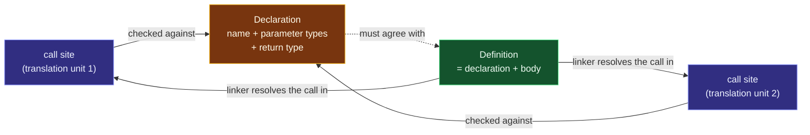

# Anatomy of a Function

> [!essence]
> A function is a promise split into two pieces: a **declaration** — a name plus a fixed *type* (a return type and an ordered list of parameter types) — that every call site checks against, and exactly one **definition** — that same declaration plus a body — that does the work. The two pieces don't have to be written together, or even in the same file, which is the entire point.

## The Problem

Source text is static: the same characters mean the same thing everywhere they appear. A calculation that's useful once is almost always useful again, with different inputs, somewhere else in the program. Without a way to name a computation and re-invoke it, "reuse" can only mean copying the code, and copies drift — a fix applied to one no longer reaches the other nine.

> [!principle] Constraint → Consequence → Design
> 1. **Constraint:** Real programs are compiled in pieces (`[[The Compilation Pipeline|separate compilation]]`), so the code that *calls* a function often lives in a different file, compiled at a different time, from the code that *defines* it. The compiler processing the call may never read the body at all.
> 2. **Consequence:** If checking a call required reading the callee's body, a call could only be compiled after its definition — killing separate compilation, and forcing every caller to see implementation details it has no business knowing.
> 3. **Requirement:** There must be a small, purely textual description of a function — its **type**: a return type and an ordered parameter-type-list — that fully specifies "how to call this," repeatable verbatim in every file that needs it, while the actual work (the body) exists exactly once, findable later.
> 4. **Design:** C++ splits the function's identity into a **declaration** (the type — name, parameter types, return type) and a **definition** (that same declaration plus a `{ ... }` body). A call is checked purely against whichever declaration is visible at the call site: argument types are matched, implicit conversions applied, and the resulting expression's type fixed — all without the compiler ever opening the file that holds the body.
> 5. **Price:** the split creates two failure modes the compiler's front end structurally cannot see: a function that is declared and called but never *defined* anywhere (an error the *linker* raises, not the compiler — see Pitfalls), and more than one definition of the same function reaching the finished program (a rule violation with, as the Standard puts it, no diagnostic required). Both are the general subject of [[Declarations vs Definitions]] and [[The One Definition Rule]]; what's specific to a function is that its declaration doesn't just name a *thing* — it names a *type*.

> [!tension] abstraction ⟷ control
> A declaration is an abstraction: it says nothing about how the promise is kept, only what may be asked of it and what comes back. That's deliberate — it's what lets a caller be compiled against a function whose body doesn't exist yet, or exists in a library the caller will never see the source of. But the promise still has to be kept by *something*, at a real cost, on a real machine: [[The Call Stack and Stack Frames|the call itself]] pushes an activation record, copies or aliases the arguments, and jumps. Anatomy is the line between the two: everything above it is checked at compile time from text alone; everything below it is what Under the Hood makes visible.

## Mental Model

> [!model] A job posting and the person hired to do it
> A **declaration** is a job posting: a title and a list of required qualifications — an ordered list of input types — plus the type of result the role produces. You can post the identical listing on every job board in town (every file that calls the function includes the same declaration), and as long as every copy says the same thing, that's fine. A **definition** is the one person actually hired: only one hire is allowed for that exact posting, no matter how many boards carried the ad.
> **Where it breaks:** a real hiring process involves interviews and judgment calls. A C++ call site involves neither — the compiler matches argument types against the posted qualifications by a fixed, mechanical procedure (conversions, not persuasion), and either the match is exact-enough or the code does not compile. There is no candidate who "seems like a good fit anyway."



Two call sites in two different files can both be compiled against the same declaration without either one seeing the definition. Only the linker, working after both files are separately compiled, needs the one body to exist and wires every call to it.

## Mechanics

| Situation | Rule | Example |
|---|---|---|
| Declaration with no body | Introduces the function's name and type; may be repeated in as many files as need it, as long as every repetition agrees | `int fact(int);` included via a header in ten `.cpp` files |
| Definition (declaration + body) | Also counts as a declaration, but is the *only* one allowed to exist for a given non-inline function across the whole linked program | `int fact(int n) { ... }` — written once |
| A function's **type** | The return type plus the parameter-type-list, plus its ref-/cv-qualifiers and whether it's `noexcept`(C++17) — but *not* parameter names and *not* default arguments (`[dcl.fct]` ¶13) | `int fact(int);` and `int fact(int n)` are the same type: `int(int)` |
| Two declarations of the same function | Must denote the same type; a different return type alone does not make a second, overloaded function — it makes an inconsistent redeclaration | `int describe(int);` then `double describe(int);` is ill-formed, not an overload |
| A call expression | Type-checked against whichever declaration is *visible at that point in the source*, never against the body — the definition can be absent, unseen, or written afterward | forward-declare, call, define later, all in one file |

> [!standard] What counts as "the same declaration" ignores names
> `[dcl.fct]` ¶20 is explicit that parameter names are optional and need not match between a function's declaration and its definition — they exist for the reader, not the type checker. Two declarations that name their parameters differently, or not at all, are still one function, provided the types agree.

## Under the Hood

> [!machine] The compiler doesn't need the body; the linker does
> Compiling a file that only *declares* `fact` and calls it succeeds and produces a normal object file — the call becomes a reference to an external symbol, mangled per the Itanium C++ ABI as `_Z4facti` (`int fact(int)`; see [[Name Mangling and extern C]]). Only the **link** step, which happens after every file is compiled, fails if no object file anywhere supplies that symbol's body:

```text
$ g++ -std=c++20 -c caller.cpp -o caller.o   # compiles fine: declaration is enough
$ nm caller.o | grep fact
                 U _Z4facti                  # "U" = undefined: a promise, not yet kept
$ g++ caller.o -o prog                       # only now, at link time:
/usr/bin/ld: caller.o: in function `main':
caller.cpp:(.text+0xe): undefined reference to `fact(int)'
```

The compiler's job ends at "this call is type-correct against the declaration it saw." Whether a body ever turns up is the linker's problem, discovered later, by a completely different tool, working from a completely different piece of evidence — the mangled name, not the source text.

## In Code

**1 · A forward declaration is enough to compile a call**

```cpp
#include <iostream>

int fact(int n);  // ① declaration: the checked contract, nothing more

int main() {
    std::cout << fact(5) << '\n';  // ② checked against ①, not against any body
}

int fact(int n) {  // ③ definition: the one and only body
    return n <= 1 ? 1 : n * fact(n - 1);
}
// expect: 120
```
1. All the compiler knows about `fact` at this point: it takes one `int`, returns one `int`.
2. The call is accepted purely on that basis — the definition below hasn't been read yet in source order, and needn't be in this file at all.
3. This is the single body every call to `fact` in the program must ultimately resolve to.

**2 · The declaration alone rejects a bad call — no body required to catch it**

```cpp
// cc: ill-formed
int fact(int n);  // declaration only — no body anywhere in this translation unit

int main() {
    fact("five");  // error: no conversion from const char* to int
}
```
The error is reported at compile time, before linking is even attempted, and without `fact` ever being defined. The declaration alone carries enough information — one `int` parameter — to know that a `const char*` argument doesn't fit.

**3 · Redeclaring with a different return type doesn't overload — it conflicts**

```cpp
// cc: ill-formed
int describe(int n);         // first declaration: type is int(int)
double describe(int value);  // error: same name, same parameter type, different return type

int main() {}
```
Function overloading is resolved from the *parameter*-type-list; the return type plays no part in choosing between candidates ([dcl.fct] ¶13; see [[Overload Resolution]]). Two declarations that agree on parameters but disagree on return type aren't a legal overload set — they're two conflicting descriptions of one function, and the compiler rejects the second as ill-formed.

**4 · Parameter names are not part of the type**

```cpp
#include <iostream>

int scale(int value, int factor);   // ① declared with these names

int main() {
    std::cout << scale(3, 4) << '\n';
}

int scale(int x, int k) {           // ② defined with different names — same function
    return x * k;
}
// expect: 12
```
1. The declaration visible to `main` calls the parameters `value` and `factor`.
2. The definition renames them to `x` and `k`. Nothing about the function's type changed, because names were never part of it.

## Pitfalls

> [!trap] "Declared but never defined" is legal — right up until it's used
> A header can declare a hundred functions whose bodies live in a `.cpp` file nobody has written yet. None of that is an error, because a declaration is a complete, self-sufficient promise on its own. The failure appears only when some call actually needs the body resolved, and it appears at *link* time, in the linker's vocabulary ("undefined reference"), often in a build far removed from the line that triggered it. See [[What the Linker Does]] for what the linker is actually doing when it reports this.

> [!ub] Two definitions of the same function is not something the compiler is obliged to catch
> `[basic.def.odr]` requires exactly one definition of every non-inline function that is odr-used in the whole program. Violate it — two translation units each supplying a body for the same non-templated, non-inline function — and the program is ill-formed, but explicitly **no diagnostic is required** (`[basic.def.odr]` ¶12, ¶16.1). Older phrasings of this rule call the violation "undefined behavior"; the current wording is more precise (ill-formed, no diagnostic required), but the practical consequence is the same one this note has been building toward: the compiler that only ever reads one file at a time cannot enforce a promise that spans every file in the program. See [[The One Definition Rule]] for the general rule across variables, classes and templates.

> [!trap] Thinking a different return type is enough to overload
> `int f(int);` and `double f(int);` look, to many learners, like "two versions of `f` for two use cases." They aren't: overload resolution never looks at the return type to *choose* between candidates, only at the parameter-type-list, so the second declaration is read as a second, disagreeing description of the same function, not a new one. See Example 3 above, and [[Function Overloading]] for how a real overload set is built.

## Evolution

See [[Map — Evolution of C++]] for the language-wide timeline this fits into.

| Standard | Change | Why |
|---|---|---|
| C++98 | The base rules: a function's type is its return type plus parameter-type-list; overloads distinguished only by parameters | Establishes the signature as the unit the compiler checks calls against |
| **C++11** | Trailing return type, `auto f(...) -> T` (`[dcl.fct]` note, since C++11) | Lets a return type that depends on the parameters (via `decltype`) be written *after* seeing them |
| C++14 | Return type deduction for ordinary functions from the `return` statement(s), without a trailing type | Removes the trailing-return boilerplate when the type is unambiguous from the body |
| **C++17** | Exception specification (`noexcept` or not) becomes part of the function's type (P0012R1) | Lets templates and metaprogramming query and dispatch on noexcept-ness; still not enough alone to overload on |
| C++20 | Abbreviated function templates: constrained `auto` parameters (`void f(C1 auto x)`) | A lighter syntax for a template whose parameter types are merely constrained, not fixed |
| C++23 | Explicit object parameter — "deducing `this`" (`void f(this Self&& self)`, P0847) | Lets a member function's implicit object parameter be named, typed and deduced like any other parameter |

## Connections

- **Prerequisites:** none formally — this is D05's entry point — though it leans on the vocabulary of [[Map — Expressions & Control]] (an argument is an expression) and [[Map — Objects, Memory & Lifetime]] (a parameter is an object).
- **Enables:** [[The Call Stack and Stack Frames]] (what a call costs on the real machine), [[Parameter Passing — Value, Reference, Pointer]] and [[Returning Values — Copies, References and RVO]] (initialization rules applied at the boundary this note defines), [[Function Overloading]] and [[Overload Resolution]] (what happens when one name has several declarations that *do* differ in parameters).
- **Siblings:** [[Declarations vs Definitions]] (the general declaration/definition split, of which a function's is one instance) · [[The One Definition Rule]] (the whole-program constraint this note's Pitfalls invoke) · [[Name Mangling and extern C]] (how the linker actually finds the one definition).
- **Domain:** [[Map — Functions]].
- **Practice:** *Continuum #05 Console Calculator REPL*: build several `print`/`eval`-style overloads against fixed signatures. *Continuum #06 Function Library & Header Refactor*: physically separate every declaration (header) from its definition (source file) — the exact split this note derives from first principles. *Continuum #09 Recursion Lab*: call a function, through its declaration, from inside its own not-yet-finished body.

## Check Yourself

> [!quiz]- What exactly is a function's *type*, and what two things does it deliberately leave out?
> The return type plus the parameter-type-list (and, since C++17, whether it's `noexcept`, plus any ref-/cv-qualifiers on a member function). It leaves out the parameter *names* and any *default arguments* — neither affects what the compiler checks a call against ([dcl.fct] ¶13).

> [!quiz]- Why can a file compile a call to a function whose definition it has never seen, and doesn't even exist yet?
> Because a call is checked purely against the *declaration* visible at that point — argument types matched to the parameter-type-list, result typed as the return type. The body is irrelevant to that check; it only has to exist somewhere by the time the whole program is linked.

> [!quiz]- Predict: does this program compile, and if so what does it print? `int f(int); int main() { std::cout << f(true); } int f(int n) { return n + 1; }` (assume `<iostream>` is included)
> It compiles and prints `2`. `bool` converts implicitly to `int` (`true` → `1`), matching the single-`int` parameter-type-list; the call is checked against the forward declaration, and the definition supplies the body once execution reaches it.

> [!quiz]- Why does `int area(int w, int h); double area(int w, int h);` fail, when `int area(int); double area(double);` succeeds?
> Overload resolution distinguishes candidates only by their parameter-type-lists. The first pair has an *identical* parameter-type-list (`int, int`) and differs only in return type — not a legal overload, just a conflicting redeclaration. The second pair has genuinely different parameter types (`int` vs. `double`), so it's a real overload set of two distinct functions.

## Sources

- Primer §6.1 "Function Basics" (p. 202): what a function is, the call operator, and argument passing as parameter initialization.
- Primer §6.1.2 "Function Declarations" (p. 207): identifies a function's return type, name and parameter types as jointly forming its interface (its "prototype"), and argues declarations belong in headers so every caller agrees on it.
- Tour §1.3 "Functions" (p. 4): function declaration syntax, and the observation that a function's type is fixed by its return type together with the ordered list of its argument types.
- PPP §7.2 "Declarations and definitions" (ch. 7 "Technicalities: Functions, etc."): the general declared-vs-defined distinction, built up from "undeclared identifier" through to a link error, independent of any one entity kind.
- cppreference, *Functions*: https://en.cppreference.com/w/cpp/language/functions
- cppreference, *Definitions and ODR*: https://en.cppreference.com/w/cpp/language/definition
- Draft standard `[dcl.fct]` ¶5, ¶13, ¶20 (parameter-type-list, function type, parameter names): https://eel.is/c++draft/dcl.fct
- Draft standard `[basic.def.odr]` ¶12, ¶16.1 (one definition required; violation for a non-inline function is ill-formed, no diagnostic required): https://eel.is/c++draft/basic.def.odr
- See [[Guide — C++ Primer (5th ed)]] and [[Guide — A Tour of C++ (3rd ed)]] for where these citations sit in each book.
