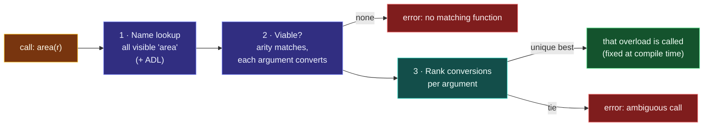

# Function Overloading

> [!essence]
> Overloading lets **one name stand for a family of functions** that differ in their parameter lists. At every call the compiler compares the argument types with each family member's parameter types and picks **exactly one**, at compile time, with no run-time cost. If no single best match exists the call doesn't compile. Under the hood every overload is a separate function with its own symbol; only the name you type is shared.

## The Problem

C has one function per name. So the C library spells the same idea several times: `abs` for `int`, `labs` for `long`, `fabs` for `double`, `fabsf` for `float`. Callers must remember which spelling matches their type, and picking the wrong one silently converts (`abs(-2.7)` gives `2`).

> [!principle] Constraint → Consequence → Requirement → Design → Price
> 1. **Constraint:** One operation (absolute value, print, area, parse) often makes sense for several types. The machine code differs per type, so there must be several functions.
> 2. **Consequence:** If each needs its own name, names multiply, generic-looking code can't be written, and a mismatched spelling converts the argument instead of failing.
> 3. **Requirement:** Let several functions share a name, and choose the right one from what the caller *passes*, statically, with no run-time dispatch.
> 4. **Design:** A function's identity is its **name plus parameter types** ([[Anatomy of a Function]]). Functions with the same name but different parameter lists in the same scope form an **overload set**. For each call, [[Overload Resolution]] ranks how well each argument converts to each candidate's parameter and picks the unique best. The linker never sees a clash, because each overload gets a distinct *mangled* symbol (Under the Hood).
> 5. **Price:** The choice depends on C++'s implicit conversion rules, which are intricate. Adding an overload can silently change which function an existing call selects, or make it ambiguous. Readers must perform resolution in their heads to know what a call does.

> [!tension] abstraction ⟷ control
> `print(x)` reads like one operation (abstraction), but which body runs is decided by type rules you don't see at the call site. Overloading is safe when every overload does *the same thing* for its type (C++ Core Guidelines C.162–C.163: overload only operations that are roughly equivalent). It becomes a trap when overloads with one name do different jobs.

## Mental Model

> [!model] A matchmaker with a three-step checklist
> For each call, the compiler (1) **gathers candidates**: every function of that name visible from the call site; (2) **keeps the viable ones**: right number of arguments, and each argument *can* convert to its parameter; (3) **picks the best**: the one whose conversions are at least as good for *every* argument and strictly better for *at least one*. If step 2 leaves nobody, "no matching function". If step 3 can't name a single winner, "call is ambiguous". **Where the model breaks:** step 1 is subtler than "everything with that name": an inner scope hides outer declarations, and argument-dependent lookup adds functions from the arguments' namespaces ([[Name Lookup and ADL]]).



**The conversion ranking**, best first, for one argument → one parameter:

| Rank | What it covers | Example (argument → parameter) |
|---|---|---|
| 1 · Exact match | Identical type; also lvalue→rvalue, array→pointer, function→pointer, adding `const` | `int` → `int`, `int` → `const int&`, `char[4]` → `const char*` |
| 2 · Promotion | Small integers to `int`; `float` to `double`; unscoped enum to its promoted type | `char` → `int`, `short` → `int`, `bool` → `int`, `float` → `double` |
| 3 · Standard conversion | Any other built-in conversion | `int` → `double`, `double` → `int`, `int` → `long`, pointer → `bool`, `0` → pointer |
| 4 · User-defined conversion | A converting constructor or conversion operator (at most one per argument) | `const char*` → `std::string` |
| 5 · Ellipsis | Matching a C-style `...` parameter | anything → `...` |

## Mechanics

**What makes two declarations different overloads**, and what doesn't:

| Situation | Rule | Example |
|---|---|---|
| Different number or types of parameters | Different overloads | `f(int)` / `f(double)` / `f(int, int)` |
| Differ only in return type | **Error**: redeclaration conflict, not an overload | `int f(int);` + `double f(int);` |
| Differ only in top-level `const` on a by-value parameter | **Same function** (the copy's constness is invisible to callers) | `f(int)` ≡ `f(const int)` |
| Differ in low-level `const` (pointer/reference to const) | Different overloads | `f(int&)` / `f(const int&)` · `f(char*)` / `f(const char*)` |
| `T&` vs `T&&` (C++11) | Different overloads: lvalues pick `&`, rvalues pick `&&` | `take(const std::string&)` / `take(std::string&&)` |
| Differ only in parameter names or default arguments | Same function | `f(int x)` ≡ `f(int y = 3)` |
| Type aliases | Same type, same function | `using Id = int; f(Id)` ≡ `f(int)` |
| Differ only in `noexcept` | Not allowed to overload | `f() noexcept` / `f()` is an error |
| Declared in different scopes | **Not** an overload set: the inner one hides the outer | a local `void print(int);` hides the global `print(const std::string&)` |
| Template and non-template with equally good match | The non-template wins | `f(int)` beats `template<class T> f(T)` for `f(1)` |
| Two templates, both viable | The *more specialized* wins; in C++20 the *more constrained* | `f(T*)` beats `f(T)` for a pointer |
| `void f(Arg) = delete;` (C++11) | Participates in resolution; *selecting* it is an error | block `f(double)` so doubles don't silently truncate |

> [!standard] The "better function" rule, `[over.match.best]`
> F1 is better than F2 if, for **every** argument, F1's conversion is no worse than F2's, and for **at least one** argument it's strictly better. Tie-breakers follow (non-template over template, more specialized template, more constrained). If no single viable function is better than all the others, the call is ill-formed as ambiguous.

**Overloading or default arguments?** If the variants do the same thing with some parameters defaulted, use [[Default Arguments]]: one body, one behaviour. If the *implementation* differs per type, overload. Don't mix both on one name without care: `f(int, int = 0)` plus `f(int)` makes `f(1)` ambiguous.

## Under the Hood

> [!machine] Overloads are separate functions with separate symbols
> The compiler encodes the parameter types into each function's linker symbol (*name mangling*, Itanium C++ ABI on Linux/macOS). `nm` on an object file with four `print` overloads, GCC 13.3:
> ```text
> _Z5printi                                  print(int)
> _Z5printd                                  print(double)
> _Z5printii                                 print(int, int)
> _Z5printRKNSt7__cxx1112basic_stringIc...E  print(std::string const&)
> ```
> `_Z` starts a mangled name, `5print` is the length-prefixed name, and the rest lists the parameter types (`i` = int, `d` = double, `RK` = reference to const). The return type isn't encoded for ordinary functions, which is one reason return type alone can't distinguish overloads. Resolution happened at compile time, so the call instruction names one symbol directly: overloading costs **nothing** at run time. It is also why C code can't call these functions without `extern "C"`, which turns mangling (and therefore overloading) off ([[Name Mangling and extern C]]).

## In Code

**1 · An overload set and how calls pick members**

```cpp
#include <iostream>
#include <string>

void show(int)                { std::cout << "int "; }
void show(double)             { std::cout << "double "; }
void show(const std::string&) { std::cout << "string "; }
void show(int, int)           { std::cout << "int,int "; }

int main() {
    show(42);          // ① exact match
    show(3.14);        // exact match
    show('x');         // ② promotion char → int beats conversion char → double
    show(2.5f);        // ③ promotion float → double
    show(std::string("hi"));
    show(1, 2);        // arity selects
    std::cout << '\n';
}
// expect: int double int double string int,int
```
1. Each call is resolved independently, at compile time.
2. `char` → `int` is a *promotion* (rank 2); `char` → `double` is a *conversion* (rank 3). Promotion wins.
3. `float` → `double` is also a promotion, so `show(double)` beats `show(int)`.

**2 · When there is no single best: ambiguity**

```cpp
// cc: ill-formed
void scale(long)   {}
void scale(double) {}

int main() {
    scale(10);        // error: int → long and int → double are both "conversion": a tie
}
```
Both candidates need a rank-3 conversion, so neither is better. Fix it at the declaration (add `scale(int)`) or at the call (`scale(10L)`, `scale(10.0)`).

**3 · Three classic surprises**

```cpp
#include <iostream>
#include <string>

void label(bool)               { std::cout << "bool "; }
void label(const std::string&) { std::cout << "string "; }

void ptr_or_int(int)   { std::cout << "int "; }
void ptr_or_int(char*) { std::cout << "pointer "; }

void take(const std::string&) { std::cout << "copy "; }
void take(std::string&&)      { std::cout << "move "; }

int main() {
    label("hello");         // ① pointer → bool (standard) beats → std::string (user-defined)
    ptr_or_int(0);          // ② 0 is an int first
    ptr_or_int(nullptr);    //    nullptr can only become a pointer
    std::string s = "x";
    take(s);                // ③ lvalue → const&
    take(std::string("y")); //    rvalue → &&
    std::cout << '\n';
}
// expect: bool int pointer copy move
```
1. A string literal is `const char[6]`, which decays to `const char*`, which converts to `bool` by a *standard* conversion. Reaching `std::string` needs a *user-defined* conversion, which ranks lower. Add a `label(const char*)` or `label(std::string_view)` overload.
2. This is why `nullptr` (C++11) replaced `0` and `NULL` for null pointers: `0` prefers integer overloads.
3. Overloading on `const T&` vs `T&&` is how containers and constructors distinguish "copy from this" and "you may steal from this" ([[Move Semantics]]).

**4 · Blocking conversions with `= delete`, and templates vs non-templates**

```cpp
#include <iostream>
#include <string>

void set_percent(int p)  { std::cout << "percent " << p << ' '; }
void set_percent(double) = delete;          // ① 42.7 must not silently become 42

template <typename T> void which(T)  { std::cout << "template "; }
void which(int)                      { std::cout << "plain "; }   // ② equal match: plain wins

template <typename T> void sink(T&&)            { std::cout << "forwarding "; }
void sink(const std::string&)                    { std::cout << "const& "; }

int main() {
    set_percent(42);
    // set_percent(42.7);                    // error: use of deleted function
    which(1); which(1.0);
    std::string s;
    sink(s);                                  // ③ T&& deduces std::string&: exact, beats adding const
    sink(static_cast<const std::string&>(s));
    std::cout << '\n';
}
// expect: percent 42 plain template forwarding const&
```
1. A deleted overload still takes part in resolution. When it's the best match the program doesn't compile, which turns a silent truncation into an error.
2. When a template and a non-template match equally well, the non-template is preferred. For `1.0` only the template matches exactly.
3. A forwarding-reference template is *greedy*: for a non-const lvalue it deduces `std::string&`, an exact match, while the `const std::string&` overload needs a qualification adjustment. Constrain such templates (C++20 `requires`) or avoid overloading them against specific types ([[Forwarding References and Reference Collapsing]]).

## Decorators: Wrapping Functions Python-Style

Python's `@decorator` takes a function and returns a new function that adds behaviour around it (logging, retrying, timing, caching) without editing the original. C++ has no `@` syntax, and a function name can't be rebound to something else. But the *idea* maps directly onto a **higher-order function template**: take any callable, return a lambda that calls it.

| Python | C++ (C++14/17) |
|---|---|
| `def logged(func): ... return wrapper` | `template <class F> auto logged(F f) { return [f](auto&&... args) -> decltype(auto) {...}; }` |
| `*args, **kwargs` | `auto&&... args` forwarded with `std::forward<decltype(args)>(args)...` |
| `@logged` rebinding `f` | Define `f_impl`, then `const auto f = logged(f_impl);` (in a header: `inline const auto`, C++17) |
| Decorator with arguments, `@retry(3)` | Extra parameters: `retry(3, f)`, or a factory returning a decorator |
| Stacking `@a` over `@b` | Nesting `a(b(f))`: the innermost (last-listed) wraps first |
| `functools.wraps` metadata | None: pass a name string, or `std::source_location` (C++20) |
| Decorating a method | Wrap a lambda that calls it: `logged("area", [&r] { return r.area(); })` |
| Decorators chosen at run time | `std::function` values composed in a loop (third example) |
| Class-based decorator (`__call__`), class decorators | [[Overloading in Classes — Constructors, Members and Operators]], "Decorators with Classes" |

**1 · A decorator, a decorator with a parameter, and stacking (C++14)**

```cpp
#include <iostream>
#include <stdexcept>
#include <utility>

template <typename F>
auto logged(const char* name, F f) {                     // ① takes a callable, returns a new one
    return [name, f](auto&&... args) -> decltype(auto) { // ② accepts any arguments (*args)
        struct Exit { const char* n; ~Exit() { std::cout << "<" << n << ' '; } } on_exit{name};
        std::cout << ">" << name << ' ';
        return f(std::forward<decltype(args)>(args)...); // ③ forwards them unchanged
    };
}

template <typename F>
auto retry(int times, F f) {                             // ④ a decorator with a parameter
    return [times, f](auto&&... args) -> decltype(auto) {
        for (int attempt = 1; ; ++attempt) {
            try { return f(args...); }                   // ⑤ no std::forward: args may be reused
            catch (const std::exception&) { if (attempt == times) throw; }
        }
    };
}

int fetch_impl(int id) {                                 // fails twice, then succeeds
    static int calls = 0;
    if (++calls < 3) throw std::runtime_error("busy");
    return id * 10;
}

const auto fetch = logged("fetch", retry(3, fetch_impl));   // ⑥ @logged @retry(3) def fetch

int main() {
    int r = fetch(7);
    std::cout << "= " << r << '\n';
}
// expect: >fetch <fetch = 70
```
1. A decorator is a function template: it accepts any callable type `F` (function, function pointer, lambda, function object) and returns a new callable.
2. A generic variadic lambda plays the role of `def wrapper(*args, **kwargs)`. `-> decltype(auto)` returns exactly what `f` returns, including references and `void`.
3. `std::forward` passes each argument on as the lvalue or rvalue it was ([[Forwarding References and Reference Collapsing]]). The `Exit` object's destructor prints the exit line even when `f` returns `void` or throws.
4. `@retry(3)` becomes an extra parameter.
5. A wrapper that calls `f` more than once must **not** forward: the first call could move from the arguments.
6. Python rebinds the name; C++ creates a new object with a new name. Everything is resolved at compile time and usually inlined, so the wrapper costs no more than writing the logging code by hand.

**2 · Decorating an overloaded function**

```cpp
#include <iostream>
#include <string>
#include <utility>

void show(int)                { std::cout << "int "; }
void show(double)             { std::cout << "double "; }
void show(const std::string&) { std::cout << "string "; }

template <typename F>
auto counted(F f) {
    return [f, n = 0](auto&&... args) mutable -> decltype(auto) {
        std::cout << '#' << ++n << ':';
        return f(std::forward<decltype(args)>(args)...);
    };
}

int main() {
    // auto bad = counted(show);                   // ① error: which show? An overload set isn't a value
    auto one  = counted(static_cast<void (*)(int)>(show));        // ② pick ONE overload explicitly
    auto all  = counted([](auto&&... a) -> decltype(auto) {       // ③ or lift the WHOLE set into a lambda
        return show(std::forward<decltype(a)>(a)...);
    });
    one(1);
    all(1); all(2.5); all(std::string("x"));        // resolution happens inside, per call
    std::cout << '\n';
}
// expect: #1:int #1:int #2:double #3:string
```
1. `counted(show)` doesn't compile: `show` names an overload *set*, and template argument deduction can't choose a member of it without knowing the argument types ("unresolved overloaded function type").
2. A cast to one function-pointer type selects a single overload, which then *is* a value.
3. Lifting the set into a generic lambda keeps every overload. Resolution then happens inside the lambda at each call, so one decorated object serves all of them. The wrapper's `n` is its own state, which is why `one` and `all` count separately.

**3 · Decorators chosen at run time (`std::function`)**

```cpp
#include <algorithm>
#include <cctype>
#include <functional>
#include <iostream>
#include <string>
#include <vector>

using Handler    = std::function<std::string(const std::string&)>;
using Decorator  = std::function<Handler(Handler)>;      // ① a decorator is itself just a value

Decorator uppercase() {
    return [](Handler next) -> Handler {
        return [next](const std::string& in) {
            std::string out = next(in);
            std::transform(out.begin(), out.end(), out.begin(), [](unsigned char c) { return std::toupper(c); });
            return out;
        };
    };
}
Decorator bracket(char open, char close) {
    return [open, close](Handler next) -> Handler {
        return [=](const std::string& in) { return open + next(in) + close; };
    };
}

int main() {
    Handler greet = [](const std::string& name) { return "hi " + name; };
    std::vector<Decorator> chosen{bracket('[', ']'), uppercase()};   // ② could come from a config file
    for (auto it = chosen.rbegin(); it != chosen.rend(); ++it) greet = (*it)(greet);   // ③ innermost last in list
    std::cout << greet("ada") << '\n';
}
// expect: [HI ADA]
```
1. With `std::function`, a decorator is an ordinary run-time value: store it, put it in a vector, pick it from a configuration file. This is how web-framework "middleware" works.
2. The list reads top-down like Python's stacked `@` lines.
3. Applying them in reverse makes the last-listed decorator the innermost, as in Python. The price of this flexibility is type erasure: every layer is an indirect call, possibly with a heap-allocated closure, where the template version of the first example inlines completely ([[Callables and std-function]]).

## Pitfalls

> [!trap] Adding an overload changes existing calls
> An overload set is shared by every caller. Adding `f(long)` next to `f(double)` can make every `f(intValue)` in the program ambiguous, or silently redirect calls to the new function. Treat adding an overload like changing an interface.

> [!trap] An inner declaration hides the whole outer overload set
> Overloading only happens among functions found in the *same scope* by lookup. Declaring `void print(int);` inside a block or a namespace hides every outer `print`, even ones that would match better, and a derived class's `f` hides all of the base's `f` overloads ([[Name Hiding in Derived Classes]]).

> [!trap] Overloads that do different things
> `draw(Shape)` drawing and `draw(Card)` taking a card from a deck share a name but not a meaning. Readers assume one name means one operation. Give different operations different names.

> [!trap] Mixing default arguments and overloads
> `void f(int a, int b = 0);` and `void f(int a);` compile, but `f(1)` is ambiguous. Choose one mechanism per name.

> [!trap] Numeric literal types matter
> `42` is `int`, `42L` is `long`, `4.2` is `double`, `4.2f` is `float`, `'4'` is `char`. With `f(long)` and `f(double)`, even `f(42)` is ambiguous (In Code 2).

## Evolution

| Standard | Change | Why |
|---|---|---|
| **C++98** | Overloading of functions and operators; ranking rules; name mangling | One name per operation across types, with static selection |
| **C++11** | `nullptr`; rvalue references (`&` vs `&&` overloads); `= delete`; ref-qualified member overloads | Fix `0`/`NULL` overload surprises; move-aware overload pairs; ban unwanted conversions explicitly |
| C++17 | `noexcept` joins the function type (still can't overload on it); `std::string_view` parameters | Cleaner function-pointer typing; one overload for all string kinds |
| **C++20** | Concepts: the *more constrained* viable template wins; abbreviated templates (`void f(std::integral auto)`) | Replace fragile `enable_if` tricks with readable constrained overloads |
| C++23 | Explicit object parameter ("deducing `this`") | One member template replaces `const`/non-const/`&&` overload triplets ([[Overloading in Classes — Constructors, Members and Operators]]) |

## Connections

- **Prerequisites:** [[Anatomy of a Function]] (a function's type is its parameter list).
- **Deeper:** [[Overload Resolution]] (the full ranking and tie-break rules) · [[Implicit Conversions and Promotions]] (what the ranks mean) · [[Name Lookup and ADL]] (where candidates come from).
- **Related choices:** [[Default Arguments]] · [[Function Templates]] · [[Concepts and Constraints]] · [[Forwarding References and Reference Collapsing]].
- **In classes:** [[Overloading in Classes — Constructors, Members and Operators]] (constructors, `const`/ref-qualified members, operators, hiding vs overriding).
- **Under the hood:** [[Name Mangling and extern C]].
- **Decorators:** [[Lambda Expressions]] · [[Callables and std-function]] · [[Function Templates]] · class-based decorators in [[Overloading in Classes — Constructors, Members and Operators]].
- **Overview:** [[Functions and Parameters — The Complete Picture]] · [[Map — Functions]].
- **Practice:** *Continuum #5 Console Calculator REPL* (overload `evaluate` for integer and floating-point expressions, then add an overload that makes a call ambiguous and read the compiler's candidate list) · *#6 Function Library & Header Refactor* (declare the overload set in a header; check that `nm` shows one mangled symbol per overload).

## Check Yourself

> [!quiz]- Why can't two functions differ only in their return type?
> Resolution looks only at the arguments of a call, and a call's result may even be discarded, so the compiler would have no information to choose with. The language therefore treats such declarations as conflicting redeclarations, and ordinary functions don't encode the return type in their mangled name.

> [!quiz]- With `void f(bool)` and `void f(const std::string&)`, which one does `f("text")` call, and how do you make it call the string version?
> `f(bool)`: array → pointer → `bool` is a *standard* conversion, which beats the *user-defined* conversion to `std::string`. Add `f(const char*)` or `f(std::string_view)`, or call `f(std::string("text"))` / use `"text"s`.

> [!quiz]- `void g(int); void g(double);` Predict each: `g('a')`, `g(3.0f)`, `g(5L)`.
> `g('a')` → `g(int)` (promotion beats conversion). `g(3.0f)` → `g(double)` (promotion). `g(5L)` → **ambiguous**: `long` → `int` and `long` → `double` are both conversions.

> [!quiz]- How do you write Python's `@logged` on `def area(w, h)` in C++, and why can't the result keep the name `area`?
> Write `double area_impl(double, double)` and `const auto area = logged("area", area_impl);`, where `logged` is a function template returning a generic lambda that prints and then calls the wrapped function with forwarded arguments. A C++ function name denotes a fixed function (possibly an overload set) resolved at compile time. It isn't a variable that can be reassigned, so the decorated version must be a new object with its own name.

## Sources

- Primer §6.4 "Overloaded Functions" (p. 230): what may and may not overload, `const` parameters (p. 232), calling an overloaded function (p. 233), overloading and scope (p. 234).
- Primer §6.6 "Function Matching" (p. 242), §6.6.1 "Argument Type Conversions" (p. 245): candidate and viable functions, and the conversion ranking.
- Tour §1.3 "Functions" (p. 4): overloading as one name for operations with the same meaning on different types.
- PPP ch. 7 "Technicalities: Functions, etc.", §7.4 "Function call and return".
- cppreference / web, *Overload resolution* and *Function declaration*: https://en.cppreference.com/w/cpp/language/overload_resolution · https://en.cppreference.com/w/cpp/language/function
- Draft standard `[over.match]`, `[over.ics.rank]`, `[over.match.best]`: https://eel.is/c++draft/over.match
- Python Language Reference, *Function definitions* (decorators) and PEP 318, for the Python side of the decorator comparison: https://docs.python.org/3/reference/compound_stmts.html#function-definitions · https://peps.python.org/pep-0318/
- cppreference / web, *Lambda expressions* (generic lambdas, captures), *std::forward*, *std::function*: https://en.cppreference.com/w/cpp/language/lambda · https://en.cppreference.com/w/cpp/utility/forward · https://en.cppreference.com/w/cpp/utility/functional/function
- Itanium C++ ABI, *Mangling*: https://itanium-cxx-abi.github.io/cxx-abi/abi.html#mangling
- C++ Core Guidelines C.162 "Overload operations that are roughly equivalent", C.163 "Overload only for operations that are roughly equivalent", ES.47 "Use `nullptr` rather than `0` or `NULL`": https://isocpp.github.io/CppCoreGuidelines/CppCoreGuidelines
