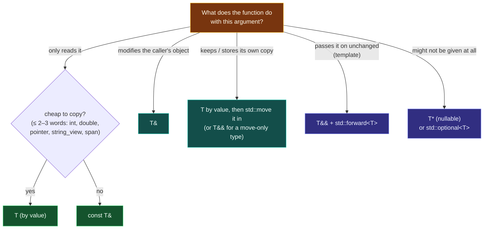

# Functions and Parameters — The Complete Picture

> [!essence]
> A function is a named, typed piece of work that is compiled once and run many times. Its **parameters** are local variables that each call fills in from its **arguments**. Almost every question about functions comes down to two decisions the language forces you to make: *how* each argument crosses into the function (a copy, an alias, or ownership handed over), and *when* the shape of the argument list is fixed (at compile time, or not until the program runs).

This note is the one-page overview of domain D05. Each section summarizes an idea and links to the note that treats it in depth. The final part, **Variable Numbers of Arguments**, goes deepest: it shows how to compile a function once and let the number of arguments be decided later, while the program runs.

## The Problem

A program is too big to write as one sequence of statements. The same work (sort these, validate that, print this) is needed in many places, with different data each time.

> [!principle] Constraint → Consequence → Requirement → Design → Price
> 1. **Constraint:** Code that is repeated by copy-and-paste has to be fixed in every copy, and code that can't be named can't be reasoned about separately.
> 2. **Consequence:** We want to write the work once, give it a name, and *vary the data*. The data might be small (an `int`), large (a million-element vector), something the caller wants changed, or something the caller is giving away.
> 3. **Requirement:** A mechanism that (a) is compiled once, (b) is checked against every call site so the wrong data can't sneak in, (c) lets the caller choose, per parameter, between copying, sharing and transferring, and (d) costs as little as a hand-written jump.
> 4. **Design:** A function has a **type**: a return type plus an ordered list of parameter types ([[Anatomy of a Function]]). Every call is type-checked against that list. Each parameter is a local object *initialized from* its argument exactly as `T param = argument;` would be, so the parameter's type (value, `&`, `const&`, `&&`, pointer) *is* the passing mode. The machine implements a call as "put arguments where the calling convention says, jump, jump back" (Under the Hood).
> 5. **Price:** The fixed parameter list is the tension. A strictly typed list can't naturally express "any number of arguments". C++ answers with several mechanisms (C varargs, `initializer_list`, containers, variadic templates), and they differ sharply in safety and in *when* the count is decided (Variable Numbers of Arguments, below).

> [!tension] compile-time ⟷ run-time
> Everything the compiler knows about a call (the types, the count, which overload) it can check and optimize. Everything left until run time (a count read from a file, a command typed by a user) must be carried as data and checked by your code. Choosing where each piece of information lives is the central design choice of this note.

## Mental Model

> [!model] A form with labelled boxes
> A function's parameter list is a printed form: each box has a label (the name) and a type ("date", "amount"). A call fills in the form. **By value** is writing a copy of the information in the box. **By reference** is writing "see the original in the caller's drawer": the function works on the caller's object directly. **Where it breaks:** a real form can't be "moved into" (C++ can hand over ownership with `&&`), and the number of boxes is printed in advance, which is exactly the limitation the last part of this note works around.



## Mechanics

### 1 · Declaration, definition, signature

| Situation | Rule | Example |
|---|---|---|
| Declare (a promise) | Name + return type + parameter types; may repeat in many files | `double area(double w, double h);` |
| Define (keep it) | Declaration + body, exactly once per program (unless `inline`) | `double area(double w, double h) { return w * h; }` |
| The function's type | Return type + parameter types (+ `noexcept` since C++17); **not** names or defaults | `double(double, double)` |
| Overloads | Same name, different parameter lists; the return type alone can't distinguish them | `print(int)` / `print(const std::string&)` |
| Trailing return (C++11) | Return type after the parameters | `auto area(double w, double h) -> double` |
| Deduced return (C++14) | `auto` lets the `return` statements decide | `auto half(int x) { return x / 2.0; }` → `double` |
| Abbreviated template (C++20) | An `auto` parameter makes a function template | `void show(const auto& x);` |

Details: [[Anatomy of a Function]] · [[Declarations vs Definitions]] · [[Function Overloading]] · [[Overload Resolution]].

### 2 · Parameters vs arguments

A **parameter** is the name declared in the function (`int n`). An **argument** is the expression the caller supplies (`fact(k + 1)`). At each call, every parameter is a brand-new local object **copy-initialized from its argument**: `int n = k + 1;`. That one rule explains most behaviour. A value parameter is a copy, a reference parameter binds to the argument, implicit conversions apply exactly as they do in an initialization, and an `explicit` constructor won't be used to convert.

> [!standard] Argument evaluation order
> The order in which arguments are evaluated is **unspecified**. Since C++17 each argument is fully evaluated before the next one starts (no interleaving), but which one goes first is still up to the compiler: `f(next(), next())` may pass the values in either order ([[Evaluation Order and Sequencing]]).

### 3 · The passing modes

| You write | The parameter is | Caller's object | Use for (Core Guidelines F.15–F.18) |
|---|---|---|---|
| `T x` | An independent copy | Untouched | Cheap-to-copy inputs; "sink" parameters you'll keep |
| `const T& x` | An alias you can't modify | Shared, read-only | Expensive-to-copy inputs |
| `T& x` | An alias you can modify | Modified in place | In-out parameters |
| `T&& x` | An alias to a temporary or `std::move`d object | Its resources may be taken | Move-only sinks, overloads that steal |
| `T&& x` in a template | A *forwarding reference* | Kept as lvalue or rvalue | Passing arguments on unchanged ([[Forwarding References and Reference Collapsing]]) |
| `T* x` | A copy of an address; may be `nullptr` | Modifiable through `*x` | Optional in-out, C interop |
| `std::span<T> x` (C++20) | Pointer + length view | Shared | Any contiguous sequence: array, `vector`, `array` |

**Arrays don't pass by value.** A parameter declared `int a[10]` is really `int* a`: the size is ignored and lost ([[Built-in Arrays and Array-to-Pointer Decay]]). Pass `std::span`, a `const std::vector<T>&`, or a reference to an array `int (&a)[10]`.

**Output parameters vs return values.** Prefer returning. Return one value directly. Return several in a `struct` and unpack them with [[Structured Bindings]] (C++17). Return "maybe a value" as `std::optional<T>` ([[optional]]). Since C++17, returning a prvalue (`return T{...};`) is **guaranteed** not to copy ([[Copy Elision and RVO]]), so returning a big object by value is not a performance mistake.

### 4 · Returning

| Rule | Why |
|---|---|
| Never return a reference or pointer to a local variable | The local dies when the function returns: dangling ([[Dangling Pointers and References]]) |
| Returning a local by value is cheap | Named return value optimization, or at worst a move |
| Don't `return std::move(local);` | It blocks the elision and forces a move |
| Mark results that must not be ignored with the `nodiscard` attribute (C++17) | Turns a forgotten error code into a warning ([[Attributes — nodiscard, maybe_unused, likely]]) |
| Flowing off the end of a non-`void` function is UB (except `main`) | The caller reads a value that was never produced |

### 5 · Other properties of a function

| Feature | Meaning | Note |
|---|---|---|
| Default arguments | Trailing parameters may have defaults, written in the declaration callers see | [[Default Arguments]] |
| `inline` | Permits identical definitions in many translation units; *not* a command to inline | [[Inlining — Compiler Reality vs the Keyword]] |
| `constexpr` / `consteval` (C++11/C++20) | May / must run at compile time | [[constexpr and consteval Functions]] |
| `noexcept` | Promises not to throw; part of the type since C++17 | [[noexcept and Why Move Must Not Throw]] |
| `static` local variable | One object shared by every call, initialized on first use (thread-safe since C++11) | [[Storage Duration]] |
| Recursion | A function calling itself; each call gets its own frame | [[Recursion]] · [[The Call Stack and Stack Frames]] |
| Function pointers, lambdas, `std::function` | Functions as values: callbacks, strategies, tables | [[Function Pointers]] · [[Lambda Expressions]] · [[Callables and std-function]] |
| `int main(int argc, char* argv[])` | The program's entry point, fed by the operating system | [[main, Program Startup and Termination]] |

## Under the Hood

> [!machine] A call is "load registers, jump, read the result register"
> On x86-64 Linux (System V ABI) the first six integer or pointer arguments travel in `rdi, rsi, rdx, rcx, r8, r9`, the first eight floating-point arguments in `xmm0`–`xmm7`, and the result comes back in `rax` (or `xmm0`). A reference parameter is passed as an address. GCC 13.3, `-std=c++17 -O1 -fno-inline`:
> ```nasm
> ; long mix(long a, int b, double c, const long& d);   called as  mix(1, 2, 3.5, x)
> call_mix():
>         mov   QWORD PTR [rsp], 7        ; x lives in the caller's frame...
>         mov   rdx, rsp                  ; ...d (a reference) = its ADDRESS, in rdx
>         movsd xmm0, QWORD PTR .LC0[rip] ; c = 3.5 in the first FP register
>         mov   esi, 2                    ; b
>         mov   edi, 1                    ; a
>         call  mix(long, int, double, long const&)
> mix(long, int, double, long const&):
>         movsx rsi, esi                  ; widen b to 64 bits
>         add   rsi, rdi                  ; a + b
>         cvttsd2si rax, xmm0             ; (long)c
>         add   rax, rsi
>         add   rax, QWORD PTR [rdx]      ; + d: a memory load through the reference
>         ret                             ; result in rax
> ```
> "Pass by reference" is literally "pass a pointer, dereference it inside". That's why `const T&` is a pessimization for an `int`: an extra memory load instead of a register. Arguments beyond the registers, and objects too large or not trivially copyable, go through memory in the caller's frame ([[The Call Stack and Stack Frames]]).

```text
  CALLER FRAME                                  REGISTERS AT THE call INSTRUCTION
 ┌─────────────────────────────┐               ┌──────┬───────────────────────────────┐
 │ x = 7              ◀────────┼───────────────┤ rdx  │ &x         (d, by reference)  │
 │ saved values, locals        │               │ rdi  │ 1          (a)                │
 ├─────────────────────────────┤               │ rsi  │ 2          (b)                │
 │ return address (pushed by   │               │ xmm0 │ 3.5        (c)                │
 │ call)                       │               │ al   │ #vector regs, ONLY for `...`  │
 └─────────────────────────────┘               └──────┴───────────────────────────────┘
```

## Variable Numbers of Arguments

The parameter list in a declaration is fixed. Yet `printf` takes any number of arguments, `std::max({a, b, c, d})` compares any number of values, and a command interpreter handles commands whose argument count is typed by the user. The key question is **when the count is decided and who knows the types**:

```text
                     COMPILE TIME                                   RUN TIME
  ─────────────────────────────────────────────────────────┬───────────────────────────────────
  variadic template   count & types known per call;        │
  f(Ts... xs)         one COMPILED COPY PER SIGNATURE      │
                                                           │
  C varargs  f(n, ...)  count written at the call site ────┼──▶ callee compiled ONCE, learns
  initializer_list<T>   count written at the call site ────┼──▶ count & values from DATA
                                                           │
  span<T> / vector<T>                                      │  count comes from data: a file,
  vector<variant/any>                                      │  user input, argc/argv, a network
  main(argc, argv)                                         │  packet. Decided AFTER compilation
  ─────────────────────────────────────────────────────────┴───────────────────────────────────
```

A function "with a variable number of parameters **after compilation**" is one whose body is compiled **once** and learns *at run time* how many arguments it received. There are four standard ways to write one, plus one pattern that combines them.

### A · C-style variadic functions: `...` and `<cstdarg>`

The oldest mechanism, inherited from C. The declaration ends in an ellipsis, and the body walks the extra arguments with four macros from `<cstdarg>`:

| Macro | Does |
|---|---|
| `va_list ap;` | A cursor over the extra arguments |
| `va_start(ap, last_named)` | Point the cursor after the last *named* parameter |
| `va_arg(ap, T)` | Read the next argument **as type `T`** and advance |
| `va_end(ap)` | Clean up (required before returning) |
| `va_copy(dst, src)` (C++11) | Duplicate a cursor, to walk the list twice |

```cpp
#include <cstdarg>
#include <iostream>

double average(int count, ...) {                // ① at least one named parameter carries the count
    va_list ap;
    va_start(ap, count);
    double total = 0;
    for (int i = 0; i < count; ++i)
        total += va_arg(ap, double);            // ② must name the PROMOTED type
    va_end(ap);
    return count > 0 ? total / count : 0.0;
}

int main() {
    float f = 4.0f;
    std::cout << average(3, 1.0, 2.5, f) << ' '  // ③ f arrives as a double
              << average(2, 10.0, 20.0) << '\n'; // one compiled function, different counts
}
// expect: 2.5 15
```
1. The function can't discover how many arguments were passed. The *caller* must say so: an explicit count (here), a format string (`printf("%d %s", ...)`), or a sentinel value at the end (`nullptr`).
2. The extra arguments undergo **default argument promotions**: `float` → `double`, and `char`/`short`/`bool` → `int`. So `va_arg(ap, float)` or `va_arg(ap, char)` is always wrong.
3. Under the hood the caller puts the values where normal arguments go and sets `al` to the number of vector registers used (`mov eax, 3` in GCC 13.3 output for a call passing three doubles). The callee's prologue spills all possible argument registers into a save area, and `va_arg` walks it. This is why varargs functions can't be inlined as easily and cost more per argument.

> [!ub] Nothing checks C varargs
> Reading an argument as the wrong type, reading more arguments than were passed, or passing a class type with a non-trivial copy constructor or destructor (like `std::string`: *conditionally-supported*, often rejected or undefined) are all undefined behaviour or unportable. The compiler checks `printf`'s format string only as a courtesy extension (`-Wformat`). Use C varargs **only to interface with C APIs** (C++ Core Guidelines ES.34, F.55).

### B · `std::initializer_list<T>` (C++11): many values, one type

```cpp
#include <initializer_list>
#include <iostream>

int largest(std::initializer_list<int> xs) {    // ① a lightweight view over a hidden const array
    int best = *xs.begin();                      // assumes non-empty, like std::max({...})
    for (int x : xs) if (x > best) best = x;
    return best;
}

int main() {
    std::cout << largest({3, 9, 2}) << ' ' << largest({7, 1, 8, 4, 5}) << '\n';   // ② braces at the call
}
// expect: 9 8
```
1. Type-safe (every element must convert to `int` without narrowing) and compiled once. `xs.size()` tells the body the count at run time.
2. The caller still writes each value in the source, so the count is fixed *per call site*. Elements are `const`, so they can be copied out but never moved out. `std::max({a, b, c})` and `std::min` use exactly this.

### C · A container or `std::span`: the count is data

When the number of arguments comes from the outside world, it isn't a list of expressions at all; it's **data**. Take the arguments as a sequence:

```cpp
#include <iostream>
#include <sstream>
#include <vector>

double mean(const std::vector<double>& xs) {           // ① compiled once; any count, decided at run time
    if (xs.empty()) return 0.0;
    double total = 0;
    for (double x : xs) total += x;
    return total / static_cast<double>(xs.size());
}

int main() {
    std::istringstream input("4  8 15 16 23 42");       // stands in for a file or std::cin
    std::vector<double> args;
    for (double x; input >> x; ) args.push_back(x);     // ② how many? only the input knows
    std::cout << args.size() << " args, mean " << mean(args) << '\n';
}
// expect: 6 args, mean 18
```
1. In C++20 prefer `std::span<const double>`: it accepts a `vector`, a `std::array` or a C array without copying ([[span]]).
2. This is the honest form of "any number of arguments": there is one argument, a sequence of any length, and its length is a run-time value you can check.

### D · Mixed types decided at run time: an argument *list object*

A command interpreter, a scripting hook or a remote-procedure-call server must call functions whose argument count **and** types arrive as input. Standard C++ can't build a native call frame at run time. The idiom is to give every callable **one** parameter, a list of values that each carry their own type (`std::variant`, or `std::any` for open-ended sets), and dispatch by name:

```cpp
#include <functional>
#include <iostream>
#include <map>
#include <sstream>
#include <string>
#include <vector>

using Args = std::vector<std::string>;                         // ① the run-time "parameter list"
using Command = std::function<std::string(const Args&)>;

int main() {
    std::map<std::string, Command> commands{
        {"add",  [](const Args& a) { long s = 0; for (auto& x : a) s += std::stol(x); return std::to_string(s); }},
        {"join", [](const Args& a) { std::string r; for (auto& x : a) r += x; return r; }},
        {"argc", [](const Args& a) { return std::to_string(a.size()); }},
    };
    std::istringstream script("add 1 2 3 4\njoin C + +\nargc\n");  // ② could be typed by a user
    for (std::string line; std::getline(script, line); ) {
        std::istringstream words(line);
        std::string name; words >> name;
        Args args;
        for (std::string w; words >> w; ) args.push_back(w);   // ③ count decided here, at run time
        auto it = commands.find(name);
        std::cout << (it == commands.end() ? "?" : it->second(args)) << ' ';
    }
    std::cout << '\n';
}
// expect: 10 C++ 0
```
1. Every command has the same C++ signature, so all of them fit in one table. The *real* parameter list is the contents of `Args`.
2. Nothing about this input existed when the program was compiled.
3. Each command validates its own arguments (count, conversions). `std::stol` throws on bad input, which is the price of moving checks from compile time to run time. With `std::vector<std::variant<long, double, std::string>>` the values keep a real type instead of being text ([[variant and visit]], [[Callables and std-function]]).

**`main` itself works this way.** `int main(int argc, char* argv[])` is compiled once. The operating system hands it a count (`argc`) and an array of C strings (`argv[0]` is usually the program name, `argv[argc]` is a null pointer) decided when the user launches the program:

```cpp
#include <iostream>
#include <string>
#include <vector>

int main(int argc, char* argv[]) {
    std::vector<std::string> args(argv + 1, argv + argc);   // skip argv[0], the program name
    std::cout << args.size() << " user arguments\n";
    for (const auto& a : args) std::cout << "  " << a << '\n';
}
// expect: 0 user arguments
```

### E · The best of both: a type-safe front end over a run-time core

A [[Variadic Templates and Fold Expressions|variadic template]] knows every argument's type at compile time, but a separate copy is generated for every distinct list of argument types. That's safe, but a heavily used function can bloat the binary. The modern pattern, used by `std::format` (a thin template that type-erases its arguments into `std::format_args` and calls the single compiled function `std::vformat`), combines the two: a tiny template front end checks and converts, and a non-template back end compiled once does the work.

```cpp
#include <initializer_list>
#include <iostream>
#include <sstream>
#include <string>

void log_line(std::initializer_list<std::string> parts) {      // ① back end: compiled ONCE
    std::string out = "[log]";
    for (const auto& p : parts) out += ' ' + p;
    std::cout << out << '\n';
}

template <typename T>
std::string to_text(const T& x) { std::ostringstream s; s << x; return s.str(); }

template <typename... Ts>
void log(const Ts&... xs) {                                     // ② front end: any count, any printable types
    log_line({to_text(xs)...});                                 // ③ pack expansion → braced list
}

int main() {
    log("disk", 93.5, '%');
    log("retry", 3, "of", 5, true);
}
// expect: [log] retry 3 of 5 1
```
1. All the real logic lives in one ordinary function taking a run-time-sized list.
2. `Ts...` is a *template parameter pack*. `sizeof...(Ts)` would give the count at compile time.
3. `to_text(xs)...` expands to `to_text(x1), to_text(x2), ...`, producing the braced list. Each instantiation of `log` is a few instructions. C++17 fold expressions (`(std::cout << ... << xs)`) express similar one-liners; see [[Variadic Templates and Fold Expressions]].

### Choosing among them

| Need | Use | Count decided | Types checked |
|---|---|---|---|
| Call a C API like `printf`, or write one for C callers | `...` + `<cstdarg>` | Call site, learned at run time | **No** |
| Several values of one type, written at the call | `std::initializer_list<T>` | Call site | Yes |
| Any number of one type, from data | `std::span<const T>` / `const std::vector<T>&` | **Run time** | Yes |
| Any number of mixed types, from data (interpreters, plugins, RPC) | `std::vector<std::variant<...>>` or `std::any` + name dispatch | **Run time** | At run time, by your code |
| Any number of mixed types, written at the call, fully checked | Variadic template (+ run-time back end if large) | Compile time | Yes |
| Call an *existing* native function with an argument list built at run time | Not possible in standard C++; use a library such as libffi, or a wrapper per signature | Run time | No |

## In Code

**1 · The four passing intents in one program**

```cpp
#include <iostream>
#include <string>
#include <utility>
#include <vector>

int count_vowels(const std::string& s) {                    // ① input, expensive to copy: const&
    int n = 0;
    for (char c : s) n += (c == 'a' || c == 'e' || c == 'i' || c == 'o' || c == 'u');
    return n;
}
void shout(std::string& s) { s += '!'; }                    // ② in-out: modifies the caller's object

class Log {
public:
    void add(std::string line) { lines_.push_back(std::move(line)); }   // ③ sink: by value, then move
    std::size_t size() const { return lines_.size(); }
private:
    std::vector<std::string> lines_;
};

int main() {
    std::string msg = "hello world";
    shout(msg);
    Log log;
    log.add(msg);                  // copies msg (we still use it below)
    log.add("temporary text");     // ④ no copy: the temporary is moved all the way in
    std::cout << msg << ' ' << count_vowels(msg) << ' ' << log.size() << '\n';
}
// expect: hello world! 3 2
```
1. `const&` gives read access without a copy. The function can't change the caller's string.
2. A non-const reference is a visible promise to modify the argument; the call site `shout(msg)` should read as such.
3. Taking a *sink* by value lets one function serve both cases: callers passing lvalues pay one copy, and callers passing temporaries pay only moves.
4. See [[Move Semantics]].

**2 · Return several values instead of using output parameters (C++17)**

```cpp
#include <iostream>
#include <optional>
#include <string>

struct Parsed { std::string key; int value; };                      // ① name the parts

std::optional<Parsed> parse(const std::string& line) {               // ② "maybe" is in the type
    auto eq = line.find('=');
    if (eq == std::string::npos) return std::nullopt;
    return Parsed{line.substr(0, eq), std::stoi(line.substr(eq + 1))};  // ③ guaranteed elision
}

int main() {
    if (auto p = parse("width=640")) {
        auto [key, value] = *p;                                         // ④ structured binding
        std::cout << key << ' ' << value * 2 << ' ';
    }
    std::cout << (parse("garbage") ? "ok" : "none") << '\n';
}
// expect: width 1280 none
```
1. A small struct documents what each returned value means, which `std::pair` or `std::tuple` doesn't.
2. [[optional]] replaces "return a bool, fill an output parameter".
3. A prvalue returned directly is constructed in the caller's storage (C++17, [[Copy Elision and RVO]]).
4. [[Structured Bindings]] unpack the struct into named variables.

**3 · Default arguments and overloading resolve at compile time**

```cpp
#include <iostream>
#include <string>

std::string pad(const std::string& s, std::size_t width = 8, char fill = '.') {   // ① trailing defaults
    return s.size() >= width ? s : s + std::string(width - s.size(), fill);
}
void describe(int)                { std::cout << "int "; }
void describe(double)             { std::cout << "double "; }
void describe(const std::string&) { std::cout << "string "; }

int main() {
    std::cout << pad("ab") << '|' << pad("ab", 4) << '|' << pad("ab", 4, '-') << '\n';  // ② filled in by the compiler
    describe(1); describe(1.0); describe(std::string("x")); describe('c');             // ③ char → int (promotion)
    std::cout << '\n';
}
// expect: int double string int
```
1. Defaults must be the trailing parameters. They live in the declaration the caller sees and are pasted into each call site at compile time.
2. `pad("ab")` is literally compiled as `pad("ab", 8, '.')`. Changing a default requires recompiling the callers, not just the function.
3. `'c'` picks `describe(int)` because *promotion* ranks above *conversion* ([[Overload Resolution]], [[Implicit Conversions and Promotions]]).

## Pitfalls

> [!ub] Returning a reference to a local
> `const std::string& name() { std::string s = "x"; return s; }` returns an alias to an object destroyed at the closing brace. Return by value ([[Dangling Pointers and References]]).

> [!trap] `const T&` for small types, `T` for big ones, backwards
> `void f(const int&)` adds a memory load (Under the Hood). `void f(std::vector<int>)` copies the whole vector for a read-only use. Cheap types by value, expensive inputs by `const&`.

> [!trap] Relying on argument evaluation order
> `print(read(), read())` may print the values in either order. Sequence side effects into named variables first ([[Evaluation Order and Sequencing]]).

> [!trap] Array parameters silently lose their size
> `void f(int a[10])` accepts an `int*` pointing at any number of `int`s, and `sizeof(a)` is the pointer size. Use `std::span` or a container.

> [!ub] Misusing C varargs
> Wrong `va_arg` type, reading past the last argument, passing `std::string` through `...`, or forgetting `va_end` are undefined or non-portable. Prefer sections B–E.

> [!trap] Defaults in the definition, not the header
> If only the `.cpp` definition says `int f(int x = 3)`, callers who include the header don't see the default, and `f()` doesn't compile for them. Put defaults in the declaration callers include ([[Default Arguments]]).

## Evolution

| Standard | Change | Why |
|---|---|---|
| **C++98** | Overloading, default arguments, references, `inline`, C varargs (`<cstdarg>`) | Type-checked functions with C compatibility |
| **C++11** | Rvalue references and move; `std::initializer_list`; variadic templates; lambdas; `constexpr`; trailing return; `noexcept`; `va_copy`; thread-safe static locals | Cheap sinks; type-safe variable argument lists; functions as values |
| C++14 | Deduced return types (`auto f()`); generic lambdas | Less spelling of types |
| **C++17** | Guaranteed copy elision; structured bindings; `std::optional`; fold expressions; the `nodiscard` attribute; `noexcept` in the function type; each argument evaluated without interleaving | Returning values becomes the default design; multi-value returns get names |
| **C++20** | Abbreviated templates (`auto` parameters); concepts; `std::span`; `consteval` | Constrained generic parameters; non-owning sequence parameters |
| C++23 | Explicit object parameter (`this auto& self`); `std::print` over `std::format`'s run-time core | One member function for `const`/non-const/rvalue callers; type-safe `printf` replacement |

## Connections

- **Prerequisites:** [[Anatomy of a Function]] · [[References]] · [[Pointers]].
- **Deep dives (D05):** [[Parameter Passing — Value, Reference, Pointer]] · [[Returning Values — Copies, References and RVO]] · [[The Call Stack and Stack Frames]] · [[Function Overloading]] · [[Overload Resolution]] · [[Default Arguments]] · [[Recursion]] · [[Lambda Expressions]] · [[Lambda Captures and Closure Objects]] · [[Function Pointers]] · [[Callables and std-function]] · [[constexpr and consteval Functions]] · [[Inlining — Compiler Reality vs the Keyword]] · [[Attributes — nodiscard, maybe_unused, likely]].
- **Variable arguments:** [[Variadic Templates and Fold Expressions]] · [[span]] · [[variant and visit]] · [[any]] · [[format and print]] · [[main, Program Startup and Termination]].
- **Ownership across calls:** [[Move Semantics]] · [[Forwarding References and Reference Collapsing]] · [[Copy Elision and RVO]].
- **Domain:** [[Map — Functions]].
- **Practice:** *Continuum #5 and #6* (write every helper once with the right passing mode and justify each) · *#9* (trace the frames of a recursive function) · *#27* (build the command table from section D and add a `help` command that lists every entry).

## Check Yourself

> [!quiz]- What exactly happens to a parameter declared `std::string s` when you call `f(name)`? And `f(std::string("tmp"))`?
> The parameter is a new local object initialized as `std::string s = <argument>;`. With the lvalue `name` it's a copy; the caller's string is untouched. With the temporary it's initialized directly from the prvalue (guaranteed elision in C++17): no copy at all. That's why taking sinks by value and moving inside is efficient.

> [!quiz]- `sum(int n, ...)` is called as `sum(2, 1.5f, 2.5f)` and reads its arguments with `va_arg(ap, float)`. What's wrong?
> Variadic arguments undergo default argument promotions: each `float` is passed as a `double`. Reading them as `float` is undefined behaviour. The body must use `va_arg(ap, double)`. Nothing checks this, which is why C varargs are for C interop only.

> [!quiz]- A tool reads commands from a file, and each command has a different number of arguments of different types. Which mechanism fits, and why not a variadic template?
> A variadic template needs the count and types at compile time, but here they are only known when the file is read. Give every command one parameter, a run-time argument list such as `std::vector<std::variant<long, double, std::string>>`, and dispatch by name through a `std::map<std::string, std::function<...>>`. Each command validates its own arguments.

## Sources

- Primer §6.1 "Function Basics" (p. 202), §6.2 "Argument Passing" (p. 208: by value p. 209, by reference p. 210, `const` parameters p. 212, array parameters p. 217, `main` options p. 218), §6.2.6 "Functions with Varying Parameters" (p. 220: `initializer_list`, and ellipsis parameters p. 222).
- Primer §6.3 "Return Types and the return Statement" (p. 222; never return a reference to a local, p. 225), §6.4 "Overloaded Functions" (p. 230), §6.5 "Features for Specialized Uses" (default arguments p. 236, `inline`/`constexpr` p. 238), §6.6 "Function Matching" (p. 242), §6.7 "Pointers to Functions" (p. 247), §16.4 "Variadic Templates" (p. 699).
- Tour §1.3 "Functions" (p. 4), §3.4 "Function Arguments and Return Values" (p. 37), §8.4 "Variadic Templates" (p. 115).
- PPP ch. 7 "Technicalities: Functions, etc.", §7.4 "Function call and return".
- cppreference / web, *Functions*, *Variadic arguments*, *Variadic functions* (`<cstdarg>`), *std::initializer_list*, *Default arguments*, *main function*: https://en.cppreference.com/w/cpp/language/functions · https://en.cppreference.com/w/cpp/language/variadic_arguments · https://en.cppreference.com/w/cpp/utility/variadic
- System V AMD64 ABI, §3.2.3 "Parameter Passing" and §3.5.7 "Variable Argument Lists" (the `al` register and register save area): https://gitlab.com/x86-psABIs/x86-64-ABI
- C++ Core Guidelines F.15–F.21 (parameter passing and returning), ES.34 "Don't define a (C-style) variadic function", F.55 "Don't use `va_arg` arguments": https://isocpp.github.io/CppCoreGuidelines/CppCoreGuidelines
