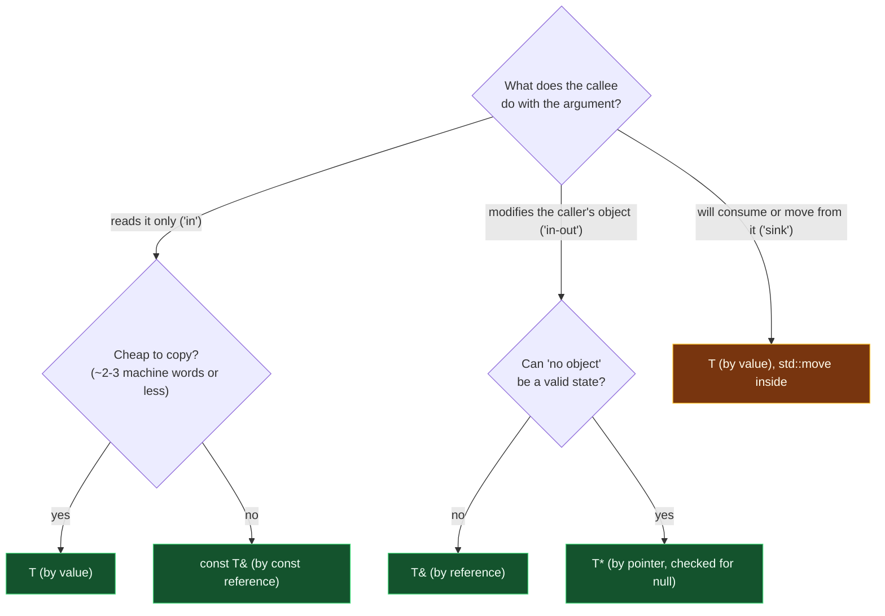

# Parameter Passing — Value, Reference, Pointer

> [!essence]
> Every parameter is a place where the caller's world meets the callee's, and C++ answers "how?" with the same rule it uses for any declaration: initialization. A parameter of type `T` is copy-initialized — the callee gets an independent object. A parameter of type `T&` is bound — the callee gets another name for the caller's own object. A parameter of type `T*` is also copy-initialized, but the value being copied is an address, so the callee holds indirection as data it explicitly asked for. The choice is not stylistic: it fixes whether the caller's mutations are visible, whether a temporary can be passed at all, and what the call costs. Default to `const T&` for anything not trivially small; reach for `T` when the type is cheap or the callee will consume it; reach for `T*` only when "no argument" must be a legal answer.

## The Question

A function's signature fixes, once and for all the calls that will ever be made to it, how each argument reaches its parameter — see [[Anatomy of a Function]] for why that signature is checked before a single instruction of the body runs. For each parameter, independently, the language offers exactly three shapes: a plain type `T` (copy in), a reference `T&` or `const T&` (alias in), or a pointer `T*` or `const T*` (an address, itself copied in). [[Pointers vs References]] settles what a reference or a pointer *is* once you already have one; this note asks the question that comes first — given data the caller already owns, which of the three should a *parameter* be?

> [!principle] Argument passing is initialization, applied at a boundary
> 1. **Constraint.** A parameter is a local name the function body computes with, but the call-site argument is an *expression* — sometimes a variable with a stable address, sometimes a temporary that exists nowhere before the call and nowhere after it.
> 2. **Consequence.** If a parameter could only ever alias existing storage, a temporary like `a + b` could never be an argument — there would be no object to name. If a parameter could only ever copy, an expensive-to-copy or genuinely uncopyable type (`std::ifstream`) could never be passed, and no callee could ever reach back into the caller's own object to change it.
> 3. **Requirement.** The language needs a way to produce an independent value from *any* expression, including a temporary, and a separate way to reach the caller's existing storage without copying it — and, for the cases in between, a way to say "here is an address; use it or not."
> 4. **Design.** C++ reuses the initialization rule it already has for a plain declaration. `void f(T x)` copy-initializes `x` exactly as `T x = arg;` would. `void f(T& x)` or `void f(const T& x)` binds `x` exactly as `T& r = arg;` would — and only the `const` form can bind a temporary, because a non-`const` lvalue reference may never bind an rvalue. `void f(T* x)` adds a third option: the value being copy-initialized is an address, so the callee decides, explicitly, whether to dereference it.
> 5. **Price.** Three mechanisms for one job means the signature must carry the caller's expectations on its own — nothing in the language forces `void f(T)` to mean "read-only" or `void f(T&)` to mean "will modify"; that is convention, not syntax. And the cheapest of the three, by value, is only cheap when `T` genuinely is — used on the wrong type it silently becomes the most expensive one.

## At a Glance

| Criterion | `T` (by value) | `T&` / `const T&` (by reference) | `T*` / `const T*` (by pointer) |
|---|---|---|---|
| **Copies the argument** | ✓ always — an independent object | ✗ never — an alias, not a copy | ✓ copies the *address* only |
| **Caller sees mutations** | ✗ never (own copy) | ~ only the non-`const` form | ~ only the non-`const` form |
| **Binds a temporary directly** | ✓ copy/move-constructs from it | ~ `const T&` only, never plain `T&` | ✗ a temporary has no address to take |
| **Can express "no argument"** | ✗ must be a real object | ✗ never null | ✓ `nullptr` |
| **Cost for a large object** | ✗ a full copy (or a move) | ✓ one address, always | ✓ one address, always |
| **Call-site syntax** | a plain name | a plain name — looks identical to by value | explicit `&x`; dereferenced with `*`/`->` |
| **Typical role** | small types; "sink" parameters the callee consumes | the default for read-only or in-out access | optional, re-aimable, or C-style array access |

## Deep Dive

### By Value — an Independent Copy

A by-value parameter is copy-initialized from the argument, so the callee's `T x` and the caller's expression are, from that point on, unrelated objects (Primer §6.2, p. 209). Nothing the function does to `x` reaches back to the caller — which is exactly the guarantee that makes by-value parameters safe to mutate freely inside the function without any risk to the caller's state.

A pointer parameter is itself passed by value: `void f(int* p)` copies the *pointer*, not the pointee. Re-aiming the local copy (`p = &other;`) never affects the caller's pointer variable, but writing through it (`*p = 0;`) changes the object it points to, because that object was never copied — only its address was (Primer §6.2, p. 209). Confusing "the pointer is a copy" with "the pointee is a copy" is the single most common misreading of pointer parameters.

Since C++11, by-value has a second job: the **sink** parameter. If a function will consume or move from its argument, taking it by value and calling `std::move` inside lets one implementation handle both an lvalue caller (which pays for a copy) and an rvalue caller (which pays only for a move) without writing an overload for each. The C++ Core Guidelines state a stricter form, *F.18: For "will-move-from" parameters, pass by `X&&` and `std::move` the parameter*, which rejects lvalue callers outright; by-value-plus-move is the more permissive variant, paying one extra move in exchange for accepting both. Pikus shows the same pattern chosen deliberately once a type is move-enabled (Pikus, "Copying and argument passing," p. 321).

### By Reference — an Alias, Never a Copy

A reference parameter is bound, not copied: `void f(T& x)` makes `x` another name for the caller's own object for the whole call, so every read or write through `x` is a read or write of that object (Primer §6.2.2, p. 210). This is what makes non-`const` reference parameters the idiomatic way to hand back more than one result — a function that must report both a position and a count can compute the first as its return value and write the second through a reference parameter, rather than inventing a struct just to carry two numbers out (Primer §6.2.2, p. 211).

Only `const T&` can bind a temporary; a plain `T&` cannot (see *In Code* §3). That asymmetry is not an arbitrary restriction — it is a safety property. A parameter declared `T&` promises the callee real, addressable storage to write into, and the language enforces that promise at every call site: you cannot accidentally hand a throwaway value to something that claims to modify your object, because there is no "your object" to modify. `const T&`, by contrast, only reads, so a temporary is exactly as good an argument as a named variable — which is why Tour calls "pass by `const` reference" the default choice for anything read-only and not tiny (Tour §3.4.1, p. 38).

### By Pointer — an Address You Must Ask to Dereference

A pointer parameter passes an address as data. The callee decides, at its own discretion and every time, whether to dereference it — which is exactly what makes `nullptr` a legal argument and "no object" a state the parameter can represent, something neither `T` nor `T&` can do (a reference must be bound to something at every call; a plain object parameter must be a real value). This is also why C-heritage code leans so heavily on pointer parameters for in-out access, and why idiomatic C++ mostly doesn't: a reference states, in the type itself, that the argument is never optional, so it needs no null check at all (Primer §6.2.1, p. 210).

### Under the Hood: the caller pays for the copy; the callee's cost is one address either way

For a large type, "by value" and "cheap" are not the same claim — the copy has to happen somewhere, and it is the caller's expression that pays for it, before the call even begins. Compiling a 32-byte struct three ways shows the callee side of that split:

```nasm
use_by_value(Big):                  use_by_ref(Big const&):            use_by_ptr(Big const*):
  cvttsd2si eax, [rsp+8]              cvttsd2si eax, [rdi]                cvttsd2si eax, [rdi]
  ret                                  ret                                  ret
```
*(GCC 14.2, Compiler Explorer, x86-64 Linux, System V ABI, `-O2 -std=c++20`.)*

`use_by_ref` and `use_by_ptr` are identical: both receive one 8-byte address in `rdi`, exactly the same machine fact [[Pointers vs References]] shows for a reference versus a pointer parameter — that equivalence doesn't go away just because the type on the other end is larger. `use_by_value` reads straight from a stack slot the caller already filled in, because a 32-byte `Big` is too large for the System V ABI's register-passing classes; the *caller's* code, not shown here, is where the actual field-by-field copy happens. For a small type — one `int`, one pointer — that copy is often a single register move, cheap enough to ignore; Tour's rule of thumb is "the size of two or three pointers or less" (Tour §3.4.1, p. 38). Past that size, by-value cost scales with the type, while by-reference and by-pointer stay at one address no matter how large `T` gets.

Pikus makes the failure mode concrete: passing a `std::vector<int>` by value into a function that only reads it (say, sums its elements) copies every element for no reason, and calls this "such a blatant inefficiency that it may be considered a bug" — one that shows up disproportionately in template code written for small types and reused for large ones (Pikus, "Copying and argument passing," p. 320).

### Corner Case: the order two arguments are evaluated in is unspecified

A natural assumption is that arguments are evaluated left to right, the way they're written. The Standard never promised that. Evaluating a function's arguments (and the postfix expression naming the function) are all sequenced *before* the function body runs, but relative to each other they are **indeterminately sequenced**: each individual argument's evaluation completes without overlapping another's, but the compiler may pick either order, and may pick a different order the next time the same call is compiled (cppreference, *Order of evaluation*, rule 14; the current working draft's `[intro.execution]`).

> [!standard] This rule has moved
> Before C++17, two arguments that both modified the *same* object — `f(++i, ++i)` — were undefined behavior: the two writes were *unsequenced*. Since C++17 (P0145R3), each parameter's initialization, with all its side effects, is *indeterminately sequenced* relative to the others: either order, but never interleaved, so `f(++i, ++i)` is well-defined-but-unspecified: `i` ends up incremented twice, in some order the Standard won't name, rather than corrupted. Two arguments touching *unrelated* objects were never UB, at any standard — only the order was ever left open, which is what *In Code* §4 demonstrates.

## Decision Guide



> [!rule] The Core Guidelines' summary
> *F.16: For "in" parameters, pass cheaply-copied types by value and others by reference to `const`.* · *F.17: For "in-out" parameters, pass by reference to non-`const`.* · *F.18: For "will-move-from" parameters, pass by `X&&` and `std::move` the parameter.* · *F.15: Prefer simple and conventional ways of passing information.*

In words: default to `const T&` unless the type is small enough that a copy is free, in which case take it by value; switch to `T&` the moment the callee must write back into the caller's object and "no object" would never be legal; switch to `T*` the moment it would. Reserve by-value-plus-`std::move` for functions whose whole point is to consume the argument.

## In Code

**1 · The contract, observed**

```cpp
#include <iostream>

void by_value(int n)      { n = 99; (void)n; }        // ① writes to the local copy only
void by_reference(int& n) { n = 99; }                 // ② writes through to the caller's object
void by_pointer(int* n)   { if (n) *n = 99; }          // ③ writes through, but only if not null

int main() {
    int a = 1, b = 1, c = 1;
    by_value(a);
    by_reference(b);
    by_pointer(&c);
    std::cout << a << ' ' << b << ' ' << c << '\n';
}
// expect: 1 99 99
```
1. `n` is `by_value`'s own object; assigning to it can never touch `a`.
2. `n` *is* `b` for the duration of the call — this is the "in-out, never null" row of *At a Glance*.
3. The null check is only meaningful because `T*` can legally be null; a reference parameter would never need one.

**2 · The cost, proven — not simulated**

```cpp
#include <cstdio>

struct Counter {
    inline static int copies = 0;
    int payload[8]{};
    Counter() = default;
    Counter(const Counter&) { ++copies; }              // ① every by-value call runs this
};

void take_by_value(Counter c) { (void)c; }
void take_by_ref(const Counter& c) { (void)c; }

int main() {
    Counter x;
    take_by_value(x);   // ②
    take_by_value(x);   // ②
    take_by_ref(x);     // ③
    take_by_ref(x);     // ③
    std::printf("%d\n", Counter::copies);
}
// expect: 2
```
1. Counting inside the copy constructor turns "by value copies" from a claim into a measurement.
2. Two by-value calls, two copy-constructions.
3. Two by-reference calls, zero — the counter proves what *At a Glance* only asserts.

**3 · Only `const T&` binds a temporary**

```cpp
// cc: ill-formed
#include <string>

void takes_const_ref(const std::string& s) { (void)s; }
void takes_ref(std::string& s) { (void)s; }

int main() {
    takes_const_ref(std::string("temp") + "orary");   // ① OK: binds the temporary
    takes_ref(std::string("temp") + "orary");           // ② error: no lvalue to bind
}
```
1. `const T&` extends the temporary's lifetime through the call ([[Temporaries and Lifetime Extension]]); it never needs a name of its own.
2. `error: cannot bind non-const lvalue reference of type 'std::string&' to an rvalue of type 'std::string'` — the compiler refuses precisely because `T&` promises a real object the callee can write back into, and this expression offers none.

**4 · Argument order is unspecified, not left-to-right**

```cpp
#include <cstdio>

int tag(const char* name) { std::printf("%s ", name); return 0; }
void combine(int, int) {}

int main() {
    combine(tag("left"), tag("right"));   // order between the two tag() calls is unspecified
    std::printf("\n");
}
// prints (GCC 11.4.0, x86-64 Linux, -O0 and -O2; re-run by the Editor 2026-10-03): "right left" —
// the Standard permits either order, and neither this output nor "left right" is guaranteed
```
This never crashes and never corrupts anything — `left` and `right` name unrelated objects, so there is no UB here at any standard. What's unspecified is purely which `tag()` call happens first, and a program that depends on the answer has a latent, compiler-specific bug.

## Connections

- **Prerequisites:** [[Anatomy of a Function]] (the signature this note's choices are made inside) · [[Pointers]] · [[References]] (what each access path *is*, before this note asks which to choose).
- **Deeper:** [[Pointers vs References]] (the type-level contrast this note leans on for *By Reference* and *By Pointer*) · [[Returning Values — Copies, References and RVO]] (the mirror question for what comes back out) · [[Move Semantics]] (what the sink pattern in *By Value* is building toward) · [[const and Const-Correctness]] · [[Top-Level vs Low-Level const]] (why `const T` and `const T&` parameters mean different things).
- **Machine:** [[The Call Stack and Stack Frames]] (where the by-value copy this note measures actually lives).
- **Domain:** [[Map — Functions]].
- **Practice:** *Continuum #6 Function Library & Header Refactor* — choose each parameter's form deliberately as you split declarations from definitions across headers.

## Check Yourself

> [!quiz]- A function is declared `void scale(std::vector<double> v, double k)`. What's wrong with the first parameter, and how would you fix it if `scale` only reads `v`?
> It takes a potentially large `vector` by value, copying every element on every call for no reason. If `scale` only reads `v`, it should take `const std::vector<double>&` — one address, no copy, and the caller's vector is safe from mutation by contract.

> [!quiz]- Why can `const T&` bind `f(a + b)` but a parameter declared `T&` cannot?
> `a + b` is a temporary — an rvalue with no persistent address the caller controls. `const T&` is specifically permitted to bind rvalues (with lifetime extension through the call). A plain `T&` is a promise of real, writable storage; the language refuses to bind it to a temporary because "write back into it" would have nothing meaningful to reach.

> [!quiz]- `void reset(int* p) { if (p) *p = 0; }` is called once as `reset(&x)` and once as `reset(nullptr)`. Could either call have been written with a `int&` parameter instead?
> Only the first. `reset(&x)` could become `reset(int& p) { p = 0; }`, but `reset(nullptr)` has no object to bind — a reference can never be null, so the "no argument" call has no reference-based equivalent at all.

> [!quiz]- `f(++i, ++i)` where `i` starts at `0`. Is this undefined behavior in C++20?
> No — since C++17 the two argument initializations are indeterminately sequenced (neither interleaves with the other) rather than unsequenced, so the result is unspecified but not UB: `i` becomes `2` either way, and the two arguments each end up as `1` and `2` in some compiler-chosen order. Before C++17 the same expression was undefined behavior, because the two writes to `i` were allowed to overlap.

## Sources

- Primer §6.2 "Argument Passing" (p. 208): argument passing as ordinary initialization. §6.2.1 "Passing Arguments by Value" (p. 209): copies are independent objects; pointer parameters copy the pointer, not the pointee. §6.2.2 "Passing Arguments by Reference" (p. 210–211): binding semantics; using a reference parameter to return a second result.
- Tour §3.4.1 "Argument Passing" (p. 38): default-to-copy, pass-by-`const`-reference for anything not "the size of two or three pointers or less."
- Pikus, "Copying and argument passing" (p. 320–321): the cost of an unnecessary by-value copy of a `vector`, and the by-value-plus-move sink pattern for move-enabled types.
- cppreference, *Order of evaluation* (rules 3 and 14; "sequenced before" rules since C++11; defect report making unsequenced-but-non-overlapping the rule since C++17): https://en.cppreference.com/w/cpp/language/eval_order
- C++ Core Guidelines F.15, F.16, F.17, F.18: https://isocpp.github.io/CppCoreGuidelines/CppCoreGuidelines#f15-prefer-simple-and-conventional-ways-of-passing-information
- Draft standard `[intro.execution]` (sequencing of function-call argument initializations): https://eel.is/c++draft/intro.execution
