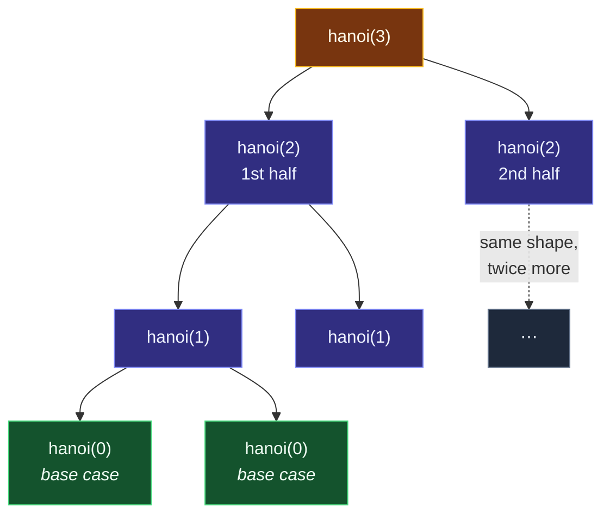

# Recursion

> [!essence]
> A recursive function solves a problem by calling itself on a strictly smaller instance of the same problem, the way a proof by induction trusts its inductive step without re-proving it. Nothing about the self-call is special to C++ — it is the same [[The Call Stack and Stack Frames|call-stack mechanism]] as any other call — but a **base case** the arguments are guaranteed to shrink toward is what separates a recursion that terminates from one that accumulates frames until the stack runs out.

## The Problem

Some computations are defined in terms of themselves at a smaller scale before a single line of code is written: moving *n* disks is moving *n* − 1 disks, moving one disk, then moving the *n* − 1 again; the height of a tree is one more than the taller of its two subtrees' heights. [[The Call Stack and Stack Frames|An ordinary function call]] already gives every invocation its own isolated frame — parameters, locals, a return address — regardless of which function did the calling. That mechanism quietly answers a harder question: what happens when a function calls itself?

> [!principle] Constraint → Consequence → Design
> 1. **Constraint:** Some problems are naturally self-similar — their own correct definition already refers to a smaller case of themselves.
> 2. **Consequence:** Writing that definition out flat, without letting the code refer back to itself, means tracking "which subproblem am I on" by hand with an explicit stack of pending states and a loop to drive it — code that has thrown away the exact correspondence to the problem's own definition.
> 3. **Requirement:** The language needs a function that can call itself, directly or indirectly, with each call getting storage of its own so that one invocation's locals are never confused with another's. The programmer, not the compiler, must then supply the one thing self-reference cannot generate on its own: a condition that eventually stops the calls before they overflow the stack.
> 4. **Design:** C++ places no restriction on a function calling itself. [[The Call Stack and Stack Frames|Ordinary function-call mechanics]] already guarantee the isolation a hundred nested calls to the same function hold a hundred independent copies of its parameters and locals without any extra machinery. Recursion is simply what that mechanism looks like when the calls happen to target the function currently running. What the programmer must supply is a **base case** — an input small enough that the function returns without calling itself again — and a **recursive case** whose argument is strictly closer to some base case every time.
> 5. **Price:** Each level of recursion is a real stack frame, so depth that grows with input size costs stack space proportional to that size, and a base case that is unreachable (or missing entirely) accumulates frames until the implementation's finite stack is exhausted. A correct base case and a correct recursive case guarantee the function terminates, but say nothing about *how many times* it calls itself — a gap the Under the Hood and Pitfalls sections below make concrete.

> [!tension] abstraction ⟷ control
> A recursive call reads exactly like any other call — same syntax, same rules, no keyword marks it as special. What that syntax hides is that, written where the compiler can trace a path back to itself, it multiplies: one line of source becomes as many live stack frames as the recursion is deep. [[The Call Stack and Stack Frames|The call stack]] makes the abstraction free to *use*; it does nothing to stop a recursion whose depth was never bounded in the first place.

## Mental Model

> [!model] Trusting the smaller case
> Treat a recursive function the way a proof by induction treats its inductive step: assume the recursive call already does the right thing for its smaller argument — don't mentally unwind it — and check only two things instead: that the base case is correct standing alone, and that the recursive case combines a correct smaller answer into a correct answer for the current input. If both hold, the function is correct at every depth, by induction on the size of the argument.
> **Where it breaks:** induction proves correctness, not cost. Trusting the smaller call tells you nothing about how many times it ends up being called or how much stack it uses while doing it — two formulations of the same problem can both be "obviously correct" under this model and differ by orders of magnitude in the work actually done, as *Pitfalls* below shows.



Every branch of this tree is the *same* function call, shrunk — `hanoi(3)` splits into two `hanoi(2)` calls, each of those into two `hanoi(1)` calls, and every `hanoi(1)` bottoms out at `hanoi(0)`, the base case. The code never draws this tree; it falls out of the function calling itself.

## Mechanics

Two properties make a self-calling function recursive in the sense this note means, rather than merely infinite. A **base case** is an input for which the function returns without calling itself again — the recursion's floor. A **recursive case** calls the function again, but only with an argument measurably closer to some base case than the current one: a smaller count, a shorter list, a shallower subtree. That "measurably closer" property is a **progress argument** — without one, nothing but a finite stack stops the calls, and the stack stops them by crashing, not by returning an answer.

| Shape | Each activation calls itself… | Frame growth | Seen in this note |
|---|---|---|---|
| **Linear** (direct) | at most once | one frame per unit of input size | a `factorial`- or `countdown`-style function |
| **Tree-shaped** (direct) | more than once | one frame per *level*, but the number of calls grows with the branching factor | Towers of Hanoi · BST height |
| **Indirect / mutual** | a *different* function, which calls back | alternates between two functions' frames | `is_even` ⟷ `is_odd` |
| **Tail** (a special case of linear) | once, as its last action | still one frame per call in the language itself; some compilers rewrite it into a loop | see [[The Call Stack and Stack Frames]] |

> [!standard] What the Standard actually constrains
> Ordinary run-time recursion answers to nothing more than [[The Call Stack and Stack Frames|the call-stack mechanism]]: the Standard requires only that an automatic object's storage survive while its block is suspended by a nested call (`[intro.execution]`), and it sets no depth limit for that case at all. Compile-time recursion is the one place a number appears: Annex B's informative implementation limits (`[implimits]`) give a potential minimum of only **512** recursive invocations for a `constexpr` function (`[dcl.constexpr]`) — a figure that matters more than it might seem, because, as *Evolution* below shows, recursion used to be the *only* way to repeat anything inside a `constexpr` function at all.

## Under the Hood

> [!machine] One frame, two further calls (GCC 11.4.0, x86-64 Linux/Ubuntu 22.04 — this run's toolchain, see Style Guide §4.7 — `-O0 -std=c++20`)
> ```nasm
> fib(int):
>         push  rbp
>         mov   rbp, rsp
>         push  rbx                     ; ① must survive across BOTH recursive calls
>         sub   rsp, 24
>         mov   DWORD PTR [rbp-20], edi
>         cmp   DWORD PTR [rbp-20], 1
>         jg    .L2
>         mov   eax, DWORD PTR [rbp-20]
>         jmp   .L3
> .L2:
>         mov   eax, DWORD PTR [rbp-20]
>         sub   eax, 1
>         mov   edi, eax
>         call  fib(int)                 ; ② first recursive call
>         mov   ebx, eax                  ; ③ its result must outlive the second call
>         mov   eax, DWORD PTR [rbp-20]
>         sub   eax, 2
>         mov   edi, eax
>         call  fib(int)                 ; ④ second recursive call — same shape, same frame
>         add   eax, ebx
> .L3:
>         mov   rbx, QWORD PTR [rbp-8]
>         leave
>         ret
> ```
> For `int fib(int n) { return n < 2 ? n : fib(n - 1) + fib(n - 2); }`. Contrast the single self-call in `factorial` ([[The Call Stack and Stack Frames]]): this frame spends an extra callee-saved register (`rbx`) purely to keep `fib(n-1)`'s result alive across the second `call`. Branching recursion costs more register pressure per frame than linear recursion, on top of costing more frames in total.

The real expense shows up in how many of these frames are alive **at once**. Evaluating `fib(3)` reaches its deepest point while the first branch is still unwinding:

```text
   Deepest point reached while evaluating fib(3)      (3 live frames)
  ┌────────────────────────────────────┐   ← oldest: waiting on both branches
  │ fib(3)   n = 3                      │     paused after calling fib(2);
  │   rbx (saved) = — not yet known     │     still owes a call to fib(1)
  ├────────────────────────────────────┤
  │ fib(2)   n = 2                      │     paused after calling fib(1);
  │   rbx (saved) = — not yet known     │     still owes a call to fib(0)
  ├────────────────────────────────────┤
  │ fib(1)   n = 1                      │   ← top: base case, returns 1 at once
  └────────────────────────────────────┘
```

Three frames deep is cheap by itself. The expense is that this three-deep shape *recurs*: once `fib(1)` returns and `fib(2)` finishes its second branch, the stack empties back down to `fib(3)` — which then pushes an entirely new chain of frames to evaluate its own second branch, `fib(1)`. *Pitfalls* below counts how many times that happens in total.

## In Code

**1 · Towers of Hanoi — tree-shaped recursion with a side effect, not just a return value**

```cpp
#include <cstdio>

void hanoi(int n, char from, char to, char via, int& moves) {
    if (n == 0) return;                     // ①
    hanoi(n - 1, from, via, to, moves);      // ②
    std::printf("move disk %d: %c -> %c\n", n, from, to);
    ++moves;
    hanoi(n - 1, via, to, from, moves);      // ③
}

int main() {
    int moves = 0;
    hanoi(3, 'A', 'C', 'B', moves);
    std::printf("total moves: %d\n", moves);
}
// expect: move disk 1: A -> C
// expect: move disk 2: A -> B
// expect: move disk 1: C -> B
// expect: move disk 3: A -> C
// expect: move disk 1: B -> A
// expect: move disk 2: B -> C
// expect: move disk 1: A -> C
// expect: total moves: 7
```
1. Base case: zero disks to move is nothing to do. `n` strictly decreases on every recursive call, so this is reached in exactly `n` steps down any one branch.
2. Move the top `n - 1` disks out of the way, onto the spare peg (`via`), before disk `n` can move.
3. Move those `n - 1` disks again, from the spare peg onto the disk they're now stacked on. Two recursive calls per activation: the tree-shaped pattern from *Mental Model*.

**2 · Binary search tree height — recursion over a shape, not a count**

```cpp
#include <cstdio>
#include <memory>

struct Node {
    int value;
    std::unique_ptr<Node> left, right;
};

std::unique_ptr<Node> insert(std::unique_ptr<Node> node, int value) {
    if (!node) return std::make_unique<Node>(Node{value, nullptr, nullptr});  // ①
    if (value < node->value) node->left  = insert(std::move(node->left), value);
    else                     node->right = insert(std::move(node->right), value);
    return node;
}

int height(const Node* node) {
    if (!node) return 0;                     // ②
    int lh = height(node->left.get());
    int rh = height(node->right.get());
    return 1 + (lh > rh ? lh : rh);            // ③
}

int main() {
    std::unique_ptr<Node> root;
    for (int v : {5, 3, 8, 1, 4, 7, 9}) root = insert(std::move(root), v);
    std::printf("height: %d\n", height(root.get()));
}
// expect: height: 3
```
1. `insert`'s base case is an empty subtree (`nullptr`): that's where the new node is attached. Each recursive call descends into exactly one child, so this is linear, not tree-shaped, despite the data structure being a tree.
2. `height`'s base case: an empty subtree has height 0.
3. `height`'s recursive case calls itself *twice* — once per child — making it tree-shaped the same way `hanoi` is, even though each individual call only has one child to look at.

**3 · Mutual recursion — two functions taking turns**

```cpp
#include <cstdio>

bool is_odd(unsigned n);                 // ① declaration only: is_even needs the name in scope

bool is_even(unsigned n) {
    if (n == 0) return true;             // ② base case
    return is_odd(n - 1);                // ③ hands off to a different function
}

bool is_odd(unsigned n) {
    if (n == 0) return false;            // ④ base case
    return is_even(n - 1);               // ⑤ hands back
}

int main() {
    std::printf("%d %d\n", is_even(8), is_odd(8));
}
// expect: 1 0
```
1. `is_even` calls `is_odd` before `is_odd` is defined, so `is_odd` needs a forward declaration — the compiler only needs to see that the name and signature exist, not the body, to accept the call.
2–5. Neither function ever calls itself; each calls the *other*, and `n` strictly decreases across the pair of calls, so the same progress argument applies to the two functions together.

## Pitfalls

> [!trap] An unreachable base case is a loop with worse error messages
> If the recursive case's argument never strictly approaches any base case — a Hanoi call with `via` and `to` swapped, a countdown that increments instead of decrements — the function calls itself without bound. [[The Call Stack and Stack Frames|Each call still pushes a real frame]], so the program doesn't hang; it exhausts the stack and crashes, typically without a catchable exception, because the Standard treats this as an implementation-defined resource limit, not a language-level error the way an uncaught exception is.

> [!trap] An override that means to call its base, but calls itself instead
> A derived class's virtual override that is meant to extend its base class's version, but omits the scope operator, doesn't reach the base version at all: the unqualified call is still virtual, so it resolves back to the *same override* through dynamic dispatch — an infinite recursion through dynamic dispatch rather than through a self-call anyone wrote down directly. Primer's example is a derived `print` written as `void print(ostream& os) { print(os); os << ' ' << i; }`, meaning to call `base::print(os)` first. Writing `base::print(os)` explicitly circumvents virtual dispatch for that one call and reaches the intended version.

> [!trap] "Correct" and "cheap" are different claims
> `fib` as written in *Under the Hood* is correct by the trusting-the-smaller-case model: the base case is right, and each recursive case combines two correct smaller answers into a correct larger one. It is also wildly wasteful: evaluating `fib(n-1)` recomputes `fib(n-2)` from scratch, work that `fib(n-2)`'s own call already redid at the next level down, and the duplication compounds with every level. Calling `fib(4)` makes **9** total calls to reach one answer; `fib(30)` makes roughly **2.7 million**, for a result a single loop computes in thirty steps. Recognizing that a tree-shaped recursion keeps re-deriving the same subproblem is the first step toward fixing it — by remembering each subproblem's answer instead of recomputing it, or by writing the loop directly — a design decision this note leaves to the problem at hand rather than making for you.

## Evolution

| Standard | Change | Why |
|---|---|---|
| C++98 | Any function may call itself, directly or indirectly; no distinct language feature marks it | Recursion follows immediately from every call getting its own storage — see [[The Call Stack and Stack Frames]] |
| **C++11** | `constexpr` functions introduced (`[dcl.constexpr]`), restricted to a body of declarations plus exactly **one** `return` statement — no loops permitted | Compile-time evaluation needed *some* way to repeat work, and a one-statement body can only repeat by calling itself |
| **C++14** | N3652 relaxes `constexpr`: ordinary declarations, `if`/`switch`, every looping statement, and mutation of locals whose lifetime began in the call are all allowed | Recursion stops being the *only* way to express compile-time repetition and becomes a style choice, the same as at run time |
| (unchanged since) | Annex B (`[implimits]`) still sets an informative minimum of 512 for recursive `constexpr` invocations | No corresponding minimum exists for ordinary run-time recursion — see *Mechanics* |

## Connections

- **Prerequisites:** [[The Call Stack and Stack Frames]] — this note is that mechanism turned into a control-flow tool; read it first for what a frame actually costs and why a tail-recursive function sometimes doesn't grow the stack at all.
- **Enables:** recursive-descent parsing, tree and graph traversal, and divide-and-conquer algorithms generally — recursion is the mechanism underneath each, wherever this Compendium covers them.
- **Siblings:** [[Anatomy of a Function]] — a recursive call still has to satisfy the same signature contract as any other call; nothing about calling yourself relaxes it. [[Functions and Parameters — The Complete Picture]] covers the rest of the domain this note sits inside.
- **Domain:** [[Map — Functions]].
- **Practice:** *Continuum #9 Recursion Lab: Towers of Hanoi & Maze Solver* — implement the three-argument `hanoi` function from *In Code*, then adapt the same base-case/recursive-case shape to a maze solver, where the base case becomes "found the exit" or "hit a dead end" instead of "zero disks left." *Continuum #15 Binary Search Tree Explorer* — the `insert` and `height` functions from *In Code* are the template for every BST operation in that project: a base case at `nullptr`, a recursive case that picks `left` or `right` and trusts the smaller call.

## Check Yourself

> [!quiz]- What two things does a function need, beyond simply being allowed to call itself, to count as a well-formed recursive function?
> A **base case** that returns without a further self-call, and a **recursive case** whose argument makes measurable progress toward a base case (a progress argument). Without the second, the first is never reached — the calls continue until the stack, not the function's own logic, stops them.

> [!quiz]- The mutual-recursion example needs a forward declaration of `is_odd` before `is_even`'s definition. Why doesn't an ordinary (non-mutual) recursive function need a forward declaration of itself?
> A function calling itself only needs its own name in scope, which it already is by the time its own body is being compiled. `is_even` needs `is_odd` in scope *before* `is_odd` has been defined — only declared — because `is_even`'s body is compiled first and calls a name that doesn't have a body yet at that point in the file.

> [!quiz]- Predict: how many total calls does running `fib(4)` make to the `fib` function shown in Under the Hood, including the outermost call?
> **9.** Counting a call to `fib(n)` recursively as 1 (for itself) plus the calls its two branches make: `fib(0)` and `fib(1)` each cost 1 call (base cases); `fib(2)` costs `1 + 1 + 1 = 3`; `fib(3)` costs `1 + 3 + 1 = 5`; `fib(4)` costs `1 + 5 + 3 = 9`.

> [!quiz]- Before C++14, could a `constexpr` function compute a value with a `for` loop instead of recursion?
> No. A C++11 `constexpr` function's body was restricted to declarations plus exactly one `return` statement — no loop statement was permitted at all, so recursion was the only available way to repeat work at compile time. N3652, adopted for C++14, lifted that restriction and allowed ordinary loops, declarations, and `if`/`switch` in a `constexpr` body.

## Sources

- Primer §6.3 "Return Types and the return Statement" (pp. 227–228): recursion defined, the `factorial` example, the requirement that a recursive function always have a path that doesn't recurse, and the "recursion loop" term for one that lacks it.
- Primer §15.3 "Virtual Functions" (p. 608): the specific pitfall of a derived override that omits the scope operator when meaning to call its base version, resolving back to itself through dynamic dispatch instead.
- PPP §5.9 "Program structure" (ch. 5 "Writing a Program"): a recursive-descent `expression()` that omits its stopping condition, described as running until the program exhausts the memory holding the chain of calls.
- Draft standard `[intro.execution]` ¶1 (automatic storage survives a suspending nested call — the constraint behind ordinary recursion) and Annex B `[implimits]` item 1.38 (an informative minimum of 512 recursive `constexpr` invocations, `[dcl.constexpr]`): https://eel.is/c++draft/intro.execution · https://eel.is/c++draft/implimits
- WG21 N3652, *Relaxing constraints on constexpr functions* (the C++11 "exactly one return statement" rule and its C++14 replacement, with the exact wording diff): https://wg21.link/n3652
- cppreference, *constexpr specifier*: https://en.cppreference.com/w/cpp/language/constexpr
- See [[Map — Functions]] for how this note connects to the rest of the domain.
