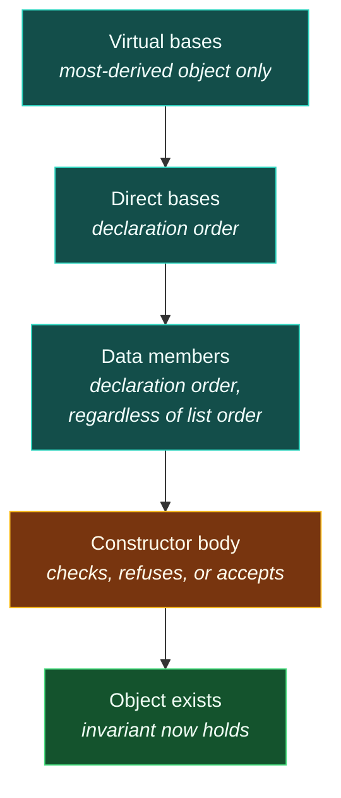

# Constructors

> [!essence]
> A **constructor** is the special member function that brings an object into existence already satisfying its invariant. It has no return type, is never called on an object that already exists, and the compiler guarantees that exactly one runs — completing every base and every member first — before any other code, including the object's own body, gets to touch it.

## The Problem

[[Encapsulation and Class Invariants|The previous note]] named the constructor as the mechanism that establishes `Account`'s invariant and moved on. It's time to build that mechanism out: what exactly does "establish" require the language to guarantee?

> [!principle] Constraint → Consequence → Requirement → Design → Price
> 1. **Constraint.** Storage becoming [[The C++ Object Model — What an Object Is|an object]] is not, by itself, a statement about the *relationship* among that object's bits. `sizeof(Account)` bytes of memory don't know that a valid `Account` needs `balance_ >= 0.0`; only code can know that, and code has to run before anyone is entitled to assume it.
> 2. **Consequence.** If bringing an object into being were an ordinary two-step — reserve the memory, then separately remember to call some `init()` — every call site that forgets the second step hands the rest of the program an object every member function was written to assume is already valid. The bug surfaces wherever that assumption is used, not where it was skipped.
> 3. **Requirement.** The language needs an operation that (a) the compiler inserts automatically, so skipping it isn't an option; (b) runs in a fixed, well-defined order across every base and member, whether or not the class author mentions them; and (c) can *refuse* — leave the object's lifetime never begun — when given arguments that can't produce a value the invariant allows.
> 4. **Design.** The **constructor**: a member function named after the class, with no return type, that the compiler calls at every point of the program where an object of that type comes into being. Before its own body runs, every base subobject and every data member is already fully built — by its own constructor, a default member initializer, or default-initialization — so the body's job is only what member-by-member construction can't do alone: check relationships between members, and throw if they don't hold.
> 5. **Price.** A class needs at least one reachable constructor to be usable at all (the compiler supplies one only under narrow conditions, and not always correctly — *Mechanics*). Constructors can't be invoked like ordinary functions to "reset" a live object — assignment or destroy-and-reconstruct do that instead. And a throwing constructor obliges the compiler to unwind exactly what was already built, member by member, without ever running the object's own destructor: a guarantee [[RAII|the next domain]] depends on completely.

> [!tension] abstraction ⟷ control
> Encapsulation only buys what its constructor actually checks. Hiding `balance_` behind `private` means nothing if the one function allowed to set it accepts every value handed to it — the boundary is real, but a boundary that lets anything through isn't enforcing an invariant, it's just relocating where the bad value gets stored.

## Mental Model

> [!model] Construction is an assembly line, not a blank check
> By the time a constructor's body executes its first statement, every base and every member already exists — each one built by its own constructor before control ever reaches this class's code. The body doesn't *create* the object; it receives an already-assembled one and gets one chance to reject it.
> **Where it breaks:** the assembly-line picture suggests the object is "itself" at every step along the way. It isn't. While a base's constructor is running, the object is only that base as far as the type system and virtual dispatch are concerned — the derived part hasn't been bolted on yet (*Pitfalls*, [[Object Lifetime]]).



## Mechanics

**A constructor has the class's name and no return type**, not even `void`. It can't be `const`, `static`, or `virtual` — there is no object yet for `const` to qualify, no dispatch to perform before the object's dynamic type is settled, and nothing for `static` to mean for an operation whose entire job is to build one instance. Like any function it can be overloaded; the kinds that recur are catalogued in [[Overloading in Classes — Constructors, Members and Operators]] (default, converting, copy, move, `initializer_list`, delegating). This note is about what *every* one of them is obligated to do, whichever kind it is.

**What happens to a member the constructor doesn't mention.** If a data member has no matching entry in the member initializer list, one of two things happens, and the choice isn't the constructor's:

| Situation | Rule | Example |
|---|---|---|
| Member has a default member initializer (C++11 NSDMI) | Uses that initializer | `int cap_ = 16;` → `16` when the constructor's list is silent about `cap_` |
| Member has neither an initializer nor a list entry | Default-initialized | A class-type member calls its default constructor; a built-in (`int`, `int*`) gets an **indeterminate value** — reading it is undefined behavior until something assigns to it |

> [!standard] Order is fixed, and it is not the list's order
> `[class.base.init]` ¶15: in a non-delegating constructor, initialization proceeds *virtual bases* (most-derived object only, depth-first left-to-right) → *direct bases* (declaration order) → *data members* (declaration order) → *the constructor body*. The member initializer list only supplies **values**; the **order** is always the order members are declared, "regardless of the order of the mem-initializers" — the exact wording the standard uses because programmers reliably expect otherwise (*Pitfalls*).

**A constructor either finishes or the object never existed.** `[class.base.init]` ¶11: "an object's initialization is considered complete when a non-delegating constructor for that object returns." A **delegating constructor** (C++11, `Widget() : Widget(default_args) {}`) hands off to another constructor of the same class; the object's lifetime can begin the moment that *target* constructor returns, before the delegating constructor's own body has run at all.

**The compiler supplies a default constructor only under narrow conditions**, and mis-relying on them is the single most common reason a class needs to write its own. The implicitly-declared default constructor is defined as **deleted** — meaning `T t;` doesn't compile — if any of these hold (cppreference, *Default constructors*):

| Condition for a deleted default constructor | Why |
|---|---|
| A reference member with no default member initializer | References must bind to something on construction; there is nothing to bind to by default |
| A `const`-qualified member with no default member initializer and no way to default-construct it | A `const` member can be set exactly once, and never afterward |
| A member or base whose own default constructor is deleted, inaccessible, or ambiguous | The compiler can't do for you what it can't call |

And the compiler declares no default constructor at all — not even a deleted one to complain about — once the class declares **any** other constructor. `Sales_data(std::string)` alone means `Sales_data()` no longer exists unless written or explicitly `= default`ed.

## Under the Hood

> [!machine] A constructor is an ordinary function with a hidden first argument
> `struct Point { int x, y; Point(int x_, int y_) : x(x_), y(y_) {} };`, compiled at `-O0` (GCC 11.4.0, x86-64 Linux, this vault's local toolchain):
> ```nasm
> Point::Point(int, int):
>         mov  QWORD PTR [rbp-8], rdi   ; rdi = address of the object being built (the hidden "this")
>         mov  DWORD PTR [rbp-12], esi  ; esi = x_
>         mov  DWORD PTR [rbp-16], edx  ; edx = y_
>         mov  rax, QWORD PTR [rbp-8]
>         mov  edx, DWORD PTR [rbp-12]
>         mov  DWORD PTR [rax], edx     ; this->x = x_
>         mov  rax, QWORD PTR [rbp-8]
>         mov  edx, DWORD PTR [rbp-16]
>         mov  DWORD PTR [rax+4], edx   ; this->y = y_
>         ret
> ```
> No instruction anywhere marks the object as "now valid" — that guarantee lives entirely in the compiler's bookkeeping about which code paths are allowed to run before the constructor returns, not in any bit the running program can inspect.

```text
 caller's frame                                  Point::Point(int, int)
┌───────────────────────────────┐
│ Point p  (8 bytes, uninit)     │◀── rdi ────   writes fields directly here:
│  ┌─────────────────────────┐  │                 [rdi]   = x_   (this->x)
│  │ x                       │  │                 [rdi+4] = y_   (this->y)
│  └─────────────────────────┘  │                no separate temporary Point ever exists
└───────────────────────────────┘
```

At `-O2` the optimizer routinely sees straight through all of this: a small object built by a constructor and immediately returned compiles to loading its bytes as a single constant, with no call, no store, no trace that a constructor ran at all. A **delegating** constructor is not, at `-O2`, a real function call to another function — GCC inlines the target and the two initializer lists collapse into one sequence of stores, exactly as if there had only ever been one constructor.

## In Code

**1 · Establishing the invariant, with `explicit` and a delegating constructor**

```cpp
#include <iostream>
#include <stdexcept>

class Temperature {
public:
    Temperature() : Temperature(0.0) {}                 // ① delegates: 0°C baseline
    explicit Temperature(double celsius) : celsius_(celsius) {
        if (celsius_ < -273.15)                         // ② the invariant, checked once
            throw std::invalid_argument("Temperature: below absolute zero");
    }
    static Temperature from_fahrenheit(double f) {       // ③ named alternative, not a converting ctor
        return Temperature((f - 32.0) * 5.0 / 9.0);
    }
    double celsius() const { return celsius_; }
private:
    double celsius_;
};

int main() {
    Temperature room = Temperature::from_fahrenheit(98.6);
    Temperature freezing;
    std::cout << room.celsius() << ' ' << freezing.celsius() << '\n';
    try {
        Temperature bad(-300.0);                        // ④
    } catch (const std::invalid_argument& e) {
        std::cout << "rejected: " << e.what() << '\n';
    }
}
// expect: 37 0
// expect: rejected: Temperature: below absolute zero
```
1. The default constructor delegates to the one-argument constructor instead of repeating its check — the check lives in exactly one place.
2. `celsius_` already holds a value (it was initialized directly, not assigned) by the time this line runs; the body's only remaining job is to refuse what the invariant can't accept.
3. `explicit` blocks `Temperature t = -300.0;` from silently converting a bare `double`; a named static function is how the class still offers a second unit without opening that door (full treatment: [[Overloading in Classes — Constructors, Members and Operators]]).
4. `bad` never comes into existence: the exception leaves the constructor before it returns, so this object's lifetime never began.

**2 · A member initializer list read top to bottom lies about what runs first**

```cpp
// cc: ub
class Rectangle {
public:
    Rectangle(int w, int h) : width_(w), height_(h), area_(width_ * height_) {}   // ①
    int area() const { return area_; }
private:
    int area_;      // ② declared FIRST
    int width_;     //    declared second
    int height_;    //    declared third
};

int main() {
    Rectangle r(3, 4);
    (void)r.area();
}
```
1. Read left to right, this looks like: set `width_`, set `height_`, then compute `area_` from both. That is not what happens.
2. Construction order follows **declaration** order, so `area_` is initialized *first* — from `width_` and `height_`, which are still indeterminate. GCC 11.4.0 (`-Wall -Wextra -Wreorder`, this vault's toolchain) catches exactly this: `'height_' will be initialized after 'area_'`, plus a separate `-Wuninitialized` warning at the read of each member. Compiling and running it printed `0` for `area_` on this toolchain at `-O0` — but that number is not a guarantee. Reading an indeterminate `int` in an expression is undefined behavior (`[basic.indet]`); a different compiler, flag set, or optimization level is free to produce anything, including a value that looks plausible. The fix is to declare `area_` last, or compute it in the body instead of the list.

**3 · A virtual call from a constructor never reaches a derived override**

```cpp
#include <iostream>

struct Widget {
    Widget() { std::cout << "Widget: kind() = " << kind() << '\n'; }   // ①
    virtual const char* kind() const { return "Widget"; }
    virtual ~Widget() = default;
};

struct Button : Widget {
    const char* kind() const override { return "Button"; }
};

int main() {
    Button b;                                                          // ②
}
// expect: Widget: kind() = Widget
```
1. `Widget`'s constructor calls the virtual function `kind()`.
2. Constructing a `Button` runs `Widget`'s constructor first, and *while it runs*, `Button`'s part of the object doesn't exist yet. The call binds to `Widget::kind()`, not `Button::kind()` — printing `"Widget"` even though the complete object really is a `Button`. See *Pitfalls*.

**4 · A constructor that throws unwinds exactly what it already built**

```cpp
#include <iostream>
#include <stdexcept>
#include <string>

struct Resource {
    Resource(const char* name, bool fail) : name_(name) {
        std::cout << "acquire " << name_ << '\n';
        if (fail) throw std::runtime_error(std::string("failed: ") + name_);
    }
    ~Resource() { std::cout << "release " << name_ << '\n'; }
    const char* name_;
};

struct Machine {
    Machine() : a_("A", false), b_("B", true), c_("C", false) {}   // ①
    ~Machine() { std::cout << "Machine::~Machine\n"; }
    Resource a_, b_, c_;
};

int main() {
    try {
        Machine m;                                                  // ②
    } catch (const std::exception& e) {
        std::cout << "caught: " << e.what() << '\n';
    }
}
// expect: acquire A
// expect: acquire B
// expect: release A
// expect: caught: failed: B
```
1. `a_` finishes constructing; `b_` throws mid-construction; `c_` is never reached.
2. `[except.ctor]` requires the destructor of every subobject "known to be initialized" — here, `a_` — to run, in reverse order of completion. `b_` itself never finished, so its destructor does not run for it; `c_` never started, so it has nothing to destroy; and `Machine::~Machine` never runs at all, because no `Machine` object was ever completed. This is exactly the guarantee [[RAII]] is built on: a partially constructed object leaks nothing, provided each resource is owned by a member whose own constructor/destructor pair handles it. The `throw` itself, and how far it searches before landing in `main`'s `catch`, is [[Exceptions]].

## Pitfalls

> [!ub] Reading a member before its own initialization runs
> A member initializer that reads another member is only safe if that other member is declared *earlier* in the class — declaration order, not list order, is what actually runs (In Code 2). Primer's own advice: prefer initializing each member from the constructor's *parameters* rather than from another member, so the order never matters.

> [!trap] A virtual call in a constructor or destructor uses the type under construction, not the final type
> `[class.cdtor]` requires it: while a base's constructor runs, the object is treated as if it had exactly that base's type, because the more-derived part's lifetime genuinely hasn't started yet. Full treatment: [[Virtual Calls in Constructors and Destructors]]; the underlying rule is the same one [[Object Lifetime]] gives for why an incomplete object can't safely be treated as complete.

> [!trap] Defining any constructor removes the compiler's default one
> `Sales_data(std::string)` alone silences `Sales_data()` — it must be written explicitly (or `= default`ed) if the class still needs to support `Sales_data s;`. This is the single most common cause of an unexpectedly deleted default constructor, and it is *not* the same rule as the deleted-default-constructor table in *Mechanics*: that table is about what happens when the compiler *tries* to synthesize one and can't.

> [!trap] A constructor's check protects the day the object is born, not every day after
> Validating the arguments in the constructor guarantees the invariant holds once — at construction. A mutating member function added later is a fresh place the invariant can be broken, and the constructor's diligence buys it nothing automatically (see [[Encapsulation and Class Invariants]]).

## Evolution

| Standard | Change | Why |
|---|---|---|
| C++98 | Constructors as described here: named after the class, no return type, overloadable, default/copy forms synthesized under conditions | The baseline mechanism |
| **C++11** | Delegating constructors (`X() : X(args) {}`); default member initializers (NSDMI); `= default` / `= delete`; inheriting constructors (`using Base::Base;`); constexpr constructors | Less duplication between overloaded constructors; a constructor no longer has to be the only place a member gets its default value |
| C++17 | Guaranteed copy elision changes what a constructor call even *is* for a returned prvalue (see [[Value Categories]]) | Removes a copy/move requirement some constructors couldn't satisfy at all (e.g. `std::mutex`) |
| C++20 | Constructors can be constrained with `requires`; aggregate rules tightened around user-declared constructors | Overload sets that used to rely on `enable_if` read as ordinary constructor declarations |

## Connections

- **Prerequisites:** [[Encapsulation and Class Invariants]] (states the job a constructor exists to do) · [[Classes as User-Defined Types]] (the class this note builds a constructor for) · [[Object Lifetime]] (what "begins" and "complete" mean for an object).
- **Enables:** [[Destructors]] (construction's matching half) · [[Member Initializer Lists and Initialization Order]] (the full mechanics of the list this note only summarizes) · [[The Special Member Functions]] (copy and move constructors as two of the five) · [[RAII]] (acquire in the constructor, release in the destructor) · [[The Forms of Initialization]] (which constructor a given `T x(v);`, `T x = v;` or `T x{v};` is even allowed to call).
- **Siblings:** [[Overloading in Classes — Constructors, Members and Operators]] (every *kind* of constructor, in detail) · [[Virtual Calls in Constructors and Destructors]] (the pitfall in full).
- **Domain:** [[Map — Classes & Encapsulation]].
- **Practice:** *Continuum #17 Bank Account Simulator* — write the constructor that actually enforces the invariant [[Encapsulation and Class Invariants|the previous note]] only described. *Continuum #12 Build-Your-Own Dynamic Array* — a constructor that allocates a buffer must leave the object in a state its destructor can safely unwind if a later member throws.

## Check Yourself

> [!quiz]- What must be true about a class's data members and bases before its constructor's own body executes its first statement?
> Every base subobject and every data member already exists: each was built by its own constructor, a default member initializer, or default-initialization, in declaration order (virtual bases, then direct bases, then members). The body's job is only to check relationships the member-wise build can't establish alone, and to refuse — by throwing — if they don't hold.

> [!quiz]- `X(int val): j(val), i(j) {}` where `i` is declared before `j`. What value does `i` end up with, and why doesn't writing `j` first in the list change that?
> `i` is initialized with whatever indeterminate value `j` happened to hold — undefined behavior — because construction order follows **declaration** order (`i` before `j`), not the order members appear in the initializer list. The list only supplies values; it never reorders anything.

> [!quiz]- A base class constructor calls a virtual function that a derived class overrides. Which version runs, and why?
> The base class's own version, never the override. While the base's constructor is running, the object is treated as having exactly the base's type, because the derived part hasn't been built yet — calling into it would touch uninitialized memory.

> [!quiz]- A constructor initializes member `a_` successfully, then throws while initializing member `b_`. What runs, and what does not?
> `a_`'s destructor runs (it was fully constructed). `b_`'s destructor does not run (it never finished constructing). The enclosing class's own destructor never runs at all, because the object's lifetime never began — only members known to be initialized are unwound (`[except.ctor]`).

## Sources

- Primer §7.1.4 "Constructors" (p. 262; the synthesized default constructor and when a class can't rely on it, p. 263–264): the baseline rules for what a constructor is and when it's supplied automatically.
- Primer §7.5.1 "Constructor Initializer List" (pp. 288–290; the `X(int val): j(val), i(j)` order example, p. 290): why initializer-list order and declaration order differ, and the advice to initialize from parameters, not other members.
- Primer §7.5.2 "Delegating Constructors" (pp. 291–292).
- Primer §15.7.3 "Calls to Virtuals in Constructors and Destructors" (pp. 627–628): why a virtual call from a base constructor binds to the base's own version.
- Tour §4.3 "Invariants" (p. 45): the constructor's job stated as establishing an invariant, and its link to RAII.
- cppreference, *Default constructors* (deleted-default-constructor conditions) and *Constructors and member initializer lists*: https://en.cppreference.com/w/cpp/language/default_constructor · https://en.cppreference.com/w/cpp/language/constructor
- Draft standard `[class.base.init]` (initializer list semantics and order, ¶9, ¶11, ¶15) and `[except.ctor]` (which subobjects are destroyed when a constructor throws, ¶3): https://eel.is/c++draft/class.base.init · https://eel.is/c++draft/except.ctor
- C++ Core Guidelines C.41 (a constructor should create a fully initialized object), C.45 (don't define a default constructor that only initializes data members; use in-class member initializers instead): https://isocpp.github.io/CppCoreGuidelines/CppCoreGuidelines
