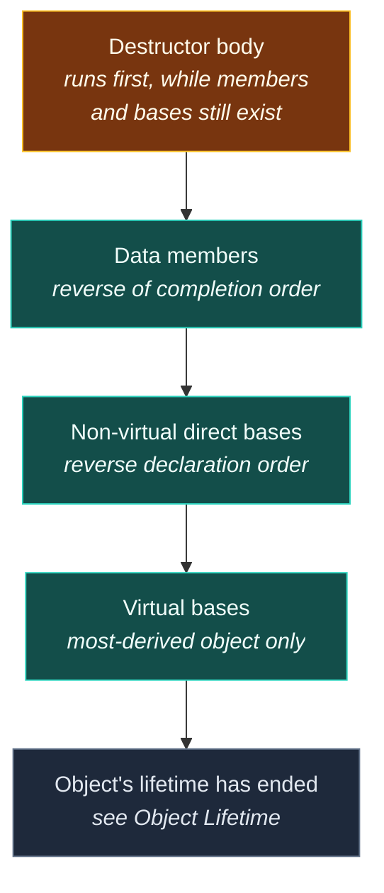

# Destructors

> [!essence]
> A **destructor** is the member function the compiler calls automatically, on every path, the instant a class-type object's lifetime is meant to end. It runs construction's teardown in reverse — its own body first, then each data member and base destroyed in the exact reverse of the order they finished being built — so that whatever a constructor acquired always gets released, on the thrown-exception path as reliably as the ordinary one.

## The Problem

[[Constructors|The previous note]] built the half of an object's life that brings it into being, already satisfying its invariant. Whatever that construction acquired — an allocation, a file handle, a lock — still exists once the constructor returns. Nothing in the object's bits records what needs releasing, or when; that has to come from somewhere else.

> [!principle] Constraint → Consequence → Requirement → Design → Price
> 1. **Constraint.** A resource a constructor acquires does not release itself when the object's [[Object Lifetime|lifetime]] ends. Release is an action, and while the compiler already agrees to do *something* automatically at that instant, by default that something is nothing.
> 2. **Consequence.** If release were an ordinary function the class author has to remember to call — before every `return`, every `break`, every path an exception takes out of a scope the author didn't even write — one missed call anywhere leaks a resource, and the leak surfaces nowhere near the call site that skipped it.
> 3. **Requirement.** The language needs an operation that (a) the compiler inserts automatically at the precise instant a class-type object's lifetime is meant to end, on *every* path out — normal return, `break`, an early return added later, `delete`, exception unwinding through frames that never mention this type by name; and (b) tears down exactly what construction built, member by member and base by base, symmetrically enough that nested resources release inner-to-outer without the class author sequencing it by hand.
> 4. **Design.** The **destructor**: a member function named `~ClassName`, taking no arguments, returning nothing, one per class — unlike a constructor, it can never be overloaded, because there is no argument list left to distinguish an overload by. The compiler inserts a call to it at every point in the program where an object's lifetime ends. Its own body runs first; the compiler-generated part then destroys the object's data members and base subobjects in the exact reverse of the order they finished construction.
> 5. **Price.** The mirror image of [[Constructors|the constructor's]] price. A class that owns a resource through a raw handle now needs a destructor that states what releasing it means — though usually the better fix is to hold it through a member that is itself RAII, so the compiler-generated destructor is already correct ([[RAII]]). And because destruction is the one operation the language runs *during* the emergency unwind that follows a thrown exception, a destructor that itself throws while that unwind is already underway leaves the language with two exceptions in flight and no rule for reconciling them — the answer is `std::terminate` (*Pitfalls*), which is exactly why destructors are `noexcept` by default.

> [!tension] abstraction ⟷ control
> The same tension [[Constructors]] named, seen from the other end. A user of the class never writes a single cleanup call — the abstraction hides teardown completely. But nothing is hidden from the compiler: it still has to know, member by member, exactly what "destroy this" means for every field, and it still inserts a real call at every real exit, paid for whether or not that exit is the one you were thinking about when you wrote the function.

## Mental Model

> [!model] Construction's matching half, run backwards
> Picture construction as a delivery, stacked item on item — bases first, then members in declaration order, each free to depend on nothing built after it. Destruction is that stack taken apart: the class's own body first (its one chance to act *before* anything underneath it is gone), then the same items removed in the opposite order they were placed, so a member is never torn down while something built *after* it — and possibly depending on it — might still be relying on it existing.
> **Where it breaks:** a physical stack unwinds only when someone chooses to unwind it, one plate at a time, stopping if they like. An object's destruction sequence isn't optional and doesn't stop partway: once it starts, every member and base runs its own destructor in full, even if that destructor's body is empty. There is no "leave it half torn-down."



## Mechanics

**A destructor has the class's name prefixed by `~`, no return type — not even `void` — and no parameters.** Because there is no parameter list, it cannot be overloaded: a class has at most one destructor (Primer §13.1.3, p. 501). It may be declared `inline`, `virtual` ([[Virtual Destructors]]) or `constexpr`; it can never be `static`, because there is always exactly one object being torn down, never a class-wide operation.

**When a destructor runs implicitly** (`[class.dtor]` ¶14):

| Object | Destructor call happens |
|---|---|
| Static-duration object | At program termination, in reverse order of completion of construction |
| Thread-duration object | At thread exit |
| Automatic-duration object | When the block it was declared in exits, by any route |
| Temporary | At the end of its lifetime — usually the end of the full-expression that created it |
| Dynamically allocated (`new`) object | When a `delete`-expression runs on it |
| Member or base subobject | Automatically, as part of destroying the object it belongs to |
| Container or array element | Automatically, as part of destroying the container (Primer p. 502) |

> [!standard] The order is the exact reverse of construction — and it runs non-virtually
> `[class.dtor]` ¶13: after the destructor body executes, it calls the destructors for the class's own non-static data members, then its non-virtual direct bases, then — if this is the most-derived object — its virtual bases. **Bases and members are destroyed in the reverse order of the completion of their construction**, and every one of those calls is made "as if referenced with a qualified name" — ignoring any override in a more-derived class. This is the standard's own statement of exactly the mechanism [[Object Lifetime]]'s *Under the Hood* observes in real assembly: each destructor rewrites the object's vptr to its *own* class before calling downward, so a virtual call reached from inside a destructor can never land on an already-destroyed derived override.

**Implicit declaration and deletion.** If a class declares no destructor of its own, one is implicitly declared as defaulted — public, inline, with the form `~ClassName()` (`[class.dtor]` ¶2–3). That implicit destructor is itself defined as **deleted** if any base or non-static data member has a destructor that is deleted or inaccessible (`[class.dtor]` ¶7.1): the compiler cannot generate teardown code for a piece it has no legal way to tear down, and a class with a deleted destructor cannot be destroyed at all — which means, since every complete object is eventually destroyed, it cannot be brought into existence as a normal object either (*In Code* 2).

**A destructor with nothing to do costs nothing to call.** `[class.dtor]` ¶8: a destructor is **trivial** if it is not user-provided, not virtual, every direct base's destructor is trivial, and every class-type non-static member's destructor is trivial. A trivial destructor performs no action — not even an empty function call (*Under the Hood*).

> [!standard] A destructor is implicitly `noexcept` — even one you write yourself
> `[class.dtor]` Note 2: a destructor declared *without* its own `noexcept`-specifier gets exactly the exception specification it would have gotten if implicitly declared. Per cppreference (*Destructors*) and `[except.spec]`, that specification is **non-throwing, unless a base or member's own destructor is itself potentially-throwing** — a class is "poisoned" only by what it contains, since C++17's rule for computing implicit specifications. Writing your own `~Widget() { … }` does **not**, by itself, remove this guarantee. Only an explicit `noexcept(false)`, or a poisoned member, does (*In Code* 3).

## Under the Hood

> [!machine] Reverse order, proven in real assembly — GCC 11.4.0, x86-64 Linux, `-O0`
> For `struct A { ~A(); }; struct B { ~B(); }; struct Machine { A a_; B b_; ~Machine() {} };`, `Machine`'s own compiled destructor:
> ```nasm
> Machine::~Machine() [base object destructor]:
>         push rbp
>         mov  rbp, rsp
>         sub  rsp, 16
>         mov  QWORD PTR [rbp-8], rdi   ; this
>         mov  rax, QWORD PTR [rbp-8]
>         add  rax, 1                  ; rax = &this->b_  (declared second)
>         mov  rdi, rax
>         call B::~B() [complete object destructor]   ; ① b_ destroyed FIRST
>         mov  rax, QWORD PTR [rbp-8]
>         mov  rdi, rax                ; rdi = &this->a_  (declared first)
>         call A::~A() [complete object destructor]   ; ② a_ destroyed LAST
>         leave
>         ret
> ```
> ① and ② are the *Mechanics* order made concrete: `b_` is declared after `a_`, so it finished constructing after `a_` — and it is torn down before `a_`. GCC additionally emits two aliased symbols per destructor (the Itanium ABI's *base-object* and *complete-object* variants, unified here with `.set` since `Machine` has no virtual bases); that split matters once virtual inheritance is involved, and is otherwise invisible.

A trivial destructor is not merely fast — it generates **no call at all**, at any optimization level that bothers to look:

```nasm
; struct Point { int x, y; };  int use() { Point p{3, 4}; return p.x + p.y; }
; GCC 11.4.0, x86-64 Linux, -O2
use():
        mov  eax, 7
        ret
```

`Point` has no user-declared destructor and no non-trivially-destructible member, so its destructor is trivial (*Mechanics*). There is no "destroy `p`" step to optimize away — the standard never required a call to exist in the first place. `int` never needed a call either; a class with only `int` members costs exactly what the `int`s themselves cost.

## In Code

**1 · Destruction is construction's order, reversed**

```cpp
#include <iostream>

struct Logger {
    const char* name;
    Logger(const char* n) : name(n) { std::cout << "construct " << name << '\n'; }  // ①
    ~Logger() { std::cout << "destroy " << name << '\n'; }
};

struct Machine {
    Logger power{"power"};      // ② declared first
    Logger sensors{"sensors"};  //   declared second
    Logger network{"network"};  //   declared third
};

int main() {
    Machine m;
    std::cout << "-- Machine alive --\n";
}
// expect: construct power
// expect: construct sensors
// expect: construct network
// expect: -- Machine alive --
// expect: destroy network
// expect: destroy sensors
// expect: destroy power
```
1. Each `Logger` member announces its own construction and destruction.
2. Members finish constructing in declaration order (power, sensors, network). `Machine` has no destructor body of its own to print, so the first visible teardown is the implicit member-by-member destruction — in exactly the reverse order: network, then sensors, then power.

**2 · A deleted member's destructor propagates: the enclosing class becomes undestroyable, and therefore uncreatable**

```cpp
// cc: ill-formed
class NoDtor {
public:
    NoDtor() = default;
    ~NoDtor() = delete;   // ① deliberately impossible to tear down
};

struct Holder {
    NoDtor member;        // ②
};

int main() {
    Holder h;              // error: use of deleted function 'Holder::~Holder()'
}
```
1. `NoDtor` cannot be destroyed — its own destructor is explicitly deleted.
2. `Holder`'s implicitly-declared destructor would need to destroy `member`, which is impossible, so the compiler defines `Holder::~Holder()` itself as deleted (`[class.dtor]` ¶7.1). Because every object that comes into existence must eventually be destroyed, `Holder h;` fails on *both* the constructor and the destructor — a value nobody could ever legally dispose of is a value the compiler refuses to create.

**3 · Implicit `noexcept`, and how a member "poisons" it**

```cpp
#include <iostream>
#include <utility>

struct Quiet {
    ~Quiet() {}                       // ① user-provided, no noexcept-specifier of its own
};

struct Loud {
    ~Loud() noexcept(false) {}        // ② opts out explicitly
};

struct Poisoned {
    Loud member;                      // ③ poisons Poisoned's own destructor
    ~Poisoned() {}
};

int main() {
    std::cout << std::boolalpha
              << noexcept(std::declval<Quiet&>().~Quiet()) << ' '
              << noexcept(std::declval<Poisoned&>().~Poisoned()) << '\n';
}
// expect: true false
```
1. `Quiet`'s destructor has a body but no `noexcept`-specifier, so it gets the *same* implicit specification a compiler-generated one would: non-throwing.
2. `Loud` explicitly declares itself throwing.
3. `Poisoned` also writes its own destructor with no specifier — but it contains a `Loud`, so its implicit specification is `noexcept(false)` too. The class's own body is irrelevant to this computation; only what it must destroy matters.

**4 · A destructor that throws while unwinding calls `std::terminate` — not your handler**

```cpp
// cc: norun
#include <iostream>
#include <stdexcept>

struct Alarm {
    ~Alarm() noexcept(false) {
        std::cout << "Alarm::~Alarm firing" << std::endl;
        throw std::runtime_error("second exception, mid-unwind");   // ①
    }
};

void arm() {
    Alarm a;
    throw std::runtime_error("first exception");   // ②
}

int main() {
    try {
        arm();
    } catch (const std::exception& e) {
        std::cout << "caught: " << e.what() << '\n';   // never reached
    }
}
```
1. `Alarm::~Alarm` is explicitly `noexcept(false)`, so it is *allowed* to throw — the language permits this even though it is almost never wise.
2. `arm()`'s own throw begins unwinding the stack, which is what triggers `a`'s destructor in the first place.

Marked `// cc: norun` because the observed behavior is a process abort, not a checkable `stdout`. Run under GCC 11.4.0, x86-64 Linux, this vault's toolchain printed `Alarm::~Alarm firing`, then `terminate called after throwing an instance of 'std::runtime_error'` on `stderr`, and the process exited via `SIGABRT` — `catch` never ran. This is not undefined behavior; `[except.terminate]` ¶1.4 requires it: a destructor invoked during stack unwinding that itself exits via an exception calls `std::terminate`, by name, every conforming implementation.

## Pitfalls

> [!trap] Writing your own destructor silently disables the compiler-generated move constructor and move assignment
> A class with *any* user-declared destructor — even an empty `~Widget() {}` — does not get an implicitly-declared move constructor or move-assignment operator at all (`[class.copy.ctor]`; cppreference, *Move constructors*). Every use that would have moved falls back to the copy constructor instead, silently, with no error and no warning. This is a deliberate C++11 backward-compatibility rule (*Evolution*), and it is precisely why [[Rule of Zero, Three and Five|the Rule of Five]] exists: once you write one of the five special members by hand, decide about all five, rather than relying on whichever subset the compiler still happens to generate. See [[The Special Member Functions]].

> [!trap] A destructor that throws mid-unwind calls `std::terminate`, never a handler
> *In Code* 4. The exception-handling machinery has no rule for reconciling two exceptions in flight at once, so the language doesn't try — it ends the program (`[except.terminate]` ¶1.4). This is the concrete reason destructors are `noexcept` by default (*Mechanics*) and should, by convention, never be written otherwise: a resource that fails to release should log the failure or abandon quietly, never throw.

> [!trap] Deleting a derived object through a base pointer with a non-virtual destructor
> Only the base's destructor runs; the derived part is never torn down. The full mechanism and fix belong to [[Virtual Destructors]] — this note only flags that the hazard exists the moment a class is meant to be deleted polymorphically.

> [!ub] Invoking a destructor a second time
> Once a destructor has run for an object, that object's lifetime has ended (`[class.dtor]` ¶18, [[Object Lifetime]]). Calling its destructor again — explicitly, or by letting scope exit fire after an explicit call — is undefined behavior; the object was never "still there" to tear down twice. Explicit destructor calls are rare enough (`[class.dtor]` Note 9) that this trap mostly appears paired with manual [[Placement new and Manual Lifetime|placement new]].

## Evolution

| Standard | Change | Why |
|---|---|---|
| C++98 | Destructor as described here: `~Name()`, no arguments, no return type, at most one per class, synthesized when absent, member/base teardown in reverse of construction order | The baseline mechanism |
| **C++11** | `= default` / `= delete` syntax for the destructor; a **user-declared destructor suppresses the implicitly-declared move constructor and move-assignment operator** (`[class.copy.ctor]`); the destructor's implicit exception specification is formalized in `[except.spec]` | Move semantics needed an explicit, backward-compatible opt-out so pre-C++11 classes with a hand-written destructor didn't suddenly move-then-destroy incorrectly; the unwind mechanism itself needed a firm default for the one function it depends on |
| C++20 | A defaulted destructor is a `constexpr` destructor whenever its members and bases allow it (P0784R7) | Extends constant evaluation to types that manage nontrivial teardown, not only trivially-destructible ones |

## Connections

- **Prerequisites:** [[Object Lifetime]] (what "the object's lifetime ends" precisely means — this note is the mechanism that ends it) · [[Constructors]] (construction's matching half; the order this note reverses).
- **Enables:** [[The Special Member Functions]] (the destructor is one of the five) · [[Rule of Zero, Three and Five]] (needing a hand-written destructor is the rule's trigger condition) · [[RAII]] (acquire in the constructor, release here) · [[Virtual Destructors]] (destruction reached through a base pointer).
- **Siblings:** [[Virtual Calls in Constructors and Destructors]] (the pitfall [[Object Lifetime]]'s vptr mechanism protects against, seen from the destructor side) · [[noexcept and Why Move Must Not Throw]] (the same implicit-exception-specification reasoning, applied to move).
- **Domain:** [[Map — Classes & Encapsulation]].
- **Practice:** *Continuum #12 Build-Your-Own Dynamic Array* — write the `~Vector` that frees the buffer the constructor allocated; PPP's own running example (§15.5) is exactly this exercise.

## Check Yourself

> [!quiz]- What must already be true about a class's data members and bases at the moment its destructor's own body finishes executing?
> Nothing has been destroyed yet — the body runs first, while every member and base is still fully alive. Only after the body returns does the compiler-generated part destroy the data members (reverse of their construction order), then the non-virtual direct bases (reverse order), then, for the most-derived object, the virtual bases.

> [!quiz]- Why can a constructor be overloaded but a destructor never can?
> Overloading is resolved by argument list, and a destructor takes no arguments — there is nothing for two declarations to differ on. A class therefore has at most one destructor, full stop.

> [!quiz]- A class writes `~Widget() { log("closing"); }` and nothing else. Does `std::vector<Widget>` move or copy `Widget` elements during reallocation, and why?
> It copies them. Declaring *any* destructor — even one that only logs — suppresses the compiler-generated move constructor and move-assignment operator (`[class.copy.ctor]`). Unless `Widget` also declares its own move operations, every "move" silently becomes a copy.

> [!quiz]- A destructor is declared `~Handle() noexcept(false) { release(); }`, and `release()` can throw. What happens if this destructor runs while a different exception is already propagating, and what happens if it runs during ordinary scope exit with no exception in flight?
> During ordinary scope exit, a thrown exception from `release()` propagates normally like any other throw. During stack unwinding for another exception, a throw from this destructor instead calls `std::terminate` (`[except.terminate]` ¶1.4) — the same code path behaves completely differently depending on whether an unwind was already underway.

## Sources

- Primer §13.1.3 "The Destructor" (pp. 501–503): what a destructor does, when it is called, and the synthesized destructor's empty-body equivalence.
- PPP §15.5 "Destructors" and §15.5.1 "Generated destructors" (ch. 15 "Vector and Free Store"): destructors motivated through the `Vector` free-store example; "a generated destructor... calls the members' destructors."
- cppreference, *Destructors*: https://en.cppreference.com/w/cpp/language/destructor
- Draft standard `[class.dtor]` (¶2–3 implicit declaration, ¶7 deleted conditions, ¶8 triviality, ¶13 teardown order, ¶14 implicit invocation contexts, ¶18 double-destruction UB): https://eel.is/c++draft/class.dtor
- Draft standard `[except.terminate]` ¶1.4 (a destructor throwing during stack unwinding calls `std::terminate`): https://eel.is/c++draft/except.terminate
- Draft standard `[class.copy.ctor]` (a user-declared destructor suppresses the implicitly-declared move constructor): https://eel.is/c++draft/class.copy.ctor
