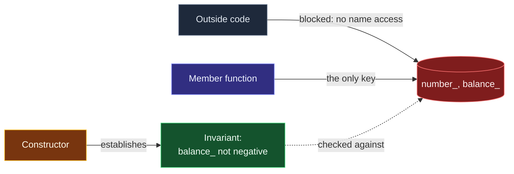

# Encapsulation and Class Invariants

> [!essence]
> A **class invariant** is the condition that must hold on an object's data members for its member functions to make sense at all. **Encapsulation** — making that data unreachable except through the class's own code — is what makes such a condition enforceable: if the only doors in are the ones the class built, the class is the only thing that can leave one open onto a broken room.

## The Problem

[[Classes as User-Defined Types|The previous note]] built `Account` from a `long` and a `double` and gave it three member functions, but left every combination of those two members equally legal: `Account{-1, -999999.99}` compiled without complaint, because nothing had yet said which `(number_, balance_)` pairs a real account is allowed to hold.

> [!principle] Constraint → Consequence → Requirement → Design → Price
> 1. **Constraint.** A class's member functions are written against an assumption about its data — `deposit` only makes sense if `balance_` already holds a real, non-negative balance. Nothing in the class body as it stood states that assumption anywhere the compiler can check it.
> 2. **Consequence.** If any code anywhere in the program can write to `number_` and `balance_` directly, keeping that assumption true becomes a promise every one of those call sites has to keep, unaided. One missed check — in code that may be nowhere near the class's own definition — and `balance_` holds a value none of the class's functions were written to handle: a bug whose cause sits far from where it surfaces.
> 3. **Requirement.** The language needs a way to (a) make the representation unreachable except through code the class author wrote, and (b) guarantee that a stated condition on that representation — the **invariant** — holds the moment an object exists, and again every time control returns from a member function to the rest of the program.
> 4. **Design.** C++ answers both halves at once. **Access specifiers** make `number_` and `balance_` reachable only through `Account`'s own member functions and any `friend`s it names (`[class.access.general]`); a **constructor** becomes the sole way to bring an `Account` into existence, and its job is to check the values it is given and refuse — by throwing — the ones that can't satisfy the invariant (Tour §4.3, p. 45). Every other member function then inherits a standing assumption: the invariant already holds when it is called, and it must hold again when it returns.
> 5. **Price.** The class now carries an obligation it didn't have before: every member function that can mutate the representation is a place the invariant must be re-verified, not just a place data gets written, and a constructor that skips a check has bought nothing. Encapsulation itself, as *Under the Hood* shows, costs nothing extra at run time — the price is entirely in **discipline**, not cycles.

> [!tension] abstraction ⟷ control
> Hiding `number_` and `balance_` behind `private` lets the rest of the program stop reasoning about two loose numbers and start reasoning about one well-formed `Account` — real abstraction. But the compiler still sees straight through it: `a.deposit(25.0)` is checked for access at compile time and then compiled exactly as if `balance_` had always been public (see *Under the Hood*). Nothing about the abstraction is free to build — a human still has to write the check — but nothing about it costs anything once built.

> [!tension] safety ⟷ performance
> A constructor's validity check and a member function's re-verification are ordinary run-time branches, paid on every call, not compiled away by the access specifier that makes them possible. [[Map — Errors & Contracts|A later domain]] asks the harder question this tension raises: which unstated preconditions get checked at all, and which are left as the caller's problem.

## Mental Model

> [!model] A front desk, not a locked diary
> `private` is not there to keep the data secret — anyone holding the class's definition can read exactly what `Account` contains. It is there to make sure the *only* door into that data is the one the class built: every write to `balance_` passes through a member function the class author wrote, the way every guest reaching a hotel room passes the front desk that issued the key. The desk doesn't hide which rooms exist; it controls who gets a key and on what condition.
> **Where it breaks:** a front desk can be walked around by a determined guest with a ladder — and so can `private`, by `reinterpret_cast`, a debugger, or code that steps outside the language's normal name-lookup rules altogether (*Pitfalls*). The guarantee `private` gives is a promise about *ordinary code paths*, not a security boundary against a determined adversary.



## Mechanics

The Standard calls the representation-hiding rule *member access control*, not "encapsulation" — that word is the field's shorthand for what the rule is for.

| Situation | Rule | Example |
|---|---|---|
| Member declared after `private:` | Nameable only by the class's own members and its declared `friend`s (`[class.access.general]` ¶1) | `balance_` unreachable as `a.balance_` from outside `Account` |
| Member declared after `public:` | Nameable anywhere without restriction — this is the class's interface | `a.deposit(25.0)` compiles from any calling code |
| No access specifier given | `class` defaults every preceding member to `private`; `struct` defaults to `public` (`[class.access.general]` ¶3) | `class Account { long number_; };` — `number_` is private |
| A constructor cannot establish a sensible invariant | Throw, rather than return an object in a state its own rules forbid | Negative opening balance ⇒ `throw std::invalid_argument{...}` |
| A member function's action would break the invariant | Refuse before mutating, leaving the object exactly as it was | `withdraw` checks funds *before* subtracting, never after |
| Another type or function needs access without becoming a member | Name it `friend` inside the class body — an exception the class grants, never one taken from outside | See [[Friends]] |

> [!standard] Access control is a compile-time gate, not a data-hiding mechanism
> `[class.access.general]` ¶5 states that a construct's interpretation is fixed *without regard to* access control, and only afterward checked for whether it named something inaccessible — access is the last check applied, not a rewriting of what the code means. Replacing every `private` in a class with `public` therefore never changes what a correct program computes; it only changes which programs are *accepted*. This is exactly why *Under the Hood* can show identical instructions for private and public member access: the specifier is enforced entirely by the front end and leaves no trace in what gets compiled.

Nothing here is specific to `Account`'s particular invariant. Whatever condition a class needs — `1 <= month <= 12`, `size() <= capacity()`, `elem` points to exactly `sz` live doubles — the mechanism that establishes and protects it is always the same pair: a constructor that checks, and a boundary nothing else can cross.

## Under the Hood

> [!machine] Private costs nothing beyond the check you chose to write
> Compiled with GCC 11.4, `-O2`, x86-64, a `deposit` reached through a `private`-guarded `Account` and the identical operation reached through an all-`public` version of the same layout emit **the same three instructions**:
> ```nasm
> via_private(AccountPriv&):
>     movsd xmm0, QWORD PTR .LC0[rip]  ; load 25.0
>     addsd xmm0, QWORD PTR [rdi+8]    ; add balance_ (offset 8)
>     movsd QWORD PTR [rdi+8], xmm0    ; store it back
>     ret
> via_public(AccountPub&):
>     movsd xmm0, QWORD PTR .LC0[rip]
>     addsd xmm0, QWORD PTR [rdi+8]
>     movsd QWORD PTR [rdi+8], xmm0
>     ret
> ```
> Access specifiers exist purely in the front end's name-lookup and access-checking pass. By the time code reaches codegen, `private` has already done its job or rejected the program; it has nothing left to emit.

The representation itself is laid out exactly as [[Classes as User-Defined Types]] showed — declaration order, no hidden fields:

```text
 Account a{1001, 250.0};                sizeof(Account) == 16
┌──────────────────────────┐
│ number_   long,  8 bytes │  offset 0   ◀── unreachable as `a.number_` from outside
├──────────────────────────┤
│ balance_  double,8 bytes │  offset 8   ◀── unreachable as `a.balance_` from outside
└──────────────────────────┘
 the walls exist only in the compiler's access-checking pass — the bytes themselves
 are exactly as reachable via a raw pointer or memcpy as if both were public
```

The only *run-time* cost this note adds is the one a human wrote on purpose: the branch inside a constructor or a mutating member function that tests whether the invariant would still hold. That branch is ordinary, visible code — it can be found by reading the class, not by consulting the compiler's internals.

## In Code

**1 · A constructor that refuses to establish a broken invariant**

```cpp
#include <iostream>
#include <stdexcept>

class Account {
public:
    Account(long number, double opening_balance)             // ①
        : number_(number), balance_(opening_balance) {
        if (balance_ < 0.0)
            throw std::invalid_argument("Account: opening balance cannot be negative");  // ②
    }
    double balance() const { return balance_; }
private:
    long number_;
    double balance_;   // invariant: balance_ >= 0.0
};

int main() {
    Account a{1001, 250.0};
    std::cout << a.balance() << '\n';
    try {
        Account bad{1002, -50.0};                             // ③
    } catch (const std::invalid_argument& e) {
        std::cout << "rejected: " << e.what() << '\n';         // ④
    }
}
// expect: 250
// expect: rejected: Account: opening balance cannot be negative
```
1. The member initializer list runs before the body, in declaration order — both members already hold *some* value by the time the check runs.
2. The body's entire job is to check the value it was about to accept and refuse it if the invariant can't hold. This is the constructor's whole responsibility, not an afterthought to initialization.
3. `bad` never comes into existence: throwing from a constructor means the object's lifetime never began.
4. Because no `Account` object was ever created, nothing needs destroying — there is no partially-built `bad` to clean up.

**2 · A member function that maintains the invariant on exit, not just on entry**

```cpp
#include <iostream>
#include <stdexcept>

class Account {
public:
    explicit Account(double opening_balance) : balance_(opening_balance) {
        if (balance_ < 0.0) throw std::invalid_argument("negative opening balance");
    }
    void withdraw(double amt) {
        if (amt > balance_) throw std::runtime_error("insufficient funds");  // ①
        balance_ -= amt;                                                    // ②
    }
    double balance() const { return balance_; }
private:
    double balance_;
};

int main() {
    Account a{100.0};
    a.withdraw(40.0);
    std::cout << a.balance() << '\n';               // ③
    try {
        a.withdraw(1000.0);
    } catch (const std::runtime_error&) {
        std::cout << a.balance() << '\n';            // ④
    }
}
// expect: 60
// expect: 60
```
1. The check runs *before* any member is touched — the function decides whether the mutation is legal first.
2. Only a withdrawal that leaves `balance_ >= 0.0` ever reaches this line.
3. A legal withdrawal changes the balance.
4. An illegal one leaves it exactly as it was: `withdraw` bailed out before mutating anything, so the invariant it inherited on entry is still exactly the invariant it hands back. A constructor alone could never provide this half of the guarantee.

**3 · The boundary itself is enforced, not advisory**

```cpp
// cc: ill-formed
class Account {
public:
    explicit Account(double balance) : balance_(balance) {}
private:
    double balance_;
};

int main() {
    Account a{100.0};
    a.balance_ -= 500.0;   // error: 'balance_' is private within this context
}
```
Without this rejection, any code anywhere in the program could reach past `withdraw`'s check and set `balance_` directly — exactly the failure mode *The Problem* started from. The compiler refuses the access at the same point it would refuse a call to a function that was never declared.

**4 · Encapsulation lets the representation change without breaking callers**

```cpp
#include <iostream>

class AccountV1 {                                  // ① balance stored as dollars
public:
    explicit AccountV1(long cents) : balance_(cents / 100.0) {}
    double balance() const { return balance_; }
private:
    double balance_;
};

class AccountV2 {                                  // ② balance stored as integer cents
public:
    explicit AccountV2(long cents) : cents_(cents) {}
    double balance() const { return cents_ / 100.0; }   // ③ same public answer
private:
    long cents_;
};

int main() {
    AccountV1 a{25050};
    AccountV2 b{25050};
    std::cout << a.balance() << ' ' << b.balance() << '\n';   // ④
}
// expect: 250.5 250.5
```
1. One representation: a `double` number of dollars.
2. A completely different one: a `long` count of cents, chosen to avoid floating-point rounding in money.
3. `balance()` still returns the same kind of answer from a different computation.
4. Calling code that only ever went through `balance()` cannot tell which representation it's talking to — and needs no changes when a class switches between them, exactly the second benefit Primer credits to encapsulation (§7.2, p. 270).

## Pitfalls

> [!trap] `private` is access control, not confidentiality
> `private` stops *ordinary, well-typed code* from naming a member. It does not stop `reinterpret_cast`, a `memcpy` of the raw bytes, a debugger, or code that deliberately steps outside the type system. If the goal is genuinely hiding a secret (a cryptographic key, say), `private` is the wrong tool entirely — it was never designed as one. See *Mental Model*.

> [!trap] A checked constructor is not a checked class
> Validating the constructor's arguments guarantees the invariant on the day the object is born. It says nothing about a member function added six months later that mutates `balance_` without re-checking it first. Every mutating member function is a fresh place the invariant can be broken, and the constructor's diligence doesn't transfer to it automatically — Example 2's `withdraw` has to run its own check.

> [!trap] Encapsulating a class that has no invariant to protect
> If every combination of a type's members is already meaningful — a `struct` of two independently-varying coordinates, say — wrapping them in `private` and writing trivial getters and setters adds ceremony without adding a guarantee. [[struct vs class]] and the C++ Core Guidelines' rule of thumb (C.2) are explicit: reach for `class` and hidden data because there *is* a relationship worth protecting, not as a default reflex.

## Evolution

See [[Map — Evolution of C++]] for the language-wide timeline.

| Standard | Change | Why |
|---|---|---|
| C / C++98 | `public`/`private`/`protected` access specifiers; `class` defaults to private, `struct` to public (`[class.access.general]`) | The mechanism this note describes is present from C++'s first standard |
| C++11 | The class-layout guarantee tied to declaration order widens from *within one access-specifier block* to *across specifiers that share the same access* | Lets a class group related `private` data across more than one labeled section without losing the layout guarantee it had before |

cppreference flags that C++11 layout guarantee itself as holding only *until* C++23; what replaces it is a question of object layout, not of encapsulation's core mechanism, and belongs to a future note on class layout rather than to this one.

## Connections

- **Prerequisites:** [[Classes as User-Defined Types]] — the values × operations × representation triple this note narrows by restricting which *values* are reachable.
- **Enables:** [[Constructors]] (the mechanism that establishes the invariant) · [[Destructors]] (what runs once an invariant-respecting object's lifetime ends) · [[The this Pointer and Member Function Calls]] (what every member function checking the invariant is secretly given) · [[Rule of Zero, Three and Five]] · [[Inheritance]] (extends the public/protected/private boundary this note builds across a class's own edge to a derived class as well).
- **Siblings:** [[struct vs class]] (the one keyword-level difference in default access) · [[Friends]] (the narrow, named exception to the boundary this note builds) · [[RAII]] (a constructor that acquires a resource is establishing an invariant about that resource's validity).
- **Domain:** [[Map — Classes & Encapsulation]].
- **Practice:** *Continuum #17 Bank Account Simulator* — the exact `Account` this note builds, taken further: reject every invalid state Example 3's boundary would otherwise let through.

## Check Yourself

> [!quiz]- What two things does a class invariant require from a class, and which single member function is responsible for the first of them?
> It requires (1) that the representation be unreachable except through the class's own code, and (2) that a stated condition on that representation hold whenever an object exists. The constructor is solely responsible for establishing it in the first place; every subsequent member function is responsible for preserving it.

> [!quiz]- Why does `private` cost nothing at run time, even though it's the thing making the invariant possible?
> Access control is checked entirely at compile time, in the front end's name-lookup pass (`[class.access.general]`); by the time code reaches codegen, a private member access and a public one compile to identical instructions. The only run-time cost is the validity check a human chose to write inside a constructor or member function — a cost the invariant needs, not one `private` itself adds.

> [!quiz]- A class validates its arguments in its constructor but has a public setter that assigns to a data member with no check at all. Does this class have a real invariant? Why or why not?
> No — or not a reliable one. An invariant has to hold after *every* public member function returns, not just after construction. An unchecked setter is a hole in exactly the boundary the constructor was trying to build, and it reopens the original problem: some path can now leave the object in a state its own rules forbid.

> [!quiz]- Do `AccountV1` and `AccountV2` from Example 4, which share a public interface but use different private representations, count as the "same type" to code that only calls `balance()`?
> To that calling code, yes, in every way that matters: it observes identical behavior from `balance()` and cannot express any operation that would reveal which representation is in use. They remain two distinct C++ types (different names, different `sizeof`), but encapsulation is exactly what makes that difference invisible to their shared interface.

## Sources

- Tour §4.3 "Invariants" (pp. 45–47): the canonical definition of a class invariant, the constructor's job in establishing it, and why "the notion of invariants is central to the design of classes."
- Primer §7.2 "Access Control and Encapsulation" (pp. 268–270): access specifiers, the `class`/`struct` default-access difference, and the two benefits of encapsulation — protecting user code from a corrupted object, and letting the representation change without breaking callers.
- PPP ch. 8 "Technicalities: Classes, etc.", §8.4.3 (forward-referenced from the struct/class discussion earlier in the chapter): a `struct` has no meaningful invariant because its members can vary independently — the direct source behind the Core Guidelines' struct/class rule of thumb.
- cppreference, *Access specifiers*: "the intent of this rule is that replacing any `private` with `public` never alters the behavior of the program"; the `class`/`struct`/`union` default-access rule: https://en.cppreference.com/w/cpp/language/access
- Draft standard `[class.access.general]`: the definition of private/protected/public member access, the class/struct default, and access control applied only after a construct's meaning is already fixed: https://eel.is/c++draft/class.access.general
- C++ Core Guidelines C.2, *Use class if the class has an invariant; use struct if the data members can vary independently*: https://isocpp.github.io/CppCoreGuidelines/CppCoreGuidelines#c2-use-class-if-the-class-has-an-invariant-use-struct-if-the-data-members-can-vary-independently
