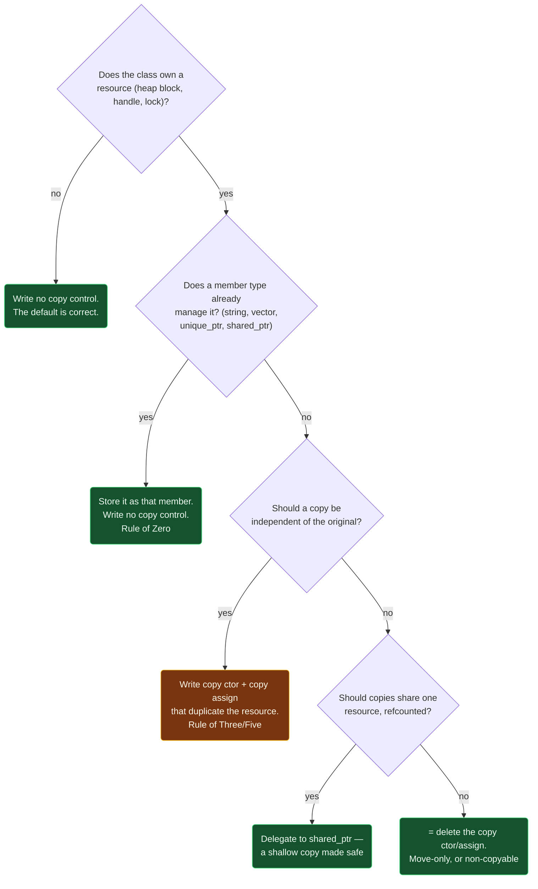

# Copy Semantics — Deep vs Shallow Copy

> [!essence]
> `Widget b = a;` always compiles, but it doesn't always mean the same thing. If `a` owns a resource through a raw handle, the compiler's default copy just duplicates the handle: **shallow copy**, two names for one resource. If a class wants two fully independent objects, it must duplicate what the handle refers to: **deep copy**, written by hand or borrowed from a member that already does it. Nothing in the syntax `b = a` tells you which one you're getting — only the class's own copy constructor decides.

## The Question

Every class with a member that isn't a plain value — a raw pointer to heap memory, a file descriptor, a socket — forces the same choice the moment someone writes `Widget b = a;`, passes `a` by value, or stores `a` in a `std::vector`. Does the copy get its own resource, or does it just get a second way to reach the original's? The language answers by default; the class author can override that answer, but only by *knowing* which one is happening.

> [!principle] Why the default isn't automatically correct
> 1. **Constraint.** When a class has no user-declared copy constructor, the compiler declares one implicitly, and it performs a *memberwise* copy: each base and member is direct-initialized from the corresponding base or member of the source (`[class.copy.ctor]` ¶15). For a member of class type (like `std::string`), "direct-initialized" means *that type's own* copy constructor runs. For a member of built-in type — including a raw pointer — it means copying the value itself: the address, not what it addresses.
> 2. **Consequence.** A class that owns a heap block through a raw `T*` member gets, for free, a copy that shares the same block. Nothing about the type signature says so. The aliasing is invisible until the two objects' destructors both run and both call `delete` on the same address — a double free — or until a mutation through one object silently shows up through the other.
> 3. **Requirement.** The class must decide, explicitly, what copying a resource-owning member means: duplicate the resource so the two objects are independent (deep copy), or refuse to let the default apply at all.
> 4. **Design.** C++ makes copy an overridable per-class contract. Define a copy constructor and copy-assignment operator that allocate a fresh resource and copy into it, and every `b = a` for that class now deep-copies. Or delegate: give the class a member of a type that *already* has correct value semantics — `std::string`, `std::vector`, `std::unique_ptr` — and the compiler's untouched default becomes correct by composition, because it now recurses into that member's own copy constructor instead of copying a raw address.
> 5. **Price.** A deep copy costs an allocation and O(*n*) work on every copy, even a copy about to be discarded — the waste [[Move Semantics]] exists to avoid. A class that instead shares one resource across copies (as `shared_ptr` does, safely) buys an O(1) copy at the cost of tracking how many owners remain.

## At a Glance

| Criterion | Shallow copy (copies the handle) | Deep copy (duplicates the referent) |
|---|---|---|
| **What gets copied** | the pointer's *value* — an address | a fresh block, with the same contents |
| **The two objects afterward** | alias each other: one resource, two names | fully independent: no shared state |
| **What the compiler's default does for a raw pointer/handle member** | ✓ exactly this — memberwise copy, `[class.copy.ctor]` ¶15 | ✗ never — needs a user-written copy constructor |
| **Cost per copy** | ✓ O(1): one word | ~ O(*n*) in the resource's size, plus an allocation |
| **Safe if both copies have an owning destructor** | ✗ both call `delete` on the same address → double free | ✓ each has its own block to release |
| **Correct for** | a non-owning observer, or a type built to share safely (`shared_ptr`) | a value type: your own resource-owning class, `string`, `vector` |
| **Who releases the resource** | must be decided outside the type (a convention, a comment) | the copy is a full owner — release is its own job |

## Deep Dive

### Shallow copy: the compiler's unmodified default

Declare no copy constructor, no copy-assignment operator, and no destructor, and the compiler synthesizes all three. For a class whose only non-trivial member is a raw pointer, the synthesized copy constructor is exactly as if you'd written `Widget(const Widget& other) : ptr(other.ptr) {}` — the pointer *value* is copied, per `[class.copy.ctor]` ¶15's direct-initialization rule for a non-class member. That is shallow copy by definition, not by mistake: the compiler was never told the pointer *owns* anything, so it treats it exactly like an `int`.

This is the correct default when the pointer genuinely doesn't own — an observing pointer into a container someone else manages ([[Owning vs Observing Pointers]]) should be copied exactly this way, cheaply, with no allocation. The danger is narrow but sharp: the same shallow copy happens whether or not the class also has a user-defined *destructor* that calls `delete` on that member. Writing the destructor without also writing matching copy operations is the single most common way this goes wrong — see *In Code* §1.

### Deep copy: writing "copy" to mean "duplicate"

A deep copy constructor allocates its *own* resource and copies the source's contents into it, so that after `Widget b = a;`, `a` and `b` share no memory: mutating one can never be observed through the other. The matching copy-assignment operator must do the same job for an object that already exists, which adds a requirement the constructor never faces: **self-assignment safety**. `a = a` must still leave `a` intact, and the naive translation of "free the old resource, then copy the new one" breaks exactly that case, because freeing the old resource frees the source too when they're the same object — see *In Code* §2–3 for a compiled, sanitizer-confirmed demonstration.

> [!ub] Reading through a pointer you already deleted is undefined behavior
> [expr.delete] ¶2 permits `delete` only on a null pointer or a value that resulted from a matching `new`-expression still denoting a live object; using the same address again — to `delete` it a second time, or to read from it first — falls outside that contract, so the behavior is undefined. The Standard does not require a diagnostic, a crash, or any particular symptom.

The safe pattern — allocate the replacement *before* touching the left-hand side's current resource, exactly as `Message::operator=` does in *In Code* §3 — sidesteps self-assignment without ever testing `this == &rhs` explicitly, because there is nothing left to free-then-read out of order.

### Choosing deep copy without writing it: the Rule of Zero

The deep-copy pattern in §2–3 above is boilerplate: allocate, copy contents, free the old resource, assign the pointer. A class almost never needs to write it directly, because the standard library already ships types that do exactly this — `std::string` and `std::vector` are themselves deep-copying, resource-owning wrappers around a raw buffer. Give a class a `std::string` member instead of a raw `char*`, write no copy constructor at all, and the *compiler's* default is now correct: `[class.copy.ctor]` ¶15's "direct-initialize from the corresponding member" now means "call `std::string`'s own copy constructor," which deep-copies. *In Code* §4 confirms this compiles to correct, independent copies with zero hand-written copy control — the practice the C++ Core Guidelines name the **Rule of Zero**.

| If a class... | ...then it should | Because |
|---|---|---|
| owns no resource directly (every member already manages its own) | declare **no** copy constructor, destructor, or assignment operator | the compiler's memberwise default is already correct — Rule of Zero |
| owns a resource through a raw handle and wants value semantics | define copy constructor **and** copy-assignment **and** destructor together | leaving one to the compiler while writing the others almost always breaks — Rule of Three |
| additionally wants cheap transfer of a temporary's resource | also define move constructor **and** move-assignment | the compiler won't synthesize *safe* moves once any of the three above is user-declared — Rule of Five |

> [!rule] The Core Guidelines' summary
> *C.20: If you can avoid defining default operations, do* (Rule of Zero) · *C.21: If you define or `=delete` any copy, move, or destructor function, define or `=delete` them all* (Rule of Three/Five) · *C.61: A copy operation should copy* — a deep copy is not optional once a class claims to be copyable.

## Decision Guide



> [!machine] Same layout, different ownership contract
> Both a shallow and a deep copy of a one-member `Message` are, physically, one pointer-sized slot next to nothing else. The difference is entirely in what the two pointers are allowed to point at afterward:
> ```text
>  SHALLOW (default memberwise)          DEEP (user-defined copy ctor)
> ┌───────────────┐                     ┌───────────────┐
> │ a: text ●─────┼──┐                  │ a: text ●─────┼──┐
> └───────────────┘  │                  └───────────────┘  │
> ┌───────────────┐  │     ┌────────┐   ┌───────────────┐  ▼     ┌────────┐
> │ b: text ●─────┼──┴────▶│ "hi\0" │   │ b: text ●─────┼────────▶│ "Hi\0" │
> └───────────────┘        └────────┘   └───────────────┘         └────────┘
>                     both destructors                      each destructor
>                     free this block                        frees its own
> ```

## In Code

**1 · The default is shallow — and silently wrong for an owning pointer**

```cpp
#include <cstring>

class Message {
    char* text;
public:
    explicit Message(const char* s)
        : text(new char[std::strlen(s) + 1]) { std::strcpy(text, s); }
    ~Message() { delete[] text; }   // ① destructor written; copy operations were not
};

int main() {
    Message a{"hi"};
    Message b = a;                  // ② compiler-synthesized copy ctor: memberwise
}                                    // ③ ~b() then ~a(): both delete[] the same block
// cc: ub
```
1. A destructor alone tells the compiler nothing about copying — it still synthesizes a memberwise copy constructor.
2. `b.text` and `a.text` now hold the identical address (`[class.copy.ctor]` ¶15: direct-initialize `text` from `a.text`, and a pointer's value *is* the address).
3. Built and run under GCC 11.4.0 (Ubuntu 22.04, x86-64, `-fsanitize=address,undefined`), this program aborts with an observed AddressSanitizer *attempting double-free* report naming both `Message::~Message()` call sites — the exact aliasing predicted above, not a hypothetical.

**2 · A deep copy that forgets self-assignment is still broken**

```cpp
#include <cstring>

class BadMessage {
    char* text;
public:
    explicit BadMessage(const char* s)
        : text(new char[std::strlen(s) + 1]) { std::strcpy(text, s); }
    BadMessage& operator=(const BadMessage& rhs) {
        delete[] text;                                 // ① frees rhs.text too, if rhs is *this
        text = new char[std::strlen(rhs.text) + 1];     // ② reads freed memory
        std::strcpy(text, rhs.text);
        return *this;
    }
    ~BadMessage() { delete[] text; }
};

int main() {
    BadMessage a{"hi"};
    a = a;              // ③ self-assignment
}
// cc: ub
```
1. This constructor *does* deep-copy for two distinct objects — the bug is ordering, not the allocation strategy.
2. When `rhs` and `*this` are the same object, line ① already freed the string that line ② is about to read.
3. Built and run under the same GCC 11.4.0 setup as §1, this aborts with an observed AddressSanitizer *heap-use-after-free* inside `strlen`, at the exact `rhs.text` read the annotation predicts — self-assignment is not a corner case a reviewer can wave away.

**3 · Safe deep copy: allocate the replacement before releasing the original**

```cpp
#include <cstring>
#include <iostream>

class Message {
    char* text;
public:
    explicit Message(const char* s)
        : text(new char[std::strlen(s) + 1]) { std::strcpy(text, s); }
    Message(const Message& other)
        : text(new char[std::strlen(other.text) + 1]) { std::strcpy(text, other.text); }
    Message& operator=(const Message& rhs) {
        char* fresh = new char[std::strlen(rhs.text) + 1];  // ① allocate first
        std::strcpy(fresh, rhs.text);
        delete[] text;                                       // ② only now release the old one
        text = fresh;
        return *this;
    }
    ~Message() { delete[] text; }
    void set(char c) { text[0] = c; }
    const char* c_str() const { return text; }
};

int main() {
    Message a{"hi"};
    Message b = a;      // ③ copy constructor: independent buffer
    b.set('H');
    std::cout << a.c_str() << ' ' << b.c_str() << '\n';
}
// expect: hi Hi
```
1. Nothing is freed yet, so if `rhs` is `*this`, its bytes are still valid when they're read.
2. Self-assignment now safely frees and replaces `text` with an identical copy of itself.
3. `b` owns a separate block; mutating it through `set` cannot touch `a`.

**4 · Rule of Zero: correct deep copy, zero copy control written**

```cpp
#include <iostream>
#include <string>

class Note {
    std::string text;    // owns its own resource; already has correct value semantics
public:
    explicit Note(std::string s) : text(std::move(s)) {}
    void set(char c) { text[0] = c; }
    const std::string& str() const { return text; }
};

int main() {
    Note a{"hi"};
    Note b = a;          // ① compiler-synthesized copy ctor calls std::string's own
    b.set('H');
    std::cout << a.str() << ' ' << b.str() << '\n';
}
// expect: hi Hi
```
1. `[class.copy.ctor]` ¶15's "direct-initialize `text` from `other.text`" now means invoking `std::string`'s copy constructor — deep by that type's own contract — so `Note` inherits correct value semantics for free.

## Connections

- **Prerequisite:** [[Ownership — Who Releases What]] — this note answers what a copy must do once an owner is already identified.
- **Enables:** [[Rvalue References]] and [[Move Semantics]] (the O(*n*) cost of a deep copy is exactly what move avoids for a source about to be discarded); [[Rule of Zero, Three and Five]] (the full derivation of the three-way and five-way obligation sketched in *Deep Dive*'s rule table).
- **Siblings:** [[Constructors]] · [[Destructors]] (copy control is one more special member function, subject to the same base/member initialization order); [[Owning vs Observing Pointers]] (shallow copy is exactly correct for a non-owning observer).
- **Alternatives to hand-written deep copy:** [[unique_ptr]] (move-only — deletes copy entirely) · [[shared_ptr and Reference Counting]] (a safe, refcounted shallow copy).
- **Domain:** [[Map — Ownership & Move Semantics]].
- **Practice:** *Continuum #12 Build-Your-Own Dynamic Array* (implement exactly this deep-copy/self-assignment pair for a hand-rolled resource-owning container).

## Check Yourself

> [!quiz]- A class defines a destructor that calls `delete` on a raw pointer member, but declares no copy constructor. What copy constructor does it get, and what does it do to that pointer?
> The compiler synthesizes one anyway (a destructor doesn't suppress it). The synthesized copy constructor performs a memberwise copy, and for a raw pointer member that means copying the address — a shallow copy — leaving both objects' destructors to `delete` the same block.

> [!quiz]- Why does a *correct* deep-copy assignment operator allocate the replacement resource before freeing the left-hand side's current one, rather than freeing first and then allocating?
> Freeing first is only safe when the source and destination are different objects. If they're the same object (self-assignment), freeing first destroys the very data the "copy from rhs" step is about to read, producing a use-after-free. Allocating the replacement first means nothing is destroyed until a valid replacement already exists.

> [!quiz]- A class stores its state entirely in a `std::vector<int>` member and defines no copy constructor, copy-assignment operator, or destructor. Is copying it safe?
> Yes. The compiler's synthesized copy constructor direct-initializes the `vector` member from the source's `vector` member, which calls `std::vector`'s own copy constructor — a deep copy of the vector's contents. This is the Rule of Zero: composing out of types that already have correct value semantics makes the untouched default correct.

> [!quiz]- Two classes both have a raw `char*` member holding a heap-allocated string. One never defines a destructor; the other defines a destructor, copy constructor, and copy-assignment operator. Which one is safe to copy, and why isn't "no destructor" itself the danger?
> Neither is guaranteed unsafe by that description alone — the first is safe only if the pointer doesn't own the memory it points to (nothing frees it, so shallow aliasing costs nothing), and the second is safe only if all three functions were written consistently. The actual danger is a destructor written *without* matching copy operations (or the reverse): that combination guarantees the shallow-copy-plus-owning-destructor double free from *In Code* §1.

## Sources

- PPP §17.4 "Copying and moving" (ch. 17): derives shallow vs. deep copy from a hand-built container that aliases after a naive copy; names "shallow copy copies only a pointer," "deep copy copies what a pointer points to," and the resulting *pointer semantics* / *value semantics* vocabulary; §17.4.1–17.4.2 fixes the aliasing with a copy constructor and a matching copy-assignment operator.
- Primer §13.1.1 "The Copy Constructor" and "The Synthesized Copy Constructor" (p. 497): the compiler always synthesizes a copy constructor unless one is user-declared, and it memberwise-copies each member using that member's own copy constructor (for class-type members) or a direct copy (for built-in types). §13.2.1 "Classes That Act Like Values" (p. 511–512): the `HasPtr` valuelike copy constructor and destructor, and the self-assignment-safe "allocate the replacement first" copy-assignment pattern this note's *In Code* §3 follows.
- cppreference, *Copy constructors* (implicitly-defined copy constructor performs full memberwise copy; deprecated-but-still-generated when a user-defined destructor or copy-assignment exists): https://en.cppreference.com/w/cpp/language/copy_constructor · *The rule of three/five/zero* (worked `rule_of_three` / `rule_of_five` / `rule_of_zero` examples, the shallow-copy failure mode named explicitly): https://en.cppreference.com/w/cpp/language/rule_of_three
- C++ Core Guidelines C.20 (Rule of Zero), C.21 (Rule of Three/Five), C.61 (a copy operation should copy): https://isocpp.github.io/CppCoreGuidelines/CppCoreGuidelines
- Draft standard `[class.copy.ctor]` ¶15 (the implicitly-defined copy constructor performs a memberwise copy via direct-initialization of each base/member): https://eel.is/c++draft/class.copy.ctor · `[expr.delete]` ¶2 (the operand of `delete` must be null or a pointer from a matching, still-live `new`-expression, or the behavior is undefined): https://eel.is/c++draft/expr.delete
