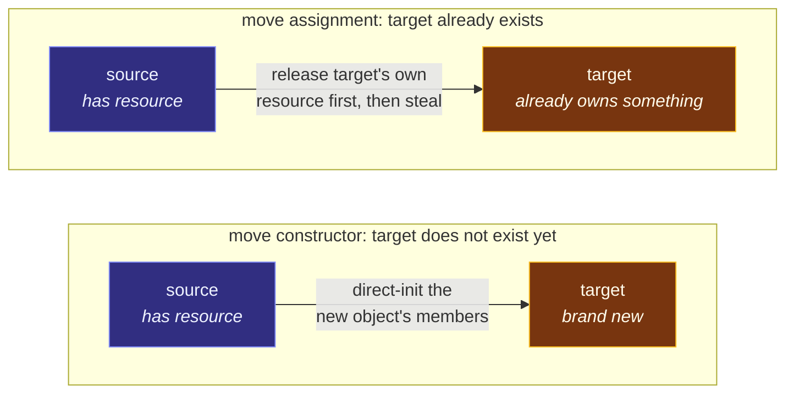

# Move Semantics

> [!essence]
> An rvalue reference only grants *permission* to pilfer an object's resources ([[Rvalue References]]); something still has to act on that permission. **Move semantics** are the two special member functions that do — the **move constructor** and **move assignment operator** — each written (or, under narrow conditions, compiler-synthesized) to transfer a resource in constant time and leave the source in a state its destructor can still safely run. Whether the compiler will write these for you, and whether the class you're copying is still copyable at all once you write one by hand, are governed by rules most programmers only discover by hitting them.

## The Problem

[[Rvalue References]] ends with a binding rule: `T&&` binds only to expressions with no other user. That rule lives entirely in the type checker. Nothing about it says what a function holding such a reference must *do*.

> [!principle] Constraint → Consequence → Requirement → Design → Price
> 1. **Constraint.** Binding `T&&` is a compile-time fact about an expression's category ([[Value Categories]]); it triggers no run-time behavior on its own. A function can declare a parameter of type `Buffer&&` and still do nothing but read from it.
> 2. **Consequence.** If nothing acts on the permission, an rvalue argument still falls back to whatever the class's copy constructor does — a full duplicate — even though the compiler has already proven no one else needs the original. The permission is wasted unless some code redeems it.
> 3. **Requirement.** The language needs two more special member functions — one for a target that doesn't exist yet, one for a target that already does — each defined to transfer a resource instead of duplicating it, and each obligated to leave the source in a state where its destructor, and only a narrow set of other operations, can still run safely.
> 4. **Design.** C++11 adds the **move constructor**, `T(T&&)`, and the **move assignment operator**, `T& operator=(T&&)`, as two more special member functions alongside the copy constructor, copy-assignment operator and destructor. The compiler will write them for you, but only when doing so can't be wrong by construction: no user-declared copy or move operation and no user-declared destructor anywhere in the class, and every member itself movable ([dcl.ref]-adjacent machinery, precisely `[class.copy.ctor]` ¶8 for the constructor).
> 5. **Price.** The five special member functions now interact: writing any one of copy, move or the destructor by hand suppresses the *compiler's* willingness to write the move operations for you — and writing a move operation goes further, silently deleting the compiler's copy operations outright. A class can go from freely copyable to move-only by adding one constructor, without ever writing the word `delete`.

> [!tension] safety ⟷ performance
> A move constructor's entire reason to exist is doing less work than a copy: no allocation, no element-by-element duplication, just a transfer of a handful of members. But "less work" is only safe because the source is guaranteed to have no other observer for the duration of the call — the same guarantee [[Rvalue References]] derived from the type system. Move semantics is where that compile-time guarantee turns into an actual run-time shortcut.

## Mental Model

A move constructor and a move assignment operator both steal, but they steal into different situations.



> [!model] Moving into an empty apartment vs. moving into a furnished one, and where it breaks
> A move **constructor** is a tenant moving into an apartment that has never been furnished: there is nothing to dispose of, so the new tenant just takes the previous tenant's furniture and the previous tenant walks out with empty hands. A move **assignment operator** is a tenant moving into an apartment someone is already living in: the old furniture must be dealt with — usually thrown out — *before or as* the new furniture arrives, or the move leaves two sets of furniture crammed into one apartment (a resource leak) or the new tenant's stuff thrown out by mistake.
> **Where it breaks:** the model suggests "old tenant" and "new occupant of this apartment" are always different people. C++ allows them to be the *same* object — `a = std::move(a)` is legal, because `std::move` doesn't know or care what it's aliased with. A move assignment operator that doesn't plan for this "moves into an apartment while still living in it."

## Mechanics

| Special member | Signature | What it must do |
|---|---|---|
| Move constructor | `T(T&&)` (or `T(T&&) noexcept`) | Direct-initialize the new object's members from the source's, typically by copying a handle rather than duplicating what it refers to; leave the source destructible. |
| Move assignment operator | `T& operator=(T&&)` | Release whatever resource `*this` already owns, then take over the source's; leave the source destructible; **must behave correctly when the source and `*this` are the same object** (Core Guidelines C.65). |

> [!standard] When the compiler will write a move operation for you
> Per `[class.copy.ctor]` ¶8, the compiler implicitly declares a move constructor for class `X` **only if** `X` has no user-declared copy constructor, copy-assignment operator, move-assignment operator, or destructor — and only if the move actually succeeds member-by-member. Move assignment (cppreference, *Move assignment operator* §Implicitly-declared) follows the same all-or-nothing rule, symmetrically. Declaring *any one* of the five special member functions by hand switches this off for the other four: the moment a class has a user-written destructor (a common reason to touch a class at all — freeing a resource), the compiler stops writing move operations for it, silently.

> [!standard] Declaring a move operation deletes the compiler's copy operations
> This is the asymmetric half of the rule, and it surprises even programmers who know the first half. If a class declares a move constructor or a move-assignment operator, `[class.copy.ctor]` ¶6 and cppreference's *Copy assignment operator* §Deleted both specify that the **implicitly-declared copy constructor and copy-assignment operator are defined as deleted**, not merely absent. A class with only a hand-written move constructor doesn't fall back to copying when someone tries to copy it — it refuses to compile. *In Code* §2 shows GCC's own diagnostic naming this exact rule.

**Copy's contract versus move's contract**, for the same statement `Widget b = a;` or `Widget b = std::move(a);`:

| | Copy | Move |
|---|---|---|
| Cost | O(*n*) in the resource's size, an allocation | O(1): pointer-sized transfers, no allocation |
| Source afterward | Untouched — still fully valid, unchanged value | Valid but unspecified ([[The Moved-From State]]) — destructible, reassignable, nothing else guaranteed |
| Selected when the argument is | an lvalue (a name) | an rvalue — a temporary, or `std::move(lvalue)` |
| If only one of the two exists | used for everything (copy is the universal fallback) | never falls back to move; an rvalue simply binds the copy operation's `const T&` parameter instead |

## Under the Hood

> [!machine] A move constructor compiles to a handful of loads and stores; a copy constructor compiles to an allocation and a loop
> For a `Buffer` holding `int* data_; int size_;`, compare the two constructors compiled to `Buffer make(...)` returning by value (GCC 11.4.0, x86-64 Linux, this vault's toolchain, `-O2`):
> ```nasm
> ; Buffer(Buffer&& other) noexcept : data_(other.data_), size_(other.size_) { ... }
> make(Buffer&&):
>         mov  rdx, QWORD PTR [rsi]     ; ① load other.data_
>         mov  rax, rdi
>         mov  QWORD PTR [rsi], 0       ; ② other.data_ = nullptr
>         mov  QWORD PTR [rdi], rdx     ;   store into new object's data_
>         mov  edx, DWORD PTR [rsi+8]   ;   load other.size_
>         mov  DWORD PTR [rsi+8], 0     ;   other.size_ = 0
>         mov  DWORD PTR [rdi+8], edx   ;   store into new object's size_
>         ret
> ```
> ```nasm
> ; Buffer(const Buffer& other) : data_(new int[other.size_]), size_(other.size_) { for(...) data_[i]=other.data_[i]; }
> make(Buffer const&):
>         ...
>         call operator new[](unsigned long)   ; ③ allocate — the move version never does this
> .L5:
>         mov  ecx, DWORD PTR [rdi+rdx]         ; ④ per-element copy loop — the move version has none
>         mov  DWORD PTR [rax+rdx], ecx
>         add  rdx, 4
>         cmp  rdx, rsi
>         jne  .L5
>         ...
> ```
> 1. The move constructor is eight straight-line instructions: load two members, zero the source's two members, store into the new object. No branch, no call.
> 2. Zeroing `other.data_` is not defensive style — it is the entire reason a moved-from `Buffer`'s destructor doesn't double-free.
> 3. The copy constructor calls `operator new[]` (and, off the fast path shown here, can reach `__cxa_throw_bad_array_new_length`) — real allocator work the move constructor has no reason to do.
> 4. The copy loop is O(*n*) in `size_`; the move constructor's cost does not depend on `size_` at all.

## In Code

**1 · Move constructor and a self-assignment-safe move assignment operator**

```cpp
#include <iostream>
#include <utility>

class Buffer {
public:
    explicit Buffer(int n) : data_(new int[n]{}), size_(n) {}

    Buffer(Buffer&& other) noexcept                     // ①
        : data_(other.data_), size_(other.size_) {
        other.data_ = nullptr;
        other.size_ = 0;
    }
    Buffer& operator=(Buffer&& other) noexcept {         // ②
        if (this != &other) {                            // ③
            delete[] data_;
            data_ = other.data_;
            size_ = other.size_;
            other.data_ = nullptr;
            other.size_ = 0;
        }
        return *this;
    }
    Buffer(const Buffer&) = delete;
    Buffer& operator=(const Buffer&) = delete;
    ~Buffer() { delete[] data_; }

    int size() const { return size_; }
    bool empty() const { return data_ == nullptr; }
private:
    int* data_;
    int size_;
};

int main() {
    Buffer a(1000);
    Buffer b = std::move(a);            // ④ move constructor
    std::cout << "a.empty()=" << a.empty() << " b.size()=" << b.size() << '\n';

    Buffer c(5);
    c = std::move(c);                    // ⑤ self-move-assignment
    std::cout << "c.empty()=" << c.empty() << " c.size()=" << c.size() << '\n';
}
// expect: a.empty()=1 b.size()=1000
// expect: c.empty()=0 c.size()=5
```
1. `other` starts with a resource; `*this` (the new object) starts with none — the "empty apartment" case. No self-assignment check is needed: a brand-new object can never alias its own constructor argument.
2. `*this` already owns `data_` when this runs — the "furnished apartment" case.
3. Guards the case where `other` and `*this` are the same `Buffer`. Without this check, freeing `data_` and then reading `other.data_` (the same member) risks corrupting exactly the value the move is trying to preserve — the hazard Primer §13.6 calls out explicitly for its own `StrVec::operator=(StrVec&&)`.
4. `a` is moved from: `data_` is now `nullptr`, confirmed by `empty()`.
5. `c = std::move(c)` reaches the move-assignment operator with `other` aliasing `*this`. The guard makes this a no-op instead of a self-inflicted double free: `c` keeps its five ints, confirmed by `size()==5`.

**2 · Declaring a move constructor deletes the compiler's copy constructor**

```cpp
// cc: ill-formed
#include <string>

class Ticket {
public:
    explicit Ticket(std::string id) : id_(std::move(id)) {}
    Ticket(Ticket&& other) noexcept : id_(std::move(other.id_)) {}   // ①
private:
    std::string id_;
};

int main() {
    Ticket t1("A-100");
    Ticket t2 = t1;   // ② error: use of deleted function Ticket::Ticket(const Ticket&)
}
```
1. `Ticket` declares a move constructor and nothing else from the special-member-function set.
2. GCC's own diagnostic names the rule directly: *"'Ticket::Ticket(const Ticket&)' is implicitly declared as deleted because 'Ticket' declares a move constructor or move assignment operator."* This is not a missing function falling back to something else — it is an explicitly deleted one, a hard compile error at the call site.

**3 · `noexcept` decides whether `std::vector` moves or copies on reallocation**

```cpp
#include <iostream>
#include <vector>

struct MayThrow {
    MayThrow() = default;
    MayThrow(const MayThrow&) { std::cout << "copy\n"; }
    MayThrow(MayThrow&&) { std::cout << "move\n"; }             // ① not noexcept
};

struct NoThrow {
    NoThrow() = default;
    NoThrow(const NoThrow&) { std::cout << "copy\n"; }
    NoThrow(NoThrow&&) noexcept { std::cout << "move\n"; }       // ② noexcept
};

template <typename T>
void grow() {
    std::vector<T> v(1);
    v.reserve(1);        // capacity is exactly 1
    v.emplace_back();    // ③ forces reallocation: 1 -> 2
}

int main() {
    grow<MayThrow>();
    grow<NoThrow>();
}
// expect: copy
// expect: move
```
1. `MayThrow`'s move constructor is permitted to throw, so `std::vector` cannot use it during reallocation and keep its strong exception guarantee (if a throw happened mid-move, some elements would already be pilfered from the old buffer and unrecoverable).
2. `NoThrow`'s move constructor promises not to throw.
3. Growing past capacity forces `std::vector` to relocate every element to new storage — internally via `std::move_if_noexcept`, which yields an rvalue only when the move constructor is `noexcept` or there is no copy constructor to fall back to. `MayThrow` fails that test and is *copied*; `NoThrow` passes it and is *moved* — confirmed by which line each `grow<T>()` prints.

## Pitfalls

> [!trap] A user-declared destructor silently turns off move
> Writing *only* a destructor — the single most natural reason to touch a resource-owning class — is enough to stop the compiler from generating move operations at all (`[class.copy.ctor]` ¶8 requires *no* user-declared destructor, copy or move operation). The class still compiles; every `std::move` on it now silently falls back to a full copy, with no warning. See [[Copy Semantics — Deep vs Shallow Copy]] for the matching Rule of Zero/Three/Five guidance, and prefer composing from members that already have correct move behavior (`std::string`, `std::vector`, `std::unique_ptr`) over hand-writing all five.

> [!trap] Self-move-assignment is legal, and relying on lucky ordering is fragile
> `a = std::move(a)` compiles and reaches the move-assignment operator — `std::move` is only a cast, so it cannot detect or refuse aliasing ([[Rvalue References]]). *In Code* §1's ordering (steal `other`'s members, then null them) happens to leave a single-resource `Buffer` merely empty rather than corrupted even without the guard — but that safety is an accident of this exact instruction order, not a property the language grants. A class with more than one independently-owned resource, or whose release step has side effects beyond deallocation, does not get the same accident for free. Core Guidelines C.65 exists precisely so no one has to re-derive which orderings are safe: test `this != &other` directly, as *In Code* §1 does.

> [!ub] The moved-from state is not empty by guarantee, only by convention
> The Standard requires only "valid but unspecified" for a moved-from standard-library object — not empty, not zero, not any particular value. Code that inspects a moved-from object's *contents* (rather than merely destroying it, reassigning it, or calling operations the type documents as safe) is relying on an implementation detail. See [[The Moved-From State]].

## Evolution

See [[Map — Evolution of C++]] for the language-wide timeline.

| Standard | Change | Why |
|---|---|---|
| C++98/03 | Only copy construction and copy assignment exist | No reference type could express "this argument is disposable," so there was nothing for a second, cheaper special member function to attach to |
| **C++11** | Move constructor and move-assignment operator introduced as distinct special member functions ([dcl.init], `[class.copy.ctor]`); `std::move_if_noexcept` added so containers can prefer move without giving up the strong exception guarantee | Turns [[Rvalue References|the rvalue-reference permission]] into an actual transfer, with an escape hatch for types whose move can throw |
| C++17 | `std::vector`'s own move constructor and move-assignment operator become `noexcept`; guaranteed copy elision (see [[Value Categories]]) removes many of the calls that would otherwise go through a move constructor at all | Fewer notional move-constructor calls for a returned prvalue; the standard containers commit to the fast path this note's *In Code* §3 demonstrates |
| C++20/23 | Implicit move extended to more `return`/`throw` forms (P1825); move-eligible names in `return` treated as xvalues (P2266) | Fewer places a programmer must write `std::move` by hand on a local that's about to go out of scope anyway |

## Connections

- **Prerequisites:** [[Rvalue References]] (the binding permission this note turns into action) · [[Copy Semantics — Deep vs Shallow Copy]] (the O(*n*) cost a move constructor exists to avoid, and the Rule of Zero/Three/Five vocabulary this note's Mechanics table extends to five members).
- **Enables:** [[The Moved-From State]] (exactly what "valid but unspecified" permits) · [[move and forward — Casts, Not Actions]] (the casts that manufacture the rvalues a move operation binds to) · [[noexcept and Why Move Must Not Throw]] (the full derivation behind *In Code* §3) · [[Copy Elision and RVO]] (when the compiler skips calling a move constructor at all).
- **Siblings:** [[unique_ptr]] — a type whose entire design is "move-only, and the compiler enforces it via the deletion rule in *Mechanics*."
- **Hazards:** [[The Moved-From State]] · [[Dangling Pointers and References]] (an observing pointer into a moved-from object's old resource).
- **Domain:** [[Map — Ownership & Move Semantics]].
- **Practice:** *Continuum #22 Rule-of-Five Resource Manager* — write all five special member functions for a resource-owning class, then delete the move constructor and confirm (as in *In Code* §2) that the compiler's own error message explains why the copy constructor vanished too.

## Check Yourself

> [!quiz]- What must a move constructor guarantee about the object it moved from, and what is it explicitly *not* required to guarantee?
> It must leave the source in a state its destructor can safely run (and, conventionally, that can be reassigned or destroyed). It is not required to leave the source with any particular value — "valid but unspecified," not "empty" or "zeroed," is the actual contract. See [[The Moved-From State]].

> [!quiz]- A class declares a move constructor and nothing else from the copy/move/destructor set. Can you still copy an object of that type? Why or why not?
> No — `Ticket t2 = t1;` is a compile error, not a fallback to a compiler-written copy. `[class.copy.ctor]` ¶6 defines the implicit copy constructor as *deleted*, not merely absent, once a move constructor is user-declared. See *In Code* §2.

> [!quiz]- Why does `std::vector` sometimes copy elements during reallocation even though the element type has a move constructor?
> Because that move constructor isn't marked `noexcept`. `std::vector` uses `std::move_if_noexcept` internally, which only yields an rvalue (enabling the move) when the move constructor can't throw or there's no copy constructor to fall back to — otherwise it yields an lvalue, forcing a copy, so a reallocation that fails partway through can still be rolled back. See *In Code* §3.

> [!quiz]- Predict: using the guarded `Buffer` from *In Code* §1, what does `c.size()` print after `c = std::move(c);`, and what would it print if the `this != &other` guard were removed?
> With the guard: `5` — the self-assignment is a no-op. Without the guard: still `5`, and `c` remains valid (empirically, for *this specific* member layout and ordering — freeing `data_` and then reading `other.data_`, which aliases the same freed pointer's *value* rather than dereferencing it, happens not to corrupt anything here). The guard isn't there because this exact class breaks without it; it's there because the safety is accidental and Core Guidelines C.65 says not to depend on that accident.

## Sources

- Primer §13.6 "Moving Objects" (pp. 534–542): the `StrVec` move constructor and move-assignment operator; the reason it checks self-assignment even though move-assignment's parameter is an rvalue — the argument can still be `std::move` applied to the very object being assigned to, so freeing before reading would risk the source; the moved-from-must-be-destructible requirement; and the synthesis rule that the compiler only writes move operations for a class with no user-declared copy-control members of its own, all of them movable.
- Tour §6.2.2 "Moving Containers" (pp. 76–78) and §6.3 "Resource Management" (p. 78): the motivating `Vector` move constructor, and "after a move, the moved-from object should be in a state that allows a destructor to be run."
- cppreference, *Move constructors* (implicitly-declared conditions; deleted-move-constructor rules): https://en.cppreference.com/w/cpp/language/move_constructor
- cppreference, *Move assignment operator* (implicitly-declared conditions, symmetric to the constructor): https://en.cppreference.com/w/cpp/language/move_assignment
- cppreference, *Copy assignment operator* §Deleted ("the implicitly-declared copy assignment operator … is defined as deleted if T declares a move constructor or move assignment operator"): https://en.cppreference.com/w/cpp/language/copy_assignment
- cppreference, *std::move_if_noexcept*: https://en.cppreference.com/w/cpp/utility/move_if_noexcept
- Draft standard `[class.copy.ctor]` ¶6 (declaring a move operation deletes the implicit copy constructor) and ¶8 (conditions for implicitly declaring a move constructor): https://eel.is/c++draft/class.copy.ctor
- C++ Core Guidelines C.65 (make move assignment safe for self-assignment), C.66 (make move operations `noexcept`): https://isocpp.github.io/CppCoreGuidelines/CppCoreGuidelines
