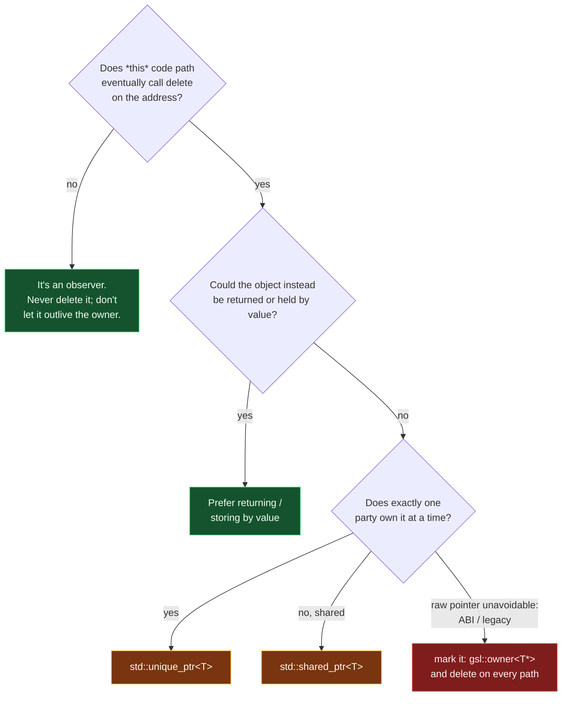

# Owning vs Observing Pointers

> [!essence]
> A raw `T*` that owns and a raw `T*` that merely observes are the exact same type, holding the exact same bits. **Owning** means this variable (or the object holding it) is the one that eventually calls `delete` on that address. **Observing** means it never will — it can read and pass the address around freely, but the moment the owner releases the object, an observer's copy of that address is worthless. [[Ownership — Who Releases What|Ownership]] names the general problem; this note is about the specific, sharp-edged case where the type system gives you no help telling the two roles apart.

## The Question

Every raw pointer you write or receive plays one of exactly two roles, and `T*` cannot tell you which. A function signature like `void configure(Widget* w)` is silent on whether `configure` will eventually `delete w` or just look at `*w` and return. Get the answer wrong — assume ownership that isn't yours, or fail to release ownership that is — and the program leaks or double-frees. The question this note answers: given a `T*`, how do you decide, mark, and check which role it plays, and when (rarely) should a raw pointer own at all?

> [!principle] Why the same type plays both roles
> 1. **Constraint.** `T*` predates the ownership question entirely — C had one pointer type for "an address," full stop, and C++ inherited it unchanged ([[Pointers]]).
> 2. **Consequence.** Every use of `T*` since has had to carry its ownership role *outside* the type: in a comment, a naming convention, or the reader's memory of what the function does. The compiler enforces none of it — `Widget* w` type-checks identically whether `w` is about to be deleted or just printed.
> 3. **Requirement.** A codebase needs some way — even an informal one — to make the overwhelmingly common case (observing) the assumed default, so the rare case (owning) has to announce itself.
> 4. **Design.** C++ Core Guidelines R.3 sets that default by convention: *a raw pointer is non-owning unless stated otherwise*. Where it must be stated, `gsl::owner<T*>` marks the exception without changing a single bit of the type (I.11). Where possible, the better fix isn't a marker at all — retype the pointer as [[unique_ptr]] or [[shared_ptr and Reference Counting|shared_ptr]], so ownership is enforced, not merely documented.
> 5. **Price.** The convention only protects code that follows it. A `T*` you didn't write yourself — a third-party API, an older module — tells you nothing until you read its documentation or its source.

## At a Glance

| Criterion | Owning `T*` | Observing `T*` |
|---|---|---|
| **Calls `delete` / `delete[]` through it** | ✓ exactly once, on every path | ✗ never |
| **Marked in the type by default** | ✗ looks identical to an observer; mark with `owner<T*>` if it must stay raw | ✗ also unmarked — silence *is* the convention (Core Guidelines R.3) |
| **Safe to let dangle after use** | ~ irrelevant — it controls when the object dies | ✗ never: dangles the instant the owner releases |
| **Safe to copy freely** | ✗ copying duplicates the address, not the resource — two "owners" now race to delete it | ✓ yes — a copy is just another look, nothing to race over |
| **How common in modern C++** | rare: legacy APIs, ABI boundaries, or inside a resource handle's own implementation | the default meaning of a bare `T*` almost everywhere else |
| **Idiomatic replacement** | [[unique_ptr]] (exclusive) or [[shared_ptr and Reference Counting]] (shared) | itself is already the idiomatic tool — or [[span]] / `const T&` for a narrower contract |
| **Typical machine code** | an address | an address |

## Deep Dive

### Observing pointers: the unmarked default

```text
  Before the owner releases                After the owner releases
 ┌────────────────────┐                   ┌────────────────────┐
 │ view : Sensor* ●──┼─┐                  │ view : Sensor* ╌╌┼╌╌▶ (freed)
 └────────────────────┘ │                 └────────────────────┘
                         ▼
                   ┌───────────┐
                   │ Sensor{7} │
                   └───────────┘
```
`view`'s own bits never change across these two moments — same address, same type. Only the object at the far end of the arrow stopped existing, and nothing about `view` records that fact. That gap is exactly what makes an observing pointer a hazard the instant it outlives what it observes, not a hazard in itself.

An observing pointer is a `T*` (or, in the Core Guidelines' own vocabulary, a `span`) that never releases what it refers to — and precisely because it never releases anything, it has no say in when its referent disappears: it can be left holding an address that used to be valid, pointing at a spot the owner has already reclaimed (Tour §15.2, p. 196). Because it owns nothing, copying, storing, or discarding an observing pointer is always safe by itself — the danger is entirely in *when* you dereference it, not in how many copies exist. That single property is what makes "just use a raw pointer to look at something" both extremely common and, done carelessly, extremely fragile: nothing about the observer's own bits ever announces that its referent is gone (see [[Dangling Pointers and References]] for the general hazard).

Per Core Guidelines R.3, this is the assumed default for every `T*` you encounter with no further context: *"There is nothing (in the C++ standard or in most code) to say otherwise, and most raw pointers are non-owning."* A parameter typed `Widget*` should be read as "hand me an address, I promise not to keep it past this call, and I will certainly never delete it" unless the function's own documentation says otherwise. That promise is exactly what a `const T&` parameter states even more strongly — a reference can't be reseated or stashed past the call as easily as a pointer can be — which is why [[Pointers vs References]] recommends reaching for a reference first and a pointer only when nullability or re-aiming is genuinely needed.

### Owning raw pointers: legal, rare, and must say so

A raw pointer *can* own — nothing in the grammar forbids it — but every standard reference on the subject treats it as something to avoid, not a routine choice. Primer's own framing is blunt: *"dynamic memory is notoriously tricky to manage correctly"* precisely because ownership by raw pointer requires a human to remember the release, on every path, including the ones that throw (Primer §12.1, p. 450). The fix the library provides is to make ownership itself a type — `unique_ptr` for a lone owner, `shared_ptr` for a tracked, shared set of them — so the compiler's own destructor-calling machinery does the remembering instead of a person.

When a raw pointer must still own — an ABI boundary that can't carry a C++ class across it, a legacy interface, or the internals of a resource handle that is itself implementing ownership from scratch — say so in the type. `gsl::owner<T*>` (Core Guidelines, Guidelines Support Library) is a plain alias with *"no default semantics beyond `T*` ... simply an indicator to programmers and analysis tools."* *In Code* §2 shows the pattern in full: a class holding one member marked `owner<unsigned char*>` (this one gets `delete[]`d) beside one plain `unsigned char*` (this one never does), so the two roles are legible side by side even though both are, bit for bit, the same pointer type.

### Arrays and the factory-function trap

Two shapes of this problem recur often enough to name directly. First: an *owning array* needs `delete[]`, not `delete` — mismatching the two is itself undefined behavior (`[expr.delete]` ¶2, the same clause that governs the single-object case), one more reason to prefer `std::vector` or `unique_ptr<T[]>` over a raw owning array pointer, and [[span]] over a raw *observing* one. Second: a function that allocates and returns a raw pointer — Core Guidelines' own `Gadget* make_gadget(int n)` example — hands the caller a decision it can't see: who deletes this? Core Guidelines I.11 calls returning ownership through a `T*` or `T&` something to avoid entirely — return the object by value when it's movable, or return `unique_ptr<T>` when pointer semantics (polymorphism through a base-class interface, say) are genuinely required. *In Code* §4 contrasts both versions directly.

## Decision Guide



1. **Default to "observer."** If you didn't allocate it and nobody handed you an explicit ownership transfer (a `unique_ptr` by value, an `owner<T*>`), treat every `T*` you're given as something you must not delete and must not use past the call that gave it to you, unless documented otherwise.
2. **Prefer value semantics first.** A `Gadget` cheap enough to move needs no pointer at all — return it, don't allocate it (Core Guidelines I.11).
3. **When ownership is real, put it in the type.** `unique_ptr<T>` for one owner, `shared_ptr<T>` for a tracked, shared set — both covered above and developed fully in [[unique_ptr]] and [[shared_ptr and Reference Counting]].
4. **Only mark a raw pointer as owning when the type genuinely can't be a smart pointer** (an ABI boundary, an array from a C API), and make the `delete`/`delete[]` unavoidable on every path, including exceptions.

## In Code

**1 · Same type, two contracts — and what happens when the roles blur**

```cpp
#include <iostream>

struct Sensor {
    int id;
    ~Sensor() { std::cout << "closing sensor " << id << '\n'; }
};

void observe(Sensor* s) {          // ① reads only — never deletes
    std::cout << "reading sensor " << s->id << '\n';
}

int main() {
    Sensor* owner = new Sensor{7}; // ② this variable is the one that must release it
    observe(owner);                // ③ same type Sensor*, opposite contract
    delete owner;                  // ④ the owner releases it, once
    delete owner;                  // ⑤ a second "release" of the same address
}
// cc: ub
```
1. Nothing in `Sensor*` tells `observe` it must not delete `s` — that restriction lives only in what `observe`'s body actually does.
2. `owner` plays the owning role purely by being the variable whose job it is to call `delete`; the type gives no hint of this.
3. `observe(owner)` compiles identically whether `owner` were an observer's copy or the true owner — the call site can't distinguish the two.
4. Correct: the object dies here.
5. `owner` still holds the same, now-freed address — it was never told the object is gone. The operand no longer "resulted from a previous new-expression" as `[expr.delete]` ¶2 requires, so this second call is undefined behavior. Built and run under AddressSanitizer (GCC 11.4, Linux, `-fsanitize=address,undefined`), this aborts with *heap-use-after-free*, caught the instant the destructor re-reads freed memory — that's ASan's detector at work, not a language guarantee; a build without it would typically just corrupt the allocator's bookkeeping silently instead of crashing cleanly.

**2 · Marking the exception: `owner<T*>` beside a plain observer**

```cpp
template <typename T>
using owner = T;   // ① a minimal stand-in for gsl::owner<T> — same bits as T*

class ImageBuffer {
    owner<unsigned char*> pixels;   // ② this member deletes what it points to
    unsigned char* cursor;          // ③ this member only looks — never delete[]s it
public:
    explicit ImageBuffer(int bytes) : pixels(new unsigned char[bytes]), cursor(pixels) {}
    ~ImageBuffer() { delete[] pixels; }   // ④ delete[]: this pointer came from new[]
};

int main() {
    ImageBuffer img(64);
    (void)img;
}
```
1. The real `gsl::owner<T>` (Guidelines Support Library) adds a `requires` clause restricting `T` to pointer types; the alias itself carries zero runtime effect either way — "no default semantics beyond `T*`" is the whole point.
2. `pixels` is the class's one owning member; the destructor is where that promise gets kept.
3. `cursor` is the exact same type `pixels` could have been, doing the opposite job — the two declarations, side by side, say what neither type alone can.
4. `owner<unsigned char*>` doesn't change which `delete` form is required — that's still decided by how the memory was allocated (`new[]` here, so `delete[]`).

**3 · An observer outlived by its owner's *storage*, not just its scope**

```cpp
#include <iostream>
#include <vector>

int main() {
    std::vector<int> scores{10, 20, 30};
    int* first = &scores[0];     // ① observes an element scores currently owns
    scores.push_back(40);        // ② may reallocate: the old buffer is freed
    std::cout << *first << '\n'; // ③ first was never told the buffer moved
}
// cc: ub
```
1. `first` doesn't own an `int`; `scores` owns the whole buffer it lives in.
2. `push_back` growing past capacity allocates a new, larger buffer, moves the elements across, and frees the old one — an implementation detail `first` has no way to see.
3. If reallocation happened, `first` now points into freed memory: the same undefined-behavior shape as *In Code* §1, reached through container growth instead of an explicit `delete`. Built the same way as §1 (GCC 11.4, Linux, ASan), this also aborts with *heap-use-after-free* — every `vector` growth path is exactly the kind of "owner released, observer didn't know" moment [[Dangling Pointers and References]] covers in general.

**4 · A factory that hides the answer, and one that doesn't**

```cpp
#include <memory>
#include <string>

struct Connection { std::string host; };

Connection* open_bad(const std::string& host) {   // ① caller must guess: who deletes this?
    return new Connection{host};
}

std::unique_ptr<Connection> open_good(const std::string& host) {  // ② the return type is the answer
    return std::make_unique<Connection>(host);
}

int main() {
    Connection* c = open_bad("db.local");
    delete c;                                        // ③ correct only because we read open_bad's body

    auto conn = open_good("db.local");                // ④ ownership is unmistakable from the signature alone
}
```
1. `Connection* open_bad(...)` type-checks identically to a function that returns a *non-owning* pointer into something else's storage — the signature alone can't tell you which.
2. `unique_ptr<Connection>` makes the transfer part of the type: there is no version of "call `open_good` and forget to think about ownership" that compiles into a leak.
3. This `delete` is only correct because we happened to read `open_bad`'s implementation — exactly the fragility Core Guidelines I.11 warns against.
4. No reading of an implementation was required; the return type already said "you now own this."

## Connections

- **Prerequisites:** [[Pointers]] (the type both roles share) · [[Ownership — Who Releases What]] (the general owner/observer/shared model this note specializes to raw pointers).
- **The idiomatic replacements:** [[unique_ptr]] (exclusive ownership, enforced) · [[shared_ptr and Reference Counting]] (shared ownership, enforced) · [[Choosing a Smart Pointer]] (deciding between them).
- **Shared hazard:** [[Dangling Pointers and References]] (what an observer becomes once its owner releases).
- **Adjacent access paths:** [[Pointers vs References]] (a `const T&` states "observer" even more strongly than a `T*` does) · [[nullptr and Null Pointers]] (an observer's "nothing to look at" state) · [[span]] (a non-owning *view* over a sequence, not just a single object).
- **Domain:** [[Map — Ownership & Move Semantics]].
- **Practice:** *Continuum #20* (apply the owning/observing distinction to a resource-holding class before reaching for smart pointers).

## Check Yourself

> [!quiz]- Given `void render(Widget* w)`, does the type tell you whether `render` will `delete w`?
> No. `Widget*` looks identical whether the function owns, observes, or stores the pointer past the call. Core Guidelines R.3 sets the default assumption — non-owning — but only documentation, a naming convention, or an `owner<T*>` marker overrides it; the compiler enforces none of it.

> [!quiz]- Why is copying an *owning* raw pointer more dangerous than copying an *observing* one?
> Copying an observer just makes another look — nothing to release, nothing at risk. Copying an owning raw pointer duplicates the address without duplicating the responsibility: both copies now believe deleting it is their job, and whichever runs its `delete` second does so on a pointer that no longer "resulted from a previous new-expression" — undefined behavior (`[expr.delete]` ¶2).

> [!quiz]- What does `gsl::owner<T*>` actually change about the compiled program?
> Nothing at run time. It's a plain alias for `T*` with no added semantics — its entire value is to tell a human reader or a static analyzer "this one deletes," which the bare type can't say on its own.

> [!quiz]- `int* p = &v[0];` where `v` is a `std::vector<int>`. Is `p` an owning or an observing pointer, and what's the one operation that can invalidate it without touching `p` itself?
> Observing — `v` owns the buffer `p` points into. Calling `v.push_back(...)` (or anything that grows past capacity) can reallocate that buffer, freeing the memory `p` refers to, even though `p`'s own bits never change.

> [!quiz]- A function is declared `Widget* make_widget(int n)`. What two designs remove the ownership ambiguity, and when would you pick each?
> Return `Widget` by value if it's cheap to move (the common case — no pointer needed at all), or return `std::unique_ptr<Widget>` if pointer semantics are required, e.g. because callers need to store it polymorphically through a base-class pointer. Both make the transfer visible in the return type instead of leaving it to documentation.

> [!quiz]- Why does an owning `T*` allocated with `new[]` require `delete[]` specifically, and what happens if you mismatch them?
> `new[]` and `new` allocate differently — an array needs its element count recorded for the destructors to run. Pairing an array allocation with a plain `delete`, or vice versa, gives the delete-expression an operand that doesn't match what it requires: undefined behavior under the same rule (`[expr.delete]` ¶2) that governs a double `delete`. Prefer a type that tracks this for you — `std::vector`, `unique_ptr<T[]>` — over an owning array pointer at all.

## Sources

- Tour §15.2 "Pointers" (p. 196): the `unique_ptr` / `shared_ptr` / `weak_ptr` vocabulary table and the definition of owning vs. non-owning pointers, including the dangling hazard.
- Primer §12.1 "Dynamic Memory and Smart Pointers" (p. 450): why manual ownership by raw pointer is "notoriously tricky," motivating smart pointers as the fix.
- PPP §18.5 "Resource-management pointers" (ch. 18): pointers as the mechanism underneath a resource handle's own implementation.
- Pikus, "Using pointers to avoid copying" (p. 330): a factory function should return `unique_ptr` even when callers may ultimately want `shared_ptr`, because converting up from unique to shared is cheap and one-directional.
- cppreference, *std::unique_ptr*: "owns (is responsible for) and manages another object via a pointer": https://en.cppreference.com/w/cpp/memory/unique_ptr
- C++ Core Guidelines R.3 "A raw pointer (a `T*`) is non-owning": https://isocpp.github.io/CppCoreGuidelines/CppCoreGuidelines#rr-ptr · I.11 "Never transfer ownership by a raw pointer (`T*`) or reference (`T&`)" (the `Gadget`/factory example this note's *In Code* §4 adapts): https://isocpp.github.io/CppCoreGuidelines/CppCoreGuidelines#ri-raw · F.22 "Use `T*` or `owner<T*>` to designate a single object": https://isocpp.github.io/CppCoreGuidelines/CppCoreGuidelines#rf-ptr
- Draft standard `[expr.delete]` ¶2 (a delete-expression's operand must be null or a pointer value from a matching, not-yet-deleted `new`-expression, or the behavior is undefined): https://eel.is/c++draft/expr.delete
