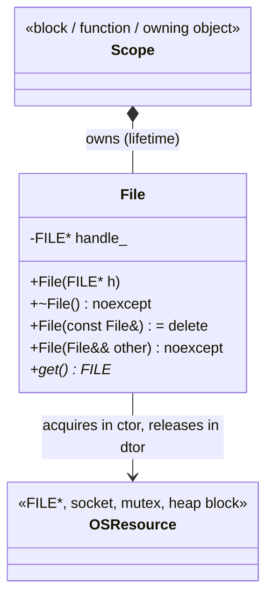
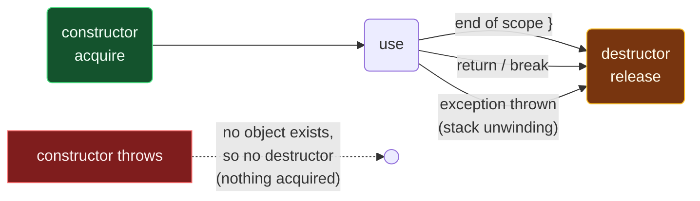

# RAII

> [!essence]
> Bind every resource to the lifetime of an object: **acquire it in a constructor, release it in the destructor.** C++ guarantees that a destructor runs whenever its object's lifetime ends: at the closing brace, on `return`, on `break`, and during exception unwinding. Release therefore becomes automatic, deterministic and exception-safe, at zero run-time cost.

## Intent

Make it *impossible to forget* to release a resource, by making release a consequence of scope rather than a line of code someone must remember to write.

## The Problem

A **resource** is anything that must be given back: heap memory, a file handle, a mutex lock, a socket, a database transaction, a GPU buffer. Each must be released **exactly once**. Zero releases is a leak; two is a double free or a double unlock.

> [!principle] Constraint → Consequence → Design
> 1. **Constraint:** A function has many exits: every `return`, `break`, `continue`, `goto`, and every *invisible* exit, where any call can throw.
> 2. **Consequence:** With manual `acquire(); … release();` pairs, each exit path needs its own cleanup. *M* resources and *N* exits need up to *M × N* cleanup statements. One missing statement on one rare path (usually the error path) is a leak nobody notices until production.
> 3. **Requirement:** Release must be tied to something the language itself executes on **every** exit path, including exceptions, without the programmer enumerating the paths.
> 4. **Design:** C++ already has such a thing. The **destructor** of an automatic object runs when its scope ends, by any route (`[stmt.jump]`, `[except.ctor]`). So wrap each resource in a class: the constructor acquires, the destructor releases. Scope exit *is* cleanup.
> 5. **Price:** Every kind of resource needs a wrapper type. Its copy and move behavior must be designed (who owns it after a copy?). Destructors must not throw.

> [!tension] safety ⟷ performance, resolved without compromise
> Garbage-collected languages make memory safe by deferring release to a collector, which costs run time and loses *determinism*: a file closes "eventually". RAII makes release **safe and immediate**, and it compiles to the same instructions you would have written by hand. That is the [[Zero-Overhead Principle]] in its purest form — the same bargain [[Map — What C++ Is|the language as a whole]] makes.

The name is historical and slightly misleading. Stroustrup coined *Resource Acquisition Is Initialization* for the acquisition half, but the idiom's power lies in the release half. Many people prefer *scope-bound resource management*.

## Structure

Three participants: the **resource** (an OS handle, a pointer, a lock), the **handle class** that owns it, and the **scope** that owns the handle.



The guarantee comes from the object's life cycle. Every path out of the scope passes through the destructor:



The dotted edge is the second half of the contract. If the constructor fails, it throws. The object never begins its lifetime, and its destructor never runs. That is correct, *provided each constructor acquires at most one resource*, or acquires several through members that are themselves RAII handles. Fully constructed members *are* destroyed when a later member's initialization throws (`[except.ctor]`).

## In Code

**✗ Manual release: one cleanup per exit path**

```cpp
#include <cstdio>
#include <stdexcept>

// Returns the first byte of a file, or -1.
int first_byte(const char* path) {
    std::FILE* f = std::fopen(path, "rb");
    if (!f) return -1;
    int c = std::fgetc(f);
    if (c == EOF) {
        std::fclose(f);                     // ① cleanup #1
        return -1;
    }
    if (c == 0) throw std::runtime_error{"NUL"};   // ② LEAK: f never closed
    std::fclose(f);                         // ③ cleanup #2
    return c;
}
```
1. Each early return needs its own `fclose`.
2. The throw path was forgotten. This is typical: error paths are the least tested.
3. The same cleanup again. Add a second resource and every path needs two calls, in the right order.

**✓ RAII handle: release is a property of the type**

```cpp
#include <cstdio>
#include <iostream>
#include <stdexcept>
#include <utility>

class File {
public:
    explicit File(std::FILE* h) : handle_{h} {                          // ① acquire
        if (!handle_) throw std::runtime_error{"open failed"};
    }
    ~File() { if (handle_) { std::fclose(handle_); std::cout << "closed\n"; } }  // ② release
    File(const File&) = delete;                                          // ③ unique owner
    File& operator=(const File&) = delete;
    File(File&& other) noexcept : handle_{std::exchange(other.handle_, nullptr)} {}  // ④
    File& operator=(File&& other) noexcept {
        if (this != &other) {
            if (handle_) std::fclose(handle_);
            handle_ = std::exchange(other.handle_, nullptr);
        }
        return *this;
    }
    std::FILE* get() const noexcept { return handle_; }
private:
    std::FILE* handle_;
};

int main() {
    try {
        File f{std::tmpfile()};
        std::fputs("data", f.get());
        throw std::runtime_error{"midway failure"};                      // ⑤
    } catch (const std::exception& e) {
        std::cout << "caught: " << e.what() << '\n';
    }
}
// expect: closed
// expect: caught: midway failure
```
1. The constructor either acquires the resource or throws, so a `File` object *always* owns an open handle (its **invariant**).
2. Destructors are implicitly `noexcept` (C++11). Release must not fail loudly; ignore or log errors.
3. Copying would give two owners and a double `fclose`, so copying is deleted. See [[Rule of Zero, Three and Five]].
4. Moving transfers ownership and leaves the source empty, which is why the destructor checks for `nullptr`.
5. The throw unwinds the `try` block. `f`'s destructor runs **before** the handler: the output is `closed`, then `caught: …`.

**✓ Modern: reuse a standard handle instead of writing one**

```cpp
#include <cstdio>
#include <memory>
#include <mutex>
#include <vector>

struct FileCloser {
    void operator()(std::FILE* f) const noexcept { std::fclose(f); }
};
using FilePtr = std::unique_ptr<std::FILE, FileCloser>;   // ① RAII for any C handle

std::mutex log_mutex;
std::vector<int> log_data;

void record(int value) {
    std::scoped_lock lock{log_mutex};                     // ② lock now, unlock at }
    if (value < 0) return;                                //    ...on every path
    log_data.push_back(value);
}

int main() {
    FilePtr f{std::tmpfile()};                            // ③ closes automatically
    if (f) std::fputs("hello", f.get());
    record(1);
    record(-1);
    return log_data.size() == 1 ? 0 : 1;
}
```
1. `std::unique_ptr` with a custom deleter turns *any* "handle + release function" pair into an RAII type in one line. That is the [[Rule of Zero, Three and Five|Rule of Zero]] in action: no hand-written special members.
2. `std::scoped_lock` (C++17) is RAII for mutexes: the early `return` cannot leave the mutex locked.
3. No `fclose` anywhere in user code.

## Consequences

| Benefit | Cost |
|---|---|
| ✓ Release on **every** path, including exceptions: the basis of [[Exception Safety Guarantees]] | ✗ A wrapper type per resource kind (mitigated by `unique_ptr` + deleter) |
| ✓ **Deterministic** timing: the lock is released at `}`, not "eventually" | ✗ Ownership must be designed: copy? move? share? |
| ✓ Zero overhead: destructor calls are inlined at scope exits; unwinding uses tables, not run-time checks | ✗ Destructors cannot report failure by throwing |
| ✓ Composes: a class whose members are RAII handles is automatically RAII | ✗ Needs a scope that matches the resource's intended lifetime |
| ✓ Local reasoning: acquisition and release sit in one place (the type) | ✗ Doesn't help with resources whose lifetime is not tied to any object's (e.g. cycles of `shared_ptr`) |

> [!machine] What it compiles to
> The compiler inserts a destructor call at every exit from the scope. On the normal paths it is an ordinary (often inlined) call. For the exception path, the compiler emits a **landing pad** (a small block that runs the pending destructors and then resumes unwinding), located through side tables (`.eh_frame` / LSDA on Itanium-ABI platforms). The fast path pays nothing for this. See [[Stack Unwinding]] and [[The Cost of Exceptions]].

> [!trap] The unnamed guard
> `std::scoped_lock{log_mutex};` creates a **temporary** that locks and then unlocks at the semicolon: no protection at all. Every RAII guard needs a *name*: `std::scoped_lock lock{log_mutex};`.

> [!trap] When destructors do *not* run
> `std::exit` skips destructors of automatic objects. `std::abort`, `std::quick_exit` and `std::_Exit` skip all of them. If an exception escapes `main`, `std::terminate` is called, and whether the stack is unwound first is implementation-defined. Catch at the top of `main` if cleanup matters.

## Variations

| Variation | Resource | Standard type |
|---|---|---|
| **Unique ownership** | heap object, any handle | `std::unique_ptr<T, Deleter>`: see [[unique_ptr]] |
| **Shared ownership** | object with many owners | `std::shared_ptr<T>`: see [[shared_ptr and Reference Counting]] |
| **Lock guards** | mutex ownership | `std::lock_guard`, `std::scoped_lock`, `std::unique_lock` |
| **Containers** | heap buffers | `std::vector`, `std::string`: RAII you use daily |
| **Streams** | file descriptors | `std::ifstream` / `std::ofstream` close in their destructors |
| **Threads** | a running thread | `std::jthread` (C++20) joins in its destructor |
| **Scope guard** | "run this lambda at exit" | `scope_exit` (Library Fundamentals TS v3); see [[Scope Guards]] |
| **Transaction** | commit-or-rollback | the destructor rolls back unless `commit()` was called |

## Connections

- **Prerequisites:** [[Object Lifetime]] (when destructors run) · [[Destructors]].
- **Builds on it:** [[unique_ptr]] · [[Rule of Zero, Three and Five]] · [[Exception Safety Guarantees]] · [[Stack Unwinding]] · [[Scope Guards]] · [[Ownership — Who Releases What]].
- **Prevents:** [[Memory Leaks]] · [[Double Free and Mismatched new-delete]] · [[Dangling Pointers and References]] (partly: it fixes *who* releases, not *who still looks* — for that, see how [[Pointers vs References]] separates owning from observing access).
- **Domain:** [[Map — Ownership & Move Semantics]] · see also [[Map — Errors & Contracts]] for the channels (exceptions, error codes, `expected`) that RAII is built to survive.
- **Practice:** *Continuum #25 Smart Pointer Refactor Lab* (replace every `delete`) · *#26 Custom Exception Hierarchy & Robust CSV Parser* (RAII under exceptions) · *#31 TCP Chat Client/Server* (RAII for sockets).

## Check Yourself

> [!quiz]- Why does RAII need *exceptions* in order to make sense of constructor failure?
> A constructor has no return value to report failure. Throwing is the only way to refuse to create the object. Because a throwing constructor means the object never existed, its destructor never runs. That is exactly right, since nothing was acquired.

> [!quiz]- A class acquires two raw resources in its constructor body: `a_ = open(); b_ = open();`. The second `open` throws. What leaks, and what is the fix?
> `a_` leaks. The object never finished construction, so `~Class()` never runs, and raw handles have no destructors of their own. Fix: make each member an RAII handle (e.g. `FilePtr a_, b_;`). Fully constructed *members* are destroyed when a later initialization throws.

> [!quiz]- Predict the output: `{ std::cout << "A"; File f{std::tmpfile()}; std::cout << "B"; }` using the `File` class above.
> `AB` followed by `closed`. The destructor runs at the closing brace, after everything else in the scope.

## Sources

- Tour §5.2.2 "A Container" (pp. 57–58): constructor acquires, destructor releases; the canonical introduction (also §4.2 "Exceptions", p. 45, on RAII as the basis of error handling).
- Tour §15.2.1 "unique_ptr and shared_ptr" (p. 197): standard RAII handles.
- Primer §12.1.4 "Smart Pointers and Exceptions" (p. 467): why direct `new`/`delete` leaks on exceptions; custom deleters.
- Primer §18.1.1 "Throwing an Exception" (p. 772): stack unwinding destroys local objects.
- PPP §18.4 "Resources and exceptions" and §18.5 "Resource-management pointers": RAII developed from a leaking example.
- cppreference, *RAII*: https://en.cppreference.com/w/cpp/language/raii
- C++ Core Guidelines R.1 "Manage resources automatically using resource handles and RAII", E.6 "Use RAII to prevent leaks", CP.44 "Remember to name your lock_guards": https://isocpp.github.io/CppCoreGuidelines/CppCoreGuidelines
