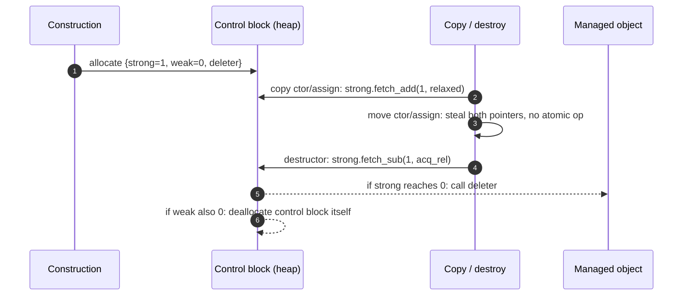

# shared_ptr and Reference Counting

> [!essence]
> `shared_ptr<T>` lets several owners hold the same object at once by moving the bookkeeping off the object and into a separate **control block**: a heap-allocated record holding a strong count, a weak count, and a type-erased deleter. Copying a `shared_ptr` atomically increments the strong count; destroying one atomically decrements it; the owner that drives it to zero calls the deleter. The count is safe to touch from any thread — the object it protects is not.

## The Problem

[[unique_ptr]] enforces "exactly one owner" by refusing to compile a copy. That is the right answer whenever the code can name a single party responsible for release. But some objects genuinely have no such party: a cache entry several lookups hold at once, a graph node reachable from more than one edge, a resource handed to a background task that may outlive the function that started it. No line in the program is uniquely "the last one done with it" — that fact can only be discovered at run time, by counting.

> [!principle] Constraint → Consequence → Requirement → Design → Price
> 1. **Constraint.** `unique_ptr`'s ownership lives in the *type*: the compiler enforces a single owner by deleting the copy operations. Some objects need more than one simultaneous owner, and no compile-time rule can predict which owner will finish last.
> 2. **Consequence.** If nothing tracks how many owners remain, releasing the object requires knowing in advance which owner is the last one — exactly the fact that shared ownership makes unknowable ahead of time. Release either happens too early (a dangling reference in whichever owner is still using the object) or never (a leak, because everyone assumed someone else would do it).
> 3. **Requirement.** Something must count live owners, delete the object exactly when that count reaches zero, and — since owners can be created and destroyed from different places, including different threads — do the counting itself without racing.
> 4. **Design.** `shared_ptr<T>` stores two pointers: one to the managed object, one to a **control block** shared by every `shared_ptr` that co-owns it. The control block holds the strong count (how many `shared_ptr`s), the weak count (how many `weak_ptr`s, see *Consequences*), and the deleter and allocator, type-erased so any `shared_ptr<T>` is the same type regardless of how it was constructed. Copying a `shared_ptr` copies both pointers and increments the strong count; destroying one decrements it; the decrement that reaches zero runs the deleter. The count is an atomic integer, so this bookkeeping is correct even when different `shared_ptr` copies live on different threads.
> 5. **Price.** The control block is a second heap allocation (unless `make_shared` combines it with the object, see *Under the Hood*), and every copy, move-away, and destruction touches an atomic variable — real cost paid on every operation, whether or not the object is ever actually shared across threads. `weak_ptr` support and thread-safe counting are unconditional: a `shared_ptr` that only ever has one owner still pays for both.

> [!tension] safety ⟷ performance
> [[Map — Ownership & Move Semantics|The domain's Key Idea]] states the trade plainly: `unique_ptr` costs nothing extra; `shared_ptr` costs an atomic operation and a control block on every copy. Tour puts the design guidance directly: "Use `shared_ptr` only if you actually need shared ownership" (Tour §15.2.1, p. 199) — the mechanism below explains exactly what that guidance is telling you to avoid paying for.

## Mental Model

> [!model] A community mailbox with a mechanical, tamper-proof counter
> Several key-holders can open the same mailbox. A padlock's built-in counter clicks up whenever a key is copied and down whenever a key-holder turns theirs in for good; whoever's turn-in clicks the counter to zero is the one who empties and removes the box. The counter is built so that two hands clicking it at the exact same instant never lose a click — that part is safe no matter how many people share it.
> **Where it breaks:** the counter's safety says nothing about the *letters inside*. Two people reading and writing the same letter at the same time still collide; the mechanism only protects the click, not the contents. And the guarantee covers copying *from* a key someone already holds — it says nothing about two people independently filing copies of what they believe is "the same" master key (see the *Pitfalls* example below): that isn't a copy of an existing key at all, it's a second, unrelated lock fitted to the same door.

```text
   shared_ptr<Widget> a               shared_ptr<Widget> b  (a copy of a)
  ┌─────────────────────┐            ┌─────────────────────┐
  │ ptr    ●─────────────┼───┐    ┌───┼─●   ptr             │
  │ ctrl   ●─────────────┼─┐ │    │ ┌─┼─●   ctrl            │
  └─────────────────────┘ │ │    │ │ └─────────────────────┘
                           │ │    │ │
                           │ └────┼─┼──────▶ Widget            (heap, 12 bytes)
                           │      │ │
                           ▼      ▼ ▼
                     ┌──────────────────────────┐
                     │ control block             │
                     │  strong = 2   (atomic)    │
                     │  weak   = 0   (atomic)    │
                     │  deleter  (type-erased)   │
                     └──────────────────────────┘
```
Both `shared_ptr`s carry the *same* two addresses; only the strong count, sitting in the one shared control block, tells either of them whether it is safe to delete.

## Step by Step



1. **Construct.** `shared_ptr<T>(new T(...))` allocates the object and the control block **separately**; the control block stores a pointer to the object plus a type-erased deleter (`delete` by default). `make_shared<T>(...)` (and `allocate_shared`) instead allocate **one** block big enough for both and construct `T` in place inside it — see the allocation-count proof in *Under the Hood*.
2. **Copy.** The copy constructor and copy-assignment operator copy both stored pointers and increment the strong count. cppreference's implementation notes specify the increment as `fetch_add` with `memory_order_relaxed` — later operations don't depend on it, so the weakest ordering that is still atomic suffices.
3. **Move.** [[Move Semantics|Moving]] a `shared_ptr` steals its two pointers and leaves the source null — no atomic operation at all, because the total count of owners hasn't changed, only which variable names one of them. This is one reason `std::move`-ing a `shared_ptr` you're about to discard is cheaper than letting it be copied.
4. **Destroy.** The destructor decrements the strong count. cppreference notes the decrement needs a *stronger* ordering (acquire-release) than the increment: the thread that drives the count to zero must see every write the other owners made to the object before it runs the deleter. If the count reaches zero, the managed object is destroyed. The control block itself survives until the **weak** count also reaches zero (see *Consequences*).

## Under the Hood

> [!machine] `make_shared` performs one allocation; `shared_ptr(new T)` performs two — observed, GCC 11.4.0, x86-64 Linux, no optimization flags
> Overriding the global `operator new` to count calls makes the claim in *Step by Step* directly observable rather than asserted:
> ```cpp
> #include <memory>
> #include <cstdio>
> #include <cstdlib>
>
> int alloc_count = 0;
> void* operator new(std::size_t n) { ++alloc_count; return std::malloc(n); }
> void operator delete(void* p) noexcept { std::free(p); }
> void operator delete(void* p, std::size_t) noexcept { std::free(p); }
>
> struct Widget { int x, y, z; };
>
> int main() {
>     alloc_count = 0;
>     std::shared_ptr<Widget> a(new Widget{1, 2, 3});
>     std::printf("shared_ptr(new Widget): %d allocation(s)\n", alloc_count);   // ①
>
>     alloc_count = 0;
>     auto b = std::make_shared<Widget>(4, 5, 6);
>     std::printf("make_shared<Widget>(): %d allocation(s)\n", alloc_count);    // ②
> }
> // expect: shared_ptr(new Widget): 2 allocation(s)
> // expect: make_shared<Widget>(): 1 allocation(s)
> ```
> ① The bare `new Widget{...}` is one allocation; wrapping it triggers a second, separate allocation for the control block. ② `make_shared` places `Widget` inside the same allocation as the control block — the "single allocation" claim from Tour (§15.2.1, p. 199: `make_shared` "does not need a separate allocation for the use count") made visible by counting, not just cited.

**Cost model.** A typical implementation stores exactly two pointers in the `shared_ptr` object itself (cppreference, *Implementation notes*): the stored pointer (what `get()` returns) and a pointer to the control block. That makes `sizeof(shared_ptr<T>)` twice `sizeof(unique_ptr<T>)` on any target where both pointers are the same width — libstdc++, x86-64 Linux and MinGW-w64, x86-64 Windows both confirm this:

```cpp
#include <memory>

struct Widget { int x; };

static_assert(sizeof(std::shared_ptr<Widget>) == 2 * sizeof(void*));   // ①
static_assert(sizeof(std::unique_ptr<Widget>) == 1 * sizeof(void*));   // ②
int main() {}
```
1. The Standard does not guarantee this layout — cppreference calls it only "a typical implementation" — but every mainstream library ships it.
2. Reproduces [[unique_ptr]]'s cost model for contrast: one pointer, the minimum any owning handle could occupy.

**The atomic count is not free even single-threaded, and it doesn't protect the object.** Pikus measured a hand-rolled, non-atomic publishing pointer against `shared_ptr` used with explicit atomic operations and found the publishing pointer roughly **60× faster on one thread**, with the gap widening as more threads read concurrently (Pikus ch. 6, "Smart pointers for concurrent programming," pp. 231–233; figures 6.7–6.8 in that chapter). This is reported behavior from Pikus's own benchmark, not something this vault's toolchain reproduced. The reason isn't only the atomic increment: `shared_ptr` also pays for `weak_ptr` support it may never use, and Pikus shows that a minimalistic custom reference-counted pointer without that support can again be "several times more efficient" than `shared_ptr` (p. 234). The thread-safety guarantee itself is narrower than it sounds: cppreference's own wording is that *member functions on different `shared_ptr` objects that share ownership* are safe to call concurrently without extra synchronization — copying `a` into `b` on one thread while another thread destroys a *different* `shared_ptr` to the same object is fine. Calling a non-`const` member function on the *same* `shared_ptr` variable from two threads at once is a data race regardless (cppreference; Pikus p. 232 reaches the identical conclusion independently): the count is atomic, the six-or-so bytes of the `shared_ptr` object holding *which* control block it currently points at are not, unless wrapped in `std::atomic<std::shared_ptr<T>>` (C++20).

## In Code

**1 · The count rises on copy, falls on destruction**

```cpp
#include <memory>
#include <iostream>

struct Sensor {
    inline static int alive = 0;
    int id;
    explicit Sensor(int id) : id{id} { ++alive; }
    ~Sensor() { --alive; }
};

void observe(std::shared_ptr<Sensor> s) {                      // ① by value: the copy bumps the count
    std::cout << "inside observe: use_count=" << s.use_count() << '\n';
}

int main() {
    auto a = std::make_shared<Sensor>(1);
    std::cout << "after construction: use_count=" << a.use_count() << '\n';
    {
        auto b = a;                                             // ② copy: count 1 → 2
        std::cout << "after copy: use_count=" << a.use_count() << '\n';
        observe(a);                                              // ③ a third owner, briefly
        std::cout << "after observe returns: use_count=" << a.use_count() << '\n';
    }                                                             // ④ b destroyed: count 2 → 1
    std::cout << "after inner scope: use_count=" << a.use_count()
               << ", alive=" << Sensor::alive << '\n';
}
// expect: after construction: use_count=1
// expect: after copy: use_count=2
// expect: inside observe: use_count=3
// expect: after observe returns: use_count=2
// expect: after inner scope: use_count=1, alive=1
```
1. `observe` takes its parameter *by value*, so calling it copies `a`, which increments the strong count for the call's duration — a common, if easy-to-miss, extra copy. Passing `const std::shared_ptr<Sensor>&` instead avoids it when the callee only needs to look, not to become a co-owner.
2. Copying `a` into `b` increments the count the two now share.
3. Inside `observe`, the parameter is a third co-owner: 2 (from `a` and `b`) plus the temporary copy made to call it.
4. `b`'s destructor at the closing brace decrements the count; the `Sensor` itself is untouched because `a` still owns it — `alive` stays `1` until `main` ends.

**2 · Two independently-constructed `shared_ptr`s never share a count**

> [!ub] Wrapping a raw pointer twice makes two unrelated control blocks
> `shared_ptr`'s sharing is established only by **copying an existing `shared_ptr`**. Constructing a second `shared_ptr` from the same raw pointer — including one obtained via `get()` — creates a *second, independent* control block with its own strong count starting at 1 (cppreference: "constructing a new `shared_ptr` using the raw underlying pointer owned by another `shared_ptr` leads to undefined behavior"). Both eventually reach zero and both call the deleter on the same address.
> ```cpp
> // cc: ub
> #include <memory>
>
> struct Widget { int x = 0; };
>
> int main() {
>     auto owner = std::make_shared<Widget>();
>     Widget* raw = owner.get();                       // ① observing, not owning
>     std::shared_ptr<Widget> impostor(raw);            // ② a second control block, strong=1
> }   // both destructors independently decrement their OWN count to zero: double free
> ```
> Observed here (GCC 11.4.0, x86-64 Linux, `-fsanitize=address,undefined`): AddressSanitizer reports `attempting free on address which was not malloc()-ed`, tracing the bad `delete` back through `impostor`'s destructor to memory that `owner`'s control block already claims. On the owner's MinGW toolchain, which has no ASan runtime, this same program either corrupts the heap silently or aborts, depending on the allocator — `cc.py code`'s sanitizer fallback documents which it saw. The fix is what example 1 already does: share by copying `owner`, never by re-wrapping `owner.get()`.

**3 · The aliasing constructor: sharing ownership of the whole while pointing at part**

```cpp
#include <memory>
#include <iostream>

struct Engine { int rpm = 4000; };
struct Car { Engine engine; };                                // ① engine is a subobject, not its own allocation

int main() {
    auto car = std::make_shared<Car>();
    std::shared_ptr<Engine> engine_view(car, &car->engine);   // ② shares car's control block, stores &engine
    car.reset();                                               // ③ this handle to the Car is gone...
    std::cout << "rpm=" << engine_view->rpm                    // ④ ...but the object lives on
              << " use_count=" << engine_view.use_count() << '\n';
}
// expect: rpm=4000 use_count=1
```
1. `Engine` has no allocation of its own — it lives inside `Car`'s single `make_shared` allocation.
2. This is why the two stored pointers matter: `engine_view`'s *stored* pointer is `&car->engine`, but its *control-block* pointer is the same one `car` uses, so it counts as a co-owner of the whole `Car`.
3. `car.reset()` drops one strong reference; the count doesn't reach zero because `engine_view` still holds the control block.
4. `engine_view` keeps the entire `Car` — engine included — alive, and reports `use_count() == 1` because it's now the sole owner, even though it never mentions `Car` by name.

## Consequences

The control block explains a family of `shared_ptr` rules and failure modes:

| Observed rule or failure | Explained by |
|---|---|
| Copying a `shared_ptr` is measurably slower than copying a `unique_ptr` (which doesn't compile at all) | The atomic increment on the strong count, paid on every copy regardless of threading — see [[Map — Ownership & Move Semantics]] |
| `shared_ptr<T>` is one type no matter what deleter or allocator it was built with | The deleter and allocator are type-erased *inside* the control block, unlike [[unique_ptr|unique_ptr's]] deleter, which is a template parameter |
| Building a second `shared_ptr` from `.get()` double-frees | Each independently-constructed `shared_ptr` allocates its *own* control block with its own count starting at 1 — example 2 above |
| A `weak_ptr` can outlive the object it once observed without keeping it alive | The weak count and the strong count are tracked separately; expiring the object only requires the strong count to hit zero — see [[weak_ptr and Reference Cycles]] |
| The control block's memory can outlive the object it managed | It isn't deallocated until the weak count *also* reaches zero, so a lingering `weak_ptr` keeps the (now-empty) control block allocated |
| A `make_shared` object's memory isn't reclaimed the instant the last `shared_ptr` is destroyed, if a `weak_ptr` still exists | Object and control block share **one** allocation with `make_shared`; freeing the block that still holds a live weak count would deallocate the object's storage too, so the whole block waits for both counts |
| `shared_ptr` is called "thread-safe" but data races on the pointee still happen | Only the count is atomic; the managed object gets no synchronization from `shared_ptr` itself — Pikus p. 232, *Under the Hood* |
| `shared_ptr<Derived>` converting to `shared_ptr<Base>` needs no virtual destructor | The control block already stores the correct deleter for the original type, captured at construction — contrast [[Virtual Destructors|unique_ptr's]] UB in the same scenario |

## Connections

- **Prerequisites:** [[Ownership — Who Releases What]] — names the "who releases this" question this mechanism answers for the shared case. [[unique_ptr]] — the singular-ownership contrast this note leans on throughout.
- **Enables:** [[weak_ptr and Reference Cycles]] (the non-owning counterpart the weak count exists for) · [[Choosing a Smart Pointer]] · [[make_unique and make_shared]].
- **Siblings:** [[Owning vs Observing Pointers]] · [[Move Semantics]] (why moving a `shared_ptr` skips the atomic operation).
- **Hazards:** the twin-control-block double free in example 2 · [[Virtual Destructors]] (the non-virtual-destructor trap `shared_ptr` avoids that `unique_ptr` doesn't).
- **Domain:** [[Map — Ownership & Move Semantics]].
- **Practice:** *Continuum #25 Smart Pointer Refactor Lab* — replace shared raw pointers with `shared_ptr`, then measure `use_count()` at each handoff to confirm your mental model of who owns what, when.

## Check Yourself

> [!quiz]- Why does `shared_ptr` need a separate control block, when a hand-rolled intrusive reference count (Pikus, ch. 6) stores the count inside the object itself?
> A general-purpose `shared_ptr<T>` must work for any `T`, including types that were never designed with a reference count in mind, and it must also support `weak_ptr`, which needs to detect that an object is gone without touching freed memory. A separate control block can outlive the object (once the strong count hits zero but the weak count hasn't) and needs no cooperation from `T` at all. An intrusive count, as Pikus shows, avoids the second allocation and can be faster — at the cost of building it into the type.

> [!quiz]- Two threads each hold their own `shared_ptr` copy to the same object and one destroys its copy while the other copies its own. Is this safe? What if both threads instead shared and mutated the *same* `shared_ptr` variable?
> Safe: the strong count is atomic, so a concurrent increment (from the copy) and decrement (from the destruction) always leave the count at a consistent value, per cppreference's guarantee for member functions called on *different* `shared_ptr` objects that co-own the same resource. Two threads operating on the *same* `shared_ptr` variable without synchronization is a data race regardless — the count is atomic, but the `shared_ptr` object's own pointers are not, so a plain `std::shared_ptr<T>` variable shared across threads needs `std::atomic<std::shared_ptr<T>>` (C++20) or explicit locking.

> [!quiz]- Predict: what goes wrong in `std::shared_ptr<Widget> impostor(owner.get());`, and why doesn't `std::shared_ptr<Widget> copy(owner);` have the same problem?
> `owner.get()` returns the raw pointer with no connection to `owner`'s control block, so `impostor` allocates a brand-new control block with its own strong count starting at 1 — two independent owners of one object, each convinced it's the only one, each set to `delete` it when its own count reaches zero: a double free. `copy(owner)` is a *copy constructor* call, which explicitly shares `owner`'s existing control block and increments its count instead of creating a new one.

> [!quiz]- Why is `sizeof(std::shared_ptr<Widget>)` twice `sizeof(std::unique_ptr<Widget>)`, even for the default deleter in both?
> `unique_ptr` stores only the managed pointer (the deleter, when stateless, is folded away — see [[unique_ptr]]). `shared_ptr` must additionally reach the control block from every copy, so it stores a second pointer to it. That second pointer is the price of a count that can be shared by owners that don't otherwise know about each other.

## Sources

- Primer §12.1 "Dynamic Memory and Smart Pointers" (pp. 450–467): `shared_ptr`'s operations, `make_shared` as "the safest way" to allocate (p. 451), the `process(shared_ptr<int>)` reference-count walkthrough (pp. 464–465), and the `get()`-then-wrap hazard worked in full (p. 466) — the basis for example 2 above.
- Tour §15.2.1 "unique_ptr and shared_ptr" (p. 199): "shared_ptr provides a form of garbage collection... neither cost free nor exorbitantly expensive"; "Use shared_ptr only if you actually need shared ownership"; `make_shared`'s single-allocation efficiency claim, verified by counting in *Under the Hood*.
- Pikus, ch. 6 "Building blocks for concurrent programming," § "Smart pointers for concurrent programming" (pp. 231–234): the precise thread-safety guarantee (atomic operations on the counter, not on the pointee), `fetch_add`/`fetch_sub` as the underlying primitive, the measured cost of `shared_ptr`'s atomics versus a hand-rolled publishing pointer and a custom intrusive reference count.
- cppreference, *std::shared_ptr* — Implementation notes (control block contents, two-pointer layout, single allocation under `make_shared`/`allocate_shared`, `fetch_add`/relaxed for increment vs. stronger ordering for decrement) and Notes (constructing from another `shared_ptr`'s raw pointer is undefined behavior; thread-safety scope): https://en.cppreference.com/w/cpp/memory/shared_ptr
- cppreference, *std::shared_ptr::unique* (member removed in C++20) and *std::atomic\<std::shared_ptr\>* (C++20 replacement for the free-function `atomic_load`/`atomic_store` overloads, themselves deprecated in C++20 and removed in C++26): https://en.cppreference.com/w/cpp/memory/shared_ptr/unique · https://en.cppreference.com/w/cpp/memory/shared_ptr/atomic2
- C++ Core Guidelines, F.27 "Use a `shared_ptr<T>` to share ownership" and the surrounding guidance to prefer returning by value or `unique_ptr` and reach for `shared_ptr` only when reference semantics are genuinely needed: https://isocpp.github.io/CppCoreGuidelines/CppCoreGuidelines
- Draft standard `[util.smartptr.shared]` (the class template's normative definition): https://eel.is/c++draft/util.smartptr.shared
