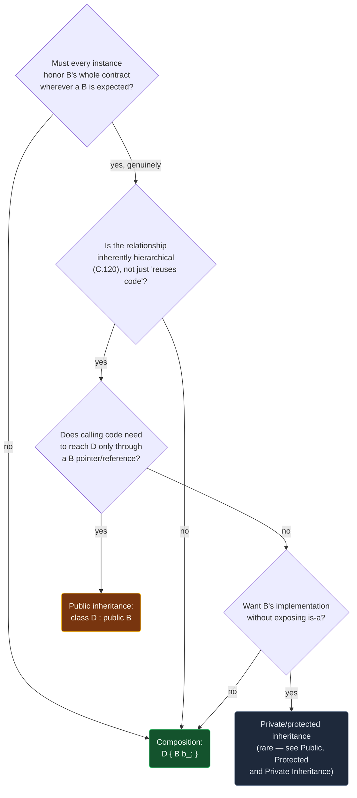

# Composition vs Inheritance

> [!essence]
> Both let one class reuse another's code. **Inheritance** makes that reuse a promise: a derived class publicly claims *is-a*, and the base becomes a physical part of every derived object, reachable and substitutable through a base pointer or reference. **Composition** makes no such promise: one class simply *has-a* member of another type, with no implicit conversion and no obligation to honor the member's whole interface. Reach for inheritance only when a derived type must behave acceptably everywhere its base is expected — not merely when it sounds, in English, like "a kind of" it.

## The Question

A class `D` wants to reuse what class `B` already does. Two constructs both compile: `class D : public B { ... };` and `class D { B b; ... };`. Both give `D`'s own code a way to call `B`'s operations. The choice between them is not a matter of taste — it decides what `D` promises its callers, how tightly `D`'s source is welded to `B`'s, and whether a `D` can stand in anywhere a `B` is expected.

> [!principle] Why both exist
> 1. **Constraint.** Two classes can be related in genuinely different ways: one can be a specialized version of the other (a `Square` is a kind of `Rectangle`), or one can simply contain or use the other (a `Car` has an `Engine`; it is not a kind of `Engine`).
> 2. **Consequence.** A single reuse mechanism strong enough to model the first relationship — one that licenses treating a `Square*` as a `Rectangle*` — would, applied to the second, license treating a `Car*` as an `Engine*`. That conversion is meaningless and, if the base type was never designed to be inherited from, actively dangerous ([[Virtual Functions]] covers why a base needs a virtual destructor before it can be deleted through a base pointer at all).
> 3. **Requirement.** The language needs a mechanism that names the relationship and licenses the base-pointer conversion only when it is intended (public inheritance), and a separate, conversion-free mechanism for the far more common case of merely delegating to another type's implementation.
> 4. **Design.** C++ gives both from C++98: `class D : public B` for the first ([[Inheritance]] derives its mechanics in full), and an ordinary data member — `B b_;` inside `D` — for the second. Primer's own summary of the choice, stated as a key concept at p. 637, is exactly this: a publicly-derived class should read as *is-a*; a member should read as *has-a*.
> 5. **Price.** Inheritance is the stronger, more coupling claim, so it should be the *rarer* choice. C.120 of the C++ Core Guidelines states this as a rule: use a class hierarchy only to represent a concept with genuinely hierarchical structure — never merely to avoid retyping a few members.

> [!tension] value ⟷ identity
> Composition asks nothing of `B` beyond its ordinary value semantics: `D` holds a `B`, copies it, and calls whichever of its members `D` chooses to call — or wraps and narrows. Public inheritance asks for more: it converts `D`'s *identity* — a pointer or reference to it — into a `B`'s identity, so every promise `B` makes to its own callers must still hold for every `D`. [[Object Slicing]] is what happens when only the value half of that promise is actually used.

## At a Glance

| Criterion | Public Inheritance (`class D : public B`) | Composition (`class D { B b_; }`) |
|---|---|---|
| **Relationship expressed** | *is-a*: `D` is a kind of `B` | *has-a*: `D` contains, delegates to, or uses a `B` |
| **Implicit conversion** | ✓ `D*`/`D&` converts to `B*`/`B&` | ✗ none; `D` is never mistaken for `B` |
| **Exposes `B`'s whole public interface** | ✓ unless hidden member-by-member (error-prone) | ✗ `D` exposes exactly what it redeclares |
| **Substitutable for `B` (Liskov)** | ~ only if every `D` truly honors `B`'s contract | n/a — no substitutability is claimed |
| **Coupling to `B`'s implementation** | ✓ high: `D`'s layout and behavior are welded to `B`'s | ~ lower: `D` depends only on the member functions it calls |
| **Can change which type is reused, later** | ✗ hard: the base is baked into every `D` object | ✓ easy: swap the member's type if the interface matches |
| **Needs `B` to permit derivation** | ✓ `B` should offer a virtual (or protected) destructor | ✗ any complete type can be a member |
| **Extra runtime cost over the other** | — none: same bytes, same calls (see *Under the Hood*) | — none |

## Deep Dive

### Public inheritance: reuse that also promises *is-a*

[[Inheritance]] already derives what public derivation buys: every accessible member of `B` becomes a member of `D`, the base occupies a subobject inside every `D`, and because the derivation is `public`, a `D*` converts implicitly to a `B*`. That conversion is not a minor convenience — it is the entire point of choosing inheritance over composition, and it is a promise to every piece of code that only ever sees the `B*`: *whatever `B` guarantees, this object honors too.* That promise has a name — the **Liskov Substitution Principle** — and it is stronger than "shares a name with" or "feels like a kind of" in everyday English.

### The substitutability trap: *is-a* is not *resembles*

The textbook case where English intuition misleads is a `Square` derived from a `Rectangle`. Mathematically a square is a rectangle, so the derivation looks free. But `Rectangle` here advertises two independent operations, `setWidth` and `setHeight`, each promising to change exactly one dimension. A `Square` cannot honor that promise — changing one side of a square changes the other — so `Square::setWidth` is forced to silently move `height_` too, to preserve *its own* invariant. Whatever `Square` does at that point, it breaks a promise `Rectangle` already made to code that only knows about `Rectangle`.

```cpp
#include <iostream>

class Rectangle {
public:
    Rectangle(int w, int h) : width_(w), height_(h) {}
    virtual void setWidth(int w)  { width_ = w; }
    virtual void setHeight(int h) { height_ = h; }
    int area() const { return width_ * height_; }
    virtual ~Rectangle() = default;
protected:
    int width_, height_;
};

class Square : public Rectangle {                              // ①
public:
    explicit Square(int side) : Rectangle(side, side) {}
    void setWidth(int w) override  { width_ = height_ = w; }   // ② keeps its own invariant...
    void setHeight(int h) override { width_ = height_ = h; }   // ③ ...by breaking Rectangle's
};

void resizeToFiveByFour(Rectangle& r) {                         // ④ written against Rectangle alone
    r.setWidth(5);
    r.setHeight(4);
    std::cout << r.area() << '\n';                              // a caller expects 5*4 = 20
}

int main() {
    Rectangle rect(2, 2);
    Square sq(2);
    resizeToFiveByFour(rect);
    resizeToFiveByFour(sq);
}
// expect: 20
// expect: 16
```
1. Compiles cleanly: `Square` is a mathematically-defensible "kind of" `Rectangle`.
2–3. Each override individually looks reasonable; together they mean `setHeight` silently undoes what `setWidth` just did.
4. `resizeToFiveByFour` never mentions `Square` — it was written once, against `Rectangle`'s contract, exactly as public inheritance is supposed to allow.

The second call doesn't crash, doesn't warn, and doesn't invoke undefined behavior — it just prints the wrong number for what the caller asked for. That is the trap: a `Square` *is*, in ordinary language, a `Rectangle`; it is not *substitutable* for one, because `Rectangle` promised something a `Square` structurally cannot deliver. The fix is never a coding trick at the call site — it is one of the three moves [[Inheritance]]'s own price already names: weaken `Rectangle`'s contract (drop the independent-dimension promise), strengthen `Square` (let it stop being a square), or drop the inheritance relationship entirely and reach for composition instead.

### Composition: reuse without the promise

A class that merely holds a member never has to answer "does every instance honor the member's full contract?", because it never claims to *be* the member. It exposes exactly the operations it chooses to redeclare — nothing more. Pikus's own worked example (ch. 7, p. 242) is exactly the "leak" a poor inheritance choice creates: wrapping `std::stack` to add a mutex by *publicly deriving* from it exposes every one of `std::stack`'s unguarded member functions unchanged, so a caller who forgets to route through the wrapper's lock calls straight into the unsynchronized base. Composition closes that hole by construction, because there is nothing to forget to wrap — there is no derived-to-base conversion for a caller to reach through.

The same shape shows up with any container, with no threading involved at all:

**✗ Inheriting exposes the whole base:**
```cpp
#include <vector>
#include <iostream>

class BadStack : public std::vector<int> {                     // ①
public:
    void push(int v) { push_back(v); }
    void pop_top()    { pop_back(); }
    int  top() const  { return back(); }
};

int main() {
    BadStack bs;
    bs.push(1); bs.push(2); bs.push(3);
    bs.insert(bs.begin(), 99);                                  // ② still public: inherited, not hidden
    for (int x : bs) std::cout << x << ' ';
    std::cout << '\n';
}
// expect: 99 1 2 3
```
1. `BadStack` adds stack-flavored names, but `public` derivation keeps every `std::vector` member reachable too.
2. `insert` was never redeclared or hidden — it is simply *there*, inherited unchanged, and it lets a caller splice an element into the middle of what is supposed to be a stack.

**✓ Composition exposes only what's redeclared:**
```cpp
#include <vector>

class GoodStack {                                               // ①
public:
    void push(int v) { data_.push_back(v); }
    void pop_top()    { data_.pop_back(); }
    int  top() const  { return data_.back(); }
private:
    std::vector<int> data_;
};

int main() {
    GoodStack gs;
    gs.push(1);
    gs.insert(gs.begin(), 99);                                  // ② error: no such member
}
// cc: ill-formed
```
1. `data_` is a private member: `GoodStack`'s public interface is exactly `push`, `pop_top`, `top` — nothing `std::vector` offers leaks through.
2. `insert` (and `begin`, and `operator[]`, and every other `std::vector` member) simply isn't a name `GoodStack` has. The compiler rejects the misuse instead of running it.

### Under the Hood: the same bytes, a different compile-time contract

Composition is not a "safer but slower" alternative — on any mainstream ABI it costs exactly what inheritance costs, because both boil down to one subobject sitting next to another in memory. Verified with GCC 11.4.0, x86-64 Linux (Ubuntu 22.04), `-std=c++20`:

```cpp
struct Engine { int hp; double displacement; };
struct CarByInheritance : Engine { const char* plate; };
struct CarByComposition  { Engine engine; const char* plate; };
// sizeof(CarByInheritance) == 24
// sizeof(CarByComposition)  == 24
```
Both layouts place `Engine`'s 16 bytes (`int hp` padded to `double`'s 8-byte alignment, then `displacement`) ahead of the trailing pointer, for an identical 24 bytes on this platform. The difference this note is about — whether `CarByInheritance*` implicitly converts to `Engine*`, and whether every `Engine` member is now also a `CarByInheritance` member — is a fact the type system enforces at compile time, not a fact about what either layout costs to store or call through.

## Decision Guide



In words:

1. **Default to composition.** It expresses delegation without promising substitutability, and it costs nothing extra (*Under the Hood*).
2. **Reach for public inheritance only when substitutability is the actual requirement** — client code genuinely needs to hold a `B*`/`B&` and call virtual operations without knowing which derived type it has. [[Virtual Functions]] is the mechanism that makes this pay off.
3. **Before committing to inheritance, check C.120**: is the relationship *inherently* hierarchical, or is it just "this saves me retyping members"? The Core Guidelines' own bad example is a `Container` base class whose pure-virtual interface forces every derived class to implement list *and* vector *and* tree operations at once — three unrelated concepts glued into one hierarchy because *some* reuse was wanted.
4. **Private or protected inheritance** is a narrow middle case — "implemented in terms of, but not substitutable for" — covered in full by [[Public, Protected and Private Inheritance]]; prefer composition even there unless the derived class specifically needs the base's protected members or to override its virtuals.

## In Code

See *Deep Dive* for the three worked examples (the `Rectangle`/`Square` substitutability trap, the `BadStack`/`GoodStack` interface-leak contrast, and the `Engine`-based layout check) — each is a self-contained, compiled block proving one specific claim of this note.

## Connections

- **Prerequisite:** [[Inheritance]] (what public derivation mechanically buys, and its price).
- **The narrow middle case:** [[Public, Protected and Private Inheritance]] (has-a implemented *through* inheritance, without exposing is-a).
- **What public inheritance is usually *for*:** [[Virtual Functions]] (substitutable dispatch is the payoff that justifies the coupling).
- **The bug this trade-off produces when skipped:** [[Object Slicing]] (choosing inheritance's identity promise, then only ever using the value half of it).
- **A parallel has-a-through-wrapping case:** [[Overloading in Classes — Constructors, Members and Operators]] (operator design for a type that wraps another).
- **Domain:** [[Map — Inheritance & Polymorphism]].
- **Practice:** *Continuum #20 Employee Management System* — before giving `Manager` a base class `Employee`, check whether every `Manager` operation would truly honor every promise `Employee` makes to code that only holds an `Employee&`.

## Check Yourself

> [!quiz]- What does public inheritance promise that composition does not?
> That a pointer or reference to the derived type may be substituted anywhere the base type is expected, and that the substituted object will honor every promise the base makes to its callers (the Liskov Substitution Principle) — not merely that the two types are related in some loose, English sense.

> [!quiz]- `Square` derives from `Rectangle` and overrides `setWidth`/`setHeight` to keep both sides equal. Why does `resizeToFiveByFour(Rectangle&)` print 16 instead of the 20 a caller of `Rectangle` would expect?
> `setHeight(4)` runs after `setWidth(5)`, and `Square::setHeight` sets *both* `width_` and `height_` to 4 to preserve its own square invariant — silently undoing the `setWidth(5)` call the base's contract never said would be reversible. The object compiles and runs without any diagnostic; it just breaks the caller's expectation.

> [!quiz]- Why does inheriting `BadStack` from `std::vector<int>` let a caller corrupt the stack's discipline, when `GoodStack`'s private `std::vector<int>` member does not?
> Public inheritance makes every accessible base member — including `insert`, `erase`, and `operator[]` — a member of the derived class too, unless each is individually hidden (error-prone). A private member exposes nothing beyond what the enclosing class explicitly redeclares, so `GoodStack` simply has no `insert` to call.

> [!quiz]- Does choosing composition over inheritance cost anything at runtime?
> No, on any mainstream ABI: a base subobject and a same-typed data member occupy the same bytes in the same relative position (verified: both layouts are 24 bytes on GCC 11.4.0, x86-64 Linux). The choice is entirely about what the type system lets calling code assume — substitutability versus no such claim — not about memory or call overhead.

> [!quiz]- The C++ Core Guidelines' C.120 warns against a `Container` base class with list, vector, and tree operations all as pure virtuals. What is specifically wrong with that hierarchy?
> It was built to reuse an interface, not to model an inherently hierarchical concept: a list, a vector, and a tree are three different, mostly incompatible sets of operations forced into one substitutability contract. Every concrete derived class must implement (or stub out) operations that make no sense for it — the opposite of a hierarchy that matches a real hierarchical structure.

## Sources

- Primer §15.9 "Text Queries Revisited", *Key Concept: Inheritance versus Composition* (p. 637): the foundational is-a/has-a distinction — a publicly-derived class should read as "is a" its base; a member relationship reads as "has a".
- Pikus ch. 7 "Data Structures for Concurrency", *Interface design for thread safety* (p. 242): the worked `mt_stack` example — wrapping `std::stack` by public inheritance exposes every unguarded base member, "prefer composition over inheritance" stated as the resolving rule of thumb.
- C++ Core Guidelines C.120 "Use class hierarchies to represent concepts with inherent hierarchical structure (only)" and C.129 "When designing a class hierarchy, distinguish between implementation inheritance and interface inheritance": https://isocpp.github.io/CppCoreGuidelines/CppCoreGuidelines#Rh-domain and #Rh-kind
- isocpp.org C++ FAQ, *Proper Inheritance and Substitutability* (the Circle/Ellipse form of the substitutability trap this note's `Rectangle`/`Square` example adapts; "inheritance means 'is substitutable for'... it does not mean 'is a'"): https://isocpp.org/wiki/faq/proper-inheritance
