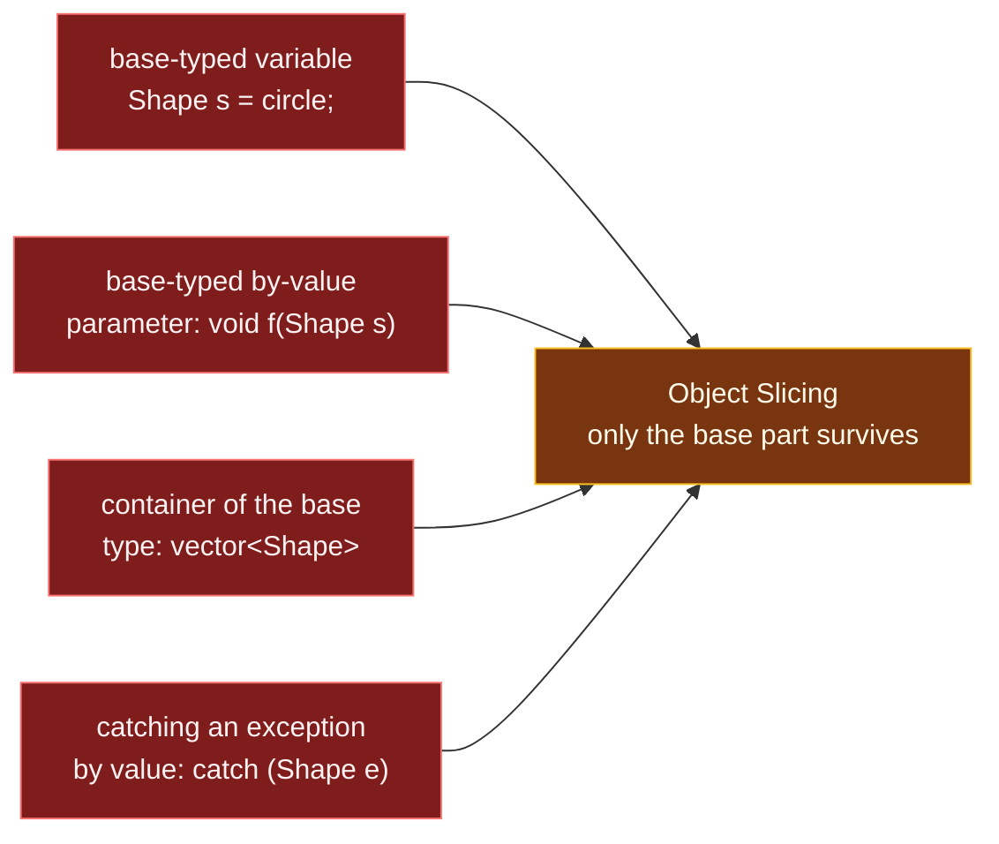

# Object Slicing

> [!essence]
> **Slicing** happens when a derived object initializes, is assigned to, or is passed by value into storage typed as its base class. The base class's own copy (or move) constructor runs — it is not virtual, and it knows only about the base's members — so only the base part comes along. Unlike a dangling pointer, this is not undefined behavior: the code compiles, runs, and does exactly what the language promises. It just is not what a programmer thinking in terms of the derived object expected.

## Symptom

Slicing bugs look nothing like memory-safety bugs, and that is what makes them easy to miss:

- A virtual call that "should" reach the derived override runs the base version instead — **every single time**, not intermittently. There is no timing dependence, no build-configuration dependence, nothing a sanitizer would flag.
- The program never crashes and no tool reports corruption, because nothing is corrupted. A perfectly valid `Shape` object sits where the programmer pictured a `Circle`.
- It arrives through ordinary-looking syntax: `Shape s = circle;`, a function parameter `void f(Shape s)`, a `std::vector<Shape>`, or `catch (Shape e)`. All four compile without a single warning from `-Wall -Wextra` on this vault's toolchain (GCC 11, verified below).
- It survives code review for the same reason: nothing about the *syntax* is wrong. The derived-to-base conversion this exploits is exactly the conversion that makes public inheritance useful in the first place ([[Inheritance]]).

## Root Cause

> [!principle] Constraint → Consequence → Requirement → Design → Price
> 1. **Constraint:** Overload resolution for a copy or move operation is decided at compile time from the *static* type of the source expression, never the dynamic type. A variable's storage is also fixed in size by its *declared* type: a `Shape`-typed slot is always exactly `sizeof(Shape)` bytes, whatever object initialized it.
> 2. **Consequence:** When a `Circle` initializes or is assigned to something declared `Shape`, the derived-to-base standard conversion binds the argument to `Shape::Shape(const Shape&)` — the only candidate a `Shape`-typed target can call. That constructor was written for `Shape`; it has never heard of `Circle::r`, and there is no room for it in a `Shape`-sized object regardless.
> 3. **Requirement:** Preserving dynamic type across the operation would require the target's storage to grow to fit whatever concrete type shows up — impossible for a named variable, a by-value parameter, or a fixed-size element slot in a `std::vector`.
> 4. **Design:** C++ resolves the conflict by making the conversion legal and silent: it builds a genuine, self-sufficient `Shape`, using `Shape`'s own constructor, which — like every constructor — stamps *its own* class's vptr into the object it is building ([[Virtual Dispatch — vptr and vtable]]). The result is not a damaged `Circle`; it is a perfectly ordinary `Shape` that happens to have been built from a `Circle`'s base part.
> 5. **Price:** There is no separate syntax for "slice down on purpose" versus "slice down by accident" — both are spelled identically. The only way to keep an object's dynamic type across an assignment-like operation is to never copy the object itself: keep it behind a pointer or reference, which carry an address rather than a fixed-size value ([[Pointers vs References]]).

```text
 Circle c{2.0}  (sizeof = 16)          Shape s = c;   (sizeof = 8)
┌───────────────────────────┐        ┌───────────────────────────┐
│ vptr ● → vtable(Circle)    │        │ vptr ● → vtable(Shape)     │
│ r    = 2.0                 │        │  (no slot for r: Shape     │
└───────────────────────────┘        │   never had one)           │
                                      └───────────────────────────┘
        c is untouched                s.area() runs Shape's own version:
                                       its vptr never pointed at Circle's table
```

Four doors lead to the same failure, and none of them raise a diagnostic by default:



## Minimal Reproduction

**1 · Direct assignment** — the naive expectation is that a virtual call still finds `Circle::area()`; it does not.

```cpp
#include <iostream>

struct Shape {
    virtual ~Shape() = default;
    virtual double area() const { return 0.0; }   // ① non-pure: Shape is concrete, so it can be sliced into
};
struct Circle : Shape {
    double r;
    explicit Circle(double r) : r{r} {}
    double area() const override { return 3.14159 * r * r; }
};

int main() {
    Circle c{2.0};
    Shape s = c;                     // ② copy-initializes a Shape from a Circle argument
    std::cout << s.area() << '\n';   // ③ naive guess: 12.5664 (virtual, so surely Circle::area?)
    std::cout << c.area() << '\n';   // ④ c itself is never touched
}
// expect: 0
// expect: 12.5664
```
1. `Shape::area()` needs a body precisely so `Shape` itself is instantiable — an abstract `Shape` would turn line ② into a compile error instead (see *Prevention Rules*).
2. `Shape`'s copy constructor runs, not `Circle`'s: it builds a real `Shape`, stamped with `Shape`'s own vptr.
3. Even though `area()` is `virtual`, `s`'s *dynamic* type is `Shape` — dispatch was never in question, because there is no `Circle` here to dispatch to.
4. `s` and `c` are two independent objects; slicing damages nothing about the source.

**2 · A container of the base type** (the classic form, `Primer` §15.8 and `Tour` §12.2)

```cpp
#include <iostream>
#include <vector>

struct Shape {
    virtual ~Shape() = default;
    virtual double area() const { return 0.0; }
};
struct Circle : Shape {
    double r;
    explicit Circle(double r) : r{r} {}
    double area() const override { return 3.14159 * r * r; }
};

int main() {
    std::vector<Shape> shapes;            // ① element type is Shape: every slot is Shape-sized
    shapes.push_back(Circle{2.0});        // ② push_back copy-constructs a Shape element from the Circle
    shapes.push_back(Circle{3.0});
    double total = 0.0;
    for (const auto& s : shapes) total += s.area();   // ③ naive guess: 12.566 + 28.274
    std::cout << total << '\n';
    std::cout << sizeof(Shape) << ' ' << sizeof(Circle) << '\n';   // ④
}
// expect: 0
// expect: 8 16
```
1. `std::vector<Shape>` cannot hold a `Circle`: there is no room for `Circle::r` in a `Shape`-sized element, so it never tries to.
2. Each `push_back` runs the same derived-to-base conversion as example 1, once per element.
3. Both elements are genuine `Shape` objects; the total is `0`, not the sum of two circle areas.
4. `sizeof(Circle)` is 16 on this toolchain (GCC 13.2, x86-64 Linux, LP64): one vptr (8 bytes) plus one `double` (8 bytes). `sizeof(Shape)` is 8: the vptr alone. Layout is implementation-specific ([[Trivial, Standard-Layout and Aggregate Types]]).

## Detection

| Tool | Catches it? | How |
|---|---|---|
| **Compiler warnings** (`-Wall -Wextra`) | ✗ mostly no | GCC 11 (observed, this vault's toolchain) emits nothing for either example above: the derived-to-base conversion is ordinary, well-formed code. The one exception is `-Wcatch-value` (GCC 8+, part of `-Wextra`), which does warn on `catch (Shape e)` specifically — reported behavior, not exercised here. |
| **clang-tidy** | ~ yes, statically | `cppcoreguidelines-slicing` flags assignments and initializations from a more-derived type to a less-derived one. Not installed on this vault's toolchain, so this is reported from the check's own documentation, not observed. |
| **AddressSanitizer / UBSan** | ✗ no | Neither models this. No memory is read out of bounds, no object's lifetime rule is broken, and nothing here is undefined behavior — a sanitizer has nothing to instrument. |
| **Code review heuristic** | ✓ if asked | For every base-typed variable, parameter, return type, container element or catch clause built from a class with virtual functions: *"should this be a pointer or a reference instead?"* |

## Fix

The fix is always **stop copying the object by value**: keep it behind a pointer or reference so the object itself never moves, and — if a genuine polymorphic *copy* is needed — make that copy an explicit, virtual operation instead of an implicit one.

**✗ A base-typed variable silently drops the derived part:**

```cpp
#include <iostream>

struct Shape {
    virtual ~Shape() = default;
    virtual double area() const { return 0.0; }
};
struct Circle : Shape {
    double r;
    explicit Circle(double r) : r{r} {}
    double area() const override { return 3.14159 * r * r; }
};

int main() {
    Circle c{2.0};
    Shape s = c;                    // silently builds a plain Shape
    std::cout << s.area() << '\n';
}
// expect: 0
```

**✓ Own it through a pointer; make a real copy only through a virtual `clone`:**

```cpp
#include <iostream>
#include <memory>
#include <vector>

struct Shape {
    Shape() = default;
    Shape& operator=(const Shape&) = delete;
    virtual ~Shape() = default;
    virtual double area() const = 0;
    virtual std::unique_ptr<Shape> clone() const = 0;
protected:
    Shape(const Shape&) = default;                 // ① copyable by derived classes, not by outsiders
};
struct Circle : Shape {
    double r;
    explicit Circle(double r) : r{r} {}
    Circle(const Circle&) = default;                // ② reuses Shape's protected copy constructor
    double area() const override { return 3.14159 * r * r; }
    std::unique_ptr<Shape> clone() const override { return std::make_unique<Circle>(*this); }
};

int main() {
    std::vector<std::unique_ptr<Shape>> shapes;     // ③ the container holds addresses, not Shape-sized slots
    shapes.push_back(std::make_unique<Circle>(2.0));
    shapes.push_back(std::make_unique<Circle>(3.0));
    double total = 0.0;
    for (const auto& s : shapes) total += s->area();   // ④ each -> reaches the real Circle::area
    std::cout << total << '\n';

    auto copy = shapes[0]->clone();                 // ⑤ a deliberate, complete polymorphic copy
    std::cout << copy->area() << '\n';
}
// expect: 40.8407
// expect: 12.5664
```
1. A `protected` copy constructor is callable by `Circle`'s own copy constructor but not by code that only has a `Shape&` or a `Shape` variable to write — that closes the door example 1 walked through (Core Guidelines C.67).
2. `Circle`'s own copy constructor must be re-enabled explicitly; it delegates to `Shape`'s protected one for the base part.
3. Pointers (here, owning `unique_ptr`s) carry an address, and an address is the same size no matter what it points to — there is never a "not enough room" problem.
4. Dynamic dispatch works exactly as intended: each element really is whatever `Circle`, `Square`, or future shape it was constructed as.
5. `clone()` is the deliberate, virtual answer to "I want a real copy of whatever this actually is" — the operation the implicit copy constructor cannot give a polymorphic type.

## Prevention Rules

> [!rule] Access polymorphic objects only through a pointer or reference (Core Guidelines C.145)
> Never declare a variable, parameter, return type, or container element type as a plain base class that has virtual functions. Use `Base&`, `Base*`, or an owning smart pointer.

> [!rule] Make a polymorphic base suppress copying, and offer `clone()` instead (Core Guidelines C.67)
> Delete the base's public copy assignment and make its copy constructor `protected`; each derived class re-enables its own copy constructor and implements a virtual `clone()`. This turns the mistake in example 1 into a compile error instead of a silent bug:
> ```cpp
> // cc: ill-formed
> struct Shape {
>     Shape() = default;
>     virtual ~Shape() = default;
>     virtual double area() const { return 0.0; }
> protected:
>     Shape(const Shape&) = default;
> };
> struct Circle : Shape {
>     double r;
>     explicit Circle(double r) : r{r} {}
>     double area() const override { return 3.14159 * r * r; }
> };
> int main() {
>     Circle c{2.0};
>     Shape s = c;   // error: Shape::Shape(const Shape&) is protected here
> }
> ```

> [!rule] Don't slice (Core Guidelines ES.63)
> The rule applies to implicit slicing too: a value returned from a function, or a value passed to another function, slices exactly as visibly as a direct assignment does. Prefer designs (references, pointers, `clone()`, `std::variant`) where the question "which type is this really?" cannot silently change answer.

## Connections

- **Root concept:** [[Inheritance]] (the derived-to-base conversion this pitfall exploits, from the note that names it as the value/identity tension) · [[Virtual Functions]] · [[Virtual Dispatch — vptr and vtable]] (why the copy's vptr is `Shape`'s, not `Circle`'s).
- **Same tension, different door:** [[Virtual Destructors]] (the destruction-time counterpart: a static/dynamic mismatch striking through `delete` instead of copy) · [[Exceptions]] (catching by value slices a thrown object exactly the same way).
- **Structural cures:** [[Pointers vs References]] (both preserve dynamic type; only a by-value copy loses it) · [[Copy Semantics — Deep vs Shallow Copy]] (what a copy constructor is and is not obligated to do).
- **Where it bites in the standard library:** [[vector]] (a base-typed vector has no spare bytes for whatever a derived type adds).
- **Domain:** [[Map — Inheritance & Polymorphism]].
- **Practice:** *Continuum #18 Shape Hierarchy & Polymorphic Area Calculator* — reproduce the sliced total, then fix it with owning pointers and a `clone()` method.

## Check Yourself

> [!quiz]- Why is `Shape s = circle;` not undefined behavior, when a dangling reference is?
> Slicing builds a genuine, complete, valid `Shape` object using `Shape`'s own constructor — every byte of `s` is legitimately initialized and every rule in `[basic.life]` is satisfied. Nothing about the operation is forbidden by the abstract machine; it simply discards information the programmer wanted kept. A dangling reference, by contrast, reads or writes an object whose lifetime has already ended, which the Standard leaves completely unspecified.

> [!quiz]- `void report(Shape s)` is called with a `Circle` argument. Does making `Shape::area()` pure virtual (`= 0`) change what happens at the call site?
> Yes — it changes it from a silent bug into a compile error. `Shape` becomes abstract, and a by-value parameter of an abstract type cannot exist, because building it would require instantiating `Shape` directly. The call site never gets the chance to slice.

> [!quiz]- A colleague "fixes" slicing by changing `std::vector<Shape> shapes` to `std::vector<Shape&> shapes`. Why doesn't this compile, and what's the idiomatic replacement?
> Standard containers require an *Erasable* element type — one they can construct, destroy, and reassign in place — and references cannot be reassigned to refer elsewhere, so no standard container can hold them directly. Use `std::vector<std::reference_wrapper<Shape>>` for non-owning access, or, far more often, `std::vector<std::unique_ptr<Shape>>` when the container should also own the objects.

## Sources

- Primer §15.2.3 "No Automatic Conversion between Objects" (p. 603): the `Quote`/`Bulk_quote` example this note's `Shape`/`Circle` mirrors, and the term "sliced down" (also *Defined Terms*, p. 650).
- Primer §15.8 "Containers and Inheritance" (pp. 630, 633): why a `vector<Base>` cannot hold a `Derived` politely, and "Simulating Virtual Copy" — the `clone()` idiom in its original C++11 form.
- PPP §18.5 "Resource-management pointers": introduces the term *slicing* directly against a `Shape`/`Circle` example, and shows why `vector<Shape> = vector<Circle>` is instead a compile error.
- Tour §12.2 "vector" (p. 160): warns against `vector<Shape>` by name, for exactly this reason — a `Shape`-sized element has nowhere to put a derived type's extra data.
- cppreference, *Derived classes*, §Derived-to-base conversion: https://en.cppreference.com/w/cpp/language/derived_class
- C++ Core Guidelines C.145 "Access polymorphic objects through pointers and references", C.67 "A polymorphic class should suppress copying", ES.63 "Don't slice": https://isocpp.github.io/CppCoreGuidelines/CppCoreGuidelines
- clang-tidy, `cppcoreguidelines-slicing`: https://clang.llvm.org/extra/clang-tidy/checks/cppcoreguidelines/slicing.html
