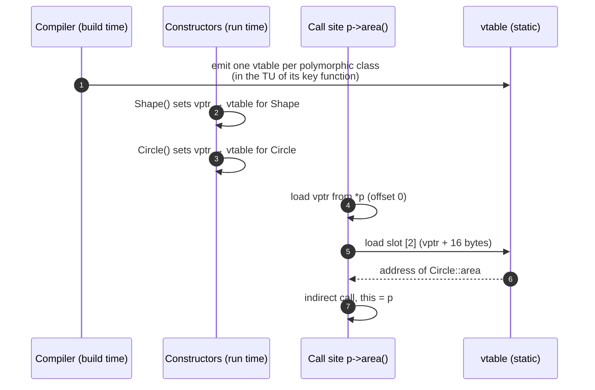

# Virtual Dispatch — vptr and vtable

> [!essence]
> A virtual call picks its target at **run time** from the object's *dynamic* type. Every mainstream compiler does it the same way. Each polymorphic class gets one static table of function pointers (the **vtable**), and each object carries a hidden pointer to its class's table (the **vptr**). A call becomes: load the vptr, load a slot, jump there. That is two loads and an indirect branch.

## The Problem

A function like `double total_area(const std::vector<Shape*>&)` is compiled **once**, before anyone writes `Hexagon`. Yet every call to `area()` inside it must reach the right override for whatever object actually arrives.

> [!principle] Constraint → Consequence → Design
> 1. **Constraint:** At the call site the compiler knows only the *static* type (`Shape&`). The *dynamic* type is decided at run time and may belong to a class compiled later, in another library.
> 2. **Consequence:** The call target can't be a fixed address baked into the instruction stream. Something reachable **from the object itself** must identify the right code.
> 3. **Requirement:** Given any object whose static type is `Shape`, find `area()` for its dynamic type in constant time, with no search, no string lookup and no knowledge of the full class hierarchy.
> 4. **Design:** Give every polymorphic class a table with one slot per virtual function, laid out **identically for the base and all derived classes** (slot *k* always means the same function), and store a pointer to that table in each object. Now a call is *object → table → slot k*: constant time, and it works for classes that don't exist yet.
> 5. **Price:** A pointer per object (8 bytes on 64-bit targets), a table per class, an indirect branch per call, and usually the loss of inlining, which is the bigger cost.

> [!tension] compile time ⟷ run time
> Virtual dispatch is C++'s *run-time* answer to "one code path, many types". Templates are its *compile-time* answer. The vtable is the price of deciding late. See [[Static vs Dynamic Polymorphism]].

The Standard specifies only the *behavior* of virtual functions (`[class.virtual]`), not vtables. But GCC and Clang (following the Itanium C++ ABI) and MSVC all use this design. The details below are Itanium ABI on x86-64 and were checked with GCC 13.

## Mental Model

```text
  OBJECTS (anywhere)                 VTABLES (static storage, one per class)
 ┌──────────────────────┐          ┌─────────────────────────────────────┐
 │ Circle c1            │          │ vtable for Circle                   │
 │  vptr ●──────────────┼──┐       │  -16  offset-to-top = 0             │
 │  r = 1.0             │  │       │   -8  &typeinfo for Circle  (RTTI)  │
 └──────────────────────┘  ├─────▶ │ [0]  Circle::~Circle  (complete)    │
 ┌──────────────────────┐  │       │ [1]  Circle::~Circle  (deleting)    │
 │ Circle c2            │  │       │ [2]  Circle::area                   │
 │  vptr ●──────────────┼──┘       └─────────────────────────────────────┘
 │  r = 2.5             │          ┌─────────────────────────────────────┐
 └──────────────────────┘          │ vtable for Square                   │
 ┌──────────────────────┐          │ [0]  Square::~Square  (complete)    │
 │ Square s             │   ┌────▶ │ [1]  Square::~Square  (deleting)    │
 │  vptr ●──────────────┼───┘      │ [2]  Square::area                   │
 │  side = 3.0          │          └─────────────────────────────────────┘
 └──────────────────────┘
     slot [2] means "area" in EVERY table derived from Shape
```

> [!model] A restaurant menu with fixed numbering
> Every restaurant in a chain prints its menu with the same numbering: dish #2 is always "the main course", though each branch cooks it differently. A customer (the call site) who wants the main course asks for "#2" without knowing which branch they are in. The vptr is the menu on the table; the vtable is the branch's kitchen list.
> **Where it breaks:** the "branch" can change during a meal. While an object is being constructed or destroyed, its vptr points at the *base* class's table (Step 2).

## Step by Step



1. **Build the tables (compile time).** For each class with at least one virtual function, the compiler lays out a vtable. It copies the base's slots, **replaces** the slots of overridden functions, and **appends** slots for new virtual functions. The Itanium ABI puts two header fields *before* the address the vptr points to: *offset-to-top* (used for multiple inheritance) and the *typeinfo* pointer (used by `typeid` and `dynamic_cast`). A virtual destructor takes **two** slots: one destroys, the other destroys and then calls `operator delete`.
2. **Stamp the objects (construction).** Each constructor, *after* its base subobjects are built and *before* its own body runs, stores its own class's vtable address into the vptr. A `Circle` is briefly a `Shape` (vptr → Shape's table) and then becomes a `Circle`. Destruction reverses this: each destructor resets the vptr to its own class's table before running its body. That is why virtual calls in constructors and destructors don't reach derived overrides ([[Virtual Calls in Constructors and Destructors]]).
3. **Dispatch (each call).** `p->area()` compiles to: read the vptr at offset 0 of `*p`; read the function pointer in slot 2; call it with `p` as `this`.
4. **Adjust `this` (multiple inheritance only).** If the override lives in a class whose `Shape` subobject is not at offset 0, the slot points to a small **thunk** that adjusts `this` before jumping to the real function. See [[Multiple and Virtual Inheritance]].

## Under the Hood

> [!machine] The whole call is two instructions (GCC 13, `-O2`, x86-64, only `Shape` visible)
> ```nasm
> measure(Shape const&):              ; double measure(const Shape& s) { return s.area(); }
>         mov  rax, QWORD PTR [rdi]    ; ① rax = s.vptr (first 8 bytes of the object)
>         jmp  [QWORD PTR [rax+16]]    ; ② tail-call slot 2: skip the two destructor slots
> ```
> Slot 2 sits at byte offset 16 because the virtual destructor occupies slots 0 and 1.

The compiler's own class dump (`g++ -fdump-lang-class`) confirms the layout drawn above. `sizeof(Shape)` is **8** (the vptr alone). `sizeof(Circle)` is **16** (vptr + one `double`). The vptr points to *vtable + 16*, just past the two header fields:

```text
Vtable for Circle            (_ZTV6Circle: 5 entries)
  0   offset-to-top = 0
  8   &typeinfo for Circle
 16   Circle::~Circle   ◀── vptr points here
 24   Circle::~Circle   (deleting)
 32   Circle::area
```

**Devirtualization.** If the compiler can *prove* the dynamic type, it calls the function directly and can inline it. Proof comes from a `final` class, a local object of known type, or whole-program analysis. When GCC can see a likely target, it also *speculates*: it compares the loaded slot with `&Circle::area`, runs an inlined copy on a match, and makes the indirect jump otherwise. Declaring a class `final` lets `c.area()` on a `const Circle&` compile to straight-line arithmetic with no loads from the vtable at all.

**Performance reality.** The indirect branch is cheap when it is **predictable**, as when one call site keeps seeing the same dynamic type. It gets expensive in a loop over a mixed bag of types that the [[Branch Prediction|branch predictor]] can't learn. The larger, hidden cost is usually **lost inlining**: the optimizer can't see through the call to vectorize or fold constants. Measure before blaming virtual calls ([[Performance — Measure, Don't Guess]]).

## In Code

**1 · Dynamic type decides; the vptr costs one pointer**

```cpp
#include <iostream>
#include <memory>
#include <vector>

struct Shape {
    virtual ~Shape() = default;
    virtual double area() const = 0;
    virtual const char* name() const { return "shape"; }      // ① default, overridable
};
struct Circle final : Shape {
    double r;
    explicit Circle(double r) : r{r} {}
    double area() const override { return 3.14159 * r * r; }
    const char* name() const override { return "circle"; }
};
struct Square final : Shape {
    double side;
    explicit Square(double s) : side{s} {}
    double area() const override { return side * side; }     // ② name() inherited
};

int main() {
    std::vector<std::unique_ptr<Shape>> shapes;
    shapes.push_back(std::make_unique<Circle>(1.0));
    shapes.push_back(std::make_unique<Square>(2.0));
    for (const auto& s : shapes)                               // ③ static type: Shape
        std::cout << s->name() << ' ' << s->area() << '\n';
    std::cout << sizeof(Shape) << ' ' << sizeof(Square) << '\n';   // ④
}
// expect: circle 3.14159
// expect: shape 4
```
1. A non-pure virtual function supplies the vtable's default slot contents.
2. `Square` doesn't override `name()`, so its vtable's `name` slot holds `Shape::name`.
3. Each call goes through the object's own vptr: one loop, two behaviors.
4. On a typical 64-bit target this prints `8 16`: the vptr, plus the vptr and a `double`. Layout is implementation-specific, so no test depends on it.

**2 · Watching the vptr change during construction**

```cpp
#include <iostream>

struct Base {
    Base()          { hello(); }                   // ① vptr → Base's vtable here
    virtual ~Base() { hello(); }                   // ③ vptr reset to Base's vtable
    virtual void hello() const { std::cout << "Base\n"; }
};
struct Derived : Base {
    Derived()  { hello(); }                        // ② vptr → Derived's vtable now
    ~Derived() override { hello(); }
    void hello() const override { std::cout << "Derived\n"; }
};

int main() {
    Derived d;
}   // prints: Base, Derived, Derived, Base
// expect: Base
// expect: Derived
```
1. While `Base()` runs, the object *is* a `Base`: its derived part doesn't exist yet, so dispatch reaches `Base::hello`.
2. `Derived()` stamps its own vtable before its body runs.
3. Destruction runs in reverse. By the time `~Base()` runs, the `Derived` part is gone, and the vptr says so.

**3 · `final` removes the indirection**

```cpp
struct Shape {
    virtual ~Shape() = default;
    virtual double area() const = 0;
};
struct Circle final : Shape {                      // ① no class can derive from Circle
    double r = 1.0;
    double area() const override { return 3.14159 * r * r; }
};

double via_base(const Shape& s)    { return s.area(); }   // ② indirect: load vptr, load slot, jump
double via_final(const Circle& c)  { return c.area(); }   // ③ direct and inlined: no vtable access
```
1. `final` promises the dynamic type of any `Circle&` is exactly `Circle`.
2. Compiles to the two-instruction sequence shown in *Under the Hood*.
3. GCC -O2 emits only the multiply instructions of `Circle::area`, inlined.

## Consequences

The mechanism explains a whole family of C++ rules and failures:

| Observed rule or failure | Explained by |
|---|---|
| Virtual calls in constructors/destructors don't reach overrides | The vptr is re-stamped per construction stage: [[Virtual Calls in Constructors and Destructors]] |
| `delete base_ptr` needs a **virtual destructor** | Only a virtual destructor puts the *deleting* destructor in a vtable slot: [[Virtual Destructors]] |
| Copying a `Derived` into a `Base` value loses the behavior | The `Base` copy constructor stamps *Base's* vptr: [[Object Slicing]] |
| Linker error *"undefined reference to vtable for X"* | The vtable is emitted in the TU defining the class's **key function** (first non-inline, non-pure virtual). If that function has no definition, no TU emits the table: [[What the Linker Does]] |
| `dynamic_cast` and `typeid` work only on polymorphic types | They read the typeinfo pointer stored in the vtable header: [[RTTI and dynamic_cast]] |
| Polymorphic objects are not "trivially copyable" and not C-layout-compatible | The hidden vptr member: [[Trivial, Standard-Layout and Aggregate Types]] |
| Templates beat virtual calls in hot inner loops | Direct calls can be inlined and vectorized: [[Static vs Dynamic Polymorphism]] |

## Connections

- **Prerequisites:** [[Virtual Functions]] (the behavior) · [[Inheritance]] · [[Pointers]].
- **Explains:** [[Virtual Destructors]] · [[Object Slicing]] · [[Virtual Calls in Constructors and Destructors]] · [[RTTI and dynamic_cast]].
- **Access path:** [[Pointers vs References]] — this mechanism fires identically through a `Base&` and a `Base*` bound to the same object; only a by-value copy loses the dynamic type.
- **Extends to:** [[Multiple and Virtual Inheritance]] (thunks, several vptrs) · [[Type Erasure]] (hand-built vtables).
- **Alternatives:** [[Static vs Dynamic Polymorphism]] · [[variant and visit]] · [[CRTP]].
- **Machine level:** [[Branch Prediction]] · [[What Optimizers Do]].
- **Domain:** [[Map — Inheritance & Polymorphism]].
- **Practice:** *Continuum #18 Shape Hierarchy* (print `sizeof` of your shapes and explain each byte) · *#21 Game Entity System* (multiple inheritance: find the thunks with `-fdump-lang-class`).

## Check Yourself

> [!quiz]- Why is the vptr stored *in the object*, when the vtable is shared by the whole class?
> The call site knows only the static type. The one thing guaranteed to travel with the object is the object itself, so the object must say which table applies. One pointer per object is the minimum that lets code compiled today dispatch to classes written tomorrow.

> [!quiz]- A class declares `virtual void draw();` but no one ever defines `draw`, and no code calls it. The program still fails to link with "undefined reference to vtable for Widget". Why?
> `draw` is the key function: the first non-inline, non-pure virtual function. Under the Itanium ABI the vtable is emitted only in the translation unit that defines the key function. With no definition, no TU emits the vtable, yet every constructor references it to stamp the vptr.

> [!quiz]- Predict: in example 2, which lines print if `Derived d;` is replaced with `Base* p = new Derived; delete p;`?
> The same four lines: `Base`, `Derived`, `Derived`, `Base`. `~Base` is virtual, so `delete p` reaches `~Derived` through the vtable's deleting-destructor slot, which then chains to `~Base`. Without `virtual` on `~Base`, the behavior would be undefined.

## Sources

- Primer §15.3 "Virtual Functions" (p. 603): dynamic binding rules, `override`/`final`, calls during construction.
- Tour §5.4 "Virtual Functions" (pp. 62–63): the vtbl picture and the cost argument from the language's designer.
- Pikus ch. 10 "Compiler Optimizations in C++", § Function inlining (pp. 352–357): why virtual calls block inlining, and when compilers devirtualize.
- Itanium C++ ABI §2.5 "Virtual Table Layout": https://itanium-cxx-abi.github.io/cxx-abi/abi.html#vtable
- cppreference, *virtual function specifier*: https://en.cppreference.com/w/cpp/language/virtual
- Draft standard `[class.virtual]`, `[class.cdtor]` (virtual calls during construction): https://eel.is/c++draft/class.virtual · https://eel.is/c++draft/class.cdtor
