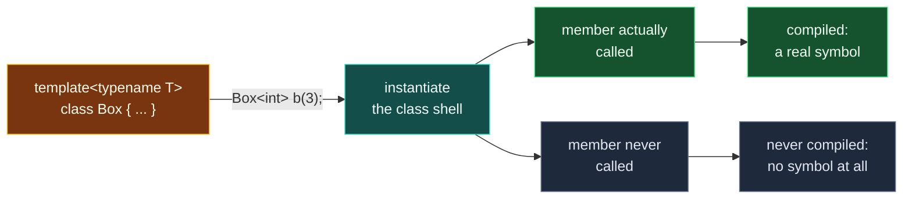

# Class Templates

> [!essence]
> A class template is a family of classes, substituted and compiled the same way a function template is — but with no call to read the type off. Every use must name the type argument directly, and once a class is instantiated, each of its members is instantiated separately, only the first time that particular member is actually used.

## The Problem

[[Templates — Code That Writes Code|A template]] needs a concrete argument before the compiler can check its body. For a function template, [[Function Templates|argument deduction]] gets that argument for free: a call already supplies arguments, and those arguments already have types, so `compare(3, 7)` tells the compiler `T = int` just by being written. A class template is used in places that carry no such evidence. `Box<int> b;` default-constructs with no arguments at all. `typename Box<int>::value_type` names a nested type and calls nothing. A function parameter `const Box<int>&` is a type, not an expression. Even where a constructor call does exist, it might not mention the parameter — a `Box` built from an allocator alone says nothing about the element type.

> [!principle] Constraint → Consequence → Requirement → Design → Price
> 1. **Constraint.** Deduction works by matching a call's argument types against a function's declared parameter types. A class name used in a declaration, a nested-type lookup, or a parameter list is not a call, and even the one class-template use that *is* a call — a constructor invocation — need not mention every template parameter.
> 2. **Consequence.** The trick that lets a function template stay silent about `T` has nothing reliable to read in most of the places a class template appears, and is unreliable even in the one place it could try.
> 3. **Requirement.** The template argument has to be carried by the *name* of the type itself, available wherever that name appears, independent of whether a call happens to be present.
> 4. **Design.** Every use of a class template supplies its arguments explicitly, in angle brackets: `Box<int>`. Because this is a property of the name, it works identically in a variable declaration, a nested-type lookup, a function parameter, or no expression at all.
> 5. **Price.** The type is spelled out every time, even when a constructor's own arguments would make it obvious to a human reader. (C++17 narrows, but does not remove, this price — see *Pitfalls*.)

> [!tension] abstraction ⟷ control
> Deduction let a function-template call read exactly like an ordinary call — the abstraction of never writing `<T>`. A class template cannot offer that by default: the places it is used don't reliably carry the evidence deduction needs. The reader keeps direct control of which specialization is meant, at the cost of writing it down every time.

## Mental Model



> [!model] A blueprint with one blank measurement, and where it breaks
> A class template is a cabinetmaker's blueprint with one dimension left blank — say, shelf depth. A function template's blank can usually be read straight off the customer's order; a class template's blank has nothing to read from most of the time, so the customer writes the number on the blueprint before the shop builds anything (`Box<int>`). Once the number is filled in, the shop still doesn't cut every part the sheet shows — only the piece this order actually asks for. A drawer pull nobody ordered stays uncut, even if the wood on hand couldn't have been cut into that shape at all.
> **Where it breaks:** a blueprint is read once. A class template is re-read, separately, the moment *any* order needs an uncut part — so "uncut" is temporary, not a permanent decision made back when the blank was first filled in.

## Mechanics

| Situation | Rule | Example |
|---|---|---|
| Every use of the class name | Template arguments are given explicitly in `<>` — nothing is deduced from a declaration alone | `Box<int> b;` |
| Inside the template's own scope | The bare template name, with no `<>`, refers to the current instantiation | Inside `Box`, a return type written `Box&` means `Box<T>&` |
| Defining a member outside the class body | Repeat the template parameter list, then qualify with `ClassName<T>::` | `template <typename T> const T& Box<T>::get() const { ... }` |
| Implicit instantiation of the class | Triggered only when a *complete* type is needed — constructing an object, calling a member, taking `sizeof` — not by a pointer or reference declaration alone | `Box<Incomplete>* p;` instantiates nothing |
| Implicit instantiation of a member | A separate event per member, happening only when that specific member is actually used | `peek()` instantiated; an unused `announce()` never is |
| `static` data member | One instance per class-template instantiation, defined once per `T` outside the class, exactly like an out-of-class member function | `template <typename T> int Counted<T>::count = 0;` |
| Default template argument | Allowed for class templates from C++98; function templates had to wait for C++11 | `template <typename T, typename Alloc = std::allocator<T>> class Vec;` |
| Supplying the argument from a constructor call (C++17) | [[Class Template Argument Deduction|CTAD]] reads the call the way a function template's deduction always could — only where a constructor call exists | `std::pair p{1, 2.0};` needs no `<int, double>` |

> [!standard] Implicit instantiation is member-by-member, and happens only when needed
> `[temp.inst]` ¶2–3: a class template specialization is implicitly instantiated "when the specialization is referenced in a context that requires a completely-defined object type," and doing so "causes the implicit instantiation of the **declarations**, but not of the **definitions**," of its non-deleted member functions, member classes and static data members. A member's own *definition* is instantiated only when that member is itself referenced in a way that needs it to exist. This is why a class template can declare a member whose body wouldn't compile for some `T`, as long as a program using `T` never calls that member.

## Under the Hood

> [!machine] An unused member leaves no trace in the object file
> Compiled with GCC 11.4 (Ubuntu 22.04), x86-64 Linux, `-O0 -std=c++20`: instantiating a `Crate<Gadget>` and calling only `peek()` (see *In Code*, example 2) produces exactly two symbols. `announce()`, never called, produces none — even though `Gadget` has no `operator<<` and `announce()`'s body would not compile for it:
> ```text
> $ nm crate.o | c++filt
> 0000000000000000 W Crate<Gadget>::Crate(Gadget)    ← used (constructed)
> 0000000000000000 W Crate<Gadget>::peek() const      ← used (called)
>                      Crate<Gadget>::announce() const  ← absent: never instantiated
> ```
> (GCC's Itanium ABI emits a constructor twice — complete-object and base-object variants — which is why two near-identical constructor symbols back one declaration; that detail has nothing to do with templates.) The compiler never attempted to check `announce()`'s body against `Gadget` at all. A type only has to satisfy the part of a class template's interface a program actually exercises — the mechanical basis for the usage-based, duck-typed interfaces the Standard Library's containers rely on throughout.

## In Code

**1 · Explicit arguments, and defining a member outside the class**

```cpp
#include <iostream>
#include <string>

template <typename T>
class Box {
public:
    explicit Box(T value) : value_(value) {}   // ①
    const T& get() const;
private:
    T value_;
};

template <typename T>                           // ②
const T& Box<T>::get() const { return value_; }

int main() {
    Box<int> price(42);                          // ③
    Box<std::string> label("hello");
    std::cout << price.get() << ' ' << label.get() << '\n';
}
// expect: 42 hello
```
1. Nothing about the constructor call tells the compiler which `Box` is meant until the declaration names one: `Box<int> price(42)` supplies `42` to a constructor that already knows, from the `<int>`, what type it takes.
2. Defining `get` outside the class repeats the template parameter list and qualifies the name with `Box<T>::` — the member is a function template in its own right, sharing the class's parameter.
3. `Box<int>` and `Box<std::string>` are two unrelated, separately compiled classes that happen to share a source definition, exactly as for a function template's two instantiations.

**2 · Implicit instantiation needs a complete type — a pointer doesn't ask for one**

```cpp
template <typename T>
class Box {
public:
    explicit Box(T value) : value_(value) {}
private:
    T value_;
};

class Incomplete;        // declared, never defined

int main() {
    Box<Incomplete>* p;  // ①
    (void)p;
}
```
1. A pointer to `Box<Incomplete>` needs only the *name* `Box<Incomplete>`, not its complete definition, so no instantiation happens — exactly as `Incomplete*` itself would need no definition of `Incomplete`. Nothing here checks whether `Box<Incomplete>` could even exist.

**3 · The compiler only instantiates a member that gets used**

```cpp
#include <iostream>

template <typename T>
class Crate {
public:
    explicit Crate(T value) : value_(value) {}
    const T& peek() const { return value_; }        // ①
    void announce() const { std::cout << value_ << '\n'; }  // ②
private:
    T value_;
};

struct Gadget { int id; };   // no operator<<

int main() {
    Crate<Gadget> c(Gadget{7});
    std::cout << c.peek().id << '\n';                // ③
}
// expect: 7
```
1. `peek()` never uses `operator<<`, so it compiles for `Gadget` without trouble.
2. `announce()` would not compile for `Gadget` — but nothing requires it to, because nothing in `main` calls it.
3. `Crate<Gadget>` and `peek()` are instantiated; `announce()` is not. A naive reading of "a class template with that member" would expect this program to fail to compile. It doesn't: see *Under the Hood* for the object-file evidence.

**4 · Each instantiation owns a separate `static` member**

```cpp
#include <iostream>

template <typename T>
class Counted {
public:
    Counted() { ++count; }
    static int count;
};
template <typename T> int Counted<T>::count = 0;   // ①

int main() {
    Counted<int> a, b;
    Counted<double> c;
    std::cout << Counted<int>::count << ' ' << Counted<double>::count << '\n';  // ②
}
// expect: 2 1
```
1. A `static` data member of a class template is defined once per `T`, outside the class, the same way an out-of-class member function is.
2. `Counted<int>::count` and `Counted<double>::count` are two independent `int`s: constructing two `Counted<int>` objects never touches `Counted<double>::count`. They do not share storage, because `Counted<int>` and `Counted<double>` are unrelated classes that only happen to share a source template.

## Pitfalls

> [!trap] Forgetting the template parameter list outside the class
> Writing `const int& Box::get() const { ... }` instead of `template <typename T> const T& Box<T>::get() const { ... }` is a plain, common slip. GCC 11.4 reports it as `error: 'template<class T> class Box' used without template arguments` — a name-lookup error, not a hint about the missing `template <typename T>` prefix. The fix is always the same: repeat the class's own parameter list, then qualify with `Box<T>::`.

> [!trap] A member can compile for `T` right up until you call it
> Extending example 3: `c.announce();` for `Crate<Gadget>` fails only once it is actually written, with GCC 11.4 reporting the error *inside* `announce()`'s body — `no match for 'operator<<'` — not at the class's declaration. A class template with a member that happens not to work for some `T` is not itself ill-formed; it becomes ill-formed only at the call that forces that member to be instantiated. See [[Concepts and Constraints]] for moving this category of failure earlier, to the declaration.

```cpp
// cc: ill-formed
template <typename T>
class Crate {
public:
    explicit Crate(T value) : value_(value) {}
    void announce() const { std::cout << value_ << '\n'; }
private:
    T value_;
};

struct Gadget { int id; };

int main() {
    Crate<Gadget> c(Gadget{7});
    c.announce();   // error, and only here: no operator<< for Gadget
}
```

> [!trap] CTAD narrows the explicit-argument requirement; it doesn't remove it
> Since C++17, `std::pair p{1, 2.0};` needs no `<int, double>`, because [[Class Template Argument Deduction|CTAD]] reads the constructor call. CTAD only fires where a constructor call exists to read: a default-constructed `Box<int> b;`, a function parameter type, or a nested-type lookup still need the argument written by hand, same as before C++17. *The Problem*'s derivation covers the general case; CTAD is a narrow, later exception for the one position — a constructor call — where deduction turned out to be possible after all.

## Evolution

| Standard | Change | Why |
|---|---|---|
| C++98 | Class templates; default template arguments already allowed | A class routinely has several constructors, or none that mention every parameter, so a fallback for the un-deducible case was needed from the start — before function templates got the same allowance in C++11 |
| C++11 | `extern template class Box<int>;` (explicit instantiation declaration) | Suppresses the implicit instantiation that would otherwise happen again in every translation unit that uses `Box<int>`, cutting redundant compile work ([[Why Templates Live in Headers]]) |
| C++11 | `>>` closes two nested template-argument lists without a space | Earlier grammars lexed `>>` as the right-shift operator, forcing `Box<Box<int> >`; the parser now resolves it from context |
| C++17 | Class template argument deduction (CTAD) | Lets a constructor call supply the arguments a function-template call could always supply on its own — see [[Class Template Argument Deduction]] |

## Connections

- **Prerequisites:** [[Templates — Code That Writes Code]] (what a template is, and that instantiation happens at all — this note specializes that idea to a name used without a call to read arguments from, rather than to a function call).
- **Enables:** [[Template Instantiation]] (the complete mechanism; this note's member-by-member laziness is one instance of it) → [[Why Templates Live in Headers]] (the same header-visibility price, now paid per member) → [[Class Template Argument Deduction]] (C++17's narrow answer to this note's central cost).
- **Siblings:** [[Function Templates]] (the same substitution mechanism, applied where a call *does* supply arguments to deduce from) · [[Non-Type Template Parameters]] (a class-template parameter that is a value, not a type — `std::array<int, 4>`'s `4`) · [[Concepts and Constraints]] (constrains which `T` a class template will accept, moving a failure like example 3's to the declaration).
- **Domain:** [[Map — Generic Programming]].
- **Practice:** *Continuum #24 Generic Container Library*: [[Function Templates]] built the free functions a generic container needs; this is where the container's own class gets written, one member instantiated at a time as callers actually use it.

## Check Yourself

> [!quiz]- Why must every use of a class template name its arguments explicitly, when a function template can usually leave them to be deduced?
> Deduction reads types off a call's arguments. A class template is used in places that carry no call at all — a variable declaration, a nested-type lookup, a function parameter — and even its one call-like use, construction, might not mention every parameter. The argument has to be carried by the name itself instead, so it is written in `<>` at every use.

> [!quiz]- `Box<Incomplete>* p;` compiles even though `Incomplete` is never defined, but `Box<Incomplete> b;` doesn't. Why the difference?
> A pointer declaration needs only the name `Box<Incomplete>`, not a completely-defined type, so no instantiation happens — the same reason `Incomplete*` alone needs no definition of `Incomplete`. Declaring an actual `Box<Incomplete>` object needs a complete type, which forces instantiation, which needs `Incomplete`'s own definition to lay out the `T value_` member — and there isn't one.

> [!quiz]- Predict: does `Crate<Gadget>` from example 3 compile, given that `Gadget` has no `operator<<`? What if you add a call to `c.announce()`?
> It compiles as written: `announce()` is declared but never instantiated, because nothing calls it, and instantiation of a member happens only when that specific member is used. Adding `c.announce();` makes the program ill-formed — the error appears inside `announce()`'s body, at the point `operator<<` is applied to a `Gadget`.

> [!quiz]- Why does each instantiation of `Counted<T>` get its own `count`, instead of every `Counted<T>` object anywhere sharing one counter?
> `Counted<int>` and `Counted<double>` are unrelated classes that only happen to share a source template — the same fact that makes `Box<int>` and `Box<std::string>` unrelated. A `static` data member belongs to one class, so each instantiation gets its own instance, defined by its own copy of `template <typename T> int Counted<T>::count = 0;`.

## Sources

- Primer §16.1 "Defining a Template," "Instantiating a Class Template" (p. 660): a class template's uses are distinguished from a type by always carrying explicit arguments, and two instantiations are unrelated classes.
- Primer §16.1 "Member Functions of Class Templates" (p. 661) and "Instantiation of Class-Template Member Functions" (p. 663): a member function defined outside the class repeats the template parameter list, and is itself instantiated only if the program uses it.
- Primer §16.1 "static Members of Class Templates" (p. 667): each instantiation of a class template has its own instance of each `static` member, defined once per `T` outside the class.
- Primer §16.1 "Default Template Arguments" (p. 670): class templates could take default template arguments before function templates could (C++11 extended it to functions).
- Tour §7.2 "Parameterized Types" (p. 88): the canonical `Vector<T>` class template, declared and used with several different element types, including a nested one.
- PPP §18.1 "Templates" (ch. 18): a class template built up from a concrete `Vector` first, motivating the parameter before naming the mechanism.
- cppreference, *Class template*: explicit vs. implicit instantiation, and that a pointer or reference declaration does not require a complete type: https://en.cppreference.com/w/cpp/language/class_template
- Draft standard `[temp.inst]` ¶¶2–3: the normative rule that implicit instantiation of a class template instantiates member declarations but not definitions, and only when a member is actually needed: https://eel.is/c++draft/temp.inst
