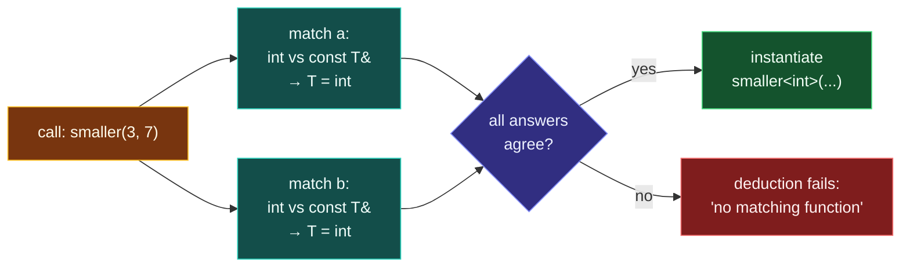

# Function Templates

> [!essence]
> A function template's call site already carries what a class template has to be told explicitly: the types. **Template argument deduction** reads the declared type of each function parameter, matches it against the type of the actual argument, and solves for the template parameter — before the compiler ever looks at the body. A call to a function template therefore reads exactly like a call to an ordinary function.

## The Problem

[[Templates — Code That Writes Code|A template]] is a recipe the compiler follows once a concrete type replaces its placeholder. For a class template that replacement has to be spelled out: `Box<int> price(42);` names `int` in angle brackets because nothing about *using* a class carries type information the compiler could read instead. A function template sits in a different position. Every call already supplies arguments, and those arguments already have types — `compare(3, 7)` says, just by being written, that whatever `T` is, it behaves like `int` here.

> [!principle] Constraint → Consequence → Requirement → Design → Price
> 1. **Constraint.** Before the compiler can check a template's body — whether `a < b` is even legal — every use of the template parameter inside it must be bound to one concrete type. There is no way to type-check "`T::something`" generically.
> 2. **Consequence.** If binding that parameter always required spelling it out (`compare<int>(3, 7)`, every time), a function template would buy nothing over a hand-written overload per type: the caller still names the type, now in two places that must agree — the arguments and the brackets — instead of one.
> 3. **Requirement.** For a function template specifically, the language needs a rule that reads the declared parameter types — each one possibly built from the template parameter, like `const T&` — compares them against the types the call actually supplies, and solves for the template parameter the way you would solve a short equation.
> 4. **Design.** **Template argument deduction**: the compiler matches each function parameter's declared type against the matching argument's type, deduces every template parameter that appears there, and requires all the deductions for the same parameter to agree. A parameter the compiler can't tie to any function argument — one that appears only in the return type — can't be deduced at all.
> 5. **Price.** Deduction is syntactic pattern matching on *declared* parameter types, not the full reasoning overload resolution does elsewhere. Most implicit conversions are switched off: the call's types must already agree with each other, or deduction fails outright and the caller must rescue it with an explicit argument, or with a second, independent template parameter for the operand that differs.

> [!tension] abstraction ⟷ control
> Deduction is C++ at its most convenient: write `smaller(3, 7)` and never mention `T`. But the convenience is deliberately narrow. Unlike an ordinary function call, where `int` slides into a `double` parameter without comment, deduction accepts only argument types that already agree — it will not quietly pick a common type for you. The abstraction of not writing `<T>` is bought by giving up the usual freedom to let nearby types convert into each other.

## Mental Model



> [!model] Solving one small equation per parameter, and where that breaks down
> Each function parameter that mentions `T` poses a tiny equation: "whatever you pass as `a`, its type is `T`." The compiler solves one such equation per parameter that mentions `T`, then checks that every solution agrees.
> **Where it breaks:** a real equation can be rearranged to make two answers match. Deduction never does that — it accepts only answers that already agree, almost exactly, so a caller who wants `3` treated as a `double` must say so, by writing `3.0` or by naming `T` explicitly.

```text
 call      smaller(3, 7)
 pattern   smaller(const T& a, const T& b)
                      │                │
            T from a: int      T from b: int
                      └───────┬────────┘
                       agree → T = int
                 instantiate smaller<int>(...)

 call      smaller(3, 7.5)
 pattern   smaller(const T& a, const T& b)
                      │                │
            T from a: int      T from b: double
                      └───────┬────────┘
                int ≠ double → deduction fails
             fix: smaller<double>(3, 7.5)
```

## Mechanics

**Deduction rules**, situation by situation:

| Situation | Rule | Example |
|---|---|---|
| By-value parameter `T x` | `T` is deduced as the argument's type with top-level `const`/reference stripped; an array or function argument decays to a pointer | `template<typename T> void f(T); int a[3]; f(a);` deduces `T = int*` |
| Reference parameter `const T&` | Binds without copying; a `const` the argument lacks is added for free, but that doesn't make `T` itself `const` | A `string` and a `const string` argument both instantiate the *same* `const string&` version |
| Reference parameter `T&` | The argument must be a non-`const` lvalue; `T` is deduced as the referred-to type | `template<typename T> void f(T&); f(42);` is ill-formed — `42` isn't an lvalue |
| The same `T` used by more than one parameter | Every deduction for `T` must agree exactly; only const-qualification and array/function-to-pointer conversions are allowed, nothing else | `smaller(3, 7.5)` deduces `int` from one argument and `double` from the other — error |
| `T` appears only in the return type | Can't be deduced — nothing in the call mentions it | `template<typename T1, typename T2, typename T3> T1 sum(T2, T3);` needs `T1` given explicitly |
| A parameter whose type doesn't mention `T` | Converts exactly as it would for a non-template function; it plays no part in deduction | `template<typename T> std::ostream& print(std::ostream&, const T&);` converts an `ofstream` argument to `ostream&` as usual |
| `T&&` where `T` is the function template's *own* parameter | A **forwarding reference**: deduces `T` as a reference type for an lvalue argument, as the plain type for an rvalue — the mechanism in full belongs to [[Forwarding References and Reference Collapsing]] | `template<typename T> void f(T&&);` accepts both lvalues and rvalues |

**Supplying what deduction can't reach:**

| Situation | Rule | Example |
|---|---|---|
| Explicit template argument | Written in `<>` after the function name; matched left to right against the template parameter list | `sum<long long>(i, lng)` fixes `T1`; `T2` and `T3` are still deduced |
| Default template argument (C++11) | Used only when the parameter is neither deduced nor given explicitly; the same right-to-left rule as default *function* arguments applies — every parameter to its right needs a default too | `template<typename Dest = long long, typename Src> Dest widen(Src v);` → `widen(42)` uses `Dest = long long` |

> [!standard] A non-template wins an equally good match
> A function-template instantiation enters overload resolution exactly like any other candidate, ranked by the conversions its call needs. When an instantiation and an ordinary, non-template function are an **equally good match** for the same call, the non-template is preferred. Deduction has already discarded any instantiation that isn't viable at all; this tie-break only matters once at least one instantiation and at least one ordinary overload are both still in the running. See [[Function Overloading]] for the full ranking and [[Overload Resolution]] for the general algorithm this specializes.

## Under the Hood

> [!machine] The tie-break is decided at compile time, and it is visible in which symbol gets called
> Compiled with GCC 11.4 (Ubuntu 22.04), x86-64 Linux, `-std=c++20 -O0` (no inlining, so the call sites stay visible), a plain call and an explicitly-specialized call to the same name compile to two different symbols, even though both would print the same answer:
> ```nasm
> call   smaller(int const&, int const&)        ; from smaller(x, y)       — non-template wins the tie
> call   smaller<int>(int const&, int const&)    ; from smaller<int>(x, y) — <int> forces the template
> ```
> (Symbol names shown demangled via `c++filt`; the object file holds `_Z7smallerRKiS0_` and `_Z7smallerIiERKT_S2_S2_`.) Nothing here is decided while the program runs: both candidates are fully resolved, named, and compiled before `main` ever executes.

Because the callee is fixed this way — unlike a virtual call, which is resolved while the program runs by reading a vptr — either symbol is free to be inlined away entirely once optimizations are turned on. Pikus names exactly this as inlining's first precondition: the compiler can only fold a call into its caller's body when it can identify, at compile time, which function the call actually reaches (Pikus, "Function inlining," p. 352). A function template's instantiation satisfies that precondition by construction — it is a single, ordinary, compile-time-known function, indistinguishable from a hand-written one once compiled.

## In Code

**1 · Deduction, and overriding it with an explicit argument**

```cpp
#include <iostream>

template <typename T>
const T& smaller(const T& a, const T& b) {        // ①
    return (a < b) ? a : b;
}

int main() {
    std::cout << smaller(3, 7) << '\n';            // ②
    std::cout << smaller<double>(3, 7.5) << '\n';  // ③
}
// expect: 3
// expect: 3
```
1. `T` never has to be spelled out at the call site — both of its uses are inside `const T&`, a function parameter type.
2. Two `int` arguments each solve `T = int`; the answers agree, so the compiler instantiates `smaller<int>`.
3. `<double>` fixes `T` explicitly. `3` then converts to `double` the way it would for any ordinary parameter — explicit arguments get normal conversions, deduced ones don't.

**2 · Why a trailing return type exists: two parameters, deduced independently**

```cpp
template <typename T, typename U>
auto add(T a, U b) -> decltype(a + b) {   // ①
    return a + b;
}

int main() {
    return add(3, 4.5) == 7.5 ? 0 : 1;    // ②
}
```
1. `a` and `b` aren't declared yet at the point a traditional return type would sit, so `decltype(a + b)` has nothing to name there. The trailing form (C++11) puts the return type *after* the parameter list, where both names are already in scope.
2. `T` and `U` are deduced independently — `T = int`, `U = double` — and nothing requires them to agree, because they are two different template parameters, not two uses of one.

**3 · A default template argument for the parameter nothing deduces**

```cpp
#include <iostream>

template <typename Dest = long long, typename Src>
Dest widen(Src v) { return static_cast<Dest>(v); }

int main() {
    std::cout << widen(42) << '\n';        // ①
    std::cout << widen<int>(42) << '\n';   // ②
}
// expect: 42
// expect: 42
```
1. `Dest` never appears in the parameter list, so it can't be deduced; its default, `long long`, applies instead. `Src` is deduced as `int`, as usual.
2. An explicit `<int>` overrides the default and matches the first template parameter, `Dest` — explicit arguments bind left to right (Mechanics).

## Pitfalls

> [!trap] Deduction failure reads as "no matching function," not "wrong type"
> GCC 11.4 reports `error: no matching function for call to 'smaller(int&, double&)'`, then a note: `deduced conflicting types for parameter 'const T' ('int' and 'double')`. The headline error is about *matching*, not types, so a reader who stops at the first line can waste time checking argument count before reaching the real cause. Fix it with an explicit argument, `smaller<double>(x, y)`, or by making both arguments the same type before the call.

```cpp
// cc: ill-formed
template <typename T>
const T& smaller(const T& a, const T& b) {
    return (a < b) ? a : b;
}

int main() {
    int x = 3;
    double y = 7.5;
    return smaller(x, y) > 0;   // two different types for the same T
}
```

> [!trap] Implicit conversions are mostly off during deduction, unlike everywhere else in C++
> Outside templates, C++ converts eagerly: pass an `int` where a `double` is expected and the compiler just does it. During deduction, only two conversions survive — adding `const`/reference-to-`const`, and array-or-function-to-pointer decay. Every other conversion that would normally apply — `int` to `double`, derived to base, a user-defined conversion — is switched off for a parameter whose type mentions `T`. This is the deliberate price named in *The Problem*: nothing converts behind your back inside a template, so two arguments that look "close enough" to a reader still have to be identical to the compiler.

## Evolution

| Standard | Change | Why |
|---|---|---|
| C++98 | Function templates with automatic argument deduction from the call; explicit template arguments for the parameters deduction can't reach | The original mechanism |
| **C++11** | Default template arguments allowed in function templates — previously restricted to class and alias templates | Lets a rarely-varied parameter, like `widen`'s `Dest`, go unnamed at most call sites |
| C++14 | Plain `auto` as a return type, deduced from the `return` statements, without a trailing `decltype` | Removes C++11's trailing-return boilerplate for the common case where the body alone fixes the type |
| C++17 | `if constexpr` inside a template body ([[if and switch with Initializers, and if constexpr]]) | One function template can branch on a compile-time property of `T` without instantiating the discarded branch |
| C++20 | Abbreviated function templates — `auto` in the parameter list is sugar for an implicit template parameter; `requires` constrains which `T` a call will accept | A shorter spelling for the simplest generic functions, and a way to reject an unsuitable `T` at the declaration instead of deep inside the body ([[Concepts and Constraints]]) |

## Connections

- **Prerequisites:** [[Templates — Code That Writes Code]] (what a template is, and why instantiation happens at all — this note specializes that idea to the one case where a call already carries enough information to resolve it).
- **Enables:** [[Template Argument Deduction]] (the complete algorithm: non-deduced contexts, deduction from a function pointer, and the forwarding-reference rule only sketched here) → [[Full and Partial Specialization]] → [[Concepts and Constraints]] (constrains which `T` deduction is even allowed to try).
- **Siblings:** [[Class Templates]] (the same substitution mechanism, with no call to deduce from until C++17's class template argument deduction) · [[Function Overloading]] (a function-template instantiation competes in the same overload set as an ordinary function — the tie-break rule above) · [[Forwarding References and Reference Collapsing]] (the special deduction rule for a `T&&` parameter, left for its own note).
- **Domain:** [[Map — Generic Programming]].
- **Practice:** *Continuum #24 Generic Container Library* starts with the free functions a generic container needs before the container class itself calls for [[Class Templates]].

## Check Yourself

> [!quiz]- What does template argument deduction read, and when does the compiler perform it?
> It reads the types of the actual call arguments, matches each against the function parameter type that uses the template parameter, and solves for it — before the compiler looks at the function body, so instantiation can proceed with every type already concrete.

> [!quiz]- Why can't the compiler deduce `T1` in `template<typename T1, typename T2, typename T3> T1 sum(T2, T3);` from a call like `sum(3, 4.5)`?
> `T1` never appears in the function's parameter list, only in the return type, and deduction only reads parameter types against argument types. Nothing in the call carries information about `T1`, so it must be supplied explicitly: `sum<double>(3, 4.5)`.

> [!quiz]- Will `smaller(3, 3.0)` compile? If not, what fixes it without changing either literal?
> No: the first argument deduces `T = int`, the second `T = double`, and the two disagree, so deduction fails. Supply `T` explicitly instead of changing the literals: `smaller<double>(3, 3.0)`.

> [!quiz]- A function template `smaller<T>` and a non-template `smaller(int, int)` both match `smaller(3, 7)` exactly. Which one runs, and does the choice cost anything while the program executes?
> The non-template wins: when a template instantiation and a non-template function are equally good matches, the non-template is preferred. The choice is made entirely at compile time — the call instruction already names one fixed symbol — so it costs nothing at run time.

## Sources

- Primer §16.1 "Defining a Template" (p. 671): default template arguments follow the same right-to-left rule as default function arguments.
- Primer §16.2.1 "Conversions and Template Type Parameters" (pp. 679–680): which conversions survive for a deduced parameter, and a worked example of deduction failing when the same template parameter is used with two different argument types.
- Primer §16.2.2 "Function-Template Explicit Arguments" (p. 682): explicit template arguments, matched left to right, needed when a parameter doesn't appear in the function parameter list.
- Primer §16.3 "Overloading and Templates" (pp. 695, 698): a non-template function beats an equally good function-template match.
- Tour §7.2.3 "Template Argument Deduction" (p. 93): deducing a template argument from how a template is used, not only from an explicit argument list.
- PPP §18.1 "Templates" (ch. 18): a template built up from a concrete function first — motivation for letting the call itself supply the type.
- Pikus, "Function inlining" (p. 352): a callee must be known at compile time before a compiler will even consider inlining it.
- cppreference, *Function template*: deduction, explicit template arguments, and abbreviated function templates: https://en.cppreference.com/w/cpp/language/function_template
- cppreference, *Template parameters*, §Default template arguments: disallowed in a function template until C++11: https://en.cppreference.com/w/cpp/language/template_parameters
- Draft standard `[temp.deduct]` (argument deduction), `[temp.arg.explicit]` (explicit arguments): https://eel.is/c++draft/temp.deduct · https://eel.is/c++draft/temp.arg.explicit
