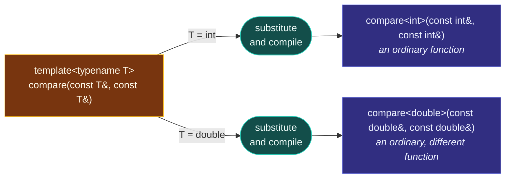

# Templates — Code That Writes Code

> [!essence]
> A template is not code the compiler runs — it is a recipe the compiler *follows*, at compile time, to write ordinary code. A placeholder stands in for a type or value that isn't chosen yet; the compiler substitutes a real argument and compiles a fully concrete function or class from the result, once for every distinct combination a program actually asks for.

## The Problem

A `sort` needs to work on `int`, on `std::string`, and on a `Matrix` class invented after the library ships — with none of those types related by inheritance, and none of them paying for an indirect call they don't need. Two older tools each solve half of this and fail the other half. Writing `compare` separately for `int` and for `std::string` is correct, and produces object code exactly as fast as a version hand-tuned per type, but it doesn't scale: every type has to be anticipated in advance, and near-identical bodies drift out of sync once one copy is fixed and the others aren't. The preprocessor's `#define` avoids that repetition, but a macro is text substituted *before* the compiler has parsed a single type: it does no type checking, respects no scope, and can silently evaluate an argument twice.

> [!principle] Constraint → Consequence → Requirement → Design → Price
> 1. **Constraint.** The compiler must eventually emit concrete machine code, and machine code is specific: comparing two `int`s and comparing two `double`s are different instructions on different kinds of register. Nothing in compiled output can be "generic."
> 2. **Consequence.** Reusing one algorithm across unrelated types without hand-duplicating it needs something *earlier* than code generation to stand in for "the type" — resolved into something concrete before a single instruction is produced, yet still checked as real C++, not merely pasted as text.
> 3. **Requirement.** The language needs a construct written once, in its own grammar, with a name standing for a type or value not yet chosen; understood well enough by the compiler to type-check, to respect scope, and to evaluate each argument exactly once; and able to yield, for every distinct argument a program actually supplies, a complete, ordinary, fully concrete definition — never a shared, indirect one.
> 4. **Design.** A template is exactly that: a function or class declaration prefixed with a template parameter list. The parameter is the placeholder. Substituting a real type or value for it and compiling the result is **instantiation**, and the compiler performs it automatically — deducing the substitution from a call where it can, checking it like any other C++, and doing it once per distinct combination of arguments actually used.
> 5. **Price.** Because the substitution happens purely at compile time, nothing about "which type" survives into the running program: no tag, no branch, no indirection. The cost moves entirely to compile time and to the size of the compiled binary — *N* distinct instantiations are *N* separate, unshared bodies. And because the compiler needs the template's actual body, not merely its declaration, wherever it performs a substitution, that body typically has to be visible in every translation unit that instantiates it — usually by living in a header ([[Why Templates Live in Headers]]).

> [!tension] compile time ⟷ run time
> [[Map — Inheritance & Polymorphism|Virtual dispatch]] answers "one algorithm, many types" by resolving the type while the program *runs*, through an indirect call read off a vptr. A template answers the same question earlier — while the program is *built* — generating a separate, fully concrete definition per type actually used, so nothing is left to resolve once execution starts. [[Static vs Dynamic Polymorphism]] compares the two prices directly.

## Mental Model



> [!model] A cookie cutter, and where it breaks
> A template is a cookie cutter: a shape parameterized over whatever "dough" you press it into. You don't eat the cutter — each press produces a fully baked cookie of one particular flavor, indistinguishable from one made by a dedicated cutter for that flavor alone.
> **Where it breaks:** a physical cutter doesn't check the dough. A C++ template's body is checked, at the moment of substitution, against exactly what that "flavor" of type can actually do — the operators and member functions its statements call for. Unsuitable dough (a type missing `operator<`) doesn't jam the cutter; it fails to compile. And the cutter is pressed at most once per distinct flavor across the *whole* program: a second request for a flavor already produced reuses that instantiation rather than baking another.

## Mechanics

The Standard's own definition is spare: a template stands for **a family** — of classes, of functions, or of variables, or an alias for a family of types (`[temp.pre]`) — never a single one of them; concepts (C++20) are the newest member admitted to that family.

| Situation | Rule | Example |
|---|---|---|
| Declare a template | Prefix a function or class declaration with `template <parameter-list>`; each parameter is a placeholder for a type (`typename T`), a compile-time value, or another template | `template <typename T> class Box { /* ... */ };` |
| Supply the argument | Give it explicitly in angle brackets, or — for a function template — let the compiler deduce it from the call's argument types | `Box<int> b(3);` explicit · `compare(3, 7)` deduces `T = int` |
| Trigger instantiation | The compiler substitutes the argument for the parameter and compiles a fresh, ordinary definition the first time that exact combination is needed: a call, for a function template; a use requiring the complete type, for a class template | The first call to `compare(3.0, 7.0)` instantiates `int compare(const double&, const double&)` |
| Two instantiations of one template | Are unrelated, distinct types or functions — neither inherits from the other, and nothing is shared between them at run time | `Box<int>` and `Box<std::string>` share no base class and cannot be assigned to one another |
| A non-type parameter | A compile-time value — an `int`, a pointer, and (since C++20) more — stands in for a parameter instead of a type | `template <int N> struct FixedArray { int data[N]; };` |

Function templates get most of their arguments for free: the compiler reads the call and works out `T` without being told (see the forthcoming [[Template Argument Deduction]]). Class templates could not do this until C++17's class template argument deduction (CTAD) gave a constructor call the same power. Both are the *same* substitution mechanism described here, applied at two different call sites.

## Under the Hood

> [!machine] Two instantiations are two unrelated bodies of machine code
> Compiled unoptimized, so neither instantiation is inlined away, `compare<int>` and `compare<double>` are separate symbols with genuinely different instructions — one on general-purpose registers, one on the floating-point unit. Nothing about "the template" survives into either; each reads exactly like a function that was hand-written for that one type (GCC 11, `-O0`, `-std=c++20`):
> ```nasm
> int compare<int>(int const&, int const&):
>         mov    rax, QWORD PTR [rbp-8]    ; rax = &a
>         mov    edx, DWORD PTR [rax]      ; edx = a
>         mov    rax, QWORD PTR [rbp-16]   ; rax = &b
>         mov    eax, DWORD PTR [rax]      ; eax = b
>         cmp    edx, eax                  ; integer compare
>         jge    .L10
>         mov    eax, -1
> int compare<double>(double const&, double const&):
>         mov    rax, QWORD PTR [rbp-8]
>         movsd  xmm1, QWORD PTR [rax]     ; xmm1 = a (float register, not edx)
>         mov    rax, QWORD PTR [rbp-16]
>         movsd  xmm0, QWORD PTR [rax]     ; xmm0 = b
>         comisd xmm0, xmm1                ; floating-point compare
>         jbe    .L21
>         mov    eax, -1
> ```
> At `-O2` a call site like `compare(3, 7)` normally inlines the instantiation away entirely, leaving only the comparison itself — the same code a hand-written `int compare(int, int)` would produce. The template cost nothing beyond writing it once.

## In Code

**1 · One definition, two unrelated instantiations**

```cpp
#include <iostream>
#include <string>

template <typename T>
int compare(const T& a, const T& b) {
    if (a < b) return -1;
    if (b < a) return 1;
    return 0;
}

int main() {
    std::cout << compare(3, 7) << '\n';                                         // ①
    std::cout << compare(std::string("pear"), std::string("apple")) << '\n';    // ②
}
// expect: -1
// expect: 1
```
1. `T` is deduced as `int`; instantiates `int compare(const int&, const int&)`.
2. `T` is deduced as `std::string`; instantiates an entirely different function, `int compare(const std::string&, const std::string&)`, that happens to share a source template with ①.

**2 · Why the substitution has to be a compiler mechanism, not text substitution**

```cpp
#include <iostream>

#define MAX_MACRO(a, b) ((a) > (b) ? (a) : (b))

template <typename T>
const T& max_of(const T& a, const T& b) { return (a > b) ? a : b; }

int main() {
    int i = 5, j = 3;
    std::cout << MAX_MACRO(++i, j) << '\n';   // ①
    int k = 5, m = 3;
    std::cout << max_of(++k, m) << '\n';      // ②
    std::cout << i << ' ' << k << '\n';       // ③
}
// expect: 7
// expect: 6
// expect: 7 6
```
1. The preprocessor expands this to `((++i) > (j) ? (++i) : (j))` *before* anything is type-checked: `++i` appears twice in the source, so it runs twice. `i` goes from 5 to 7, and the printed value is the second increment, 7 — not the 6 a reader expects.
2. `max_of` is an ordinary function call: `++i` is evaluated exactly once, at the call site, to produce the reference argument. No template mechanism could reproduce the macro's bug even by accident, because argument-passing rules apply — templates are still functions, not text.
3. `i` was incremented twice (7); `k`, once (6). The difference is not about templates being "smarter" — it's that a template is compiled code obeying C++'s evaluation rules, where a macro is text obeying none of them.

**3 · A class template is a family of unrelated types**

```cpp
#include <iostream>
#include <string>

template <typename T>
class Box {
public:
    explicit Box(T value) : value_(value) {}
    const T& get() const { return value_; }
private:
    T value_;
};

int main() {
    Box<int> price(42);
    Box<std::string> label("hello");
    std::cout << price.get() << ' ' << label.get() << '\n';
}
// expect: 42 hello
```
`Box<int>` and `Box<std::string>` are two distinct, unrelated classes generated from one source definition. Neither is a base or a derived class of the other, and the compiler produced each only because `main` actually asked for it.

## Pitfalls

> [!trap] A template is not a smarter macro
> Example 2 is the whole difference in miniature: a macro is substituted by the preprocessor, before types or scope exist yet; a template is substituted by the compiler, which type-checks the result and evaluates every argument exactly once, following ordinary function-call rules. Reach for `constexpr` or a template when a macro's job is "compute this," and reserve `#define` for things a template genuinely cannot do (conditional compilation, stringizing).

> [!trap] The error surfaces inside the template, not at your mistake
> `Point` below has no `operator<`, so instantiating `compare<Point>` fails — but the compiler reports the failure inside `compare`'s body, with a note that it was "required from here" at the call site. Before C++20 this was the normal shape of a template error: correct in substance, but pointing away from the actual mistake. [[Concepts and Constraints]] moves exactly this class of failure to the call site instead.

```cpp
// cc: ill-formed
template <typename T>
int compare(const T& a, const T& b) {
    if (a < b) return -1;   // requires operator<
    if (b < a) return 1;
    return 0;
}

struct Point { int x, y; };

int main() {
    Point p1{1, 2}, p2{3, 4};
    return compare(p1, p2);   // Point has no operator<
}
```

> [!rule] The price scales with distinct instantiations, not with source size
> A template used with only one or two concrete types buys nothing over an ordinary function and still pays in compile time — every distinct argument set is a full, separately-compiled body (see *Under the Hood*, and [[Template Instantiation]] for the mechanism in detail). Templatize because the type genuinely varies, not by reflex.

## Evolution

| Standard | Change | Why |
|---|---|---|
| C++98 | Function and class templates; explicit (full) specialization | The original mechanism: one definition, many compiler-generated instantiations |
| C++11 | Variadic templates (parameter packs); alias templates (`template using`); `extern template` | Templates taking an arbitrary number of arguments; naming a family of types without a wrapper class; suppressing redundant instantiations across translation units |
| C++14 | Variable templates | Extends "a family of X" to variables, not only functions and classes: `template<typename T> constexpr T pi = T(3.14159...);` |
| C++17 | Class template argument deduction (CTAD) | Function templates could always deduce their arguments from a call; a class template's constructor call finally can too — `std::pair p{1, 2.0}` needs no explicit `<int, double>` |
| C++20 | Constraints and concepts (`requires`) | Names, and lets the compiler check, exactly which operations an argument must supply — before instantiation is even attempted, not deep inside it ([[Concepts and Constraints]]) |

## Connections

- **Prerequisites:** none registered; the note assumes only ordinary [[Map — Functions|functions]] and [[Map — Classes & Encapsulation|classes]].
- **Enables:** [[Function Templates]] → [[Class Templates]] → [[Template Instantiation]] → [[Concepts and Constraints]].
- **Siblings:** [[Static vs Dynamic Polymorphism]] (the same problem, resolved at run time instead) · [[Why Templates Live in Headers]] (this note's Price, worked through in full).
- **Domain:** [[Map — Generic Programming]].
- **Practice:** *Continuum #24 Generic Container Library* begins here — see [[Function Templates]] and [[Class Templates]] for where the project picks it up.

## Check Yourself

> [!quiz]- What does "instantiation" mean for a template, and when does the compiler perform it?
> The compiler substitutes a concrete argument for the template parameter and compiles a complete, ordinary definition from the result. For a function template this happens the first time a call needs that particular argument set, usually with the type deduced from the call; for a class template, the first time something needs the complete type. Once instantiated for a given argument set, later uses of that same set reuse it.

> [!quiz]- Why does a template's definition usually have to live in a header, while an ordinary function's declaration alone is enough in every translation unit that calls it?
> Instantiating a template means substituting the argument into the actual body and compiling the result — the compiler cannot do that from a declaration alone, because there is no body to substitute into. Every translation unit that instantiates the template needs that body visible, so it is placed where all of them can see it: the header. See [[Why Templates Live in Headers]].

> [!quiz]- Predict: after `compare(std::string("x"), std::string("y"))` has already been called once earlier in the same file, does calling `compare(std::string("apple"), std::string("apple"))` create a second instantiation of `compare<std::string>`? What does it return?
> No second instantiation: the compiler needs at most one `int compare(const std::string&, const std::string&)` per program, because the substitution is fixed by the *type*, not the values passed. It returns `0` — neither string is less than the other.

> [!quiz]- A colleague suggests writing every function as a template "so it definitely works for any argument." What does that cost, and when is an ordinary function the better choice?
> Every distinct argument type used anywhere in the program becomes another full, separately-compiled instantiation, so compile time and binary size grow with how many distinct types are actually passed — not with how much source was written. If a function is only ever called with one or two concrete types, a template buys nothing over an ordinary overload and still pays that price.

## Sources

- Primer, ch. 16 opening, "Templates and Generic Programming" (p. 651): the compile-time-vs-run-time framing — OOP resolves an unknown type at run time, generic programming resolves it during compilation.
- Primer §16.1 "Defining a Template" (p. 652): a template transformed into a specific class or function, and that the transformation happens during compilation.
- Primer §16.1.1 "Instantiating a Function Template" (p. 653): argument deduction from a call, and the compiler generating a distinct instantiation per deduced type.
- Primer, Defined Terms (p. 713): template and instantiation defined in one line each — the glossary form of this note's essence.
- Tour §7.1 "Introduction" (p. 87): a template as a class or function parameterized by types or values, for representing a general idea independent of one concrete type.
- Tour §7.2 "Parameterized Types" (p. 88): `template<typename T>` read as "for all types T," worked through a `Vector<T>` example.
- PPP §18.1 "Templates" (ch. 18): a template as a mechanism letting a programmer use types as parameters, with the compiler generating a specific class or function once concrete types are supplied — built up from a concrete `Vector` first.
- Pikus, "Lifting knowledge from runtime to compile time" (p. 366): the real-machine case for turning a runtime configuration value into a compile-time template parameter, and the code-size price of the branch the compiler can then eliminate.
- cppreference, *Templates*: a template as an entity defining a family of classes, functions, variables, a type alias, or a concept; instantiation and the header-visibility requirement for implicit instantiation: https://en.cppreference.com/w/cpp/language/templates
- Draft standard `[temp.pre]`: the normative one-sentence definition of what a template is: https://eel.is/c++draft/temp.pre
