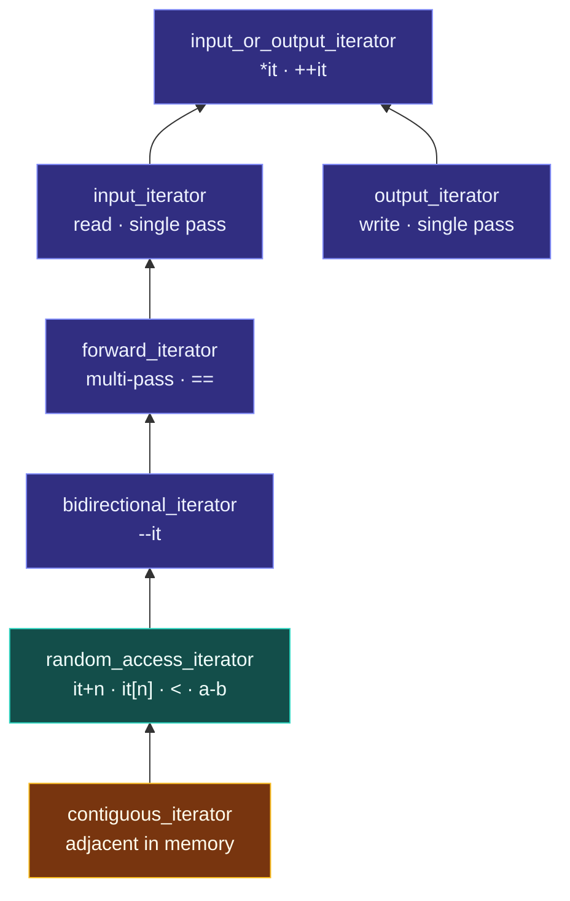

# Iterator Categories and Concepts

> [!essence]
> Iterator categories sort iterators by **which operations they can perform in constant time**: read once, read repeatedly, step back, or jump anywhere. Each algorithm demands the weakest category that still lets it keep its complexity promise. C++98–17 encoded the categories as tag types that code had to trust; C++20 turned them into **concepts** that the compiler checks, and let a range end at a **sentinel** instead of a second iterator.

## The Problem

[[Iterators]] give every container one protocol. But containers differ in what they can do *cheaply*, and algorithms differ in what they need.

> [!principle] Constraint → Consequence → Requirement → Design → Price
> 1. **Constraint:** A `vector` can reach element *k* in one addition; a `list` must walk *k* nodes; an input stream can't go back at all, because reading consumes the data. Meanwhile `sort` promises O(n log n), which assumes it can jump to a pivot in O(1).
> 2. **Consequence:** A single iterator interface has two bad options. It could offer `it + k` everywhere, and on a `list` that would quietly be O(k), so `sort` would become O(n² log n) with no warning. Or it could offer only `++`, and then `vector` couldn't be sorted efficiently either.
> 3. **Requirement:** Let each iterator advertise exactly the operations it can do in constant time. Let each algorithm state the minimum it needs, so the right combinations compile, the wrong ones don't, and an algorithm can pick a faster strategy when a stronger iterator arrives.
> 4. **Design:** A **refinement hierarchy**: input → forward → bidirectional → random access → contiguous, plus a separate output branch. Each level adds operations and promises everything below it. Every iterator carries a label naming its level; since C++98 the label is a *tag type*, and since C++20 it is a *concept* as well (`[iterator.requirements.general]`: all category operations are required to be amortized constant time).
> 5. **Price:** Programmers must learn the hierarchy. Before C++20 the labels were an honor system: a mislabeled iterator compiled and misbehaved. Two generations of rules now coexist (legacy named requirements vs C++20 concepts), and they disagree on some iterators (Pitfalls).

> [!tension] compatibility ⟷ evolution
> C++20 could not redefine the old categories without breaking 20 years of code that inspects `iterator_category`. So it added a parallel system: new concepts and a new `iterator_concept` member, alongside the old tags. Most iterators satisfy both, a few satisfy them differently, and generic code must know which system it is asking.

## Mental Model



> [!model] Licence classes
> Think of driving licence classes: a heavy-truck licence also lets you drive a car, so a job that asks for a "car licence" accepts any holder of a higher class. A job states the lowest class it needs, and a driver holds the highest class they qualified for. **Where the analogy breaks:** an output iterator is not a lower class of input iterator but a different licence altogether (write-only), and in C++20 two classification systems exist side by side, so one iterator can hold different classes in each (Pitfalls).

## Mechanics

**What each category guarantees.** This follows the operations table on cppreference's *Iterator library* page:

| Category | Write | Read | `++` single pass | `++` multi-pass | `--` | `+n`, `[n]`, `<`, `-` | Contiguous storage | Typical source |
|---|---|---|---|---|---|---|---|---|
| Output | ✓ | | ✓ | | | | | `back_inserter`, `ostream_iterator` |
| Input | may | ✓ | ✓ | | | | | `istream_iterator` |
| Forward | may | ✓ | ✓ | ✓ | | | | `forward_list`, `unordered_map` |
| Bidirectional | may | ✓ | ✓ | ✓ | ✓ | | | `list`, `set`, `map` |
| Random access | may | ✓ | ✓ | ✓ | ✓ | ✓ | | `deque` |
| Contiguous | may | ✓ | ✓ | ✓ | ✓ | ✓ | ✓ | `vector`, `array`, `string`, `T*` |

"May" means a *mutable* iterator also satisfies the output requirements (`vector<int>::iterator`), while a `const_iterator` does not. **Multi-pass** is the key line between input and forward: copies of a forward iterator can each walk the same elements independently; copies of an input iterator share one consumable source.

**Generation 1: tags and `iterator_traits` (C++98 onward).** Every iterator exposes five member types, read through `std::iterator_traits<It>` (which also covers raw pointers, since pointers can't have members):

| Member | Meaning | For `std::vector<int>::iterator` |
|---|---|---|
| `value_type` | Element type | `int` |
| `difference_type` | Signed distance | `std::ptrdiff_t` |
| `reference` | Type of `*it` | `int&` |
| `pointer` | Type of `it.operator->()` | `int*` |
| `iterator_category` | A tag struct | `std::random_access_iterator_tag` |

The tags are empty structs that **inherit** along the hierarchy (`random_access_iterator_tag` → `bidirectional_iterator_tag` → `forward_iterator_tag` → `input_iterator_tag`). Passing a tag object to overloaded functions (*tag dispatch*) makes overload resolution pick the most specialized version the iterator qualifies for. This is how `std::advance` and `std::distance` are O(1) on a `vector` and O(n) on a `list`. `output_iterator_tag` stands alone, and `contiguous_iterator_tag` was only added in C++20.

**Generation 2: concepts (C++20).** `<iterator>` defines concepts the compiler checks against the iterator's actual operations, not a label it declares. `std::input_iterator`, `std::output_iterator<I, T>`, `std::forward_iterator`, `std::bidirectional_iterator`, `std::random_access_iterator`, `std::contiguous_iterator`, all built from smaller pieces such as `indirectly_readable`, `weakly_incrementable` and `sentinel_for`. An iterator may state its C++20 level in a separate member, `iterator_concept`, and the associated types have direct aliases: `std::iter_value_t<I>`, `std::iter_reference_t<I>`, `std::iter_difference_t<I>` and `std::iter_rvalue_reference_t<I>` (C++20), plus `std::iter_const_reference_t<I>` (C++23).

**Sentinels and counted ranges (C++20).** A range is now `[i, s)`: an iterator and a *sentinel* `s` of possibly different type, where `sentinel_for<S, I>` requires only that `i == s` is meaningful. `sized_sentinel_for` adds an O(1) `s - i`. A *counted range* `i + [0, n)` is `n` elements starting at `i`. These let "until `'\0'`", "until the stream fails" and "the first n" be ranges without inventing a fake end iterator ([[Ranges and Views]]).

**Requirements for algorithms (C++20).** The `std::ranges::` algorithms (not the classic `std::` overloads, which stay unconstrained) are constrained by bundles built on the iterator concepts: `std::sortable<I>` (in-place reordering by a comparison), `std::mergeable`, `std::permutable`, `std::indirectly_copyable`, and callable checks such as `std::indirect_unary_predicate<F, I>` and `std::indirect_strict_weak_order<F, I>` for the lambdas you pass in.

> [!standard] `[iterator.requirements.general]`, `[iterator.concepts]`, `[iterator.traits]`
> Six categories are defined (five before C++17's *LegacyContiguousIterator*). Their operations must be amortized constant time. A category that refines another supports everything the refined one does. For pointers, `iterator_traits<T*>` names `random_access_iterator_tag` as the category and `contiguous_iterator_tag` as the C++20 concept.

## Under the Hood

> [!machine] Tag dispatch costs nothing at run time
> The category is resolved during overload resolution, so the generated code is just the right algorithm. `std::distance` on each iterator type, GCC 13.3, `-std=c++17 -O2`, x86-64:
> ```nasm
> dist_vec(vector<int>::const_iterator, vector<int>::const_iterator):  ; random access
>         mov  rax, rsi
>         sub  rax, rdi          ; (last - first) in bytes
>         sar  rax, 2            ; ÷ sizeof(int): O(1)
>         ret
>
> dist_list(list<int>::const_iterator, list<int>::const_iterator):     ; bidirectional
> .L15:   mov  rdi, QWORD PTR [rdi]   ; follow node->next
>         add  rax, 1                 ; count one step
>         cmp  rdi, rsi
>         jne  .L15                   ; O(n)
> ```
> Both come from one template, `std::distance`. The tag type (an empty struct, never materialized in memory) chose the body at compile time. C++20 concepts produce the same result through constrained overloads instead of tag arguments.

## In Code

**1 · Asking an iterator what it is: both generations**

```cpp
// cc: std=c++20
#include <deque>
#include <forward_list>
#include <iostream>
#include <iterator>
#include <list>
#include <type_traits>
#include <vector>

template <typename It>
const char* legacy_level() {                                         // ① C++98 style: inspect the tag
    using Tag = typename std::iterator_traits<It>::iterator_category;
    if (std::is_base_of<std::random_access_iterator_tag, Tag>::value) return "random";
    if (std::is_base_of<std::bidirectional_iterator_tag, Tag>::value) return "bidi";
    return "forward-or-less";
}

int main() {
    static_assert(std::contiguous_iterator<std::vector<int>::iterator>);      // ② C++20 style: ask the compiler
    static_assert(!std::contiguous_iterator<std::deque<int>::iterator>);
    static_assert(std::bidirectional_iterator<std::list<int>::iterator>);
    static_assert(!std::bidirectional_iterator<std::forward_list<int>::iterator>);
    std::cout << legacy_level<std::deque<int>::iterator>() << ' '
              << legacy_level<std::list<int>::iterator>() << ' '
              << legacy_level<std::forward_list<int>::iterator>() << '\n';
}
// expect: random bidi forward-or-less
```
1. `is_base_of` rather than `is_same`, so a *more* capable tag still counts: a tag derived from `random_access_iterator_tag` passes the random-access test.
2. Concept checks are compile-time facts about the actual operations. A wrong answer is a build error at this line, not a runtime surprise.

**2 · Choosing an implementation by concept (C++20)**

```cpp
// cc: std=c++20
#include <iostream>
#include <iterator>
#include <list>
#include <vector>

template <std::input_iterator It>
It middle(It first, It last) {                         // ① any single-direction iterator: walk
    auto n = std::distance(first, last);
    std::advance(first, n / 2);
    return first;
}

template <std::random_access_iterator It>              // ② more constrained, so preferred when it applies
It middle(It first, It last) {
    return first + (last - first) / 2;                 // O(1)
}

int main() {
    std::vector<int> v{1, 2, 3, 4, 5};
    std::list<int>   l{1, 2, 3, 4, 5};
    std::cout << *middle(v.begin(), v.end()) << *middle(l.begin(), l.end()) << '\n';
}
// expect: 33
```
1. The general version compiles for any input iterator. For a `list` it walks: once to count, once to reach the middle.
2. `random_access_iterator` *subsumes* `input_iterator`, so for a `vector` both overloads are viable and the compiler picks this more specific one. It's the C++20 replacement for tag dispatch ([[Concepts and Constraints]]; C++14/17 version in [[Header — iterator]], "Choose an Algorithm by Iterator Category").

**3 · The same mismatch, caught at the call site**

```cpp
// cc: ill-formed
#include <algorithm>
#include <list>

int main() {
    std::list<int> l{3, 1, 2};
    std::ranges::sort(l);   // error: constraints not satisfied: list's iterator is not random_access_iterator
}
```
`std::ranges::sort` is constrained with `random_access_iterator` and `sortable`, so the compiler reports the unmet requirement at this line. The classic `std::sort(l.begin(), l.end())` fails too, but its error comes from deep inside the implementation ([[STL Architecture — Containers, Iterators, Algorithms]], In Code 3).

**4 · The two generations disagree**

```cpp
// cc: std=c++20
#include <iostream>
#include <iterator>
#include <ranges>
#include <type_traits>

int main() {
    auto nums = std::views::iota(0, 10);                // 0..9 generated on demand, not stored
    using It = std::ranges::iterator_t<decltype(nums)>;
    constexpr bool concept_says_ra = std::random_access_iterator<It>;
    constexpr bool legacy_says_input =
        std::is_same_v<std::iterator_traits<It>::iterator_category, std::input_iterator_tag>;
    std::cout << concept_says_ra << legacy_says_input << ' ' << nums[7] << '\n';
}
// expect: 11 7
```
`*it` on an `iota` iterator returns an `int` **by value**; there is no stored element to refer to. Legacy forward iterators must return a real reference, so under the old rules this iterator is only an *input* iterator. The C++20 concepts drop that rule, and it is fully random access. Pre-C++20 algorithms that read `iterator_category` will pick their slowest path for it.

## Pitfalls

> [!trap] Testing a tag with `is_same`
> `std::is_same<Tag, std::random_access_iterator_tag>` rejects any iterator whose tag *derives* from it, and in C++20 code that checks `iterator_concept` it rejects `contiguous_iterator_tag`. Use `std::is_base_of` (C++14/17) or `std::derived_from` / the concepts themselves (C++20).

> [!trap] Treating an input iterator as multi-pass
> Copying an `istream_iterator` does not copy the stream. Reading through one copy consumes input the other copy "still points at". Any algorithm that needs two passes needs forward iterators; copy single-pass data into a container first.

> [!trap] Hand-written iterators with missing or wrong member types
> An iterator without the five member types (or a C++20 `iterator_concept`) is invisible to `iterator_traits`, and classic algorithms fail with baffling errors. An iterator that declares `random_access_iterator_tag` but lacks `operator[]` compiles until an algorithm uses it. Don't inherit from `std::iterator` (deprecated in C++17); declare the types yourself and `static_assert` the C++20 concept ([[Header — iterator]], "Write Your Own Forward Iterator").

> [!ub] Violating a category's semantic promises
> Concepts check syntax, not meaning. An iterator whose `==` isn't consistent with its `++`, or whose "multi-pass" copies secretly share state, satisfies the concept yet makes algorithms misbehave. The standard calls such programs ill-formed, no diagnostic required, or undefined ([[Undefined Behavior]]).

## Evolution

| Standard | Change | Why |
|---|---|---|
| **C++98** | Five categories; tags with inheritance; `iterator_traits`; `std::iterator` helper base | Algorithms pick the best strategy at compile time with zero runtime cost |
| C++14 | Value-initialized forward iterators compare equal | Gives a forward iterator a well-defined "null" value |
| C++17 | *LegacyContiguousIterator* named requirement; `std::iterator` deprecated | Name the guarantee `vector`/`array`/`string` already gave; stop recommending a base class that made the five types hard to read and override |
| **C++20** | Iterator concepts; `iterator_concept`; `contiguous_iterator_tag`; sentinels and counted ranges; `iter_value_t`/`iter_reference_t`…; `ranges::iter_move`/`iter_swap`; algorithm concepts (`sortable`, `mergeable`, `permutable`) | Compiler-checked requirements; proxy-reference and generated sequences become first-class; ranges no longer need two iterators of one type |
| C++23 | `basic_const_iterator`, `std::const_iterator<I>`, `iter_const_reference_t` | A uniform way to make any iterator read-only |
| C++26 | `projected_value_t` | Value type seen through a projection, for algorithms that take a projection |

## Connections

- **Prerequisites:** [[Iterators]] (the protocol being classified).
- **Enables:** [[Ranges and Views]] (sentinels, generated sequences) · [[The Algorithms Library]] (why each algorithm accepts what it does) · [[Header — iterator]] (tags, traits, concepts, `advance`/`distance` in practice).
- **Siblings:** [[Concepts and Constraints]] (the language feature the C++20 half is built from) · [[Type Traits]] (the machinery `iterator_traits` belongs to) · [[Function Templates]] (overload resolution that tag dispatch relies on).
- **Frame:** [[STL Architecture — Containers, Iterators, Algorithms]].
- **Practice:** *Continuum #23 STL Container & Algorithm Playground*: write `middle()` both ways and confirm the choice with a `static_assert` · *#24 Generic Data Structure Library*: give your hand-written container a forward iterator and `static_assert` `std::forward_iterator` against it.

## Check Yourself

> [!quiz]- Why doesn't `std::list<int>::iterator` support `it + 5`, when the library could implement it as five `++` steps?
> Categories only promise constant-time operations. `it + 5` looks O(1), so an algorithm (like `sort`) that relies on O(1) jumps would silently become far slower. Making it not compile forces you to write `std::next(it, 5)`, which is honest about the walk.

> [!quiz]- What does an input iterator lack that a forward iterator has, and which algorithms care?
> Multi-pass: copies of a forward iterator can each traverse the same elements, and `a == b` means they refer to the same element. Algorithms that remember a position and come back to it (`std::max_element`, `std::search`, `std::adjacent_find`, `std::unique`) need forward iterators; one-pass algorithms like `std::find` or `std::accumulate` accept input iterators.

> [!quiz]- Predict: for `using It = int*;`, what are `iterator_traits<It>::iterator_category` and `std::contiguous_iterator<It>`?
> The category is `random_access_iterator_tag` (the legacy system has no contiguous tag for its category member), while `std::contiguous_iterator<int*>` is `true`, and `iterator_traits<int*>::iterator_concept` is `contiguous_iterator_tag`. Legacy code sees random access; C++20 code sees contiguous.

## Sources

- Primer §10.5 "Structure of Generic Algorithms" and §10.5.1 "The Five Iterator Categories" (p. 410): what each category supports and why algorithms name the weakest they need.
- Tour §8.2 "Concepts" (p. 104): concepts as compile-time requirements and concept-based overloading. §14.5.2 "Iterator Concepts" (p. 192): the C++20 iterator concepts, sentinels, `sortable`/`mergeable`/`permutable`.
- Tour §13.3 "Iterator Types" (p. 178): iterators of different containers and what they have in common.
- cppreference / web, *Iterator library*: the category operations table, definitions, iterator concepts, associated types, primitives and algorithm concepts: https://en.cppreference.com/w/cpp/iterator
- cppreference / web, *std::iterator_traits*: https://en.cppreference.com/w/cpp/iterator/iterator_traits
- Draft standard `[iterator.requirements.general]`, `[iterator.concepts]`, `[iterator.traits]`: https://eel.is/c++draft/iterator.requirements
