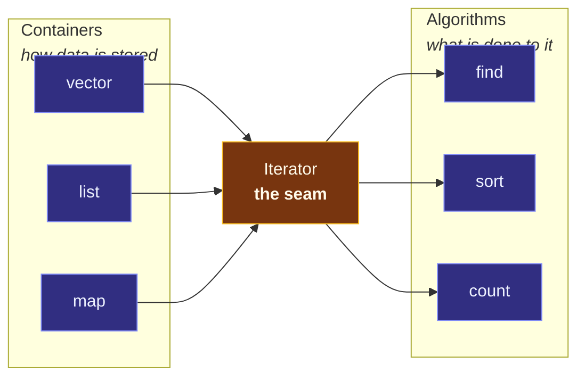

# STL Architecture — Containers, Iterators, Algorithms

> [!essence]
> The STL is not a library of data structures; it is a design that splits "how data is stored" (**containers**), "what is done to it" (**algorithms**), and the minimal protocol connecting the two (**iterators**) into three independent pieces. Because every container and every algorithm agrees on the iterator protocol alone, N containers and M algorithms need N+M implementations instead of N×M.

## The Problem

C++ inherited C's habit of writing each data structure and its operations as one inseparable unit: an array came with its own hand-written search loop, a linked list with its own. Nothing stopped two programs — or two functions in the same program — from writing `find` three times, once per container, each tested and debugged separately.

> [!principle] Constraint → Consequence → Requirement → Design → Price
> 1. **Constraint:** Almost every program needs the same small set of operations — search, sort, copy, count, transform — applied to the same small set of storage shapes — a growable array, a linked list, a sorted tree. Neither the operations nor the storage shapes are language features; both must be written as ordinary code (Tour §9.2, p. 120).
> 2. **Consequence:** If `sort` is written to know `vector`'s contiguous layout directly, it cannot also sort a `list`. Multiply *N* storage shapes by *M* operations and a library that hand-writes every combination needs N×M functions, each an independent source of bugs — consistent with why containers "define few operations" of their own (Primer §10.1, p. 376).
> 3. **Requirement:** An algorithm must be expressible exactly once, in terms of "a sequence of elements," without knowing whether that sequence is a contiguous buffer, a chain of nodes, or something a user wrote last week.
> 4. **Design:** Define a minimal, common protocol — the **iterator** — that any storage shape can implement over itself, and write every algorithm in terms of that protocol alone. Containers and algorithms never call each other directly; every conversation goes through an iterator. PPP frames this as the point of its whole chapter on the topic: sequence and iterator are the two notions that connect containers, which hold data, to algorithms, which process it (PPP ch. 19). The result, folded into the standard library at C++98, is conventionally called the STL (Tour §9.2, p. 120).
> 5. **Price:** An algorithm can only assume what the weakest iterator it accepts actually offers — it cannot use `[]` unless it required random access — so the vocabulary of iterator *categories* becomes something every programmer must learn (Mechanics, below). And when an iterator doesn't meet an algorithm's requirement, the error used to surface deep inside library internals rather than at the call site (Pitfalls).

> [!tension] abstraction ⟷ control
> A generic `std::sort` over `vector<int>::iterator` must compile to the same code a programmer would write by hand for that exact case — nothing beyond what the abstraction is really asking for. The library keeps that promise at compile time, by generating one concrete instantiation per iterator type actually used ([[Map — Standard Library]] develops this as the domain's central tension); the price is paid in compile time and in template-shaped error messages.

## Mental Model

Picture three independent layers, connected by exactly one seam.

```text
  WITHOUT A SHARED PROTOCOL                    WITH THE ITERATOR SEAM
  (N containers × M algorithms)                (N containers + M algorithms)

  vector  ─ find_vector() ┐                     vector ┐
  vector  ─ sort_vector() │                      list  ├─▶ Iterator ─▶ find()
  list    ─ find_list()   ├─ 3×3 = 9             map   ┘              sort()
  list    ─ sort_list()   │  hand-written                             count()
  map     ─ find_map()    │  functions          3 containers + 3 algorithms
  map     ─ sort_map()    ┘                      = 3 + 3 = 6 pieces total
```

> [!model] The universal socket, and where it breaks
> An iterator is a socket standard: any appliance (algorithm) that only needs what the standard promises — a plug shape, a voltage — runs off any socket (container) that meets it, even one wired decades later by someone who never saw the appliance. **Where it breaks:** a socket standard has one tier; iterators have six, layered by what they promise (Mechanics). Plugging a "needs 240V" appliance into a "110V-only" socket is the electrician's job to prevent — for iterators, the C++20 `std::ranges::` algorithms make the compiler refuse the mismatch at the call site (iterator concepts); the classic `std::` algorithms still don't.



## Mechanics

Every algorithm operates on a **range**: a half-open pair `[begin, end)`, the first element and one position past the last, never a container directly (Tour §13.1, p. 174). "One position past the last" matters because it makes an empty range representable (`begin == end`) without a special case.

| Situation | Rule | Example |
|---|---|---|
| An algorithm needs a range | Pass two iterators, not a container | `std::sort(v.begin(), v.end())` |
| An algorithm needs a destination | Pass a third iterator that only needs to be *written to* | `std::copy(v.begin(), v.end(), out)` |
| The destination has no room yet | Wrap it in an insert iterator, which extends the container | `std::back_inserter(result)` |
| An algorithm's requirement isn't met | `std::ranges::` algorithms (C++20) reject it at the call site via concepts; the classic `std::` algorithms are unconstrained, so the program is ill-formed only if a missing operator happens to be used (otherwise undefined behavior) | `std::ranges::sort(l)` → "constraints not satisfied"; `std::sort(l.begin(), l.end())` → "no match for `operator-`" deep in the library |

**Iterator categories.** Not every container can offer every operation cheaply — a linked list cannot jump to element *k* in O(1) the way an array can. Rather than force every container to fake operations it can't do efficiently, the library groups iterator operations into categories and lets each algorithm declare the *weakest* category it can work with (Primer §10.5, pp. 410–412):

| Category | Guarantees | Needs it | Typically from |
|---|---|---|---|
| Input | read-once, `++` only, single-pass | `find`, `count` | `istream_iterator` |
| Output | write-once, `++` only, single-pass | destination of `copy` | `ostream_iterator`, `back_inserter` |
| Forward | read/write, `++` only, multi-pass | `replace` | `forward_list` |
| Bidirectional | + `--` | `reverse` | `list`, `map`, `set` |
| Random-access | + `+`, `-`, `<`, `[]` in O(1) | `sort`, `binary_search` | `vector`, `deque`, `array`, `string` |
| Contiguous (C++17; concept C++20) | + guaranteed adjacent storage | `data()`-based APIs | `vector`, `array`, `string` |

A category higher in the table supplies every operation of the categories below it (`[iterator.requirements.general]` ¶4), so an algorithm that only asks for a forward iterator happily accepts a random-access one.

> [!standard] C++20 turned the categories into concepts, and generalized the pair
> Before C++20, an iterator's category was established by convention — nested `typedef`s picked up by `iterator_traits` — and compilers were not required to reject a mismatched category at the call site (Pitfalls). C++20 names each category as a constrainable concept (`std::forward_iterator`, `std::random_access_iterator`, …) and makes `contiguous_iterator` a concept (the category itself was introduced in C++17). The concepts constrain the new `std::ranges::` algorithms; the classic `std::sort` and friends keep their unconstrained C++98 signatures, so a mismatch there still fails, if at all, inside the library (GCC 11.4, `-std=c++20`: `std::ranges::sort(l)` reports "constraints not satisfied"; `std::sort(l.begin(), l.end())` reports "no match for `operator-`" in `stl_algo.h`). It also generalizes the pair itself: a **range** is now an iterator and a *sentinel*, and the sentinel is allowed to be a different type from the iterator (`[iterator.requirements.general]` ¶8, footnote 177) — which is what lets `std::ranges` express a range with no fixed end, like an input stream read until failure.

## Under the Hood

> [!machine] The generic call costs nothing extra — and the library version can beat a hand-written loop
> Each call to a function template is a separate compilation target: `std::find(v.begin(), v.end(), x)` over `vector<int>::iterator` generates its own function, specialized for exactly that iterator type, with no virtual call and no runtime branch on "what kind of container is this." Comparing GCC 11's output at `-O1` for a generic call against an equivalent hand-written loop over the same `vector<int>` (x86-64):
> ```nasm
> contains_handwritten(std::vector<int> const&, int):   ; for (size_t i=0;...) if (v[i]==target) ...
>         mov  rax, [rdi+8]
>         mov  rdx, [rdi]
>         ...
> .L21:
>         cmp  DWORD PTR [rdx+rax*4], esi
>         je   .L23
>         add  rax, 1
>         cmp  rax, rcx
>         jb   .L21
>         mov  eax, 0
>         ret
> ```
> `std::find` over the same range doesn't just match this — libstdc++'s implementation unrolls the scan four elements per iteration (excerpt):
> ```nasm
> contains_generic(std::vector<int> const&, int):       ; std::find(v.begin(), v.end(), target)
> .L7:
>         cmp  esi, [rax]
>         je   .L3
>         cmp  esi, [rax+4]
>         je   .L16
>         cmp  esi, [rax+8]
>         je   .L17
>         cmp  esi, [rax+12]
>         je   .L18
>         add  rax, 16
>         cmp  rax, rdx
>         jne  .L7
> ```
> "Zero overhead" is a floor, not a ceiling: the generic algorithm, tuned once by the library implementer for every caller, can outperform what most programmers would write by hand — for free, every time it's called.

## In Code

**1 · The same algorithm, unmodified, over three storage shapes**

```cpp
#include <algorithm>
#include <deque>
#include <iostream>
#include <list>
#include <vector>

template <typename Container, typename T>
auto count_occurrences(const Container& c, const T& value) {
    return std::count(c.begin(), c.end(), value);   // ①
}

int main() {
    std::vector<int> v{1, 2, 3, 2, 1, 2};
    std::list<int>   l{1, 2, 3, 2, 1, 2};
    std::deque<int>  d{1, 2, 3, 2, 1, 2};

    std::cout << count_occurrences(v, 2) << ' '      // ②
              << count_occurrences(l, 2) << ' '
              << count_occurrences(d, 2) << '\n';
}
// expect: 3 3 3
```
1. `std::count` only ever calls `==`, `!=` and `++` on its iterators — the input-iterator minimum — so it never needs to know how `v`, `l` and `d` actually store their elements.
2. One template function, instantiated three times by the compiler, once per container's iterator type. No hand-written `count_in_vector`, `count_in_list`, `count_in_deque`.

**2 · A container the STL has never heard of**

```cpp
#include <algorithm>
#include <iostream>
#include <numeric>

class MeasurementLog {                               // ① no relation to any STL class
public:
    explicit MeasurementLog(std::size_t n) : data_(new double[n]), size_(n) {}
    ~MeasurementLog() { delete[] data_; }
    MeasurementLog(const MeasurementLog&) = delete;
    MeasurementLog& operator=(const MeasurementLog&) = delete;

    double* begin() { return data_; }                // ② the entire contract
    double* end()   { return data_ + size_; }

private:
    double* data_;
    std::size_t size_;
};

int main() {
    MeasurementLog log(5);
    std::iota(log.begin(), log.end(), 1.0);           // ③
    std::cout << std::accumulate(log.begin(), log.end(), 0.0) << '\n';
}
// expect: 15
```
1. `MeasurementLog` owns a raw `double[]` and was written without `<algorithm>` in mind.
2. Supplying `begin()`/`end()` that return plain pointers is enough: a pointer already satisfies random-access iterator — iterators are explicitly a generalization of pointers (`[iterator.requirements.general]` ¶2).
3. `std::iota` and `std::accumulate` work on it immediately, unmodified. This is the extensibility Tour §9.2 (p. 120) points to: users can add their own containers and algorithms to the same framework.

**3 · A category mismatch is caught, not silently miscompiled**

```cpp
// cc: ill-formed
#include <algorithm>
#include <list>

int main() {
    std::list<int> l{3, 1, 2};
    std::sort(l.begin(), l.end());   // error: list::iterator is bidirectional, not random-access
}
```
`std::sort` requires random access because its `O(n log n)` guarantee depends on jumping to a pivot in O(1); iterator categories only ever promise operations realizable in *constant* time (draft `[iterator.requirements.general]` ¶14). `list`'s iterator can only step one node at a time, so this fails to compile — the fix is `l.sort()`, the member function `list` supplies for exactly this reason.

## Pitfalls

> [!trap] Treating any iterator as if it were a pointer
> A pointer happens to satisfy every category up to contiguous, so code prototyped on `vector` quietly assumes `+`, `-` and `[]` work on *any* iterator. Move the same code to a `std::map` or `std::list` and those operators aren't there — this is by design (Mechanics), not a library gap.

> [!trap] A misused iterator category used to fail deep inside the library
> Before C++20, a compiler was not required to reject the wrong iterator category at the call site, and older implementations often accepted it silently (Primer §10.5, p. 411). Where the mismatch did surface — as in Example 3 above — the message pointed at the algorithm's internals, not the caller's line. C++20 fixes this only for the `std::ranges::` algorithms, which are concept-constrained; the classic `std::` overloads are not, so prefer `std::ranges::sort(v)` when you want the call-site diagnostic.

> [!ub] Holding an iterator across a mutation that invalidates it
> Every container documents which operations invalidate its iterators (inserting into a full `vector` invalidates all of them; erasing from a `list` invalidates only the erased element's). Using an invalidated iterator is undefined behavior, not a checked error. See [[Iterator Invalidation]].

## Evolution

| Standard | Change | Why |
|---|---|---|
| **C++98** | The STL (Stepanov's design) enters the standard library; five iterator categories via nested `typedef`s and `iterator_traits` | A shared, extensible container/algorithm framework, at the cost of convention-only enforcement |
| C++11 | Move iterators; free `std::begin`/`std::end`; range-based `for` | Generic code can move instead of copy; iterate without naming a container's own `begin()`/`end()` |
| C++17 | Parallel algorithm overloads take an `ExecutionPolicy` (`<execution>`) | The same algorithm call can ask for parallel or vectorized execution without a different function name |
| **C++20** | Iterator categories become concepts, including `contiguous_iterator` (a category since C++17); concept-constrained `std::ranges::` algorithms; ranges generalize `[begin, end)` to iterator + *sentinel*, possibly different types | Category mismatches move toward the call site; ranges can express an end that isn't another iterator (a predicate, a count, "read until failure") |

## Connections

- **Prerequisites:** None registered at the topic level; the reader should already have function templates in view from [[Map — Generic Programming]] — this note is where that machinery starts paying for itself.
- **Enables:** [[Iterators]] (the seam, examined on its own) · [[vector]] (the concrete container every abstract claim here can be checked against) · [[The Algorithms Library]] (the payoff, `find`/`sort`/`transform` catalogued) · [[string]].
- **Siblings:** [[Map — Generic Programming]] (the compile-time machinery this architecture is built from).
- **Domain:** [[Map — Standard Library]] — this note is the frame the rest of D10 fills in.
- **Practice:** *Continuum #23 STL Container & Algorithm Playground* — implement one operation (search, or a running total) two ways, a hand-rolled loop and an algorithm call, across at least two container types; note where an iterator category refuses to compile before it refuses to run.

## Check Yourself

> [!quiz]- Why does the STL keep containers, iterators and algorithms as three separate pieces instead of giving every container its own `sort` and `find`?
> Because separating them turns an *N containers × M algorithms* problem (one hand-written function per combination) into *N + M*: every container implements the iterator protocol once, every algorithm is written against that protocol once, and any container/algorithm pair that agrees on category "just works."

> [!quiz]- `std::sort(v.begin(), v.end())` compiles for `std::vector<int>`. Why does the same call fail for `std::list<int>`?
> `std::sort`'s `O(n log n)` guarantee needs to jump to arbitrary positions in O(1) — random access. `vector`'s iterator provides that; `list`'s iterator is only bidirectional, since a linked list can't jump to node *k* without walking there. `list` supplies its own `sort()` member instead, implemented for the structure it actually has.

> [!quiz]- Predict: `std::vector<int> v{3, 1, 2}; std::sort(v.rbegin(), v.rend());` — does this compile, and what does `v` hold afterward?
> It compiles: `vector`'s `reverse_iterator` adapts a random-access iterator and stays random-access itself. Sorting the *reversed* view ascending leaves the underlying vector descending: `v` holds `{3, 2, 1}`.

## Sources

- Primer §10.1 "Overview" (p. 376) and §10.5 "Structure of Generic Algorithms" (pp. 410–412): why containers deliberately define few operations of their own, and the five iterator categories with their guarantees.
- Tour §9.2 "Standard-Library Components" (p. 120): the STL as a framework of containers and algorithms, extensible so users can add their own; §13.1 "Introduction" (p. 174): the half-open-range definition of a sequence; §13.2 "Use of Iterators" (p. 176): algorithms working unmodified across containers.
- PPP ch. 19 "Containers and Iterators": sequence and iterator as the two notions tying containers to algorithms.
- cppreference, *Iterator library* and *Algorithms library*: https://en.cppreference.com/w/cpp/iterator.html · https://en.cppreference.com/w/cpp/algorithm.html
- Draft standard `[iterator.requirements.general]` (categories, ranges, sentinels) and `[algorithms.general]`: https://eel.is/c++draft/iterator.requirements.general · https://eel.is/c++draft/algorithms.general
