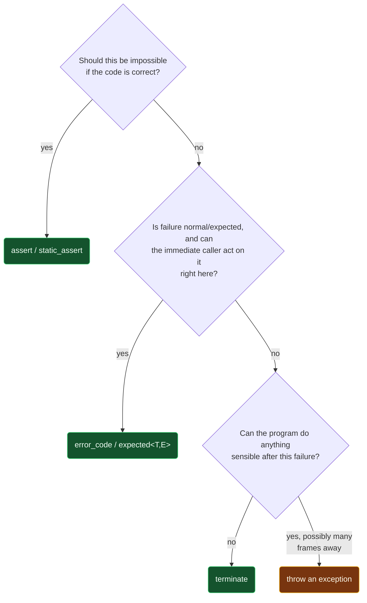

# Error Handling Strategies Compared

> [!essence]
> A function that cannot keep its signature's promise has exactly four ways to say so: throw and let the failure propagate on its own, return a value the caller must explicitly check, state the promise as an assertion and abort if it's broken, or refuse to check at all and let undefined behavior stand as the price of never having asked. Which channel fits a given interface is a design decision made once per interface, not a matter of taste exercised call by call.

## The Question

A function's signature promises a result. Something can always prevent it from keeping that promise: a bad argument, a file that isn't there, a socket that refuses to connect, an allocator with nothing left to give. The function has to tell *someone* — but which someone, and how, is a design decision, because each of C++'s channels answers a different question about *where* the failure should surface and *who* is expected to act on it.

> [!principle] Why one channel isn't enough
> 1. **Constraint.** A failure detected inside a function has to be reported to code its author has never seen: the caller might handle it on the spot, three frames up, or not at all — and some callers (a constructor, an operator) have no return value to hand a result back through in the first place.
> 2. **Consequence.** A single fixed channel forces every interface into the same shape. A millisecond-budget inner loop can't afford a channel that costs something when nothing goes wrong; a programmer's own logic bug doesn't look like a normal, expected failure such as "file not found"; and neither looks like "the program cannot sensibly continue at all."
> 3. **Requirement.** The language needs at least one channel that propagates automatically across frames the immediate caller can't see through, one that reports failure as an ordinary, explicitly checked value, and one that states a promise and checks it directly — each with a different cost model, so the common, no-error case never pays for the rare one.
> 4. **Design.** C++ hands the choice to the interface's designer instead of fixing one for the whole language: [[Exceptions|exceptions]] (throw, propagate automatically), [[error_code and System Errors|error codes]] and [[expected — Errors as Values|`expected<T,E>`]] (return a value the caller must check), [[assert and static_assert|assertions]] (state the promise, check it — sometimes only in debug builds, sometimes entirely at compile time), and terminating outright when nothing sensible can follow a failure at all.
> 5. **Price.** Choice is also the cost: nothing in the type system tells a reader which channel an unfamiliar function uses, and mixing channels inside one component multiplies the number of failure paths that reader has to track.

> [!tension] safety ⟷ performance
> Checking a contract costs something on every call, whether or not it's ever broken; not checking costs nothing until the one call where it mattered. Every channel below sits at a different point on that line, and the right choice is the one whose cost model matches how often — and how urgently — the interface actually fails.

## At a Glance

| Criterion | Exceptions | Error codes | Assertions | Terminate |
|---|---|---|---|---|
| **Cost, no failure** | ~ near-zero (table-based) | ✗ one check per call | ~ one branch, removable | ✓ zero |
| **Cost, on failure** | ~ concentrated unwinding | ✓ cheap comparison | ✗ `abort()`, no recovery | ✗ `terminate()`, no recovery |
| **Ignorable by accident** | ✗ no, ends loudly | ✓ yes, easy to skip | ✗ no, or absent by build | n/a |
| **Crosses many frames** | ✓ automatic | ✗ manual relay each frame | ✗ checks only this call | n/a |
| **Works in a constructor** | ✓ the only channel that can | ✗ no return slot to use | ~ can check, can't report | ✓ trivially |
| **Present in release build** | ✓ always | ✓ always | ~ `assert` removable, `static_assert` isn't | ✓ always |
| **Right failure kind** | rare, can't handle locally | expected, caller acts here | "should be impossible" | can't recover at all |

## Deep Dive

### Exceptions: automatic propagation across frames you can't see

Exceptions are C++'s most general mechanism for reporting a failure a function cannot handle itself (Tour §4.4, p. 47). They are not a second way to return a value — they exist specifically to report that a task could not be completed, and the language optimizes the *non-throwing* path so heavily that returning a value stays far cheaper than throwing the same value ever could be (Tour §4.4, p. 47). Once thrown, an exception needs no help crossing frames: intervening functions don't have to mention, check, or relay it at all, which is exactly what makes it the right tool when a failure can only be resolved many calls higher up, by a caller none of those intervening functions know about (Tour §4.4, p. 47).

That automatic crossing is also why exceptions are the only channel usable from a constructor or an operator: neither has a return slot a caller could inspect, and unwinding a half-built object through manually checked error codes at every one of those frames would be far messier than letting a single `throw` do it (Tour §4.4, p. 47–48). The safety of "throw and let go" is not automatic on its own — it depends on [[Stack Unwinding]] running the destructor of every fully constructed automatic object between the `throw` and its `catch`, which is why [[RAII]] rather than hand-written cleanup is the foundation exception-safe code is built on. What the *non-throwing* path actually costs, measured, is [[The Cost of Exceptions]]; what to throw and how to structure a hierarchy of exception types is [[Designing Exception Hierarchies]].

### Error codes and `expected<T,E>`: failure as an ordinary value

An error indicator is the right channel when failure is normal and expected — Tour's own example is a file that may simply not exist — and the immediate caller is the one expected to act on it (Tour §4.4, p. 47). PPP frames the same choice from the other side: a run-time error is either dealt with by the caller or by the callee, and returning a value indicating failure is exactly how a callee hands that decision back up one frame at a time (PPP §4.5 "Run-time errors").

`std::error_code` (`<system_error>`, since C++11) is the standard library's own vocabulary for this: it pairs a platform-dependent value with an `error_category`, converts to `bool` (true means "an error"), and a default-constructed one means "no error" (cppreference, *`std::error_code`*). `std::expected<T,E>` (since C++23) puts the same idea inside the type system instead of a separate out-parameter: a function returns *either* the value or the error, and the caller must ask which one it got before touching either — no implicit "zero means success" convention to forget. Both share error codes' central cost, and its central risk: the check is cheap, but nothing in the language forces the caller to make it, which is exactly the shape of bug the *In Code* example below compiles cleanly.

### Assertions: stating the promise and checking it directly

An assertion doesn't report a failure up the call chain at all — it names a condition that should already be true and reacts if it isn't. `assert()` (`<cassert>`, Tour §4.5.1, p. 49) checks its argument at run time: if the argument is false, it writes a diagnostic to standard error and calls `std::abort()`; if the macro `NDEBUG` is defined at the point `<cassert>` was last included, `assert` is disabled entirely and generates no code — not even the comparison (cppreference, *`assert`*). `static_assert` (Tour §4.5.2, p. 50; since C++11) checks a constant expression at compile time instead: failing it is a compiler error, not a run-time branch, so there is nothing left to pay for once the program is running.

The two check the same *kind* of thing — a promise the author believes must hold — at two different points in the program's life: `static_assert` for whatever is knowable before the program runs at all, `assert` for what can only be known once it's executing but is still expected to be a programmer error, not a normal operating condition, if it's ever false. Neither is meant to report a failure the caller is expected to recover from; that's what the other three channels are for.

### Terminate — or the bet not to check at all

Sometimes nothing sensible can follow a failure: memory exhaustion on a system with no reasonable recovery path, or an architecture that recovers from any non-trivial error by restarting the whole process (Tour §4.4, p. 48). `noexcept` (Tour §4.5.3, p. 50–51) turns that into an enforceable promise: a function declared `noexcept` that throws anyway does not unwind into its caller. Instead, the search for a handler exits a function with a non-throwing exception specification, which the Standard names as one of the situations that calls `std::terminate()` directly (`[except.terminate]` ¶1.3) — and whether the stack unwinds at all first, in that specific situation, is left implementation-defined (`[except.terminate]` ¶2). A mistaken `noexcept` doesn't just fail to catch the exception; it makes what destructors ran before the abort implementation-specific.

The quieter extreme is not to check the contract at all. Pikus frames error handling itself as part of an interface's contract, and states the design rule plainly: "error handling must be cheap" in the common, no-error case, whatever that costs in the rare one (Pikus, "Errors and undefined behavior," p. 420). Sometimes the answer to "how cheap" is that even detecting the violation is judged not worth its cost, and the interface documents the result as [[Undefined Behavior]] instead of checking it (Pikus, p. 421). That is the fourth channel by omission: pay nothing, until the one call where the bet was wrong.

## Decision Guide



1. **A logic error that should be structurally impossible** — an index already checked, an invariant the constructor established — gets an assertion, not a reported failure: there's no caller to hand it to that would do anything but the same check again.
2. **A normal, expected condition the immediate caller can act on right there** gets an error code or `expected<T,E>` — the file-not-found case, where propagating further than one frame would just delay a decision that frame is already equipped to make.
3. **A failure with no sensible continuation** — memory exhaustion in a system with no recovery path — terminates outright rather than pretending a return value would help.
4. **Everything else**, especially a failure that has to reach a frame several calls away, or one with no return path at all (a constructor, an operator), throws.

## In Code

**1 · An exception crosses a frame that never mentions it**

```cpp
#include <iostream>
#include <stdexcept>

double safe_divide(double a, double b) {
    if (b == 0.0) throw std::domain_error("divide by zero");   // ①
    return a / b;
}

double compute(double a, double b, double c) {
    return safe_divide(a, b) + c;   // ② no error check anywhere in this frame
}

int main() {
    try {
        std::cout << compute(1.0, 0.0, 2.0) << '\n';
    } catch (const std::domain_error& e) {   // ③
        std::cout << "caught: " << e.what() << '\n';
    }
}
// expect: caught: divide by zero
```
1. `throw` leaves `safe_divide`'s immediate caller, `compute()`, with nothing to check.
2. `compute()` never mentions that `safe_divide` can fail; the exception threads through it untouched. That is what "crosses frames automatically" means.
3. Only the frame equipped to respond needs a `catch`, however many frames away it sits.

**2 · An error code is a value — and values can be ignored**

```cpp
#include <cctype>
#include <iostream>
#include <string>
#include <system_error>

std::error_code parse_port(const std::string& s, int& out) {
    for (char c : s)
        if (!std::isdigit(static_cast<unsigned char>(c)))
            return std::make_error_code(std::errc::invalid_argument);   // ①
    out = std::stoi(s);
    return {};                                                          // ②
}

int main() {
    int port = 0;
    parse_port("80x0", port);                 // ③ return value never checked
    std::cout << "using port " << port << '\n';
}
// expect: using port 0
```
1. Failure becomes an ordinary return value; no exception machinery is involved at all.
2. A default-constructed `error_code` means "no error" — its `operator bool` is `false`.
3. Nothing in the language forces this check to happen. The bug compiles cleanly and prints an answer that looks exactly as valid as a right one.

**3 · Two checks, two different times**

```cpp
#include <cassert>
#include <iostream>

constexpr int buffer_words(int bytes) {
    static_assert(sizeof(int) == 4, "this note assumes a 32-bit int");   // ①
    return bytes / static_cast<int>(sizeof(int));
}

int shrink(int size, int amount) {
    assert(amount <= size);   // ② checked only when NDEBUG is not defined
    return size - amount;
}

int main() {
    std::cout << shrink(buffer_words(16), 2) << '\n';
}
// expect: 2
```
1. Checked entirely by the compiler against a constant expression; failing it is a compile error, not a run-time branch.
2. Compiled with `-DNDEBUG`, this line — the comparison, the possible `abort()`, the diagnostic text — generates no code at all.

**4 · A broken `noexcept` promise terminates, it doesn't unwind**

```cpp
#include <iostream>
#include <stdexcept>

void flush_to_disk() { throw std::runtime_error("disk full"); }

void log_shutdown() noexcept {
    flush_to_disk();                         // ① a callee's throw breaks the noexcept promise
}

int main() {
    std::cout << "before\n";
    log_shutdown();            // ② std::terminate() runs here, never a catch
    std::cout << "after\n";    // ③ unreachable
}
// cc: norun
```
1. The compiler does not verify this promise; it only wires in the reaction for the moment it's broken. (GCC's `-Wterminate` does catch a `throw` written *directly* inside a `noexcept` body; the realistic case is a callee that throws, which no warning sees.)
2. The search for a handler exits a function with a non-throwing exception specification, which calls `std::terminate()` directly (`[except.handle]` ¶7; listed in `[except.terminate]` Note 1, item 1.3) — no `catch` anywhere gets a chance to run.
3. This is well-defined termination, not undefined behavior: the Standard names this exact situation and its response.

## Connections

- **Assumed vocabulary:** [[Undefined Behavior]] (what "no channel at all" resolves to) · [[Preconditions, Postconditions and Contracts]] (what a broken promise actually is).
- **Each channel, deeper:** [[Exceptions]] · [[Stack Unwinding]] · [[Designing Exception Hierarchies]] · [[The Cost of Exceptions]] · [[noexcept]] · [[assert and static_assert]] · [[error_code and System Errors]] · [[expected — Errors as Values]].
- **Foundation for exception safety:** [[RAII]].
- **Domain:** [[Map — Errors & Contracts]].
- **Practice:** *Continuum #26* (apply a deliberate error-handling strategy per interface, not one convention for a whole program).

## Check Yourself

> [!quiz]- Which channel is the only one usable from inside a constructor, and why?
> Exceptions. A constructor has no return value for a caller to inspect, so error codes and `expected<T,E>` have nowhere to put the failure; throwing is the only way to report that construction couldn't complete.

> [!quiz]- A library function fails once in roughly ten million calls, and the immediate caller can't do anything useful with the failure. Which channel fits, and which doesn't?
> An exception fits: the failure is rare and has to percolate to a frame equipped to act, and exceptions are optimized so the far more common non-failing path pays almost nothing. An error code fits poorly here — it would force every intermediate frame to check a condition that almost never fires, which is exactly the tedious, error-prone repetition Tour warns against.

> [!quiz]- In *In Code* §2, `parse_port("80x0", port)` returns an error code that is never checked. What does the program print, and why does that answer look more trustworthy than it is?
> It prints `using port 0`, because `port` was initialized to `0` and never updated — the function detected the malformed input and reported it correctly, but nothing forced `main` to look. The output is indistinguishable from "port 0 was genuinely requested."

> [!quiz]- What is the difference between what `assert` and `static_assert` each check, and when?
> `static_assert` checks a constant expression at compile time; failing it is a compiler error and costs nothing once the program runs. `assert` checks a run-time condition and calls `std::abort()` if it's false — but only when the macro `NDEBUG` is not defined, so it can be compiled out of a release build entirely.

> [!quiz]- Why does throwing from a `noexcept` function not simply behave like an ordinary uncaught exception?
> An ordinary uncaught exception still searches every enclosing frame for a matching `catch`. Once the search reaches the boundary of a `noexcept` function, the Standard calls that a situation where `std::terminate()` runs directly (`[except.terminate]` ¶1.3) — no further search happens, and whether any destructors ran first before the call is implementation-defined.

## Sources

- Tour ch. 4 "Error Handling," §4.4 "Error-Handling Alternatives" (p. 47–48): the throw/return/terminate taxonomy and the criteria for each. §4.5 "Assertions," §4.5.1 "`assert()`" (p. 49), §4.5.2 "Static Assertions" (p. 50), §4.5.3 "`noexcept`" (p. 50–51).
- PPP §4.5 "Run-time errors" (the caller-deals-with-it vs. callee-deals-with-it framing) and §4.2 "Sources of errors" (the taxonomy of what can go wrong in the first place).
- Pikus, "Design for Performance," §"Errors and undefined behavior" (p. 420–421): interfaces as contracts, "error handling must be cheap," and the deliberate choice to leave a violation undetected rather than pay to check it.
- cppreference, *`assert`*: https://en.cppreference.com/w/cpp/error/assert · *`std::error_code`*: https://en.cppreference.com/w/cpp/error/error_code · *`std::expected`*: https://en.cppreference.com/w/cpp/utility/expected · *`std::terminate`*: https://en.cppreference.com/w/cpp/error/terminate · *`static_assert` declaration*: https://en.cppreference.com/w/cpp/language/static_assert
- Draft standard `[except]` (exception handling) and `[except.terminate]` ¶1.3 (a non-throwing exception specification exiting its search calls `std::terminate` directly), ¶2 (whether the stack unwinds first in that case is implementation-defined): https://eel.is/c++draft/except.terminate
- See [[Map — Errors & Contracts]] for how these four channels fit together as one domain, and [[The Cost of Exceptions]] for the measured version of the "near-zero when it doesn't throw" claim made here.
