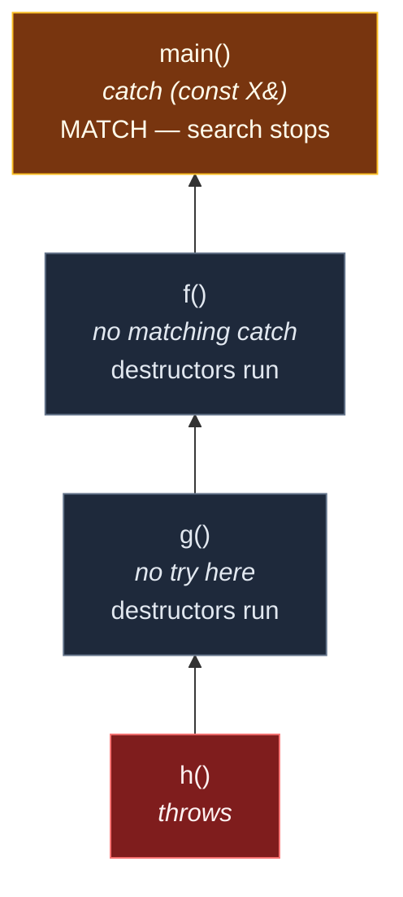

# Exceptions

> [!essence]
> An **exception** is a value thrown from the exact point a function cannot keep its promise, transferred automatically to a **handler** — a `catch` clause of a matching type — however many stack frames separate them, destroying every fully-constructed automatic object in the frames it passes through along the way.

## The Problem

A function three calls deep inside a library detects a failure it has no way to act on: it doesn't know whether the program that called it will retry, ask the user, or give up. [[Error Handling Strategies Compared|Choosing exceptions as the channel]] for that failure is one decision; this note is about the mechanism that decision hands you.

> [!principle] Constraint → Consequence → Design
> 1. **Constraint:** The code equipped to decide what a failure means is often several calls above the code that detects it, and the frames in between usually have no relationship to either — they just happen to sit on the path connecting them.
> 2. **Consequence:** If failure travels the way an ordinary return value does, every one of those intervening frames must mention it: check it, and pass it on. That is work proportional to the number of frames, performed by code that has no use for the answer, and the one line most likely to be skipped under deadline pressure is exactly that relay.
> 3. **Requirement:** The language needs an operation that leaves from the exact statement where the failure is detected, searches upward through frames **without their source code mentioning it at all**, and runs each frame's cleanup on the way past — so a frame that never asked to be exited early isn't left holding a half-acquired resource.
> 4. **Design:** `throw` constructs an **exception object** — a copy of the thrown expression — and hands control to the runtime, which walks up the call stack from the throw point. At each enclosing `try`, it checks that block's `catch` clauses **in the order they are written**, looking for one whose declared type matches the exception object. Every frame it exits on the way has its fully-constructed automatic objects destroyed first ([[RAII|stack unwinding]]). If the search reaches the top of the program with no match, `std::terminate()` runs.
> 5. **Price:** Control can now leave from any statement that calls anything, and nothing in an intervening frame's source text says so — every frame between a `throw` and its `catch` must be safe to abandon partway through, which is exactly the guarantee [[RAII]] exists to supply in advance. The exception object itself must be copy-constructible from the thrown expression, and matching a handler is a plain top-to-bottom search, not overload resolution, so getting the order or the type wrong fails silently rather than refusing to compile.

> [!tension] abstraction ⟷ control
> `throw` buys real abstraction: a function can report failure without knowing, or even being able to know, who will handle it — the call stack does the work of finding out. The price is control: execution can leave any calling expression, invisibly, and the visible text of an intervening frame gives no hint that it might be exited before its last statement runs. Error codes trade that abstraction back for visibility — you can see every place a check might fail, because you wrote the check.

## Mental Model

> [!model] A building-wide alarm, not a phone call
> `throw` is not a phone call to one specific person; it's an alarm pulled on one floor of a building. It doesn't ring only there — it propagates upward automatically, and every floor's occupants leave through the marked exit (their destructors) as they go, whether or not that floor caused the alarm. The evacuation stops at the first floor whose posted procedure names *this* alarm — a `catch` declared for the right type. A floor trained only for "fire" doesn't stop a "flood" alarm; it passes through untouched, and the search continues upward.
> **Where it breaks:** a real fire drill is passive scaffolding. A C++ destructor is active code — it deallocates, closes, unlocks — and there is exactly one alarm live on a given thread's stack at a time (until it's rethrown or a new one is thrown from inside a handler). "Evacuating" isn't optional building policy either: every automatic object in every exited frame is guaranteed to be destroyed, not just the ones someone remembered to wire up.



## Mechanics

| Situation | Rule | Example |
|---|---|---|
| `throw expr;` | Copy-initializes a new **exception object** whose type is `expr`'s type after array-/function-to-pointer decay, with top-level cv-qualifiers removed (`[expr.throw]`) | `throw std::string("x");` throws a plain `std::string`, never a `const` one |
| Search order in one `try` | Its `catch` clauses are tried **in the order they are written**, top to bottom — not by best match | `catch (Base&)` written before `catch (Derived&)` makes the second clause unreachable |
| Type match (`[except.handle]`) | `T` (or `T&`) matches exception object type `E` if `E` and `T` are the same type ignoring top-level cv-qualifiers, **or** `T` is an unambiguous public base of `E` | `catch (const std::exception&)` matches any standard exception, derived or not |
| No match in this `try` | The search continues in the next dynamically enclosing `try` (of the same thread) | An unmatched `catch` block is simply skipped, whatever its position in the source |
| No match anywhere | `std::terminate()` runs; whether the stack unwinds first is implementation-defined | An exception escaping `main` always terminates the program |
| `throw;` (no operand, inside a handler) | Reactivates the **currently handled** exception object itself — no new object is created, so nothing is sliced | Ill-formed to terminate if used while no exception is being handled |
| `throw e;` (naming the caught variable) | Copy-initializes a **new** exception object of `e`'s declared (static) type | Slices to that type if `e`'s declared type is a base of the object actually thrown |

> [!standard] `catch(...)` and handler-parameter initialization
> A `catch (...)` handler matches any type at all and, if present, must be the last handler in its sequence (`[except.handle]`). When the declared handler type `T` is a base of the exception object's type `E`, the parameter is copy-initialized from the corresponding **base-class subobject**, not converted through some other constructor — so a value parameter of the base type genuinely loses the derived part, it doesn't just view it differently.

## Under the Hood

> [!machine] The non-throwing path costs nothing (GCC 11.4.0, x86-64 Linux, this vault's toolchain, `-O2`)
> Two functions differ only in whether the compiler *could* need to throw:
> ```nasm
> compute_might_throw(int, int):        ; if (b==0) throw 1; return a/b;
>         testl   %esi, %esi
>         je      .L3            ; b == 0: jump to the COLD path below
>         movl    %edi, %eax
>         cltd
>         idivl   %esi
>         ret                    ; <-- identical to the noexcept version below
> .L3:                            ; .text.unlikely section — not on the hot path
>         call    __cxa_allocate_exception@PLT
>         call    __cxa_throw@PLT
>
> compute_noexcept(int, int) noexcept:  ; return a/b;   (no throw possible)
>         movl    %edi, %eax
>         cltd
>         idivl   %esi
>         ret
> ```
> The division itself is the only cost either function pays. The exception machinery (`__cxa_allocate_exception`, `__cxa_throw`) is emitted into a separate cold section that the non-throwing path never touches — the same **table-based** model referenced in [[RAII]] and detailed in [[The Cost of Exceptions]]. This vault observed this split; it did not observe run-time timing, which [[The Cost of Exceptions]] covers with numbers.

## In Code

**1 · Handlers are tried in the order they're written, not by best match**

```cpp
#include <iostream>
#include <stdexcept>

struct ParseFailure : std::runtime_error {
    using std::runtime_error::runtime_error;
};

void parse(int code) {
    if (code == 1) throw ParseFailure("bad token");          // ①
    if (code == 2) throw std::out_of_range("index 12 for size 5");
    throw std::string("not even a std::exception");          // ②
}

void run(int code) {
    try {
        parse(code);
    } catch (const ParseFailure& e) {                        // ③ tried first
        std::cout << "parse failure: " << e.what() << '\n';
    } catch (const std::exception& e) {                      // ④ base of ParseFailure too,
        std::cout << "some other exception: " << e.what() << '\n';  //   but never reached for it
    } catch (...) {                                           // ⑤ must be last
        std::cout << "not even a std::exception\n";
    }
}

int main() { run(1); run(2); run(3); }
// expect: parse failure: bad token
// expect: some other exception: index 12 for size 5
// expect: not even a std::exception
```
1. `ParseFailure` derives from `std::runtime_error`, which derives from `std::exception`.
2. A thrown value need not be a `std::exception` at all — any copyable type is a legal exception object.
3. Placed first, so it wins for `code == 1` even though ④ would also match (public-base rule).
4. Catches `std::out_of_range` too, since it publicly derives `std::exception`.
5. `catch (...)` is the only handler that can catch the `std::string`, and it must come last.

**2 · Catching a polymorphic exception by value slices it**

```cpp
#include <iostream>
#include <stdexcept>
#include <string>
#include <utility>

class ConfigError : public std::runtime_error {
public:
    ConfigError(std::string key, std::string reason)
        : std::runtime_error("config error"), key_(std::move(key)), reason_(std::move(reason)) {}
    const char* what() const noexcept override {              // ①
        message_ = key_ + ": " + reason_;
        return message_.c_str();
    }
private:
    std::string key_, reason_;
    mutable std::string message_;
};

void load(const std::string& key) { throw ConfigError(key, "missing required field"); }

int main() {
    try { load("timeout"); }
    catch (std::runtime_error e) {                            // ② by value: slices to the base
        std::cout << "by value:     " << e.what() << '\n';
    }
    try { load("retries"); }
    catch (const std::runtime_error& e) {                     // ③ by reference: no slicing
        std::cout << "by reference: " << e.what() << '\n';
    }
}
// expect: by value:     config error
// expect: by reference: retries: missing required field
```
1. `ConfigError` overrides `what()` to build a message from its own members.
2. The handler parameter's declared type is the base `std::runtime_error`, so — per the rule in *Mechanics* — it is copy-initialized from the base subobject only. `ConfigError::what()` never runs; `std::runtime_error::what()` does. GCC flags exactly this at `-Wall`: *catching polymorphic type `std::runtime_error` by value*. See [[Object Slicing]].
3. A reference binds to the whole object (or its base subobject, without copying it), so the override still fires.

**3 · Bare `throw;` preserves the object; `throw e;` builds a new, sliced one**

```cpp
#include <iostream>
#include <stdexcept>

struct DiskFull : std::runtime_error {
    using std::runtime_error::runtime_error;
};

void write_log() { throw DiskFull("no space left"); }

void save_naive() {
    try { write_log(); }
    catch (const std::runtime_error& e) {
        throw e;                                                // ① throws a NEW std::runtime_error
    }
}
void save_correct() {
    try { write_log(); }
    catch (const std::runtime_error& e) {
        throw;                                                  // ② rethrows the original DiskFull
    }
}

int main() {
    try { save_naive(); }
    catch (const DiskFull&)        { std::cout << "naive: DiskFull\n"; }
    catch (const std::runtime_error&) { std::cout << "naive: only runtime_error\n"; }

    try { save_correct(); }
    catch (const DiskFull&)        { std::cout << "correct: DiskFull\n"; }
    catch (const std::runtime_error&) { std::cout << "correct: only runtime_error\n"; }
}
// expect: naive: only runtime_error
// expect: correct: DiskFull
```
1. `e`'s *declared* type is `std::runtime_error`, so `throw e;` copy-initializes a fresh exception object of that type — the `DiskFull` identity is gone.
2. `throw;` reactivates the exception object that is already live; no new object is built, so its dynamic type (`DiskFull`) survives to the next handler.

**4 · No matching handler anywhere terminates the program**

```cpp
#include <iostream>
#include <stdexcept>

void deep_call() { throw std::runtime_error("nobody is listening"); }  // ①

int main() {
    std::cout << "before\n";
    deep_call();                 // ② search reaches the top with no try/catch at all
    std::cout << "after\n";      // ③ unreachable
}
// cc: norun
```
1. Nothing in this program has a `try` block, so there is no handler sequence to search.
2. The search for a matching handler exits every frame, including `main`, and finds nothing.
3. `std::terminate()` runs (observed on this vault's toolchain: `terminate called after throwing an instance of 'std::runtime_error'`, then `SIGABRT`); this line never executes.

## Pitfalls

> [!trap] Catching by value slices a polymorphic exception
> A handler parameter declared as a base class type is copy-initialized from the base subobject, whichever derived type was actually thrown (In Code 2). GCC's own `-Wcatch-value` warns on exactly this. Catch by `const T&` (or `T&` if you need to mutate before a rethrow). See [[Object Slicing]].

> [!trap] `throw e;` re-slices on rethrow — use bare `throw;`
> Naming the caught variable in a `throw` builds a brand-new exception object of that variable's *declared* type, discarding whatever more-derived type was actually thrown (In Code 3). This is exactly the pointer/value distinction [[Object Slicing]] describes elsewhere, arriving through a different door.

> [!trap] A base-class handler written before a derived one's makes the derived one unreachable
> Matching is a top-to-bottom search of the handler sequence for the entered `try`, not a best-match search like overload resolution. `catch (const std::exception&)` placed before `catch (const std::out_of_range&)` in the same `try` catches every `std::out_of_range` first, silently — most compilers warn ("exception handler unreachable"), but this is not a compile error.

> [!trap] A destructor that throws during unwinding does not add a second exception — it terminates
> If any function invoked by the unwinding machinery itself exits with an exception — most commonly a destructor of an object being unwound — `std::terminate()` is called immediately, before reaching any handler. This is why RAII types [[RAII|must not let their destructors throw]]: there is no "handle both" outcome, only termination.

## Evolution

| Standard | Change | Why |
|---|---|---|
| C++98 | `throw`/`try`/`catch` as described here; `<stdexcept>` hierarchy; dynamic exception specifications `throw(Type...)` on a function declaration | The baseline mechanism, plus a run-time-checked attempt at declaring what a function might throw |
| **C++11** | `std::exception_ptr`, `std::current_exception`, `std::rethrow_exception` (capture an exception object and move or rethrow it later, even on another thread); `noexcept` specifier introduced alongside the dynamic ones | `std::promise`/`std::future` need to carry a failure detected on one thread to a `get()` called on another |
| **C++17** | Dynamic exception specifications removed (only the empty `throw()` survives, as a spelling of `noexcept(true)`); `std::uncaught_exceptions()` (plural, a count) replaces the C++98 `std::uncaught_exception()` (a single bool, deprecated here, removed in C++20) | A checked-at-run-time "might throw X" gave none of `noexcept`'s compile-time benefit and just called `std::unexpected`/`terminate` when violated; a plain bool can't tell "unwinding for the exception I'm already handling" apart from "a second, unrelated exception started," which a nested destructor needs to know |

## Connections

- **Prerequisites:** None formally registered — this note assumes only that a function call places a new frame on the call stack. [[The Call Stack and Stack Frames]] deepens that picture once written.
- **Enables:** [[Stack Unwinding]] (exactly which destructors run, in what order) · [[Designing Exception Hierarchies]] (structuring what you throw) · [[The Cost of Exceptions]] (the "near-zero when it doesn't throw" claim, measured) · [[noexcept]] (declaring a function won't use this channel at all).
- **Siblings:** [[Error Handling Strategies Compared]] (when to reach for this channel instead of an error code or an assertion).
- **Foundation this depends on:** [[RAII]] — stack unwinding is only safe because RAII ties release to scope exit.
- **Hazards:** [[Object Slicing]] (In Code 2 and 3 are both instances of it).
- **Domain:** [[Map — Errors & Contracts]].
- **Practice:** *Continuum #5 Console Calculator REPL* — throw on malformed input instead of returning a sentinel value. *Continuum #26 Custom Exception Hierarchy & Robust CSV Parser* — design a hierarchy this note's handler-matching rules can route correctly.

## Check Yourself

> [!quiz]- Why must `catch (...)` always be the last handler in a `try`'s handler sequence?
> Because it matches every type. Matching is a top-to-bottom search, not a best match, so any handler written after a `catch (...)` could never be reached — the language makes this a rule rather than a silent dead-code trap.

> [!quiz]- A `try` has `catch (const std::exception&)` followed by `catch (const std::out_of_range&)`. A function inside the `try` throws `std::out_of_range`. Which handler runs?
> The first one, `catch (const std::exception&)` — `std::out_of_range` publicly derives `std::exception`, so it matches by the base-class rule, and handlers are tried in the order written. The second handler is unreachable for this exception (most compilers warn).

> [!quiz]- Inside a `catch (const Base& e)` block, what is the difference between `throw e;` and `throw;`, if the object actually thrown was a `Derived`?
> `throw e;` copy-initializes a new exception object of `e`'s *declared* type, `Base` — the `Derived` identity is lost. `throw;` reactivates the existing exception object with no new copy, so its dynamic type, `Derived`, survives to the next handler.

> [!quiz]- What happens if a destructor throws while another exception is already unwinding the stack, and why isn't it "handled" like an ordinary throw?
> `std::terminate()` is called immediately. The unwinding machinery itself is not inside a `try` that could catch a second exception from a destructor it invokes, so there is no handler to search for — the language defines this case as an immediate, unconditional terminate.

## Sources

- Primer §5.6 "Try Blocks and Exception Handling" (pp. 195–196): the search-reverses-the-call-chain description and `terminate` when no `try` block exists anywhere. §5.6.3 "Standard Exceptions" (pp. 197–198): the `<stdexcept>` hierarchy and what each class's constructor requires.
- Tour §4.2 "Exceptions" (p. 44) and §4.3 "Invariants" (pp. 45–46): `throw`/`catch` motivated from a `Vector::operator[]()` example; catching by reference to avoid a copy; rethrowing with bare `throw;` versus calling `std::terminate()` directly when a handler can't cope.
- PPP §4.6 "Exceptions" (ch. 4 "Errors!"): exceptions introduced alongside bad-argument and range-error handling, before the standard hierarchy is assumed.
- cppreference, *Throwing exceptions* (exception-object construction, rethrow semantics, stack-unwinding order, when unwinding itself calls `terminate`): https://en.cppreference.com/w/cpp/language/throw
- cppreference, *Handling exceptions* (handler matching rules, `catch(...)` ordering, handler-parameter initialization from a base subobject): https://en.cppreference.com/w/cpp/language/catch
- cppreference, *`std::uncaught_exception`, `std::uncaught_exceptions`* (C++17 replacement and why a count, not a bool): https://en.cppreference.com/w/cpp/error/uncaught_exception
- Draft standard `[expr.throw]` (throw-expression semantics) and `[except.handle]` (matching and handler-parameter initialization): https://eel.is/c++draft/expr.throw · https://eel.is/c++draft/except.handle
