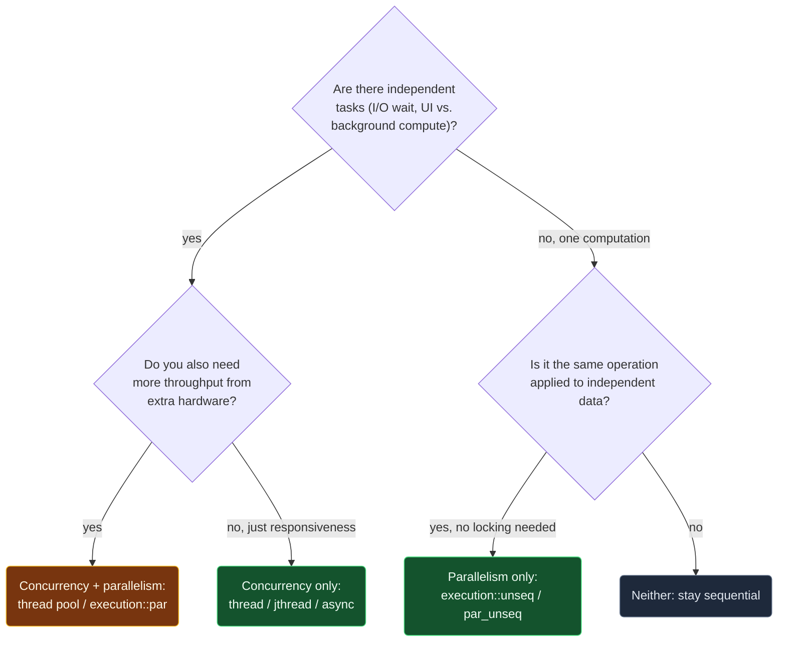

# Concurrency vs Parallelism

> [!essence]
> **Concurrency** is a property of a program's *structure*: two or more logically independent tasks exist, and the runtime is free to interleave their progress however it likes — even on a single core, one instruction at a time. **Parallelism** is a property of *execution*: two or more computations are physically happening at the same instant, which requires more than one execution unit. Neither implies the other, and most of what C++'s concurrency library offers is a way to ask for one, the other, or both, at a cost you choose.

## The Question

A program is described as "concurrent" or "parallel" almost interchangeably in casual conversation, but C++ hands you separate tools for each, and picking the wrong one either wastes hardware or wastes effort. Before reaching for `std::thread` or `std::execution::par`, the real question is: do you need the program *structured* as independent tasks, or do you need a computation *executed* faster by more hardware? Those are different problems with different failure modes.

> [!principle] Why the vocabulary has to split
> 1. **Constraint.** A single core executes one instruction stream at a time; a program with independent parts — one waiting on a disk read while another keeps computing — still has to make progress on all of them without literally running them simultaneously.
> 2. **Consequence.** If "concurrent" meant "simultaneous," a single-core machine could never run a concurrent program correctly, yet operating systems have time-sliced independent tasks on one core since long before multi-core hardware existed.
> 3. **Requirement.** The language needs a word for "these tasks are logically independent and may be interleaved in any order" that says nothing about how many execution units actually exist, and a separate word for "these computations are overlapping in physical time," which does depend on the hardware.
> 4. **Design.** C++ keeps the two ideas in separate parts of the library: `std::thread`/`std::jthread` create concurrent tasks whose scheduling is left open (Tour §18.2, p. 238); `std::execution::par` and vectorized execution request parallelism, and the Standard formalizes exactly how strong a progress guarantee each request buys (`[intro.progress]`).
> 5. **Price.** A programmer who conflates the two either under-uses hardware (writing sequential code when parallel hardware sits idle) or over-synchronizes correct concurrent code (adding locks a single core never needed) — see [[Data Races and Race Conditions]] for what happens when concurrency's independence assumption is violated instead.

The clearest way to see the difference is on a timeline. Two tasks, `A` and `B`, can be concurrent without ever overlapping in time:

```text
 CONCURRENCY (1 core, preemptive time-slicing)        PARALLELISM (2 cores)
 core0: [ A ][ B ][ A ][ B ][ A ][ B ]                 core0: [ A ][ A ][ A ][ A ]
                                                        core1: [ B ][ B ][ B ][ B ]
 time ──────────────────────────────▶                  time ──────────────────────▶
```

On the left, `A` and `B` never execute at the same instant — the core switches between them — yet the program is still concurrent: the tasks are structured as independent, and their relative order is not fixed by the code. On the right, `A` and `B` genuinely overlap: that overlap is what parallelism *means*, and it needs a second core to exist at all.

## At a Glance

| Criterion | Concurrency | Parallelism |
|---|---|---|
| **What it's a property of** | program **structure**: independent tasks that may be interleaved | program **execution**: computations that physically overlap in time |
| **Needs more than one execution unit** | ✗ one core, time-sliced, is enough | ✓ needs ≥2 units doing work at the same instant (cores, or SIMD lanes within one core) |
| **Needs more than one logical task** | ✓ yes — otherwise nothing to interleave | ~ not always: vectorized (SIMD) parallelism does one task's data in lockstep |
| **Primary goal (Tour §18.1, p. 237)** | *responsiveness*: one part progresses while another waits | *throughput*: using more processors for one computation |
| **Forward-progress guarantee (`[intro.progress]` ¶6–8)** | **concurrent**: a `thread`/`jthread` is guaranteed to *eventually* make progress, regardless of the other threads | **parallel** (`execution::par`) or **weakly parallel** (`execution::unseq`/`par_unseq`): a started lane keeps going, or nothing guarantees it resumes at all |
| **Safe to take a lock inside it** | ✓ yes — a blocked thread with concurrent guarantees will be rescheduled | ~ only under `par`'s parallel guarantee; **✗ never** under `unseq`/`par_unseq`'s weakly parallel one (cppreference, *execution policy tag*) |
| **C++ facility** | `std::thread`, `std::jthread`, `std::async` | `std::execution::par` (multi-core), `std::execution::unseq`/`par_unseq` (vectorized) |
| **What goes wrong if you skip it** | undefined behavior on shared data: [[Data Races and Race Conditions]] | no extra hazard beyond concurrency's, but idle hardware if the work can't actually be split |

## Deep Dive

### Concurrency: structuring for independent progress

Concurrency is a claim about a program's *structure*, not about the clock: two or more tasks are set up so that neither depends on a fixed order relative to the other, and the runtime is free to interleave them however it wants — including running them one instruction at a time on a single core. `std::thread` and `std::jthread` (found in `<thread>`) each launch a task — a function or a function object — and the Standard leaves it unspecified whether that task ever runs alongside another one on separate hardware (Tour §18.2, p. 238). What C++ does promise is captured precisely, not loosely, by the *concurrent forward progress guarantee*: for a thread providing it, "the implementation ensures that the thread will eventually make progress for as long as it has not terminated," regardless of whether any other thread is making progress (`[intro.progress]` ¶6). Note what that sentence does *not* say: nothing about simultaneity, only that starvation cannot continue forever. That is exactly the "one core, time-sliced" case from the diagram above — a scheduler that never lets a runnable thread starve satisfies the guarantee without ever running two threads at the same instant.

General-purpose implementations are expected to give both the thread that runs `main` and every `std::thread`/`std::jthread` this concurrent guarantee (`[intro.progress]` ¶7). That is what makes launching a thread purely to overlap a blocking I/O wait with other work a legitimate, portable concurrency technique even on single-core hardware — the goal is responsiveness, and responsiveness needs interleaving, not simultaneity.

### Parallelism: executing at the same instant

Parallelism is a claim about *execution*: multiple computations are physically happening right now, which is only possible with more than one execution unit. C++ recognizes two distinct forms of it, and the Tour is explicit that they are not the same mechanism: "parallel execution: tasks are done on multiple threads (often running on several processor cores)" versus "vectorized execution: tasks are done on a single thread using vectorization, also known as SIMD" (Tour §13.6, p. 183). The second form is the sharpest proof that parallelism and concurrency are independent axes: a vectorized loop runs on exactly *one* thread — there is no second task to interleave, so there is no concurrency in the structural sense — yet several data lanes are processed in the same instruction, at the same instant, which is genuine parallelism.

The Standard grades exactly how strong a parallelism guarantee each request buys. `std::execution::par` asks the library for *parallel forward progress*: a lane that has started is guaranteed to keep going once scheduled, which is exactly strong enough to let it take a lock — "the thread that has the lock will be eventually scheduled again and be able to release it" (cppreference, *execution policy tag*, `parallel_policy`). `std::execution::unseq` and `par_unseq` ask for only *weakly parallel forward progress*: nothing guarantees a paused lane is ever resumed, so a lock acquired there might never be released, and the Standard treats such "vectorization-unsafe" operations under these policies as forbidden — using one is undefined behavior, not merely slow (cppreference, *execution policy tag*, Notes). Concurrent forward progress is strictly the strongest of the three; parallel is next; weakly parallel is weakest (`[intro.progress]` ¶12) — which is the formal version of "a `thread` may block; a vectorized lane may not."

## Decision Guide



1. **Independent tasks with no extra throughput need** → plain concurrency: `std::thread`/`std::jthread`, or `std::async` for a result you'll collect later.
2. **Independent tasks *and* more raw throughput** → combine them: a thread pool ([[Thread Pools and Task Queues]]) or `std::execution::par`, both of which are concurrent *and* — when hardware cooperates — parallel.
3. **One computation, data-parallel, no shared mutable state to protect** → vectorization: `std::execution::unseq`/`par_unseq`, or simply trust the compiler's auto-vectorizer.
4. **One computation that needs to touch shared state under a lock while "parallel"** → that rules out `unseq`/`par_unseq` outright; use `par` (or plain threads) instead, because only they carry a strong enough forward-progress guarantee to make locking safe.

## In Code

**1 · Concurrency without guaranteed parallelism**

```cpp
#include <thread>
#include <vector>
#include <numeric>
#include <iostream>

long partial_sum(const std::vector<int>& data, std::size_t from, std::size_t to) {
    return std::accumulate(data.begin() + from, data.begin() + to, 0L);
}

int main() {
    std::vector<int> data(1'000'000, 1);
    long left = 0, right = 0;
    std::thread worker([&] { left = partial_sum(data, 0, data.size() / 2); });  // ①
    right = partial_sum(data, data.size() / 2, data.size());                   // ②
    worker.join();                                                             // ③
    std::cout << left + right << '\n';
}
// expect: 1000000
```
1. `worker` and the calling thread are two independent tasks: the code never states whether they run on separate cores or are time-sliced on one — that is exactly the part concurrency leaves open.
2. The calling thread does its own half while `worker` runs its half — the "structuring" half of concurrency: two tasks genuinely exist.
3. `join()` waits for completion before either half is read, so `left` and `right` are each written and read by exactly one thread — no data race, whether or not the two halves ever overlapped in time.

**2 · Parallelism with a safety net `par` allows**

```cpp
#include <execution>
#include <algorithm>
#include <vector>
#include <atomic>
#include <iostream>

int main() {
    std::vector<int> readings(100'000, 3);
    std::atomic<long> total{0};                                                    // ①
    std::for_each(std::execution::par, readings.begin(), readings.end(),
                  [&](int r) { total.fetch_add(r, std::memory_order_relaxed); });   // ②
    std::cout << total.load() << '\n';
}
// expect: 300000
```
1. An atomic accumulator, not a plain `long`: `par` may run this lambda across several worker threads at once, so the update must be indivisible.
2. Legal specifically because `par` carries a *parallel* forward-progress guarantee: any lane the library schedules is guaranteed to keep going, so contending on the atomic cannot stall forever. `par` is a request, not a mandate — the library may still run this sequentially if it judges that faster.

**3 · What `par_unseq` forbids, and why**

```cpp
// cc: ub norun
#include <execution>
#include <algorithm>
#include <vector>
#include <mutex>

int main() {
    std::vector<int> readings(100, 1);
    std::mutex m;
    long total = 0;
    std::for_each(std::execution::par_unseq, readings.begin(), readings.end(),
                  [&](int r) {
                      std::lock_guard<std::mutex> guard(m);   // ①
                      total += r;
                  });
}
```
1. Acquiring `m` is a synchronizing operation, and `par_unseq` promises only *weakly parallel* forward progress: nothing guarantees the lane holding the lock is ever resumed to release it, so another lane can wait forever. The Standard makes this specific combination undefined behavior rather than merely slow — it is never run for real in this Atlas (`// cc: norun`), because on real hardware it can hang indefinitely.

## Connections

- **This is the domain's entry point:** [[Map — Concurrency]] — every later D12 topic assumes this vocabulary.
- **Structures the tasks this note calls "concurrent":** [[Threads — thread and jthread]].
- **What happens without discipline on shared data:** [[Data Races and Race Conditions]].
- **The library-level parallelism this note only sketches:** [[Parallel Algorithms and Execution Policies]] · [[Atomics]] (the tool that made *In Code* §2 safe).
- **Real-hardware form of parallelism:** [[Map — Performance & the Machine]] (SIMD, multiple cores).
- **Practice:** *Continuum #29* (concurrent task structuring) · *#35* (a thread-pool exercise that deliberately mixes both axes).

## Check Yourself

> [!quiz]- A program runs two threads on a single-core CPU that time-slices between them. Is this program concurrent? Is it parallel?
> Concurrent: yes — two independent tasks exist and the runtime interleaves their progress. Parallel: no — only one instruction executes at any instant, so there is no physical overlap in time, which is what parallelism requires.

> [!quiz]- Why does `std::execution::par_unseq` forbid taking a `std::mutex` inside its callback, when `std::execution::par` allows it?
> `par` carries a *parallel* forward-progress guarantee: a scheduled lane is guaranteed to keep running once it starts, so the lane holding the lock will eventually release it. `par_unseq` carries only a *weakly parallel* guarantee: a lane may never be resumed once paused, so a lock it holds could never be released — the Standard treats this as undefined behavior, not just a performance trap.

> [!quiz]- A vectorized (SIMD) loop processes eight array elements per instruction on a single thread. Does this count as concurrency, as parallelism, or both?
> Parallelism only. There is exactly one thread — no second independent task exists to interleave, so there is no concurrency in the structural sense — but eight computations genuinely happen in the same instant inside one instruction, which is what parallelism means.

## Sources

- Tour §18.1 "Introduction" (p. 237): concurrency's two goals, throughput and responsiveness. Tour §18.2 "Tasks and threads" (p. 238): `thread`/`jthread` leave scheduling onto real hardware unspecified; threads share an address space, so communication needs synchronization. Tour §13.6 "Parallel Algorithms" (p. 183): the parallel-execution vs. vectorized-execution distinction and the `seq`/`par`/`unseq`/`par_unseq` execution policies.
- Pikus ch. 6 "Concurrency and Performance", §"What is needed to use concurrency effectively?" (p. 200–201): efficient concurrency needs enough independent work and minimal shared-data contention — the practical concern this note's vocabulary exists to make precise.
- cppreference, *std::execution::sequenced_policy, parallel_policy, parallel_unsequenced_policy, unsequenced_policy* (§Notes: the parallel vs. weakly-parallel forward-progress guarantees, and why locking under `par_unseq` is forbidden): https://en.cppreference.com/w/cpp/algorithm/execution_policy_tag_t
- Draft standard `[intro.progress]` ¶6–8, ¶12 (concurrent, parallel and weakly parallel forward-progress guarantees, and their strict ordering): https://eel.is/c++draft/intro.progress
