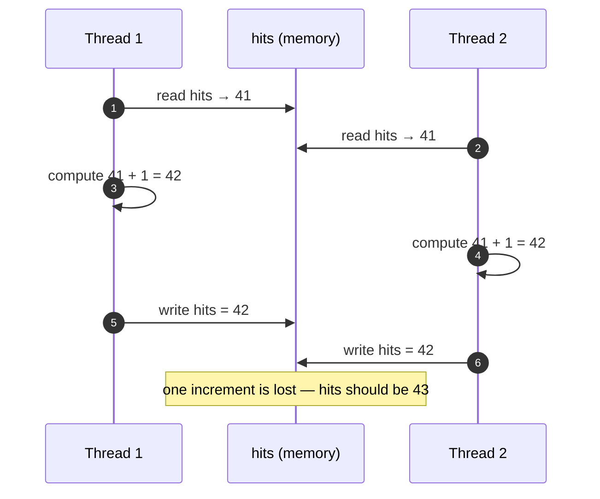

# Data Races and Race Conditions

> [!essence]
> A **data race** is two threads touching the same memory location with no synchronization between them, at least one of them writing. C++ does not call that "a wrong answer" — it calls the whole program's behavior **undefined**. A **race condition** is the wider, older idea: any bug where the outcome depends on timing you don't control. Every data race is a race condition, but a program can have a race condition with no data race at all, or a data race that corrupts nothing anyone cares about — so removing one does not automatically remove the other.

## Symptom

- The same binary, run on the same input, prints a different answer on different runs — nondeterminism that tracks the scheduler, not your test data.
- A test suite passes thousands of times on a laptop and fails once in CI, especially on a busier machine or one with more cores: more real interleavings exist for the bug to fall into.
- The bug moves or vanishes when you add a `std::cout`, attach a debugger, or build with a different optimization level ("Heisenbug"): each of those changes the exact timing window the race needs.
- A shared counter or container ends up *lower* than the sum of what every thread fed into it. Nothing crashes; an update is simply lost.

## Root Cause

> [!principle] Why unsynchronized sharing is UB, not just "risky"
> 1. **Constraint.** Modern hardware runs more than one instruction stream at once, and an operation as small as `++hits` is not one step: the processor reads the value, adds one, and writes it back — three separate accesses to the same memory location (Pikus p. 169).
> 2. **Consequence.** If two threads interleave those three steps on the same location with nothing ordering one thread's steps against the other's, both can read the same starting value, compute the same "next" value, and the thread that writes second simply erases the first thread's contribution. No crash, no diagnostic — just a quietly wrong total.
> 3. **Requirement.** The language needs an exact boundary between "the compiler and the hardware may assume this location is never touched by another thread" (so ordinary single-threaded code keeps every optimization it already had) and "this is a point where threads must agree on order."
> 4. **Design.** `[intro.races]` draws that boundary: two evaluations *conflict* if one writes a memory location the other reads or writes; if conflicting evaluations are *potentially concurrent* (different threads), at least one is not atomic, and neither *happens-before* the other, the program contains a **data race** — and that makes the entire execution's behavior undefined, not merely the value of the racing variable. A mutex's unlock *synchronizes with* the next thread's lock on the same mutex, which is what supplies the missing happens-before edge; `std::atomic` operations are simply exempted from conflicting with each other at all.

> [!standard]
> The clause is `[intro.races]` in every standard since C++11; only its numeric prefix moves between drafts (the current working draft places it at §6.10.2.2). Cite the clause tag, not the number, since the number is not stable (cppreference, *Multi-threaded executions and data races*; eel.is/c++draft/intro.races).

The failure always has the same shape: two threads each do *read → compute → write* on one location, and their steps interleave instead of running one after the other.



**Data race and race condition are independent axes**, not two names for the same bug (after Regehr, *Race Condition vs. Data Race*):

| Scenario | Data race? | Race condition? |
|---|---|---|
| Two threads `++` a shared `int` counter, no lock | yes — unsynchronized conflicting access | yes — the final total comes out wrong |
| Two threads each separately lock *check the balance*, then *debit it*, as two short critical sections | no — every access to the balance is lock-protected | yes — a second transfer can land between the two locks and spend money that was already promised |
| Two threads race, unsynchronized, on a `lastTouchedBy` debug flag that no decision in the program reads | yes — still a conflicting access with no happens-before edge | no — nothing the program does depends on which write wins |
| One lock wraps the entire check-then-debit as a single critical section | no | no |

A data-race-free program is therefore necessary for well-defined behavior, but it is not by itself evidence that the program is *correct* — the second row above has no UB and is still broken.

## Minimal Reproduction

```cpp
// cc: ub
#include <iostream>
#include <thread>
#include <vector>

int main() {
    int hits = 0;                                    // ① plain int: nothing marks it as shared
    std::vector<std::thread> workers;
    for (int t = 0; t < 4; ++t)
        workers.emplace_back([&hits] {
            for (int i = 0; i < 100'000; ++i)
                ++hits;                               // ② read-compute-write, not one step
        });
    for (auto& w : workers) w.join();
    std::cout << hits << '\n';                        // ③ data race on every iteration above
}
```
1. `hits` has automatic storage and no synchronization primitive anywhere near it — nothing in its type stops two threads from reading and writing it at once.
2. Each `++hits` is the three-step sequence from the *Root Cause* diagram. Four threads perform 400,000 of these on the same memory location, none atomic, no mutex or atomic establishing a *happens-before* edge between any pair of them.
3. By `[intro.races]` this program contains a data race the moment two of those increments overlap, and the Standard then makes no claim at all about the printed value — not "probably wrong," simply unconstrained.

Compiled with GCC 11.4 on x86-64 Linux (`-pthread`), this program is not a reliable demonstration of its own bug: at `-O2` with four threads it printed the full, correct total (`400000`) in every repeated run observed here; the race was present by the Standard's definition, but nothing visible came of it. Shrinking it to two threads at `-O0` on the same machine did produce visible lost updates (totals near half the expected `200000` in repeated runs). Both observations are reported honestly because they make the same point from opposite directions: a data race's *absence of a wrong-looking answer is not evidence of correctness*, and its presence doesn't need a particular optimization level or thread count to be real.

## Detection

| Tool | Catches it? | How |
|---|---|---|
| Compiler warnings (`-Wall -Wextra`) | no | A data race is a dynamic, cross-thread property; no standard warning flag inspects it. (GCC's `-Wunsequenced` catches a different, single-thread problem: unsequenced evaluation order, not inter-thread races.) |
| **ThreadSanitizer** (`-fsanitize=thread`) | yes, at run time | Instruments every memory access and every synchronization operation and reports the two actual racing accesses with both stack traces (GCC/Clang, Linux/macOS). It only sees interleavings the run actually exercises — a race that didn't fire that run goes unreported. |
| Valgrind (Helgrind / DRD) | partial | Flags many locking-discipline violations and races without recompiling, at roughly 20–50× slowdown; less actively maintained than TSan. |
| Static analysis (Clang Thread Safety Analysis, `-Wthread-safety`) | partial | Checks that every access to a variable annotated `GUARDED_BY(mutex)` goes through that mutex — real coverage, but only where the annotations exist. |
| Code review heuristic | yes, if asked | For every variable written from more than one thread: "which lock or atomic guards this, and can you point to every access going through it?" (Pikus p. 214's own test.) |

## Fix

**✗ Racing on a plain `int`:**

```cpp
// cc: ub
#include <iostream>
#include <thread>

int main() {
    int hits = 0;
    std::thread a([&hits] { for (int i = 0; i < 100'000; ++i) ++hits; });
    std::thread b([&hits] { for (int i = 0; i < 100'000; ++i) ++hits; });
    a.join();
    b.join();
    std::cout << hits << '\n';   // data race: the Standard makes no claim about this value
}
```

**✓ `std::atomic` makes the increment itself indivisible:**

```cpp
#include <atomic>
#include <iostream>
#include <thread>

int main() {
    std::atomic<int> hits{0};
    std::thread a([&hits] { for (int i = 0; i < 100'000; ++i) ++hits; });
    std::thread b([&hits] { for (int i = 0; i < 100'000; ++i) ++hits; });
    a.join();
    b.join();
    std::cout << hits << '\n';
}
// expect: 200000
```

`std::atomic<int>::operator++` is a single read-modify-write operation that cannot be observed half-done, and `[intro.races]` exempts atomic operations from conflicting with each other at all — so this program has no data race, and prints `200000` on every run (observed here, GCC 11.4, x86-64 Linux, `-O2`). The two threads still race for *which one goes first*, but that race has no data race in it, because neither can see the other's increment partway through.

An atomic only guarantees the indivisibility of *one* operation on *one* object. The moment an invariant spans more than one memory location, or more than one operation needs to look atomic as a group — the second row of the *Root Cause* table — an atomic variable cannot help, and the fix is a [[Mutexes and Lock Guards|mutex]] around the whole group instead.

## Prevention Rules

> [!rule] Name a guard for every piece of shared, writable state
> For every variable more than one thread can write, be able to say which mutex or which atomic protects it, and verify every access actually goes through that guard (*Core Guidelines* CP.2, "Avoid data races"). "It's probably fine" is not a guard.

> [!rule] Reach for `atomic` only for a single object; reach for a mutex for an invariant
> An atomic variable is free of data races by itself, but it says nothing about any *other* variable's relationship to it. If correctness depends on two or more pieces of state agreeing with each other, wrap the whole operation in one [[Mutexes and Lock Guards|mutex]]-protected critical section instead of making each piece separately atomic.

> [!rule] Run the test suite under ThreadSanitizer, not only ASan/UBSan
> ASan and UBSan do not look for data races; only ThreadSanitizer does. A build that is "clean" under every other sanitizer can still contain a data race that has simply never fired.

> [!rule] "No data race" is the floor, not the proof of correctness
> Fixing the race in the *Root Cause* table's top-left cell does not fix the kind in its bottom-left cell: a program built entirely from correctly-locked individual operations can still be wrong if the lock boundaries don't match the invariant the program actually needs.

## Connections

- **Root concept:** [[Threads — thread and jthread]] (the unit that makes sharing possible) · [[Undefined Behavior]] (what a data race triggers) · [[The C++ Memory Model — happens-before]] (the exact rule a mutex or atomic satisfies).
- **Structural cures:** [[Mutexes and Lock Guards]] (serialize a critical section) · [[Atomics]] (make one object's operations indivisible without a lock).
- **Related hazards:** [[Deadlock]] (the cost of the obvious fix: holding more than one guard at once) · [[Dangling Pointers and References]] (a sibling family of legal-looking code whose execution is UB).
- **Domain:** [[Map — Concurrency]].
- **Practice:** *Continuum #29 Multithreaded Producer-Consumer*: build the shared queue with a mutex from the start and verify under ThreadSanitizer that no access to it skips the lock.

## Check Yourself

> [!quiz]- The racy counter example printed the exact correct total every time at `-O2` with four threads, but undercounted at `-O0` with two. Does the `-O2` run prove the program is correct?
> No. `[intro.races]` makes the entire execution's behavior undefined the moment the race occurs — it does not promise a wrong-looking value, only that nothing is promised. A data race that happens to look fine on one compiler, flag set, and core count can look wrong on the next.

> [!quiz]- A program protects every access to `balance` with the same mutex, but does so in two separate critical sections: one that checks `balance >= amount`, and a second, later one that subtracts `amount`. Is this free of data races? Is it free of race conditions?
> Free of data races: every read and write of `balance` happens inside a lock on the same mutex, so no two accesses conflict without a happens-before edge between them. Not free of race conditions: another thread can subtract from `balance` between the check and the debit, so the checked condition can be stale by the time the debit runs — the fix is one critical section spanning the whole check-then-debit sequence, not two smaller ones.

> [!quiz]- Why does marking only the `hits` variable `std::atomic` fix the Minimal Reproduction but would *not* fix the bank-transfer example in the table above?
> The reproduction's entire bug is one operation (`++hits`) on one object, which is exactly what an atomic makes indivisible. The transfer's bug is an invariant — "the balance checked must still be the balance debited" — that spans two operations and, in general, two accounts; no single atomic object can make a relationship between several memory locations indivisible, which is what a mutex-protected critical section is for.

## Sources

- Pikus, §"Understanding the cost of memory synchronization" (p. 169): the read-increment-write shape of `++x`, and the general rule that any unsynchronized multi-thread access to one memory location with at least one write is undefined.
- Pikus, §"Lock-based versus lock-free, what is the real difference?" (p. 214): correct locking discipline eliminates data races "although you may have deadlocks and other problems" — the seed of the data-race/race-condition split.
- Pikus, §"Lock-free stack" (p. 265): ThreadSanitizer detects *potential* data races, not only ones that happen to fire during a given test run.
- Tour §18.2 "Tasks and threads" (p. 239): threads share one address space; locks and similar mechanisms exist "to prevent data races (uncontrolled concurrent access to a variable)."
- cppreference, *Multi-threaded executions and data races*: https://en.cppreference.com/w/cpp/language/multithread
- Draft standard, `[intro.races]`: https://eel.is/c++draft/intro.races
- John Regehr, "Race Condition vs. Data Race": https://blog.regehr.org/archives/490
- C++ Core Guidelines, CP: Concurrency and parallelism, rule CP.2 "Avoid data races": https://isocpp.github.io/CppCoreGuidelines/CppCoreGuidelines
