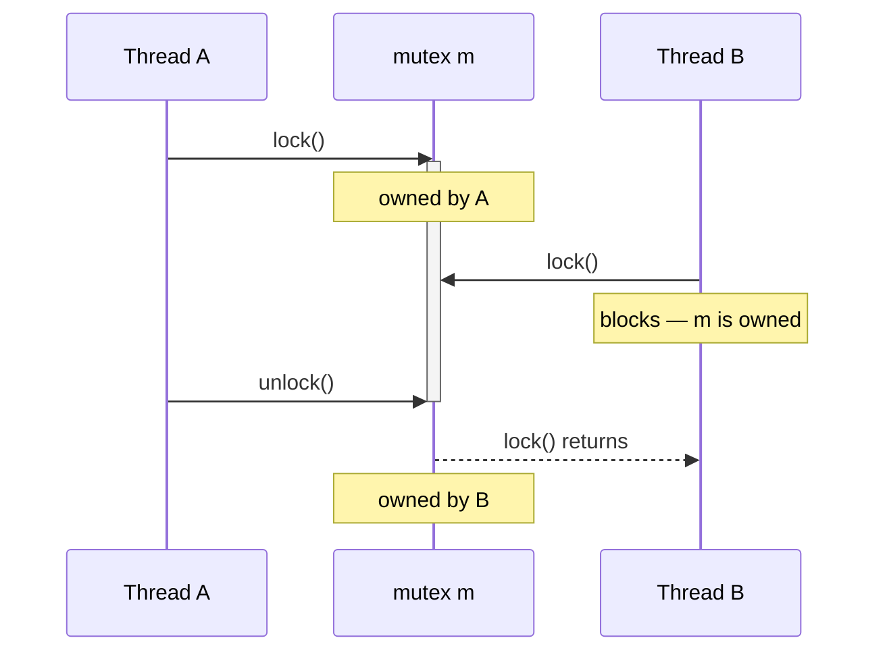

# Mutexes and Lock Guards

> [!essence]
> A **mutex** is an object that at most one thread may own at a time; a thread acquires it with `lock()` and gives it back with `unlock()`, and while it is owned every other thread calling `lock()` blocks. A **lock guard** (`lock_guard`, `unique_lock`, `scoped_lock`) is an RAII handle that ties ownership of a mutex to an object's lifetime, so `unlock()` happens automatically — on every exit path, including an exception — without the programmer having to remember it.

## The Problem

[[Threads — thread and jthread]] establishes that every thread in a process shares one address space. [[Data Races and Race Conditions]] establishes the cost of that sharing: two threads touching the same object with no discipline, at least one of them writing, is a **data race** — undefined behavior, not just a wrong answer. This note is about the discipline itself: the tool that turns "don't do this concurrently" into something the program actually enforces.

> [!principle] Constraint → Consequence → Design
> 1. **Constraint.** Some data genuinely has to be shared and mutated by more than one thread — a cache, a counter, a queue. The hardware offers no automatic protection for an ordinary read or write of such an object; it runs at full, unsynchronized speed whether that is safe or not.
> 2. **Consequence.** If nothing stops two threads from overlapping while one of them writes, they *will* overlap eventually — not because of bad luck, but because nothing in the program says they can't. The result is a data race, and the Standard makes no promise whatsoever about what the program does next ([[Data Races and Race Conditions]]).
> 3. **Requirement.** The language needs an object with exactly one property: at most one thread may hold it at a time, and a thread that wants it while another holds it must wait rather than proceed. Every thread that touches the shared data must agree, by convention, to hold that object first — the language never ties a mutex to the data it guards, so which mutex protects which data is a discipline the programmer has to maintain, not something the compiler checks (Tour §18.3, p. 242).
> 4. **Design.** C++11 added `std::mutex` (`<mutex>`): a **mutual exclusion object** with `lock()`, `try_lock()`, `unlock()`. A thread *owns* the mutex from a successful `lock()`/`try_lock()` until it calls `unlock()`; every other thread's `lock()` blocks until then (Tour §18.3.1, p. 241). But calling `lock()` and `unlock()` by hand has the same failure mode as manual `new`/`delete`: any early `return`, any thrown exception between the two calls, and the mutex stays locked forever. So the library wraps the raw mutex in the same pattern [[RAII]] already uses for memory and files — `lock_guard`, `unique_lock`, `scoped_lock` acquire in their constructor and release in their destructor, so the mutex is unlocked on *every* path out of the scope, not just the one the programmer remembered to write.
> 5. **Price.** A thread that cannot get the mutex does not fail — it **blocks**, parking itself until the mutex is free. That is correctness bought with waiting, and waiting is exactly the "serialized fraction" [[Map — Concurrency|this domain's own reading of Amdahl's Law]] says caps a program's speedup. Holding more than one mutex at a time reopens a second problem the single-mutex design doesn't have: [[Deadlock]].

> [!tension] safety ⟷ performance
> An unsynchronized read or write is the fastest access the hardware can do. A mutex buys the right to share data safely by making a thread that loses the race *wait* instead of racing ahead — real wall-clock time traded for a guarantee. [[Map — Concurrency|The domain draws this line deliberately]]: private data stays at full hardware speed, and only data actually named as shared pays the tax.

## Mental Model

> [!model] A single key to a shared room
> A mutex is one key to one room. Whoever holds the key may enter and touch what's inside; everyone else waits at the door. A lock guard is a magic key that returns itself to the hook the instant you leave the room by *any* exit — the front door, a window, even a trapdoor that drops you out unexpectedly (an exception unwinding the stack). You can't forget to return it, because returning it isn't something you do — it's something that happens when your scope ends.
> **Where it breaks:** a room has one door; a `std::mutex` is **non-recursive** — if the thread already holding the key tries to take it again, there is no second key to hand out, and (unlike a real room) nothing warns it: it is undefined behavior to call `lock()` on a mutex your own thread already owns. A `recursive_mutex` is a different object that *does* hand the same thread repeated keys, one per `lock()` call, and expects them all back before anyone else may enter.



## Mechanics

The Standard's vocabulary: a thread **owns** a mutex from a successful `lock()`/`try_lock()` until its `unlock()`. `std::mutex` offers **exclusive, non-recursive** ownership — one owner, and that owner must not already be the calling thread (cppreference, *std::mutex*).

| Situation | Rule | Example |
|---|---|---|
| `m.lock()` | Blocks until no other thread owns `m`, then takes ownership | Direct use is rare — see the RAII wrappers below |
| `m.try_lock()` | Takes ownership and returns `true` only if `m` is free *right now*; never blocks | Useful when there is other work to do instead of waiting |
| `m.unlock()` | Releases ownership; a blocked `lock()` elsewhere may now proceed | Must be called exactly once per successful `lock()`/`try_lock()` |
| Calling thread already owns `m`, calls `m.lock()` again | **Undefined behavior** — `std::mutex` is non-recursive | Use `std::recursive_mutex` if a thread genuinely must re-enter |
| `m` destroyed while owned, or owning thread terminates while it owns `m` | **Undefined behavior** | Always release before the mutex or the thread goes away |

> [!standard] Exclusive, non-recursive ownership (cppreference, *std::mutex*)
> "A calling thread must not own the mutex prior to calling `lock` or `try_lock`." A second `lock()` by the same thread is not queued and not an error the implementation is required to detect — it is undefined behavior, and on most platforms it self-deadlocks: the thread waits forever for a key it is already holding.

**The three RAII wrappers** differ in exactly one dimension: how much control they trade for simplicity.

| Wrapper | Since | Mutexes | Movable | Can unlock/relock mid-scope | Typical role |
|---|---|---|---|---|---|
| `lock_guard<M>` | C++11 | exactly 1 | ✗ | ✗ | the default: lock for the whole scope, nothing more |
| `unique_lock<M>` | C++11 | exactly 1 | ✓ | ✓ (`lock()`, `unlock()`, `try_lock()` members) | condition variables; early release; transfer of ownership |
| `scoped_lock<M...>` | C++17 | 0 or more | ✗ | ✗ | locking **several** mutexes together, deadlock-free |

`scoped_lock` with exactly one mutex is not a convenience shorthand with hidden cost — it compiles to the identical code `lock_guard` does (verified below). With two or more, it locks all of them using the same **deadlock-avoidance algorithm** as the free function `std::lock()` (C++11): try one, try the next, and if any attempt would block, release what's already held and retry in a different order, until all are acquired together (cppreference, *std::scoped_lock*; Pikus p. 295). That algorithm is what actually prevents the classic deadlock Tour describes: thread 1 takes `mutex1` then wants `mutex2` while thread 2 takes `mutex2` then wants `mutex1` (Tour §18.3, p. 242).

**Other members of the family**, covered in full on [[Header — mutex and shared_mutex]]: `std::recursive_mutex` lets the owning thread `lock()` repeatedly, provided it calls `unlock()` the same number of times; `std::timed_mutex`/`std::recursive_timed_mutex` add `try_lock_for`/`try_lock_until`; `std::shared_mutex` (C++17) distinguishes a `unique_lock` (one writer) from a `shared_lock` (many simultaneous readers) — the reader–writer idiom Tour introduces alongside the exclusive mutex (Tour §18.3.1, p. 242).

## Under the Hood

> [!machine] A lock guard is not a separate machine step — it's the mutex calls, named
> `std::lock_guard<std::mutex>` and `std::scoped_lock` (one mutex) add nothing at the assembly level beyond the mutex's own `lock()`/`unlock()`. Compiling the bodies of two functions that differ only in which wrapper they use produces **byte-identical** code (GCC 14.2, `-O2`, x86-64 Linux, Compiler Explorer):
> ```nasm
> bump():                         ; identical for lock_guard<mutex> and
>         sub  rsp, 8             ;  scoped_lock(m) — one mutex, no difference
>         mov  edi, OFFSET FLAT:m
>         call pthread_mutex_lock
>         test eax, eax
>         jne  .L3
>         add  QWORD PTR counter[rip], 1
>         mov  edi, OFFSET FLAT:m
>         add  rsp, 8
>         jmp  pthread_mutex_unlock
> ```
> The wrapper itself — constructor, destructor, the "owns the lock" flag — is optimized away entirely; what remains is one call in, one call (tail-jumped) out. Contrast this with an atomic increment, which is a single hardware instruction with no call at all: Stroustrup's point in introducing atomics right after mutexes is that they exist precisely so a program can skip paying the mutex's much higher cost for the cases simple enough not to need it (Tour §18.3.2, p. 243). `lock()` has to be able to put the calling thread to sleep and wake it again later, and only the operating system's scheduler can do that, so `std::mutex` is necessarily a real function call into a kernel-aware library — `pthread_mutex_lock` here, a Windows synchronization object on Windows — never an instruction sequence the compiler can inline.

```text
 std::mutex m;               (libstdc++, this GCC/glibc build, x86-64 Linux)
┌──────────────────────────────────┐
│ m  : 40 bytes (pthread_mutex_t)   │◀── observed: `.zero 40` in the asm above
└──────────────────────────────────┘    size/layout is library- and platform-specific —
                                         MSVC STL and libc++ lay it out differently
 lock_guard<mutex> lk(m);
┌─────────────┐        calls        ┌───────────────────────────┐
│ lk : empty   │ ───────────────▶   │ m.lock() — may block,      │
│ (reference   │   at -O2: no       │ handed to the OS scheduler │
│  to m only)  │   separate frame   │ if m is already owned      │
└─────────────┘                     └───────────────────────────┘
```

## In Code

**1 · A mutex makes concurrent increments deterministic**

```cpp
#include <iostream>
#include <mutex>
#include <thread>

std::mutex counter_mutex;
long total = 0;

void add(int n) {
    for (int i = 0; i < n; ++i) {
        std::lock_guard<std::mutex> lock(counter_mutex);   // ①
        ++total;
    }
}

int main() {
    std::thread t1(add, 100000);
    std::thread t2(add, 100000);
    t1.join();
    t2.join();
    std::cout << total << '\n';
}
// expect: 200000
```
1. Every `++total` runs with `counter_mutex` owned, so the two threads' 100000 increments each never interleave. Without the lock, `++total` is a read-modify-write that can be split across the two threads — a data race, and in practice a final value less than 200000.

**2 · `scoped_lock` acquires two mutexes without risking deadlock**

```cpp
#include <iostream>
#include <mutex>
#include <thread>

struct Account { std::mutex m; int balance; };

void transfer(Account& from, Account& to, int amount) {
    std::scoped_lock lock(from.m, to.m);   // ①
    from.balance -= amount;
    to.balance += amount;
}

int main() {
    Account a{{}, 100}, b{{}, 100};
    std::thread t1(transfer, std::ref(a), std::ref(b), 30);   // a then b
    std::thread t2(transfer, std::ref(b), std::ref(a), 10);   // b then a: reversed
    t1.join();
    t2.join();
    std::cout << a.balance << ' ' << b.balance << '\n';
}
// expect: 80 120
```
1. `t1` asks for `a.m` then `b.m`; `t2` asks for `b.m` then `a.m` — the textbook setup for [[Deadlock]]. `scoped_lock`'s deadlock-avoidance algorithm acquires both mutexes of whichever thread goes first and makes the other wait for the pair, never half-acquiring and blocking. The result is deterministic regardless of which thread the scheduler runs first.

**3 · `unique_lock` can release and reacquire mid-scope — `lock_guard` cannot**

```cpp
#include <iostream>
#include <mutex>

std::mutex log_mutex;
int writes = 0;

void write_then_pause_then_write() {
    std::unique_lock<std::mutex> lock(log_mutex, std::defer_lock);   // ①
    lock.lock();                                                      // ②
    ++writes;
    lock.unlock();                                                    // ③
    // ... work that must NOT be done while holding the lock ...
    lock.lock();                                                      // ④
    ++writes;
}   // ⑤

int main() {
    write_then_pause_then_write();
    std::cout << writes << '\n';
}
// expect: 2
```
1. `std::defer_lock` constructs `lock` *without* locking `log_mutex` yet — `lock_guard` has no such option; it always locks immediately.
2. Lock explicitly, when actually needed.
3. Release early — `lock_guard` has no `unlock()` member at all, by design: it is strictly scope-bound.
4. Reacquire. `unique_lock`'s extra state (an owns-the-lock flag) is exactly what makes this legal.
5. The destructor unlocks only if `lock` still owns the mutex at that point — here it does, from step 4.

**4 · ✗ Forgetting to name the guard is a compile error, not a silent bug**

```cpp
// cc: ill-formed
#include <mutex>

std::mutex mu;
int shared = 0;

void f() {
    std::lock_guard<std::mutex>(mu);   // declares a variable named `mu`...
    ++shared;                           // ...which needs a default constructor
}
```
Because `Type(name);` is syntactically also a valid *declaration* (the parentheses are just a declarator, as in `int (x);` meaning `int x;`), the grammar is required to parse it that way whenever it can ([stmt.ambig]). That means this line declares a local variable called `mu` of type `lock_guard<std::mutex>`, default-initialized — but `lock_guard` has no default constructor, so the program is ill-formed: GCC reports *"no matching function for call to `lock_guard<mutex>::lock_guard()`"* and separately warns `-Wparentheses: unnecessary parentheses in declaration of 'mu'`, naming the exact cause (GCC 11, `-Wall -Wextra -std=c++20`).

## Pitfalls

> [!trap] The braced form compiles silently and protects nothing
> `std::lock_guard{mu};` has *no* declaration reading — braces can't be a declarator — so it is unambiguously an expression: construct a temporary, lock `mu`, and immediately destroy the temporary, unlocking `mu`, because an unnamed temporary's lifetime ends at the end of its full-expression (`[class.temporary]`). The statement after it runs completely unprotected. This compiles cleanly under `-Wall -Wextra` (verified, GCC 11) — there is no diagnostic to catch it. **Always name the guard**: `std::lock_guard<std::mutex> lock(mu);`.

> [!ub] Locking a `std::mutex` you already own
> Not a crash and not an error message — on most platforms the thread blocks forever waiting for a key it is already holding (see *Mechanics* above). It typically shows up when a locked function calls another function that, unknown to the caller, locks the same mutex again — exactly the hazard C++ Core Guidelines CP.22 warns about ("never call unknown code while holding a lock"). Reach for `std::recursive_mutex` only when re-entry is genuinely part of the design, not as a quick fix.

> [!trap] Two mutexes, two threads, opposite order
> Acquiring more than one mutex with separate `lock()` calls — rather than `scoped_lock` or `std::lock()` — is not wrong by itself, but it has no protection against the two-thread, opposite-order pattern in Example 2. See [[Deadlock]] for the full failure mode and why "always lock in the same global order" is the manual-locking fix that `scoped_lock` makes automatic.

## Evolution

| Standard | Change | Why |
|---|---|---|
| **C++11** | `std::mutex`, `recursive_mutex`, `timed_mutex`, `recursive_timed_mutex`; `lock_guard`; `unique_lock`; the free function `std::lock()` (`<mutex>`) | The first language-level answer to "how do I serialize access to shared data" — modeled closely on POSIX mutexes (Pikus p. 295) |
| C++14 | `shared_timed_mutex` | A timed reader–writer lock, ahead of the untimed version |
| **C++17** | `scoped_lock` (variadic, deadlock-avoiding); `shared_mutex` | A single RAII type for the common multi-mutex case, replacing the `std::lock()` + `adopt_lock` idiom; an untimed reader–writer lock for the common case that didn't need timing |

## Connections

- **Prerequisites:** [[Threads — thread and jthread]] (the unit a mutex coordinates between) · [[Data Races and Race Conditions]] (the failure mode a mutex exists to prevent).
- **Builds on:** [[RAII]] (`lock_guard`/`unique_lock`/`scoped_lock` are RAII applied to a mutex instead of memory or a file handle).
- **Enables:** [[Condition Variables]] (require a `unique_lock` specifically, for the `lock()`/`unlock()` control this note's Example 3 relies on) · [[The C++ Memory Model — happens-before]] (a mutex's `unlock()`/`lock()` pair is a synchronizing operation, not just a scheduling device) · [[Thread Pools and Task Queues]] (a shared task queue is exactly the kind of object this note protects).
- **Hazards:** [[Deadlock]] (the price of holding more than one mutex at a time, named in *The Problem* and demonstrated in Example 2).
- **Siblings:** [[Atomics]] (the lighter-weight alternative for a single small value — contrasted directly in *Under the Hood*).
- **Lookup:** [[Header — mutex and shared_mutex]] — full signatures for `recursive_mutex`, `timed_mutex`, `shared_mutex`, `try_lock`, `call_once`.
- **Domain:** [[Map — Concurrency]].
- **Practice:** *Continuum #29 Producer-Consumer* — the shared queue between producer and consumer threads needs exactly this discipline before a [[Condition Variables|condition variable]] can be added on top of it.

## Check Yourself

> [!quiz]- What single property does `std::mutex` guarantee, and what must a thread do if it can't get that guarantee satisfied immediately?
> At most one thread owns the mutex at a time. A thread that calls `lock()` while another thread owns it **blocks** — it waits, rather than proceeding or failing — until the owner calls `unlock()`.

> [!quiz]- Why does `std::scoped_lock lock(m);` with a single mutex compile to exactly the same code as `std::lock_guard<std::mutex> lock(m);`, with no overhead for the "generality" of accepting a variadic list of mutexes?
> The deadlock-avoidance algorithm only has work to do when there is more than one mutex to order; with one mutex there's nothing to avoid deadlocking against, so the constructor reduces to a single `lock()` call and the destructor to a single `unlock()` call — verified identical in the *Under the Hood* assembly.

> [!quiz]- `unique_lock` carries an extra "do I currently own the mutex" flag that `lock_guard` doesn't need. What capability does that flag buy, and which example demonstrates it?
> It lets the same guard object be unlocked and relocked within its scope (so the destructor knows, at the end, whether to call `unlock()` again) — `lock_guard` has no `unlock()` member at all because it never needs to ask. Example 3 uses this to release `log_mutex` in the middle of the function and safely reacquire it.

> [!quiz]- Predict: does `void f() { std::lock_guard{mu}; g(); }` call `g()` while `mu` is locked?
> No. `std::lock_guard{mu}` is an unnamed temporary; its lifetime ends at the semicolon that terminates its full-expression, so `mu` is unlocked again before `g()` is ever called. The statement provides no protection at all, with no compiler warning under `-Wall -Wextra`.

## Sources

- Tour §18.3 "Sharing Data", §18.3.1 "Mutexes and Locks" (pp. 241–243): the mutex/`scoped_lock` design, the reader–writer idiom, and the two-mutex deadlock example this note's Example 2 and Pitfalls build on.
- Tour §18.3.2 "Atomics" (p. 243): the atomic-vs-mutex cost contrast used in *Under the Hood*.
- Pikus ch. 6 "Concurrency and Performance", §"Locks, alternatives, and their performance" (pp. 202–203): `std::lock_guard` with C++17 class template argument deduction; framing "expensive" only relative to the alternatives.
- Pikus ch. 8 "Concurrency in C++", §"Concurrency support in C++11" (p. 295): `std::mutex` following the POSIX mutex; timed and recursive variants; `std::lock()`'s unspecified-but-deadlock-free algorithm.
- cppreference, *std::mutex*, *std::lock_guard*, *std::unique_lock*, *std::scoped_lock*: https://en.cppreference.com/w/cpp/thread/mutex · https://en.cppreference.com/w/cpp/thread/lock_guard · https://en.cppreference.com/w/cpp/thread/unique_lock · https://en.cppreference.com/w/cpp/thread/scoped_lock
- C++ Core Guidelines CP.20 "Use RAII, never plain `lock()`/`unlock()`", CP.22 "Never call unknown code while holding a lock": https://isocpp.github.io/CppCoreGuidelines/CppCoreGuidelines
- Draft standard, temporary lifetime: https://eel.is/c++draft/class.temporary
