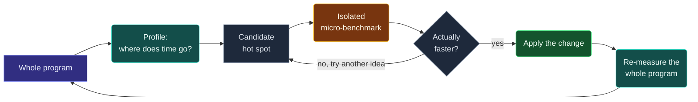

# Performance — Measure, Don't Guess

> [!essence]
> Speed is a property of one program, one compiler, one machine and one input — not something you can read off the source text. The only way to know whether a performance idea is true is to measure it, because intuition about modern hardware is reliably wrong, even for experts.

## The Problem

> [!principle] Constraint → Consequence → Design
> 1. **Constraint:** The as-if rule binds a conforming program only to *observable behavior*; it says nothing about how long reaching that behavior takes. Underneath that silence sits a real machine — multi-level caches, a pipelined, speculating CPU, an optimizer reshaping the code — whose cost model has almost nothing to do with "one line, one unit of time."
> 2. **Consequence:** Source-level reasoning about speed routinely fails. A virtual call that "should" be slow can cost nothing once the branch predictor learns it and the compiler inlines it; a "pointless" bounds check removed by hand can make a loop slower; a signed index can outperform the "obviously correct" unsigned one. The rules are not inconsistent — the real cost depends on cache state, branch history and what the optimizer could prove, none of which is visible in the source.
> 3. **Requirement:** Deciding what to change, and confirming a change actually helped, needs a method that does not rely on reading code and guessing — and that method must itself resist being fooled, because a careless measurement is its own source of wrong answers.
> 4. **Design:** Profile the whole program before touching anything, to find where time actually goes. Benchmark one candidate change in isolation, with the same care a profiler's sampling gave you. Then re-measure the whole program before believing the isolated result. `<chrono>`'s clocks are the raw material for the timing step; this domain's next notes supply the rest.
> 5. **Price:** Every number this discipline produces is tied to one compiler, one set of flags, one CPU and one input. A measurement is a fact about a specific run, not a law of the language, so it must be repeated and re-checked whenever any of those four things change, not memorized.

> [!tension] abstraction ⟷ control
> [[Zero-Overhead Principle|The zero-overhead principle]] promises that an abstraction costs no more than a hand-written equivalent — but that promise is a design *goal* the committee checks proposals against, not a guarantee the compiler enforces at your call site. This note is the only way to find out whether a specific build, on a specific machine, actually delivers on it.

## Mental Model

> [!model] The diagnostic loop, and where it breaks
> Treat performance work like a diagnosis, not a hunch. A profiler is the test that says where to look. An isolated micro-benchmark is the controlled experiment that checks one hypothesis. Re-measuring the whole program afterward confirms the treatment worked on the real patient, not only in the test tube.
> **Where it breaks:** an ordinary medical test doesn't change its own answer by being administered. A micro-benchmark can. Isolating a function changes what the compiler can see and prove about it — constants, aliasing, call-site context — so the "test" can report a number the real program would never produce. The instrument needs its own checks (see *Pitfalls*).



The loop has two trust-but-verify steps, not one: the micro-benchmark checks the idea cheaply, and the whole-program re-measurement checks that the micro-benchmark wasn't lying (see *Pitfalls*).

## Mechanics

`<chrono>` (C++11) is the portable tool for the timing half of the loop. It supplies clocks whose contract is specified precisely enough to reason about, which is more than can be said for `time()` or a platform-specific counter.

| Situation | Rule | Example |
|---|---|---|
| Measure an elapsed interval | Use `std::chrono::steady_clock`. Its `time_point`s never go backward, and its tick period is constant — exactly what `[time.clock.req]` requires for `is_steady == true`. | `auto t0 = std::chrono::steady_clock::now();` |
| Report a wall-clock timestamp (a date, a log entry) | Use `std::chrono::system_clock` instead. It represents calendar time and may be stepped by NTP or the user; fine for "when," wrong for "how long." | `system_clock::now()` for a log line |
| Reach for "the fastest clock" | Don't assume `high_resolution_clock` is a separate, better clock. Check `is_steady` before trusting it for an interval. | `static_assert(std::chrono::high_resolution_clock::is_steady);` |
| Time a computation whose result you discard | Give the result an observable effect before the scope ends, or the optimizer may delete the entire computation, not just the timing of it. | an `escape()` barrier, or a benchmarking library's `DoNotOptimize` |
| Compare two candidate implementations | Keep the benchmarked function's definition out of the same translation unit as the call that measures it. | define it in its own `.cpp`, declare it `extern` at the call site |

> [!standard] `high_resolution_clock` is not guaranteed to be anything in particular
> `[time.clock.hires]` specifies only that `high_resolution_clock` represents "clocks with the shortest tick period," and explicitly permits it to be "a synonym for `system_clock` or `steady_clock`." On libstdc++ it *is* an alias for `system_clock`. Naming a clock "high resolution" is not a promise that it is steady.

## Under the Hood

> [!machine] An unused result can erase the whole computation (GCC 11.4.0, `-O2`, x86-64 Linux)
> The as-if rule cuts both ways: if nothing in the program ever observes a value, the compiler may skip computing it entirely, however much work that would have been. Given
> ```cpp
> long sum_naive(long n) {
>     long total = 0;
>     for (long i = 0; i < n; ++i) total += i;
>     return total;
> }
> int main(int argc, char**) {
>     long n = argc * 100'000'000L;   // a run-time value — not a compile-time constant
>     sum_naive(n);                    // result discarded
> }
> ```
> `main` compiles, in full, to:
> ```nasm
> main:
>         endbr64
>         xor     eax, eax
>         ret
> ```
> The loop, and the call to `sum_naive`, are gone. Timing this `main` would report a time close to zero no matter how large `n` is at run time — not because the machine is fast, but because there is nothing left to run.

## In Code

**1 · Measuring an interval with `<chrono>`**

```cpp
#include <chrono>
#include <iostream>
#include <vector>

int main() {
    std::vector<int> readings(1'000'000, 1);

    auto start = std::chrono::steady_clock::now();      // ①
    long total = 0;
    for (int x : readings) total += x;
    auto finish = std::chrono::steady_clock::now();      // ②

    auto elapsed = std::chrono::duration_cast<std::chrono::microseconds>(finish - start);
    std::cout << "total=" << total << " elapsed=" << elapsed.count() << "us\n";
}
// prints: total=1000000 elapsed=~1500us (the exact number varies run to run)
```
1. `steady_clock::now()` returns a `time_point`; subtracting two of them gives a `duration` in the clock's own tick units.
2. `duration_cast<microseconds>` converts to a unit you can read. Never compare raw `duration` values across clocks — they can have different `period`s.

**2 · ✗ Vanishes: a discarded result lets the optimizer delete the benchmark**

```cpp
long sum_naive(long n) {
    long total = 0;
    for (long i = 0; i < n; ++i) total += i;
    return total;
}

int main(int argc, char** argv) {
    long n = argc * 100'000'000L;   // ①
    sum_naive(n);                    // ②
}
```
1. `n` depends on `argc`, so it is unknown at compile time — the compiler cannot precompute the answer.
2. The return value is thrown away. Because `sum_naive` has no side effect the compiler can see, the *entire call*, loop included, has no observable effect and is legally removed. See *Under the Hood*.

**3 · ✓ Survives: an escape barrier forces the computation to happen**

```cpp
inline void escape(long& value) {              // ③
    asm volatile("" : "+r"(value) :: "memory");
}

long sum_naive(long n) {
    long total = 0;
    for (long i = 0; i < n; ++i) total += i;
    return total;
}

int main(int argc, char** argv) {
    long n = argc * 100'000'000L;
    long result = sum_naive(n);
    escape(result);                              // ④
}
```
3. An empty inline-assembly statement that claims to both read and write `value`. The compiler cannot see inside it, so it must assume the value might be used, and is forced to compute it.
4. With the barrier in place, GCC 11.4.0 keeps the real `add`/`cmp`/`jne` loop inlined into `main`. This is the same idea as `benchmark::DoNotOptimize` in Google Benchmark: a manual escape hatch for when you are not using a library that provides one.

## Pitfalls

> [!trap] One run is not a measurement
> A single timing run mixes in whatever the cache and scheduler happened to be doing at that instant — a context switch, a cold cache line, a page fault. The same micro-benchmark run twice, unchanged, routinely reports different numbers. Measure repeatedly and look at the spread (or the minimum, as a floor the machine can actually sustain), never a single sample.

> [!trap] A discarded result is an invitation to optimize away the whole computation
> Demonstrated in *Under the Hood*: a benchmark that doesn't consume its own result can report near-zero time for arbitrarily expensive work, because the as-if rule permits deleting anything unobservable. Give every timed computation an observable sink.

> [!trap] A micro-benchmark has its own context, different from the real program's
> Defining the candidate function in the same file as the call that times it lets the compiler inline it and fold constants the real call site, in another translation unit, would never see. The fix is to compile the function separately and declare it `extern` at the benchmark's call site, so the compiler optimizes it the way it would in the real program.

> [!trap] "Everyone knows X is slow" is not a measurement
> Asked whether a virtual call is slower than a direct one, these are all individually correct answers, depending entirely on context: negligibly slower, 15–20% slower, 100% slower, 100 times slower, or even faster. See [[Virtual Dispatch — vptr and vtable]] for why: predictability and lost inlining, not the indirect jump itself, usually decide the answer. Demand a number, a compiler, a platform and an input before accepting any blanket claim.

## Evolution

| Standard | Change | Why |
|---|---|---|
| Pre-C++11 | No portable interval timer; programs reached for OS calls (`gettimeofday`, `QueryPerformanceCounter`) or C's coarse `clock()` | Every platform had invented its own timing API |
| **C++11** | `<chrono>` added: `duration`, `time_point`, `system_clock`, `steady_clock`, `high_resolution_clock` (N2661) | One portable, type-safe vocabulary for time, so "measure it" has a single standard answer everywhere |
| C++17 | Parallel algorithms ship with execution policies (`std::execution::par`, `par_unseq`) that are explicitly only *hints* | More code paths whose speed cannot be read from the source and must be measured per platform |
| C++20 | `std::chrono::is_clock` concept added; calendar and time-zone types joined the same header | Lets a clock type be checked at compile time; unrelated to the interval-timing facilities above |

## Connections

- **Prerequisites:** None — this is the discipline the rest of [[Map — Performance & the Machine|this domain]] assumes before any hardware fact is introduced.
- **Enables:** [[Profiling]] (turns this into a whole-program habit) · [[Benchmarking Correctly]] (the isolated-measurement tool, built on the escape-hatch technique shown here).
- **Checks the claim of:** [[Zero-Overhead Principle]] — states the goal; this note is how you find out whether a build actually meets it.
- **Explains a trap in:** [[Virtual Dispatch — vptr and vtable]] (the "virtual calls are slow" folklore) · [[What Optimizers Do]] (why discarded results vanish).
- **Domain:** [[Map — Performance & the Machine]].
- **Practice:** *Continuum #32 Performance Profiling & Optimization Challenge* — profile a provided program, propose a fix, and defend it with a before/after measurement rather than an argument from the source.

## Check Yourself

> [!quiz]- What does the as-if rule guarantee about how long a program takes to run?
> Nothing. It only guarantees that a conforming execution's *observable behavior* matches some execution of the abstract machine. Timing is entirely outside that contract, which is exactly why it must be measured rather than deduced from the rules.

> [!quiz]- Why can discarding a function's return value change the assembly the compiler emits for it, even when its argument is a run-time value nobody could know in advance?
> Because the as-if rule only constrains *observable* behavior. If no later code ever reads the result, the computation — however data-dependent — has no observable effect, so removing it entirely is a conforming optimization. The run-time unpredictability of the input is irrelevant; what matters is whether the output is ever used.

> [!quiz]- A benchmark times `sum_naive(n)` for a large, run-time-supplied `n` and discards the return value. The reported time is a few nanoseconds regardless of `n`. What went wrong?
> The call was optimized away. With no observable use for the result, the compiler deleted the loop and the call; the benchmark measured the cost of an empty function, not of `sum_naive`. Fix it with an escape barrier (or a library's `DoNotOptimize`) on the result.

> [!quiz]- Why is reaching for `high_resolution_clock` by name a risky habit when timing an interval?
> `[time.clock.hires]` only requires the shortest tick period, and explicitly allows it to be a synonym for `system_clock` — which is not steady and can jump. Prefer `steady_clock`, or check `is_steady` before trusting whatever `high_resolution_clock` happens to alias on your standard library.

## Sources

- Pikus ch. 1, "Evaluating, estimating, and predicting performance" (pp. 13–14): the "never guess about performance" law, and the virtual-function example with five context-dependent correct answers.
- Pikus ch. 2, "Performance benchmarking" and "Micro-benchmarks are lies" (pp. 29–30, 63–66): `<chrono>` timers; why compiling a candidate function in its own translation unit changes what the optimizer can prove about it.
- Tour §16.2 "Time" (p. 214): portable interval timing with `<chrono>`; warns against leaning on a handful of quick timings and recommends repeating a measurement to avoid being misled by rare events or cache effects.
- Tour §13.6 "Parallel Algorithms" (p. 183): execution policies are hints whose actual payoff must be checked by measurement, not assumed from the policy name.
- cppreference, *std::chrono::steady_clock* and *std::chrono::high_resolution_clock*: https://en.cppreference.com/w/cpp/chrono/steady_clock · https://en.cppreference.com/w/cpp/chrono/high_resolution_clock
- Draft standard `[time.clock.req]` (the *Cpp17Clock* requirements defining `is_steady`) and `[time.clock.hires]` (`high_resolution_clock` may alias `system_clock` or `steady_clock`): https://eel.is/c++draft/time.clock.req · https://eel.is/c++draft/time.clock.hires
- C++ Core Guidelines Per.1 ("Don't optimize without reason"), Per.3 ("Don't optimize something that's not performance critical"), Per.6 ("Don't make claims about performance without measurements"): https://isocpp.github.io/CppCoreGuidelines/CppCoreGuidelines#per-performance
