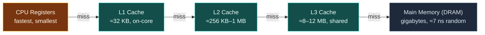
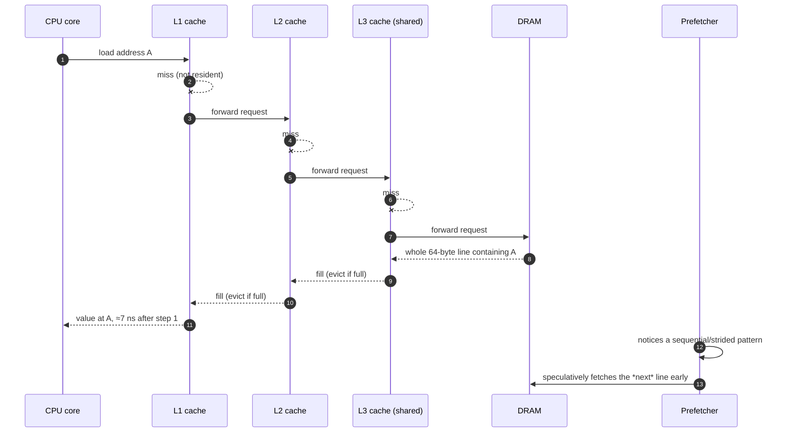

# The Memory Hierarchy and Caches

> [!essence]
> A load instruction never reaches into main memory directly. It passes through a hierarchy of progressively larger, slower, hardware-managed caches — L1, L2, L3 — so the true cost of reading a byte depends on *where in that hierarchy it already sits*, not on how many bytes the source line asks for. The same correct program can run an order of magnitude slower just by visiting the same addresses in a different order.

## The Problem

> [!principle] Constraint → Consequence → Design
> 1. **Constraint.** A modern CPU core can retire several operations per nanosecond. DRAM — the main memory on the motherboard — answers a single request in several nanoseconds: on Pikus's test machine, a random 64-bit read from main memory cost about 7 ns against a roughly 0.3 ns cycle time, a gap of more than an order of magnitude (Pikus ch. 4, pp. 116, 125).
> 2. **Consequence.** If every load genuinely walked out to DRAM, the CPU would spend almost all of its time stalled: at roughly 7 ns per random main-memory read, a core capable of several operations per nanosecond could complete several dozen arithmetic operations in the time a single such read takes, if that value isn't already close by (Pikus ch. 4, p. 125). Yet ordinary programs run far faster than one-DRAM-trip-per-load would predict, because most loads revisit data the program already touched.
> 3. **Requirement.** Something has to hold recently and nearby-touched data close enough to the CPU to answer in a cycle or two, invisibly — no source-level request for it, no change to a single bit of the program's result. Only *when* the value arrives may change, never *what* arrives.
> 4. **Design.** Insert a hierarchy of small, fast on-chip caches — SRAM, not DRAM — between the registers and main memory: L1 closest and smallest, L2 larger and slower, L3 larger still, usually shared across cores, slower again. A hardware controller invisible to the language fills them on first touch and evicts by recency heuristics. [[The C++ Abstract Machine|The abstract machine]]'s silence on timing — it binds only *observable behavior*, never duration — is exactly the freedom that lets this hierarchy exist underneath a language that never mentions it.
> 5. **Price.** Performance now depends on the working set's size relative to each cache's capacity, and on whether the access pattern lets hardware predict what to fetch next. Two programs with identical Big-O and identical output can differ by an order of magnitude in wall-clock time for a reason invisible in the source text — the order addresses are touched ([[Big-O Meets the Hardware]]).

> [!tension] abstraction ⟷ control
> [[The C++ Abstract Machine|The abstract machine]] presents memory as one flat, uniformly fast array of bytes — the model behind every pointer-and-box diagram in an introductory text (Tour §1.9, p. 17). This mechanism is where that uniformity quietly stops being true. The language keeps the illusion of a flat address space; only the *timing* of reaching an address becomes non-uniform, which is why the effect is invisible until you measure it ([[Performance — Measure, Don't Guess]]).

## Mental Model

> [!model] A desk, a filing cabinet, and a warehouse across town
> Keep what you're using *right now* on your desk (**L1**): instant reach, room for only a few folders. A filing cabinet behind your chair (**L2**) holds more, one step away. A records room down the hall (**L3**) holds much more, shared with the rest of the floor. Everything else lives in a warehouse across town (**main memory**): a courier has to drive out and back no matter how small the request. You never choose what's on your desk — a clerk watches what you keep reaching for and quietly moves folders closer or further.
> **Where it breaks:** the courier never fetches a single sheet. Courier and clerk only ever move whole *folders* at a time — on x86 hardware, a 64-byte **cache line** — so asking for one byte drags in the 63 bytes filed next to it, wanted or not (see *Under the Hood*).



Sizes and timings are Pikus's own measurements on one benchmark machine (ch. 4, pp. 119, 125); exact capacities and latencies vary by CPU model, but the *shape* — closer is smaller and faster, farther is bigger and slower — holds on every mainstream CPU.

## Step by Step



1. **Issue.** The CPU asks L1 for the address its instruction needs. Input: a virtual address. Output: a hit (value returned in a cycle or two) or a miss, forwarded one level out.
2. **Cascade on miss.** Each level repeats the same check: its own tags, hit or forward. L3 is the last on-chip level and is usually shared by every core on the chip, so its contents reflect what *any* core has recently touched.
3. **Fetch from DRAM.** On an L3 miss, the memory controller reads — not the one byte requested, but the entire 64-byte cache line that contains it (x86; see *Under the Hood*). That line is written into L3, then L2, then L1 on its way back to the CPU.
4. **Evict to make room.** If the cache level receiving the new line is already full, hardware picks something else resident to discard first, using a recency-based heuristic. Nothing is lost — the evicted line's data still exists at the next level out or in DRAM — only the fast copy is gone.
5. **Prefetch, running alongside steps 1–4.** The memory controller watches the stream of addresses a core has touched. If it detects a sequential or constant-stride pattern, it starts step 3 for lines the program hasn't asked for *yet*, so by the time the CPU reaches them they may already be in L1 — hiding the ≈7 ns instead of paying it on every element (Pikus ch. 4, pp. 129–130).

## Under the Hood

> [!machine] Visiting the same 64 MB in two orders (GCC 11.4.0, `-O2`, x86-64 Linux, this vault's toolchain — not Pikus's numbers)
> Summing a 16M-`int` array (64 MB — far past any L3) address-in-order against summing the same values through a pre-shuffled index array, same arithmetic, same data, same element count:
> ```text
> sequential: 0.44 ns/element
> random:     8.6  ns/element     (≈ 19–20× slower)
> ```
> Nothing about *what* is computed changed — only the order addresses are visited. The sequential pass lets the prefetcher stream the array in; the shuffled pass makes every access unpredictable, so most of them pay close to the full DRAM latency. Running the same source under the sanitizer build this vault's own `cc.py code` check uses (`-fsanitize=address,undefined`) narrows the ratio to roughly 7–10× — the sanitizers add their own per-access overhead, which compresses but does not erase the gap. Say *this vault's toolchain* only for numbers actually produced here; everything above about "on Pikus's machine" is his reported data, not something this vault's `cc.py` observed.

> [!standard] 64 bytes is a hardware fact, not a language guarantee
> Every mainstream x86 CPU uses a 64-byte cache line (Pikus ch. 5, p. 176) — true of the hardware, but the C++ Standard never mandates a line size. C++17 added a portable *hint*, `std::hardware_destructive_interference_size` (`<new>`), defined only as "implementation-defined," guaranteed merely to be at least `alignof(std::max_align_t)` (`[hardware.interference]`). GCC did not implement it at all for several releases after C++17 shipped: on this vault's toolchain (GCC 11.4.0), `std::hardware_destructive_interference_size` fails to compile — `'hardware_destructive_interference_size' is not a member of 'std'` — verified directly, not assumed. Code that needs a concrete number falls back to a hardcoded `64` guarded by the `__cpp_lib_hardware_interference_size` feature-test macro, exactly as cppreference's own example does.

Either way, the unit that moves is the *line*, not the byte: reading one `int` out of an array pulls its fifteen neighbors along for free, and reading byte zero of a cache-unaligned 8-byte object can straddle two lines and cost two fetches instead of one.

```text
  int data[], one 64-byte CACHE LINE outlined
 ┌──────────────────────────────────────────────────────────┐
 │[d0][d1][d2][d3][d4][d5][d6][d7][d8][d9][d10][d11][d12][d13][d14][d15]│
 └──────────────────────────────────────────────────────────┘
   reading data[3] ALONE still fetches all of d0..d15 (64 bytes)
```

## In Code

**1 · Same arithmetic, same data — only the visiting order changes**

```cpp
#include <algorithm>
#include <chrono>
#include <cstdio>
#include <numeric>
#include <random>
#include <vector>

inline void escape(long& value) {              // ① stop the optimizer deleting the loop
    asm volatile("" : "+r"(value) :: "memory");
}

int main() {
    const std::size_t n = 1u << 24;             // ② 16M ints = 64 MB: far past any L3
    std::vector<int> data(n, 1);
    std::vector<unsigned> order(n);
    std::iota(order.begin(), order.end(), 0u);
    std::mt19937 rng(1);
    std::shuffle(order.begin(), order.end(), rng);

    auto t0 = std::chrono::steady_clock::now();
    long seq_total = 0;
    for (std::size_t i = 0; i < n; ++i) seq_total += data[i];          // ③ address order
    auto t1 = std::chrono::steady_clock::now();
    escape(seq_total);

    auto t2 = std::chrono::steady_clock::now();
    long rnd_total = 0;
    for (std::size_t i = 0; i < n; ++i) rnd_total += data[order[i]];   // ④ shuffled order
    auto t3 = std::chrono::steady_clock::now();
    escape(rnd_total);

    auto seq_ns = std::chrono::duration_cast<std::chrono::nanoseconds>(t1 - t0).count();
    auto rnd_ns = std::chrono::duration_cast<std::chrono::nanoseconds>(t3 - t2).count();
    std::printf("sequential: %.2f ns/elem\n", double(seq_ns) / double(n));
    std::printf("random:     %.2f ns/elem\n", double(rnd_ns) / double(n));
}
// prints: sequential: <small> ns/elem
// prints: random:     <larger> ns/elem   (exact numbers vary by machine, build and sanitizers — see Under the Hood for the -O2 ratio measured here)
```
1. An empty inline-assembly barrier that claims to read and write `value`; without it the compiler can see both sums are never used for anything and delete both loops.
2. 64 MB guarantees the array cannot fit in any level of this hierarchy, so both passes are genuinely memory-bound.
3. `data[i]` for increasing `i`: consecutive addresses, the pattern the prefetcher is built to recognize.
4. `data[order[i]]`: the same 16M addresses, visited in a fixed but unpredictable permutation. Same sum, same cache lines eventually touched — only the *order* differs.

**2 · The 64-byte line, made visible with `alignas`**

```cpp
#include <cstddef>
#include <cstdio>

struct Counters {
    alignas(64) long a = 0;   // ① occupies its own line
    alignas(64) long b = 0;   // ② starts exactly one line later
};

int main() {
    std::printf("sizeof(Counters) = %zu\n", sizeof(Counters));
    std::printf("offsetof(b)      = %zu\n", offsetof(Counters, b));
}
// expect: sizeof(Counters) = 128
// expect: offsetof(b)      = 64
```
1. `alignas(64)` forces `a` to start at a 64-byte boundary. A bare `long` (8 bytes) would normally share a line with whatever follows it.
2. The same rule pads the struct so `b` starts on the *next* line: `offsetof(b)` is exactly 64, and the whole struct is 128 bytes — two lines for two 8-byte members that would otherwise cost one. This is the layout [[False Sharing]] needs undone when two threads hammer `a` and `b` independently and must not fight over one line.

## Consequences

The hierarchy is the hidden cost model behind a long list of performance facts that look unrelated from the source code alone:

| Observed rule or failure | Explained by |
|---|---|
| A `std::list` of a million nodes is roughly an order of magnitude slower to sum than a `std::vector` of the same values | Each node is a separate heap allocation at an unrelated address: traversal is the *random*-access case measured above, not the sequential one (Pikus ch. 4, pp. 132–133) — [[Data Locality and Access Patterns]] |
| A "worse" Big-O algorithm sometimes beats a "better" one in practice | The better bound's extra memory traffic can push its working set past a cache boundary the worse algorithm never crosses — [[Big-O Meets the Hardware]] |
| An array-of-structs loop that touches one field runs slower than the same loop over a structure-of-arrays layout | Each cache line pulled in by the AoS layout wastes most of its 64 bytes on fields the loop never reads — [[Data-Oriented Design — AoS vs SoA]] |
| A `new` or `malloc` inside a hot loop costs more than its own instruction count suggests | Freshly returned memory is typically cold: the first touch of it pays full DRAM latency regardless of how fast the allocator's bookkeeping was — [[The Cost of Dynamic Allocation]] |
| Two unrelated atomics, hammered by different threads, serialize as if they shared a lock | If they sit on the same 64-byte line, every write to one invalidates the other core's copy of the *whole line* — [[False Sharing]] |
| A profiler reports "L1 data cache load misses" as the top cost | That counter is this exact mechanism's miss path (steps 1–3 above), observed directly in hardware — [[Profiling]] |

## Connections

- **Prerequisites:** None registered — this is a hardware fact [[Map — Performance & the Machine|the rest of this domain]] assumes once [[Performance — Measure, Don't Guess|the measurement discipline]] is in place. It sits beneath, not after, [[The C++ Abstract Machine]]: the abstract machine's silence on timing is what *permits* this hierarchy to exist unmentioned in the language.
- **Enables:** [[Data Locality and Access Patterns]] · [[Big-O Meets the Hardware]] · [[The Cost of Dynamic Allocation]] · [[Data-Oriented Design — AoS vs SoA]] · [[Profiling]] (reads this mechanism's hit/miss counters directly).
- **Prerequisite for:** [[False Sharing]] — the pitfall this mechanism's cache-line unit makes possible.
- **Domain:** [[Map — Performance & the Machine]].
- **Practice:** *Continuum #32 Performance Profiling & Optimization Challenge* — measure, don't assume, which of your own data structures pays the random-access cost shown here.

## Check Yourself

> [!quiz]- What is the smallest unit of data a cache ever moves to or from the next level, and how large is it on x86?
> A cache line — 64 bytes on every mainstream x86 CPU (Pikus ch. 5, p. 176). Reading a single `int` still pulls in the other fifteen `int`s that share its line; there is no way to fetch fewer than 64 bytes at a time.

> [!quiz]- Pikus found that random-access words-per-second doesn't depend on word size, but sequential-access *bytes*-per-second eventually does. What does that pair of facts tell you about which resource limits each pattern?
> Random access is latency-bound: each access pays a fixed delay regardless of how many bytes it requests, so a wider word doesn't help. Sequential access can become bandwidth-bound once the prefetcher is streaming continuously: the limit shifts to how many bytes per second the memory bus can move, so wider words (more bytes per access) finish sooner (Pikus ch. 4, pp. 126–128).

> [!quiz]- The code in *In Code* #1 sums the same 16M integers twice: once in address order, once through a fixed shuffled permutation. Why does the second pass take roughly an order of magnitude longer when it performs the exact same number of additions on the exact same values?
> The cost isn't the arithmetic — it's reaching the operands. The sequential pass lets the hardware prefetcher predict each next address and fetch it before it's needed, hiding most of the DRAM latency. The shuffled pass makes every address unpredictable, so most reads miss every cache level and pay close to the full ≈7 ns random-access cost measured in *Under the Hood*.

> [!quiz]- A program assumes `std::hardware_destructive_interference_size` is always `64` and always available. What's wrong with that assumption?
> Two things. First, the Standard only guarantees it is *implementation-defined* and at least `alignof(std::max_align_t)` — not that it equals the real L1 line size on every target. Second, availability itself isn't guaranteed: on this vault's own toolchain (GCC 11.4.0) the name doesn't exist in `<new>` at all, which is exactly why cppreference's own example code guards every use behind `#ifdef __cpp_lib_hardware_interference_size`.

## Sources

- Pikus ch. 4 "Memory Architecture and Performance" (pp. 113–131): the memory-gap argument, the measured hierarchy of latencies, random vs. sequential access, prefetch and pipelining as latency-hiding techniques.
- Pikus ch. 4, "Memory-efficient data structures" (pp. 132–133): the `std::list` vs. `std::vector` traversal-cost comparison.
- Pikus ch. 5 "Threads, Memory, and Concurrency", §"Why data sharing is expensive" (p. 176): the 64-byte x86 cache line and its cost under concurrent writes; §"Concurrency support in C++17" (p. 296): `std::hardware_destructive_interference_size`/`constructive_interference_size`.
- Tour §1.9 "Mapping to Hardware" (p. 17): the flat, address-indexed memory model the abstract machine presents, which this hierarchy sits beneath without disturbing.
- cppreference, *std::hardware_destructive_interference_size, std::hardware_constructive_interference_size*: https://en.cppreference.com/w/cpp/thread/hardware_destructive_interference_size
- Draft standard `[hardware.interference]`: https://eel.is/c++draft/hardware.interference
