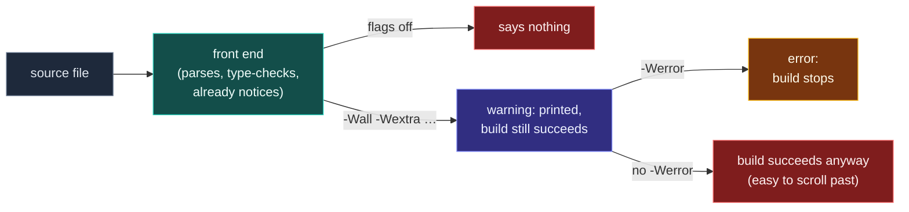
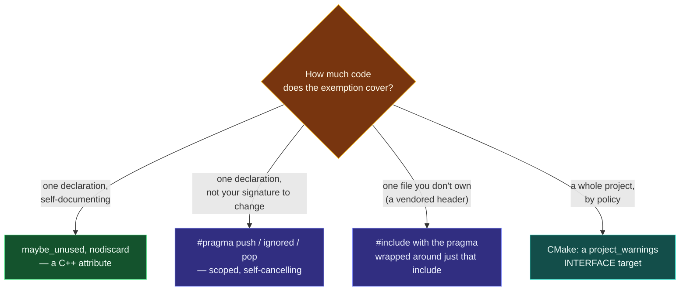

# Warnings as Guardrails

> [!essence]
> By the time a compiler rejects nothing, it has already parsed your program, resolved every name, and checked every type — and it already noticed the sign comparison, the shadowed name, the member read before it exists. **Ask it to tell you what it noticed, and refuse to ship a build where it noticed something.** That is the entire idiom: `-Wall -Wextra` (and friends) turn on the report; `-Werror` turns the report into a gate.

## Intent

Turn the compiler's own completed analysis pass into a mandatory first reviewer, by making every warning it is capable of producing visible, and making a visible warning stop the build.

## The Problem

[[Compilers and Essential Flags|A conforming compiler]] is obliged to diagnose exactly one category of program: the *ill-formed* one, where the grammar or a checkable semantic rule is broken. A second, much larger category — legal C++ that does something the author almost certainly didn't mean — carries no such obligation. Nothing in the Standard requires a diagnostic for comparing a signed loop counter against an unsigned size, for a parameter whose name happens to match a member's, or for initializing one member from another that the class declares later. All three compile silently, by default, forever.

> [!principle] Constraint → Consequence → Design
> 1. **Constraint.** The compiler's front end already parses, type-checks and partially reasons about every line before it emits code — that work happens whether or not anything is wrong. Diagnosing *ill-formed* code is the only part of that work the Standard requires it to report back.
> 2. **Consequence.** A huge class of real bugs is legal C++, so the same pass that would have caught them produces nothing unless asked. The cost lands later, at the one moment nobody is looking for it: a release build, a rare input, a reviewer skimming a diff that "compiles clean."
> 3. **Requirement.** Catching this class needs no new analysis — only a channel for the front end to report what it already computed, and a build that cannot quietly accept the report and move on anyway.
> 4. **Design.** GCC and Clang expose exactly that channel as warning flags, graded by how aggressively they second-guess legal code (`-Wall`, `-Wextra`, `-Wshadow`, …), and `-Werror` closes the loop: it promotes every warning the current flags produce into a hard compile failure, so "the compiler mentioned it" and "the build passed" can no longer both be true for the same defect.
> 5. **Price.** Turning more on means tolerating more false positives — legal, intended code that a heuristic still flags — which a team must either fix, or suppress by name, in one place, out loud. Enabling it late in a project is worse than enabling it on day one: the Core Guidelines effort itself needed "static analysis tools" paired with its advice precisely because advice nobody checks doesn't change what ships (Tour §19.1, p. 262).

Primer's constructor chapter shows a version of this that predates any flag at all: write a member-initializer list in whatever order reads best, and the text notes in passing that a considerate compiler may flag it when that order disagrees with the order the members were declared in (Primer §7.5, p. 290) — because initializer-list order is cosmetic; declaration order is what actually runs. GCC's manual confirms the mechanism directly: `-Wreorder` is one of the flags `-Wall` "turns on" for C++ (GCC, *Warning Options*). Watch what that single, already-free pass catches:

```cpp
#include <iostream>

class Window {
public:
    Window(int w) : height_{10}, area_{w * height_} {}  // ① listed in "logical" order
    int area() const { return area_; }
private:
    int area_;     // ② declared first: C++ initializes members in THIS order
    int height_;   // declared second — still zero when ① computes area_
};

// cc: ub
int main() {
    Window win{4};
    std::cout << win.area() << "\n";
}
```
1. The initializer list reads top to bottom as if `height_` is set before `area_` uses it.
2. [[Object Lifetime|Members are initialized in declaration order]], never list order (`[class.base.init]`): `area_` runs first, reading `height_` before `height_`'s own lifetime has begun. That read is undefined behavior — on this toolchain (GCC 11, x86-64 Linux) it happened to print `0`, but no later compiler release owes you that number.

Compiled with no flags, this produces an executable and no diagnostic at all. Compiled with `-Wall`, the same pass that already knows the declaration order says so twice over: once for the reordering itself (`-Wreorder`) and once, independently, for the read it causes (`-Wuninitialized`) — two separate warnings, zero changes to the code, one flag.

> [!tension] compile-time ⟷ run-time
> This idiom lives entirely on the compile-time side of [[Map — Tooling & Engineering|this domain's]] central tension. It can flag every path a human could trigger, because it never has to wait for one to actually run — at the price of occasionally flagging a path that was fine all along. [[Sanitizers — ASan, UBSan, TSan|Sanitizers]] pay the opposite price: silence about everything a given run didn't touch, in exchange for zero false alarms about what it did.

## Structure

Three participants: the **front end** (already analyzing), the **flag set** (what it's allowed to report and how harshly), and the **build** (what happens to a report).



The guardrail is the rightmost edge. A warning nobody is forced to read is a guardrail painted on the floor instead of bolted to it: visible to the careful, invisible to the rushed, and identical in both cases to the compiler that said nothing at all. `-Werror` is what turns the paint into a bolt.

## In Code

**✗ Flags off: the front end notices, nobody hears it**

```cpp
#include <iostream>

class Account {
public:
    explicit Account(double balance) {
        balance = balance;        // ① assigns the parameter to itself
    }
    double balance{0.0};          // ② the member: same name, never touched
};

int main() {
    Account a{500.0};
    std::cout << a.balance << "\n";   // expect: 0
}
```
1. `balance = balance` inside the constructor body resolves both names to the *parameter* — a parameter always shadows a same-named member in that scope, so this line assigns the parameter to itself and does nothing observable.
2. The member keeps its default, `0.0`. With no flags, `g++ -std=c++20` accepts this silently: nothing here is ill-formed, so nothing is reported, and `Account a{500.0}` quietly produces an account worth nothing.

**✓ Flags on, and enforced: the same compiler, asked**

```text
$ g++ -std=c++20 -Wall -Wextra -o acct acct.cpp
$                                                  # still silent: -Wall/-Wextra don't cover this one

$ g++ -std=c++20 -Wall -Wextra -Wshadow -o acct acct.cpp
acct.cpp:5:29: warning: declaration of 'balance' shadows a member
of 'Account' [-Wshadow]

$ g++ -std=c++20 -Wall -Wextra -Wshadow -Werror -o acct acct.cpp
acct.cpp:5:29: error: declaration of 'balance' shadows a member
of 'Account' [-Werror=shadow]
cc1plus: all warnings being treated as errors   # ③ build fails: exit 1
```
(GCC 11, x86-64 Linux, observed directly; `-Wall -Wextra` alone reproduce exit 0 with no output for this file — `-Wshadow` is not among the flags either one enables, which is exactly why a list of "recommended flags" beyond the two defaults exists at all (cpp-best-practices/cppbestpractices, *Use the Tools Available*).) ③ `-Werror` is what makes the difference between steps one and two actually matter: without it, a warning a teammate doesn't read is no better than silence.

**Modern: suppress the one you've judged safe, by name, in place**

```cpp
#include <cstdio>

void on_tick([[maybe_unused]] int tick_count) {   // ① language-level, scoped to one parameter
    std::puts("tick");
}

#pragma GCC diagnostic push
#pragma GCC diagnostic ignored "-Wunused-parameter"
void legacy_callback(int unused_arg) {            // ② tool-level, scoped to one declaration
    std::puts("legacy");
}
#pragma GCC diagnostic pop

int main() {
    on_tick(1);
    legacy_callback(2);
}
// expect: tick
// expect: legacy
```
1. The `maybe_unused` attribute (C++17; see [[Attributes — nodiscard, maybe_unused, likely]]) tells the compiler *and* the next reader that this parameter is unused on purpose — no flag needed, nothing silenced anywhere else.
2. `#pragma GCC diagnostic push/ignored/pop` (also understood by Clang) is for code you can't annotate this way — a fixed callback signature, a third-party header — and it unsuppresses itself at `pop`, so the exemption cannot leak into the next function by accident (GCC, *Diagnostic Pragmas*). `-Wunused-parameter` needs `-Wextra` in the first place: GCC's own manual states it is "not enabled by `-Wunused` unless `-Wextra` is also specified" (GCC, *Warning Options*) — one more flag this idiom only pays for once you ask.

## Consequences

| Benefit | Cost |
|---|---|
| ✓ Catches a real class of bugs the Standard never obligates the compiler to catch, at **zero** extra analysis — the pass already ran | ✗ More flags mean more false positives: legal code a heuristic still doesn't like |
| ✓ `-Werror` converts "visible if you look" into "the build cannot proceed," closing the gap [[RAII|RAII]] closes for resources | ✗ A false positive needs a *named*, scoped suppression, or the whole guardrail gets disabled out of frustration |
| ✓ Costs nothing at run time: every one of these checks happens before the first instruction is generated | ✗ Cheapest early; raising the bar on an existing, warning-heavy codebase is a real, one-time cost |
| ✓ Composes with [[Static Analysis and clang-tidy|static analysis]] and the [[The C++ Core Guidelines|Core Guidelines]] rather than competing with them — same side of the compile-time/run-time line | ✗ Different compilers warn about different things; a flag set tuned for GCC may be silent on Clang and vice versa |

## Variations



| Variation | Scope | When to reach for it |
|---|---|---|
| **Baseline set** | whole build | `-Wall -Wextra` (GCC/Clang) or `/W4` (MSVC) as the floor for every target, from the first commit |
| **Strict set** | whole build | add `-Wshadow -Wconversion -Wsign-conversion -Wnon-virtual-dtor -Wold-style-cast -Wpedantic`; each one targets a specific bug family `-Wall`/`-Wextra` don't cover (cpp-best-practices/cppbestpractices) |
| **CI gate** | whole build, in CI only or everywhere | `-Werror`; "start with very strict warning settings from the beginning — raising the warning level after the project is underway can be painful" (cpp-best-practices/cppbestpractices) |
| **Per-declaration exemption** | one function/parameter/variable | the `maybe_unused` / `nodiscard` attributes ([[Attributes — nodiscard, maybe_unused, likely]]) — visible in the signature itself |
| **Per-region exemption** | a block, or one `#include` | `#pragma GCC diagnostic push/ignored/pop` — for code you can annotate at the call site but not at its declaration |
| **Centralized policy** | whole project, shared across targets | a CMake `INTERFACE` library (`project_warnings`) that every target links, so the flag list is edited once |

A centralized policy looks like this once a project outgrows typing the same flags on every target:

```cmake
add_library(project_warnings INTERFACE)
target_compile_options(project_warnings INTERFACE
    -Wall -Wextra -Wshadow -Wconversion -Werror)
# any target: target_link_libraries(my_app PRIVATE project_warnings)
```
See [[CMake Fundamentals]] for what an `INTERFACE` library is doing here: it carries compile options to every target that links it without itself producing any code.

## Connections

- **Prerequisites:** [[Compilers and Essential Flags]] (what `-Wall`, `-Wextra` and `-O`-levels are, before this note argues for turning the first two on and enforcing them) · [[Undefined Behavior]] (the reason a warning-free compile is not a correctness guarantee).
- **Related idioms:** [[RAII]] — both idioms convert "a programmer must remember" into "the toolchain refuses to let you forget," one at compile time and one at run time.
- **This complements:** [[Static Analysis and clang-tidy]] and [[The C++ Core Guidelines]] extend the same compile-time side of the domain's tension past what a warning flag alone can express; [[Sanitizers — ASan, UBSan, TSan]] covers the run-time side this idiom cannot reach (a warning never fires on a path that was never executed and never looked suspicious in the source either).
- **Practice:** *Continuum #1 Hello, Compiler* — compile the same file with no flags, then `-Wall -Wextra`, then add `-Werror` and watch a warning become a build failure.
- **Domain:** [[Map — Tooling & Engineering]].

## Check Yourself

> [!quiz]- Why does `-Werror` matter if `-Wall -Wextra` already print the warning?
> A warning that doesn't stop the build is easy to scroll past, especially in a long CI log or a large legacy codebase. `-Werror` makes "the compiler reported a problem" and "the build succeeded" mutually exclusive for the same defect, which is the only way the report reliably reaches a human before the code ships.

> [!quiz]- The `Window` example above prints `0` on this vault's toolchain. Why can't you rely on that number?
> `area_` reads `height_` before `height_`'s lifetime has begun — an indeterminate-value read is undefined behavior (`[class.base.init]`), not a guarantee of zero. A different compiler, optimization level, or surrounding stack layout is free to produce a different value, or nothing predictable at all; only the *warnings* (`-Wreorder`, `-Wuninitialized`) are reliable, not the program's output.

> [!quiz]- A teammate wraps an entire file in `#pragma GCC diagnostic ignored "-Wall"` at the top, with no matching `pop`. What's wrong with that, compared to the pragma usage in this note?
> Two things: it silences *every* warning `-Wall` would have caught, not one named defect class, and with no `pop` the suppression never ends — it leaks into every line after it, including code written months later that the original author never looked at. The idiom calls for naming the exact flag and bracketing it with `push`/`pop` around the smallest region that needs it.

## Sources

- Primer §7.5 "Constructors Revisited" (p. 290): some compilers warn when a constructor's member-initializer list is written out of declaration order, because declaration order is what actually runs.
- PPP §2.10 "Type deduction: auto": urges a beginner to learn how to turn on a warning flag — usually `-Wall` — and keep code clean under it, on the grounds that the habit pays for itself many times over; the same passage points to static-analysis tools as the next step beyond warnings.
- Tour §19.1 "History" (p. 262): the C++ Core Guidelines paired coding advice with "static analysis tools," on the premise that advice nobody checks doesn't change what ships — the same argument this note applies to warnings as the cheapest checked layer.
- GCC documentation, *Warning Options*: exact flag lists for what `-Wall` enables (including `-Wreorder`) and the `-Wextra` dependency of `-Wunused-parameter` — https://gcc.gnu.org/onlinedocs/gcc/Warning-Options.html
- GCC documentation, *Diagnostic Pragmas*: `#pragma GCC diagnostic push/ignored/pop` semantics — https://gcc.gnu.org/onlinedocs/gcc/Diagnostic-Pragmas.html
- cpp-best-practices/cppbestpractices (GitHub), *Use the Tools Available*: the recommended GCC/Clang flag list beyond `-Wall -Wextra`, and "start with very strict warning settings from the beginning" — https://github.com/cpp-best-practices/cppbestpractices/blob/master/02-Use_the_Tools_Available.md
- C++ Core Guidelines (isocpp/CppCoreGuidelines): the broader rule set this idiom's flags only partially cover; see [[The C++ Core Guidelines]] for the rule-by-rule treatment this note does not duplicate — https://isocpp.github.io/CppCoreGuidelines/CppCoreGuidelines
- Verified against this vault's own toolchain and independently against GCC 11.4.0 (Ubuntu 22.04, x86-64), 2026-10-01: every flag combination and all three code blocks above compiled and behaved exactly as described.
