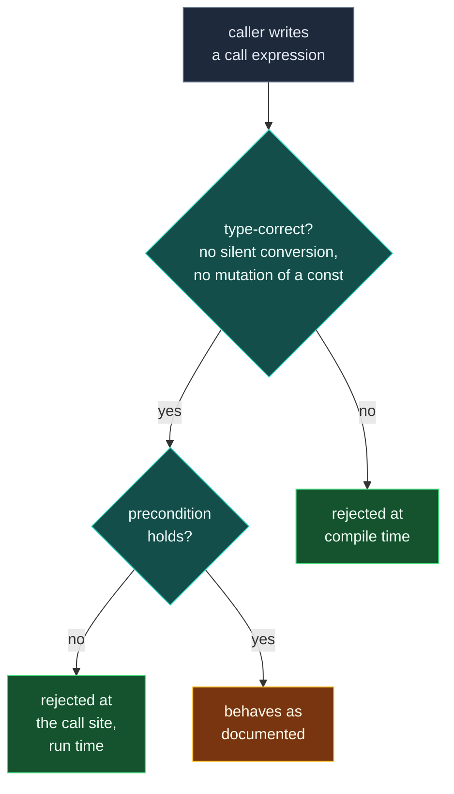

# Designing Interfaces — Easy to Use Correctly

> [!essence]
> An interface is everything a caller can see and write without reading your implementation: the member list, the parameter and return types, and whichever conversions the compiler will quietly perform on their behalf. Designing it well means shrinking the gap between **what compiles** and **what is correct**, so the mistakes a caller is likely to make are the ones the compiler — or, failing that, a loud run-time check — catches for them.

## The Problem

Every public member function has two boundaries: the set of calls its declared types and overloads will accept, and the much smaller set of calls that actually do what the function is documented to do. [[Constructors|A constructor]] only has to accept arguments that type-check; nothing in the call forces the caller to have read what those arguments are supposed to mean.

> [!principle] Constraint → Consequence → Requirement → Design → Price
> 1. **Constraint.** A function's declared parameter types bound everything the compiler checks. Any assumption true of a *valid* call that those types don't encode is enforced nowhere a compiler looks.
> 2. **Consequence.** Callers who have not read the implementation — in any codebase with more than one person, that is most callers, most of the time — will eventually write a call that compiles and means the wrong thing: two numbers in the wrong order, a percentage outside `[0,100]`, a raw `int` that was never meant to be an ID. [[Encapsulation and Class Invariants|An invariant]] protects an object's own data once it exists; nothing yet protects the call that constructs or uses it.
> 3. **Requirement.** The interface itself must narrow the legal call set as close as it can get to the intended one, and whatever gap the type system genuinely can't close must fail immediately and audibly at the call that violates it — not silently, three functions later.
> 4. **Design.** C++ supplies two independent families of narrowing. At compile time: give unrelated quantities unrelated types, so an argument of the wrong kind is a type error rather than a silent coercion; forbid conversions and mutations the author never intended (`explicit`, `const`, `= delete`). At run time, for whatever the type system can't express (a range, an ordering between two arguments, a non-empty collection): check it at the boundary and report the violation at the call, by throwing or asserting, instead of proceeding on a false assumption.
> 5. **Price.** Every one of these tools trades a convenience for a caught mistake. `explicit` removes a one-line conversion the author may have wanted; a wrapper type replaces a built-in with a user-defined one and its own constructor to spell out; a checked precondition spends a branch — and sometimes an exception's unwinding cost — on every call, including the overwhelming majority that were already correct.

> [!tension] abstraction ⟷ control
> A strong type or an `explicit` constructor hides nothing about performance — *Under the Hood* shows they compile to the same instructions as the type they replace — but they do cost the author a new vocabulary (`Meters`, not `double`) and cost the caller a more deliberate call. The abstraction the interface offers the rest of the program is purchased with a small loss of the raw convenience direct control over a built-in type would have given.

> [!tension] safety ⟷ performance
> A run-time precondition check is a vote for safety paid in cycles: the unchecked function trusts the caller and skips the branch; the checked one spends it on every call — including the calls, almost all of them, that were already correct — so that when a caller does get it wrong, the program says so instead of computing quietly on garbage.

## Mental Model

> [!model] The keyhole
> A lock's keyhole accepts any key shaped to fit it; only one key shape actually turns the right tumblers and opens the intended door. An interface is the same: its parameter types are the keyhole's shape, and a call that type-checks is a key that fits — whether or not it's the *right* key for what the caller meant to do.
> **Where it breaks:** a keyhole's shape is fixed hardware. An interface's "shape" is enforced in two different places — partly by the compiler, which simply refuses a key of the wrong type, and partly by code the author wrote, which lets the key turn and then checks, after the fact, whether what it unlocks is safe to proceed with.

```text
  all calls the COMPILER ACCEPTS for
  double speed(double distance_m, double time_s)
 ┌────────────────────────────────────────────────────────────┐
 │ swapped order · negative values · feet mistaken for meters   │
 │  ┌──────────────────────────────────────────────────────┐   │
 │  │  calls that are actually CORRECT                      │   │
 │  │  right places, both non-negative, both really m / s    │   │
 │  └──────────────────────────────────────────────────────┘   │
 │        ▲ narrowed at compile time by: strong types,          │
 │                               explicit, const, = delete       │
 │              ▲ what's left is caught at run time by           │
 │                               a checked precondition           │
 └────────────────────────────────────────────────────────────┘
```



## Mechanics

| Situation | Rule | Example |
|---|---|---|
| A single-argument constructor would let an unrelated type convert in silently | Mark it `explicit`; the caller must spell the conversion out | `explicit UserId(int);` blocks `remove_user(42)` |
| Two parameters of the same built-in type can be swapped at the call site without a type error | Give each quantity its own type instead of sharing `double`/`int` | `speed(Meters, Seconds)` rejects `speed(Seconds{2}, Meters{10})` |
| A member function might mutate the object the caller only meant to read | Mark the member function `const`, and the reference parameter `const` where it applies | `std::size_t size() const;` |
| A pointer returned from a `const` accessor still lets the caller mutate what it points to | Don't return a raw owning pointer from a const accessor; return by value or a `const`-qualified pointer | `const int* data() const;` |
| An operation the type should never support, but the compiler would otherwise accept | Delete it explicitly rather than leaving it merely undefined | `Buffer(const Buffer&) = delete;` |
| A bare `bool`/`int` parameter's meaning isn't visible at the call site | Use a scoped `enum class`, one value per meaning | `enum class Overwrite { No, Yes };` |
| A condition the type system can't express (a range, an ordering between two arguments) | Check it at the top of the function and report the violation at the call that caused it | `if (percent < 0 \|\| percent > 100) throw ...;` |

> [!standard] `explicit` broadened, not reinvented
> `explicit` on constructors is C++98. C++11 extended it to conversion operators (`explicit operator bool() const;`) and added `= delete`, so a function can be declared unusable rather than merely left undefined (`[dcl.fct.def.delete]`). C++17 let deduction guides themselves be `explicit`, extending the same narrowing to class template argument deduction. C++20 added `explicit(bool-expr)` (*conditional explicit*), so a template can choose, per instantiation, whether its own conversion is implicit.

## Under the Hood

> [!machine] Narrowing by type costs nothing once compiled
> Wrapping a `double` in a one-member struct exists purely for the type checker. GCC 11, `-O2`, x86-64, emits identical code whether the parameter is a bare `double` or a `Meters` wrapping one:
> ```nasm
> as_raw(double):         ; double as_raw(double x) { return x * 2.0; }
>         addsd xmm0, xmm0
>         ret
> as_meters(Meters):      ; double as_meters(Meters x) { return x.value * 2.0; }
>         addsd xmm0, xmm0
>         ret
> ```
> The two functions compile to the same instruction. `Meters` is passed in the same register a `double` would use and never exists as a separate object in memory. Everything `explicit`, a strong type, or a deleted overload buys you is paid for at compile time, in the type checker — never at run time. A checked precondition is different: the `if` in `set_volume_checked` (see *In Code*) is a real branch that executes on every call, which is exactly what the safety-vs-performance tension above is pricing.

## In Code

**1 · A swapped argument that compiles, then one that doesn't**

```cpp
#include <iostream>

double speed(double distance_m, double time_s) {
    return distance_m / time_s;
}

int main() {
    std::cout << speed(10.0, 2.0) << '\n';   // ①
    std::cout << speed(2.0, 10.0) << '\n';   // ②
}
// expect: 5
// expect: 0.2
```
1. 10 meters in 2 seconds: the intended call.
2. The arguments are swapped. Both are `double`, so the compiler has nothing to object to — it compiles and prints a plausible-looking but wrong answer.

```cpp
// cc: ill-formed
#include <iostream>

struct Meters { double value; };
struct Seconds { double value; };

double speed(Meters distance, Seconds time) {
    return distance.value / time.value;
}

int main() {
    std::cout << speed(Seconds{2.0}, Meters{10.0});   // ③
}
```
3. Same mistake, but `Meters` and `Seconds` are distinct types: the swapped call is a type error, caught before the program ever runs.

**2 · `explicit` closing an accidental conversion**

```cpp
#include <iostream>

class UserId {
public:
    UserId(int v) : value_(v) {}            // ①
    int value() const { return value_; }
private:
    int value_;
};

void remove_user(UserId id) { std::cout << "removing " << id.value() << '\n'; }

int main() {
    int row_index_in_a_table = 42;            // ②
    remove_user(row_index_in_a_table);        // ③
}
// expect: removing 42
```
1. A converting constructor: any `int` becomes a `UserId` with no syntax at the call site.
2. A plain `int` that was never meant to identify a user — it indexes an unrelated table.
3. It compiles and runs anyway. The mistake leaves no trace at the call site.

```cpp
// cc: ill-formed
class UserId {
public:
    explicit UserId(int v) : value_(v) {}
    int value() const { return value_; }
private:
    int value_;
};

void remove_user(UserId id);

int main() {
    int row_index_in_a_table = 42;
    remove_user(row_index_in_a_table);        // error: no implicit int -> UserId
}
```
With `explicit`, the identical call is now a compile error instead of a silent bug.

**3 · `const` stops at the top level**

```cpp
#include <cstddef>
#include <iostream>

class Buffer {
public:
    explicit Buffer(std::size_t n) : data_(new int[n]{}), size_(n) {}
    ~Buffer() { delete[] data_; }
    Buffer(const Buffer&) = delete;             // ①
    Buffer& operator=(const Buffer&) = delete;
    int* data() const { return data_; }         // ②
    std::size_t size() const { return size_; }
private:
    int* data_;
    std::size_t size_;
};

void reset_first(const Buffer& b) {              // ③
    b.data()[0] = 999;                           // ④
}

int main() {
    Buffer buf(4);
    reset_first(buf);
    std::cout << buf.data()[0] << '\n';
}
// expect: 999
```
1. Deleted so the example has exactly one owner of `data_`.
2. `const` only promises that the method won't reassign `data_` itself; the `int`s it points to are not part of that promise.
3. A reader sees `const Buffer&` and reasonably expects no mutation is possible through `b`.
4. It compiles, and it mutates the buffer's contents anyway: `const` on this accessor is bitwise, not logical.

**4 · A documented precondition versus a checked one**

```cpp
#include <iostream>
#include <stdexcept>

void set_volume_unchecked(int percent) {
    std::cout << "volume now at " << percent << "%\n";   // ①
}

void set_volume_checked(int percent) {
    if (percent < 0 || percent > 100)
        throw std::invalid_argument("set_volume: percent must be in [0,100]");
    std::cout << "volume now at " << percent << "%\n";   // ②
}

int main() {
    set_volume_unchecked(150);                 // ③
    try {
        set_volume_checked(150);               // ④
    } catch (const std::invalid_argument& e) {
        std::cout << "rejected: " << e.what() << '\n';
    }
}
// expect: volume now at 150%
// expect: rejected: set_volume: percent must be in [0,100]
```
1–2. Both functions assume `0 <= percent <= 100`; neither signature says so.
3. The unchecked version accepts 150% and reports success — a comment-only precondition enforces nothing.
4. The checked version refuses the same call at the point it happens, with a message that names exactly what went wrong.

## Pitfalls

> [!trap] A convenient conversion is also an accidental one
> A non-`explicit`, single-argument constructor accepts any value of that argument's type as if it were the class, with no syntax at the call site marking the conversion. Example 2 shows a plain `int` silently becoming a `UserId`. See [[Conversion Operators and explicit]].

> [!trap] `const` only reaches as far as the object's own members
> A `const` member function promises not to reassign the object's data members. If one of those members is a pointer, the object it points to is untouched by that promise — Example 3's `data()` returns a non-`const int*` from a `const` method and compiles cleanly. This is sometimes called *bitwise* (as opposed to *logical*) constness.

> [!trap] A precondition stated only in a comment enforces nothing
> `// percent must be 0-100` next to a function signature is documentation, not a check. It's invisible at every call site, and the compiler never reads comments. See [[Undefined Behavior]] for what happens when a *stricter* unstated precondition — not just "wrong," but UB — is violated instead of merely a logic error like Example 4's.

## Evolution

| Standard | Change | Why |
|---|---|---|
| C++98 | `explicit` on constructors; `const` member functions; `private`/`public` access | The first compile-time tools for narrowing a class's legal call set |
| C++11 | `explicit` extended to conversion operators; `enum class` (scoped enums); `= delete` | Replace `bool`/`int` pairs and unscoped enums with real types; let a function be refused outright instead of merely undefined |
| C++17 | Deduction guides may themselves be declared `explicit` | Extends the same narrowing to class template argument deduction (CTAD) |
| C++20 | `explicit(bool-expr)` — conditional `explicit` | A template can choose, per instantiation, whether its own conversion is implicit |
| C++26 (working draft) | Contract assertions — attribute-style `pre`/`post` conditions and `contract_assert` (P2900, adopted into the working draft at the Hagenberg 2025 meeting) | Gives the run-time half of this note syntax of its own, instead of a hand-written `if`/`throw`; not yet implemented by mainstream compilers, so untestable in this vault's toolchain |

## Connections

- **Prerequisites:** [[Encapsulation and Class Invariants]] (what the interface's narrowing protects once a call succeeds) · [[Constructors]] (where `explicit` and strong types attach first).
- **Enables:** [[SOLID in C++]] and the idioms of [[Map — Design & Idioms]] all presuppose the interfaces they customize are already well-shaped; [[Non-Virtual Interface]] tightens the same boundary from the inside.
- **Siblings:** [[Strong Types]] · [[Enumerations — Plain vs Scoped]] · [[Conversion Operators and explicit]].
- **Domain:** [[Map — Design & Idioms]].
- **Practice:** *Continuum #28 Mini JSON Parser / Key-Value Store Engine* — a key-value interface is exactly the "which calls should even compile" question this note names: what type should a key be, and what should happen when a caller asks for one that isn't there?

## Check Yourself

> [!quiz]- What two sets does a well-designed interface try to make equal, and which one is usually larger to start with?
> The set of calls the compiler accepts, and the set of calls that are actually correct. The accepted set starts larger — it's bounded only by the declared types — and good interface design narrows it toward the correct set.

> [!quiz]- Why does `Under the Hood` show identical assembly for `as_raw(double)` and `as_meters(Meters)`, and what does that imply about the price of strong types?
> A one-member wrapper struct exists only for the type checker; it's passed in the same register a bare `double` would use. The price of a strong type is paid entirely at compile time — in the vocabulary the author and caller must use — never at run time.

> [!quiz]- In Example 3, `b` is declared `const Buffer&`. Why does `b.data()[0] = 999;` still compile?
> `const` on `data()` only means the method won't reassign the member `data_` itself. `data_` is a pointer, and the `int`s it points to are not covered by that promise — the constness is bitwise, not logical, so the returned pointer is fully mutable.

> [!quiz]- Predict: if `set_volume_unchecked` and `set_volume_checked` both received `percent = -5` instead of `150`, would the checked version's `if` still catch it?
> Yes. The check is `percent < 0 || percent > 100`, so both out-of-range directions are covered, not just the one shown in the example.

## Sources

- Tour §4.3 "Invariants" (p. 45): preconditions as a function's counterpart to a class's invariant, and the compiler's blindness to any assumption left only in a comment.
- Primer §7.5.4 "`explicit` Constructors" (p. 296): `explicit` forbids a constructor's use in an implicit conversion while still allowing direct initialization.
- Primer §7.1 "Defining Abstract Data Types" (p. 258): `const` member functions and the implicit `const this`.
- PPP §8.7 "Class interfaces" (ch. 8): the recurring questions a class's interface must answer — argument types, copying, default construction, `const` member functions.
- Pikus, "API design considerations" (p. 406): "make the interfaces clear and easy to use correctly... make it difficult to misuse the interfaces," and the requirement that an interface never expose a half-completed operation (p. 407).
- cppreference, *`explicit` specifier*: https://en.cppreference.com/w/cpp/language/explicit
- cppreference, *Class template argument deduction*: https://en.cppreference.com/w/cpp/language/class_template_argument_deduction
- C++ Core Guidelines, I.1 "Make interfaces explicit", I.4 "Make interfaces precisely and strongly typed", I.5 "State preconditions (if any)": https://isocpp.github.io/CppCoreGuidelines/CppCoreGuidelines#SS-interfaces
- P2900, *Contracts for C++*, adopted into the C++26 working draft at the February 2025 Hagenberg meeting: https://wg21.link/p2900
