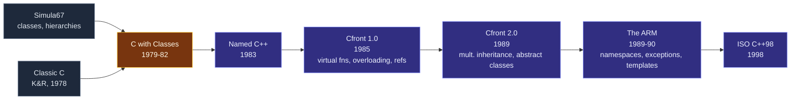

# A History of C++

> [!essence]
> For nineteen years — 1979 to 1998 — "C++" meant whatever Bjarne Stroustrup's latest compiler accepted and his latest manual described, not what a ballot said. Every mechanism this vault treats as a settled rule (constructors, virtual dispatch, references, templates, exceptions) was first a working compromise, added one at a time to solve one real project's problem, years before any standards committee existed to ratify it.

## Context

> [!history] Scope of this note
> This note covers the **pre-standard era** only: from the fall of 1979, when work began on a language called "C with Classes," to October 1998, when ISO/IEC 14882:1998 — C++98 — was ratified. What the standard itself changed, release by release, is the subject of the sibling notes this domain builds next: [[C++98 and C++03]] and onward. [[Map — Evolution of C++]] frames why the domain exists at all.

Bjarne Stroustrup needed to distribute the services of a Unix kernel across multiple processors and local-area networks — what would now be called multicores and clusters (Tour §19.1.2, p. 257). That required describing, precisely enough that independently-written pieces would interoperate, how a system's parts communicated. Simula67 could express that structure directly through classes and class hierarchies, but its implementations were too slow for systems code. C ran fast and sat close to the hardware, but its type system had no way to express or check a module's shape — the boundary between a type's interface and its implementation wasn't a thing the compiler knew about (Tour §19.1.2, p. 257).

> [!principle] Constraint → Consequence → Requirement → Design → Price
> 1. **Constraint.** Systems code needs C's efficiency and its closeness to the hardware; expressing and checking a module's structure needs something like Simula's classes. In 1979, no language offered both.
> 2. **Consequence.** Written in C alone, a module's interface is a convention the programmer remembers, not a rule the compiler enforces — mismatches surface at run time, if they surface at all. Written in Simula, the result is too slow for the device drivers and schedulers Stroustrup was actually building.
> 3. **Requirement.** A language that compiles to code as fast as C's, but lets the programmer state a type's interface and its invariant precisely enough that the compiler, not the next programmer's memory, enforces the boundary.
> 4. **Design.** Add Simula-style classes — data and operations bundled together, with public/private access control, and constructors and destructors to automate setup and teardown — directly on top of C, rather than designing a new language from nothing. Stroustrup called the result **"C with Classes"** (PPP §0.3.3; Tour §19.1.1, p. 256).
> 5. **Price.** Because each feature arrived separately, as a patch on an existing, already-used language, C++ inherited C's own weak spots (array-to-pointer decay, no built-in bounds checking) and could not simply delete them once programs depended on the patched behavior. The same compatibility constraint [[Map — Evolution of C++|the rest of this domain]] studies was already active in 1979 — it just had one user to protect instead of billions of lines of code.

Nineteen years separate the first line of "C with Classes" from the first ISO ballot. Each stage below added features in response to a specific project's need, never from a master plan:



## Headline Features

**"C with Classes" (1979–82).** The first working version already had classes and derived classes, constructors and destructors, public/private access control, and function declarations with argument-type checking (Tour §19.1.1, p. 256; cppreference, *History of C++*). Stroustrup later called the introduction of constructors and destructors the single most significant choice in that first design (Tour §19.1.2, p. 258): a "new function" built a class's execution environment and a "delete function" tore it down, and the two were soon renamed constructor and destructor. No contemporary language Stroustrup knew of had destructors with this guarantee — that releasing code runs automatically, in a fixed place, for every object. That guarantee is the one [[RAII|a later idiom]] turns into the language's whole resource-management strategy.

**Renamed and released (1983–85).** Rick Mascitti suggested the name **C++** in the summer of 1983 — the "++" reads as C's own increment operator, signaling evolution rather than a fresh start (Tour §19.1.2, p. 257) — and the first commercial release followed in October 1985, alongside the first edition of *The C++ Programming Language* (Tour §19.1.1, p. 256). By then the language had also picked up **virtual functions**, function and operator overloading, and **references**. Virtual functions were by far the most contested addition: systems programmers distrusted indirect calls, and people coming from other object-oriented languages doubted an indirect call could ever be fast enough for systems code (Tour §19.1.2, p. 258). The first C++ compiler, **Cfront**, was itself written in C++ — bootstrapped by first writing a "C with Classes"-to-C preprocessor in C, then rewriting that preprocessor's successor, Cfront, in "C with Classes" itself (Stroustrup, bs_faq.html, "Which language did you use to write C++?").

**The second half of the 1980s** added the two features that most changed what C++ *felt* like to use: **templates** and **exception handling**. Templates forced a three-way choice among flexibility, efficiency and early type checking that nobody then knew how to have all at once; Stroustrup chose flexibility and efficiency over early checking, a trade-off generic programming lived with until [[Concepts and Constraints|C++20 concepts]] finally revisited it (Tour §19.1.2, p. 259). Designing exceptions, Stroustrup wanted to pass arbitrary error information up an arbitrary number of stack frames without hand-written cleanup at each one — and in 1988, while solving exactly that problem, he discovered that binding a resource's release to a local object's destructor made exception safety nearly free. He named the technique **Resource Acquisition Is Initialization**; the C++ community soon shortened it to the acronym RAII (Tour §19.1.2, p. 259; Stroustrup, bs_faq.html).

**Toward a standard (1989–98).** Cfront 2.0 (1989) added multiple inheritance, protected access and abstract classes; *The Annotated C++ Reference Manual* — "the ARM" — appeared that same year and served as the de-facto standard until ISO took over, adding namespaces, templates and exception handling on paper even where Cfront didn't yet implement them (cppreference, *History of C++*). The second edition of *The C++ Programming Language* (1991) was the first to present templates and exception handling together with RAII as a coherent whole (Tour §19.1.1, p. 256). The ANSI C++ committee had formed in 1990 and the ISO committee in 1991; eight years of committee work later, ISO/IEC 14882:1998 — **C++98** — was ratified 22–0 (Tour §19.1.3, p. 260–261).

## Feature Map

| Feature | Problem it solved | Compendium note |
|---|---|---|
| Classes with constructors/destructors (1979–80) | Setting up and tearing down an object's state were two separate steps a caller had to remember, on every path, including early returns | [[Constructors]] |
| Derived classes & virtual functions (1980–85) | Code written against a shared interface needed to run the right concrete type's behavior without the caller naming that type | [[Virtual Functions]] |
| References (1985) | Passing or returning an object without copying it, without pointer syntax (`*`, `->`, null checks) leaking into call sites that never needed to express "may not exist" | [[References]] |
| Templates (late 1980s; formalized in the ARM, 1990) | Macros generated repetitive code but couldn't check a type before using it; handwritten per-type copies duplicated logic the compiler could generate once | [[Templates — Code That Writes Code]] |
| Exception handling + RAII (1988–90) | An error found deep in a call chain had to reach a caller many frames up, with every intervening frame still releasing what it held | [[RAII]] |
| Namespaces (the ARM, 1990) | Two libraries that each picked the same obvious name for a function or type could not be linked into one program | [[Namespaces]] |

## Before and After

Every feature above answers the same question the 1979 constraint already posed: how does a type guarantee its own setup and teardown, instead of leaving both to the next programmer's memory? The clearest single demonstration is the first and, in Stroustrup's own judgment, most significant feature: the constructor/destructor pair.

**✗ Procedural style — nothing enforces the matching call:**

```cpp
#include <iostream>

struct Account {
    double balance;
};

void account_open(Account& a, double initial) { a.balance = initial; }   // ①
void account_close(Account& a) {                                         // ②
    std::cout << "closed, balance " << a.balance << '\n';
}

int main() {
    Account a;
    account_open(a, 100.0);
    // ... arbitrarily many lines, possibly several early returns ...
    account_close(a);                                                    // ③
}
// expect: closed, balance 100
```

**✓ "C with Classes" style — the compiler enforces the matching call:**

```cpp
#include <iostream>

class Account {
public:
    Account(double initial) : balance(initial) {}                        // ①
    ~Account() { std::cout << "closed, balance " << balance << '\n'; }   // ②
private:
    double balance;
};

int main() {
    Account a(100.0);
    // ... arbitrarily many lines, possibly several early returns ...
}   // ③ destructor runs here, on every exit path — nothing to remember
// expect: closed, balance 100
```

① Both versions set up the same state. ② Both versions report the same closing action. ③ This is the only line that differs in kind, not just in syntax: the struct-and-functions version requires the programmer to notice every exit path and insert the matching call on each one; the class version requires nothing, because the destructor runs automatically wherever the scope ends. Delete the call to `account_close` from the first program and it still compiles — silently leaking the cleanup. Delete nothing from the second: there is no call to forget.

## Impact

C++'s user population grew from one person in 1979 to roughly 400,000 by 1991 — doubling about every 7.5 months for over a decade (Tour §19.1.2, p. 262). AT&T licensed Cfront to other vendors, and the proceeds funded years of further C++ development at Bell Labs (Stroustrup, bs_faq.html, "Is it true that..."). GCC added C++ support in 1987, breaking Cfront's position as the only road to a working compiler and letting the language spread faster than any single implementation could have driven it (cppreference, *History of C++*).

That growth is also why standardization took as long as it did. By the time the ANSI and ISO committees formed (1990–91), "C++" already meant nineteen years of features added to solve real projects' problems, documented across three editions of *The C++ Programming Language* and the ARM, running in production at hundreds of thousands of sites. The committee's job was never to design a language from a blank page; it was to write down, precisely, a language that already existed in several slightly different implementations — and to do that without breaking any of the code already trusting it. [[C++98 and C++03|The next note]] picks up exactly there: the first ISO standard, and the bug-fix revision five years later that is close enough to it to share a name.

## Connections

- **Prerequisites:** none — this is the domain's starting point. Read [[Map — Evolution of C++]] first for why the domain exists and where this note sits in it.
- **Enables:** [[C++98 and C++03]] (the standard this history leads into) · [[Constructors]] and [[RAII]] (the feature Stroustrup calls most significant, and the idiom its 1988 exception-handling redesign produced) · [[Virtual Functions]] (the most contested 1985 addition) · [[References]] (introduced alongside virtual functions in 1985) · [[Templates — Code That Writes Code]] (the flexibility-over-checking trade-off made in the late 1980s) · [[Namespaces]] (the ARM-era fix for library name collisions).
- **Siblings:** [[C++11 — The Modern Reboot]] and [[C++20 — The Big Four]] (later standards built on the base this note describes).
- **Domain:** [[Map — Evolution of C++]].

## Sources

- Tour ch. 19 "History and Compatibility" §19.1.1 "Timeline" (p. 256): the 1979–1998 year-by-year timeline, Cfront and ARM dates.
- Tour §19.1.2 "The Early Years" (pp. 257–259): the constructor/destructor naming story, the virtual-function controversy, the templates-vs-exceptions trade-offs, and the 1979–1991 user-growth figures (p. 262).
- Tour §19.1.3 "The ISO C++ Standards" (pp. 260–261): the ANSI/ISO committee formation and the 22–0 ratification of C++98.
- PPP §0.3.3 "A brief history of C++" (p. ch00): the first-person account of combining C's hardware efficiency with Simula's classes, and the 1984 renaming from "C with Classes" to C++.
- cppreference, *History of C++*, "Early C++" section: https://en.cppreference.com/w/cpp/language/history.html — the year-by-year feature list for "C with Classes" (1979), Cfront 1.0 (1985), Cfront 2.0 (1989), the ARM (1990), and the ANSI/ISO committee founding dates (1990–91), cross-checked against the Tour's own timeline.
- Bjarne Stroustrup, C++ FAQ: https://www.stroustrup.com/bs_faq.html — "When was C++ invented?", "Which language did you use to write C++?", and the Cfront-licensing and RAII-discovery (1988) answers; first-hand detail the Tour's chapter-19 summary compresses.
