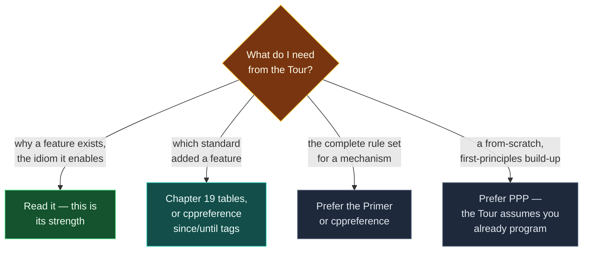

# Guide — A Tour of C++ (3rd ed)

> [!essence]
> The Tour is Stroustrup's own ~250-page overview of the C++20 language and library, written for someone who can already program and wants the shape of modern C++ fast — not the Primer's exhaustive rule sets or PPP's from-scratch build-up. This guide is the map to reading it well: what it deliberately leaves out, where it hides its rationale (the chapter-ending Advice lists), and where it puts the version history it otherwise refuses to interrupt the main text with.

## Purpose

The Style Guide's precedence order places the Tour and PPP together, both above the Primer and both below cppreference and the Standard itself (Style Guide §4.4). The protocol's own book-selection note sharpens what that tie means in practice: the Tour is the source for *the why and modern idiom*, where PPP is the source for a genuine first-principles build-up. Stroustrup states the difference himself in the preface's own terms: this is a sightseeing tour of a city, not a guidebook to live in — a few hours of major attractions and background stories, enough to know what is worth returning to, not enough to navigate the city's rules unaided (Tour Preface, p. xi). A Compendium note reaching for the Tour is reaching for the *point* of a feature — why C++ has it, what idiom it enables — not its complete rule set; the Primer or cppreference supplies the rest.

The Tour also names its own reader directly: "the assumption is that you have programmed before" (Tour Preface, p. xi), and a reader without that background is pointed to *Programming: Principles and Practice Using C++* — the book this vault indexes as `guide-ppp` — before continuing. That makes the Tour the wrong citation for a note's from-scratch motivating example, the same way the Primer is the wrong citation for one; PPP is the only one of the three built for a reader who has never written a program.

The book's most consequential design choice for a researcher is how it treats time. Stroustrup deliberately presents modern C++ as one coherent design rather than a history lesson: the main text avoids tagging each feature with the standard that introduced it, and pushes that bookkeeping into a single dedicated chapter, Chapter 19, "History and Compatibility" (Tour Preface, p. xii). Practically: a claim in Chapters 1–18 is stated as if it were simply how C++ works today, with no marginal icon or inline tag saying which standard added it, unlike the Primer's "new in C++11" marker. A note citing the Tour for a feature still needs its own version label (Charter non-negotiable 5); the Tour's own text will not supply one outside Chapter 19 or the feature-by-standard tables inside it (§19.2, p. 263), which is why [[Map — Evolution of C++]] leans on that chapter specifically rather than the book at large.

> [!tension] compatibility ⟷ evolution
> The Primer freezes a moment in the language's evolution and cannot help it; the Tour's flattened, undated presentation is a choice, made so a C++20 feature reads with the same weight as a C++98 one and the reader isn't constantly reminded which parts of the language are "old." The price is that the book actively resists being used as a version-history source outside Chapter 19 — exactly the opposite failure mode from the Primer, whose every page silently carries a C++11 timestamp. [[Map — Evolution of C++]] is where this vault does the dating work the Tour's main text declines to do inline.

## How to Use It

### Finding a topic

Nineteen chapters plus one appendix, grouped by what kind of material they hold. **Chapter 1, "The Basics"** (p. 1), covers procedural C++ informally — functions, types, scope and lifetime, pointers and references, and mapping to hardware — before anything is treated in depth. **Chapters 2–8** build up the object-oriented and generic-programming facilities in order: user-defined types (p. 21), modularity and namespaces (p. 29), error handling (p. 43), concrete and abstract classes plus virtual functions and class hierarchies (p. 53), the "essential operations" every concrete type needs — copy, move, resource management, operator overloading (p. 71) — then templates (p. 87) and concepts and generic programming (p. 103). **Chapters 9–14** tour the standard library: an overview and its organization (p. 119), strings and regular expressions (p. 125), I/O (p. 137), containers (p. 157), algorithms and iterators (p. 173), and ranges (p. 185). **Chapters 15–17** cover smart pointers and specialized containers (p. 195), utilities such as `chrono`, function adaptors, type traits and `move`/`forward` (p. 213), and numerics (p. 227). **Chapter 18, "Concurrency"** (p. 237), covers tasks and threads, sharing data, waiting for events, and coroutines. **Chapter 19, "History and Compatibility"** (p. 255), is the odd one out by design — see below. **Appendix A, "Module std"** (p. 277), is new to the third edition: a practical guide to `import std;` while it was still, at the time of writing, not yet standardized (Tour App. A.1, p. 277).

### Reading its Advice sections

Every chapter closes with a numbered **Advice** list, and these are one of the book's most useful features for a Compendium author: each item is a compressed rule of thumb with a section back-reference and, where one exists, a bracketed pointer into the C++ Core Guidelines — `[CG: F.1]` means "Guideline F.1 in the Functions section" (Tour §1.10, p. 19). Stroustrup notes the resemblance is not accidental: the Tour's first edition was itself a major source for the initial Core Guidelines (Tour Preface, p. xii). These lists are good hunting ground for a note's `[!rule]` callouts, and each one's `[CG: …]` tag is a ready-made link to the Guidelines for a Pitfalls or Prevention Rules section that wants one.

### Where the version history lives

Because the main chapters deliberately don't date their own features, a research pass building a version timeline — for [[Map — Evolution of C++]] or an *Evolution* section elsewhere — belongs in Chapter 19 specifically: §19.1's Timeline subsection narrates the language from "C with Classes" (1979) through the ISO standards (Tour §19.1.1, p. 256), and §19.2's tables list language and library features standard-by-standard from C++11 through C++20 (Tour §19.2, p. 263). Treat everything before Chapter 19 as standard-agnostic prose that a note must re-date itself, using cppreference's `(since C++NN)` tags as the check (see [[Guide — cppreference, the Draft Standard and the Core Guidelines]]).

## Coverage Map
| Section | What it covers | Compendium notes |
|---|---|---|
| Ch. 1, "The Basics" (p. 1) | Functions, types, scope/lifetime, pointers/references, mapping to hardware | [[Map — What C++ Is]], [[Map — Types & Values]], [[Map — Objects, Memory & Lifetime]] |
| Ch. 2–3, "User-Defined Types," "Modularity" (p. 21–42) | Structs/classes/enums/unions; separate compilation, namespaces, function args/returns | [[Map — Classes & Encapsulation]], [[Map — Program Structure & Build]], [[Map — Functions]] |
| Ch. 4, "Error Handling" (p. 43) | Exceptions, invariants, error-handling alternatives, assertions | [[Map — Errors & Contracts]] |
| Ch. 5–6, "Classes," "Essential Operations" (p. 53–85) | Concrete/abstract types, virtual functions, class hierarchies, copy/move, resource management, operator overloading | [[Map — Inheritance & Polymorphism]], [[Map — Ownership & Move Semantics]], [[Map — Design & Idioms]] |
| Ch. 7–8, "Templates," "Concepts and Generic Programming" (p. 87–117) | Parameterized types/operations, concepts, variadic templates, the compilation model | [[Map — Generic Programming]] |
| Ch. 9–14, Library through Ranges (p. 119–194) | Library organization, strings, I/O, containers, algorithms/iterators, ranges | [[Map — Standard Library]], [[Map — Standard Headers]] |
| Ch. 15–16, "Pointers and Containers," "Utilities" (p. 195–225) | Smart pointers, specialized containers, `chrono`, function adaptors, type traits, `move`/`forward` | [[Map — Ownership & Move Semantics]], [[Map — Generic Programming]] |
| Ch. 17, "Numerics" (p. 227) | Math functions, numerical algorithms, complex numbers, random numbers, numeric limits | [[Map — Standard Library]] |
| Ch. 18, "Concurrency" (p. 237) | Tasks/threads, sharing data, waiting for events, coroutines | [[Map — Concurrency]] |
| Ch. 19, "History and Compatibility" (p. 255) | Timeline, standard-by-standard feature evolution, C/C++ compatibility | [[Map — Evolution of C++]] |
| App. A, "Module std" (p. 277) | Using `import std;` ahead of full standardization; headers vs. modules coexistence | [[Map — Program Structure & Build]], [[Map — Standard Headers]] |

## Connections
- **Prerequisites:** none. Like its sibling guides, this note is meta to the domains — it assumes only that the reader has just hit a `Tour §…` citation somewhere in the Atlas and wants to know how much weight to put on it and where to check its date.
- **This enables:** every note whose Sources list cites `Tour §N.N (p. NNN)`, especially for *why* a feature exists or which idiom it supports — [[Map — Design & Idioms]] and [[Map — Evolution of C++]] draw on it most directly, the latter specifically through Chapter 19.
- **Siblings:** [[Guide — C++ Primer (5th ed)]] is the exhaustive-rules counterpart cited when the Tour's brevity leaves a rule underspecified. [[Guide — cppreference, the Draft Standard and the Core Guidelines]] is the check for any feature's exact version window, since the Tour's main chapters decline to state one. `Guide — Programming Principles and Practice (3rd ed)` (registered as `guide-ppp`, not yet written) is the from-scratch counterpart the Tour's own preface defers to for readers new to programming.

## Sources
- Tour Preface (p. xi): the "sightseeing tour of a city" self-description; states the book covers C++20 plus library components expected for C++23; states the assumed reader has programmed before and points a reader who hasn't to *Programming: Principles and Practice Using C++*.
- Tour Preface (p. xii): states the book treats C++ as one coherent design rather than a layered history, and that outside Chapter 19 it does not mark which standard (C, C++98, or later) introduced a given feature; recommends cppreference for exact technical detail; states the first edition was a major source for the initial C++ Core Guidelines.
- Tour §1.10 "Advice" (p. 19): the numbered Advice-list format and its `[CG: …]` bracketed cross-references into the Core Guidelines, with example items.
- Tour §19.1 "History" (p. 255) and §19.1.1 "Timeline" (p. 256): Stroustrup's account of his own role in C++'s design; the timeline from "C with Classes" (1979) through the ISO standards.
- Tour App. A.1 "Introduction" (p. 277): states `module std` was not yet part of the standard at time of writing and that the appendix offers interim guidance; states headers and modules coexist and that modules deliberately don't export macros.
- Tour Table of Contents (p. v) and chapter openers throughout: chapter and section titles and their printed starting pages, used to build the Coverage Map.
- stroustrup.com, *A Tour of C++ (Third edition)*: confirms publisher (Addison-Wesley), ISBN 0-13-681648-7, September 2022 publication, and the book's own "quick (254 pages + index...) tutorial overview... covers C++20 plus a few likely features of C++23" description: https://www.stroustrup.com/tour3.html
- Style Guide §4.4: states the source-precedence order (Standard > cppreference > Tour/PPP > Primer).
- See [[Guide — cppreference, the Draft Standard and the Core Guidelines]] for the verification step any Tour-cited feature needs before its version label goes in a note.
