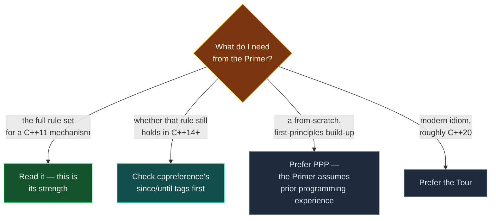

# Guide — C++ Primer (5th ed)

> [!essence]
> The Primer is the vault's most exhaustive single-book account of the language and its core library — and the only one of the four fixed at C++11, a standard three revisions behind the one this Compendium writes against. This guide is the map to using it well: where each topic lives across its four parts, how to read its pedagogical apparatus, and which of its claims need a second opinion from cppreference before they go in a note.

## Purpose

The Style Guide's precedence order for disagreeing sources ranks the Primer last among the books — "Stroustrup (Tour/PPP) > Primer (it predates C++14)" (Style Guide §4.4) — but last does not mean unused. The Primer earns its place for exactly the property that makes it risky: it is exhaustive. Where the Tour moves fast and PPP builds up from first principles for a genuine beginner, the Primer works through nearly every corner of the C++11 language and core library in sequence, cross-referenced forward and back, with a chapter-ending glossary of every term it introduced. When a note needs the *complete* rule set for a mechanism — every form of a `switch` statement, every category of implicit conversion, every one of the five special member functions — the Primer is usually where to find it stated in full, provided the note's author then checks whether C++14 through C++23 changed any part of that rule set.

The title is misleading in one respect worth flagging before citing it as an introductory source: the Primer is not written for someone who has never programmed. Its own preface states the assumption plainly — the authors expect a reader who has "used variables, written and called functions, and used a compiler" in some other block-structured language already (Primer Preface, p. xxiv). That is the opposite assumption from PPP, whose first chapters teach what a program *is*. A Compendium note citing the Primer for a from-scratch explanation of a concept is citing the wrong book; cite it for the rule, and cite PPP or the Tour for the motivating build-up.

> [!tension] compatibility ⟷ evolution
> A book fixes a moment, and the Primer's moment is early: its own preface dates its compiler testing to July 2012, against GCC 4.7.0, a release that did not yet implement inheriting constructors, reference-qualified member functions, or the regular-expression library the book itself describes (Primer Preface, p. xxvi). Three standards have shipped since. `auto` deduction rules, `constexpr` contexts, structured bindings, concepts, ranges, coroutines: none of this exists in the Primer, and a small number of C++11 rules it does state — guaranteed copy elision most notably — were later tightened by the Standard in ways the Primer cannot reflect. Directive item 6 exists for exactly this gap: every C++14-or-later claim gets checked against cppreference before it is written, and the Primer's own account of a C++11 rule gets the same check whenever the rule was among the ones later revised.

## How to Use It

### Finding a topic

The book runs in five blocks, and the block tells you what kind of material to expect. **Chapter 1** ("Getting Started," p. 1) is a single fast pass through a whole toy program — variables, I/O, control flow, a first class — before anything is explained in depth. **Part I, "The Basics"** (Ch. 2–7, p. 29–306) covers the low-level language plus classes: built-in types, `string`/`vector`/arrays, expressions, statements, functions, and — in Chapter 7 specifically (p. 253) — the mechanics of defining your own class, deferring copy control and inheritance to Part III. **Part II, "The C++ Library"** (Ch. 8–12, p. 307–492) covers I/O streams, the sequential and associative containers, the generic algorithms, and dynamic memory and smart pointers. **Part III, "Tools for Class Authors"** (Ch. 13–16, p. 493–714) is where copy control, operator overloading, inheritance and virtual dispatch, and templates live — this is the part a Compendium note on move semantics or polymorphism cites most. **Part IV, "Advanced Topics"** (Ch. 17–19, p. 715–864) covers specialized library facilities (`tuple`, regex, `<random>`), large-program tooling (exceptions, namespaces, multiple inheritance), and specialized language techniques (RTTI, pointer-to-member, nested and local classes, bit-fields, unions). **Appendix A, "The Library"** (p. 865) is a terse, header-by-header index plus a one-page tour of every algorithm — the fastest way to check "which header declares this" without leaving the book.

Two habits make this faster than reading linearly. First, use the cross-references: nearly every non-trivial claim in the book carries a `§N.N (p. NNN)` pointer to where the same idea is covered in more or less depth elsewhere, and `cc.py src find` surfaces these the same way a human skimming the margin would. Second, treat each chapter's closing **Defined Terms** glossary as a checklist before moving on — it is the book's own summary of what that chapter considered essential, and a fast way to confirm a research pass hasn't missed a term.

### Reading its pedagogical apparatus

The fifth edition marks its own text with four devices, and knowing them saves time deciding what to read closely. A margin icon of a **person studying a book** marks sections the authors consider core — "everyone should read and understand these sections" (Primer Preface, p. xxv). A **stack of books** icon marks advanced or special-purpose sections safe to skim or skip on a first pass. A **magnifying glass** flags a section covering a concept the authors expect readers to find genuinely difficult, worth slowing down for even when its importance isn't obvious yet. A fourth, unillustrated icon marks material new in the C++11 standard specifically, which is most of the book's own emphasis given when it was written (Primer Preface, p. xxiii). Inside the prose, **KEY CONCEPT** sidebars (for example the one on types, p. 3) interrupt the main text to state a foundational idea explicitly rather than let it stay implicit in an example — these are usually the cleanest single-paragraph statement of a rule the book offers, and a good hunting ground when a note needs one precise sentence to paraphrase.

### The C++11 ceiling

Because the whole book targets one fixed standard, a research pass through it should default to distrust for anything the note will state as a modern rule. The safe pattern: read the Primer for the mechanism and its C++11-era rule, then open the matching cppreference page and check every `(since C++NN)` / `(until C++NN)` tag on it before writing the claim (see [[Guide — cppreference, the Draft Standard and the Core Guidelines]]). Where the Primer's account and a later standard genuinely diverge — guaranteed copy elision is the standing example in this vault, tightened by C++17 in a way the Primer's C++11-era explanation cannot state — say so in a `[!standard]` callout rather than silently updating the claim, so a future reader can see which part came from which era.

## Coverage Map
| Section | What it covers | Compendium notes |
|---|---|---|
| Ch. 1, "Getting Started" (p. 1) | A first program, compiling and running it, a first class used (not defined) | [[Map — What C++ Is]], [[Map — Program Structure & Build]] |
| Part I, Ch. 2–6 (p. 31–251) | Built-in and compound types, `string`/`vector`/arrays, expressions, statements, functions | [[Map — Types & Values]], [[Map — Expressions & Control]], [[Map — Functions]] |
| Part I, Ch. 7 (p. 253) | Defining a class: scope, data hiding, constructors, `this`, `friend`, `static`/`mutable` | [[Map — Classes & Encapsulation]] |
| Part II, Ch. 8–11 (p. 309–447) | I/O streams, sequential and associative containers, generic algorithms | [[Map — Standard Library]] |
| Part II, Ch. 12 (p. 449) | Dynamic memory and the smart-pointer classes | [[Map — Objects, Memory & Lifetime]], [[Map — Ownership & Move Semantics]] |
| Part III, Ch. 13 (p. 495) | Copy control: copy/move construction and assignment, rvalue references | [[Map — Ownership & Move Semantics]] |
| Part III, Ch. 14–15 (p. 551–650) | Operator overloading, conversions, inheritance and virtual dispatch | [[Map — Design & Idioms]], [[Map — Inheritance & Polymorphism]] |
| Part III, Ch. 16 (p. 651) | Templates and generic programming | [[Map — Generic Programming]] |
| Part IV, Ch. 17–19 (p. 717–864) | Specialized library facilities; exceptions, namespaces, multiple inheritance; RTTI and specialized language tools | [[Map — Errors & Contracts]], [[Map — Program Structure & Build]] |
| Appendix A (p. 865) | Library headers by name; a compressed tour of the algorithms | [[Map — Standard Library]], [[Map — Standard Headers]] |

## Connections
- **Prerequisites:** none. Like its sibling guides, this note is meta to the domains — it assumes only that the reader has just hit a `Primer §…` citation somewhere in the Atlas and wants to know where that section sits and how much to trust it.
- **This enables:** every note whose Sources list cites `Primer §N.N (p. NNN)`, most heavily [[Map — Objects, Memory & Lifetime]], [[Map — Ownership & Move Semantics]] and [[Map — Inheritance & Polymorphism]], where Part II's and Part III's chapters are the densest single-book treatment this vault indexes.
- **Siblings:** [[Guide — cppreference, the Draft Standard and the Core Guidelines]] is the check every C++14+ claim from this book needs. [[Guide — A Tour of C++ (3rd ed)]] and [[Guide — Programming Principles and Practice (3rd ed)]] are the other book-side Source Guides written the same wave; between the three, the Tour covers modern idiom the Primer predates, and PPP covers the from-scratch build-up the Primer's own preface says it does not attempt.

## Sources
- Primer Preface (p. xxiii): states the 2011 standard's goals and that the fifth edition was "completely revised" to the new standard, with new-feature sections marked by a marginal icon.
- Primer Preface (p. xxiv): states the book's assumed reader background ("used variables, written and called functions, and used a compiler") and the three-part view of modern C++ (low-level language, advanced type-definition features, standard library) that motivates the book's chapter order.
- Primer Preface (p. xxv): describes the "person studying a book" (fundamental) and "stack of books" (advanced/skippable) margin icons, and the magnifying-glass icon for difficult concepts; states the four-part structure (Parts I–IV) and that Appendix A summarizes the library algorithms.
- Primer Preface (p. xxvi): describes the chapter-ending Chapter Summary and Defined Terms glossary, bold-term convention, and cross-reference style; the "A Note about Compilers" section dates the book's own compiler testing to GCC 4.7.0 (July 2012) and names inheriting constructors, reference-qualified members and the regex library as features that compiler did not yet implement.
- Primer p. 3, "Key Concept: Types": example of the book's KEY CONCEPT sidebar convention.
- Primer p. 29, Part I contents listing: confirms Chapter 7 ("Classes") starts at p. 253, closing Part I.
- Primer p. 307–308, "Part II: The C++ Library" introduction: confirms Chapters 8–12 and their scope (I/O, sequential containers, algorithms, associative containers, dynamic memory).
- Primer p. 493, "Part III: Tools for Class Authors" introduction: confirms Chapters 13–16 and that Chapter 13 covers rvalue references and move operations as a "new standard" addition.
- Primer p. 715, "Part IV: Advanced Topics" introduction: confirms Chapters 17–19 and their split between specialized-library and large-program-tooling material.
- Primer p. 865, "Appendix A: The Library" contents listing: confirms the appendix covers library names/headers and a tour of the algorithms.
- Style Guide §4.4: states the source-precedence order (Standard > cppreference > Tour/PPP > Primer) and the reason ("it predates C++14").
- cppreference, *Copy elision*: documents the C++11 permitted-but-not-required elision the Primer describes versus the mandatory elision certain prvalue contexts gained in C++17 — the standing example of a C++11-era Primer rule later tightened by the Standard: https://en.cppreference.com/w/cpp/language/copy_elision
- See [[Guide — cppreference, the Draft Standard and the Core Guidelines]] for the verification step every C++14+ claim from this book needs before it goes in a note.
