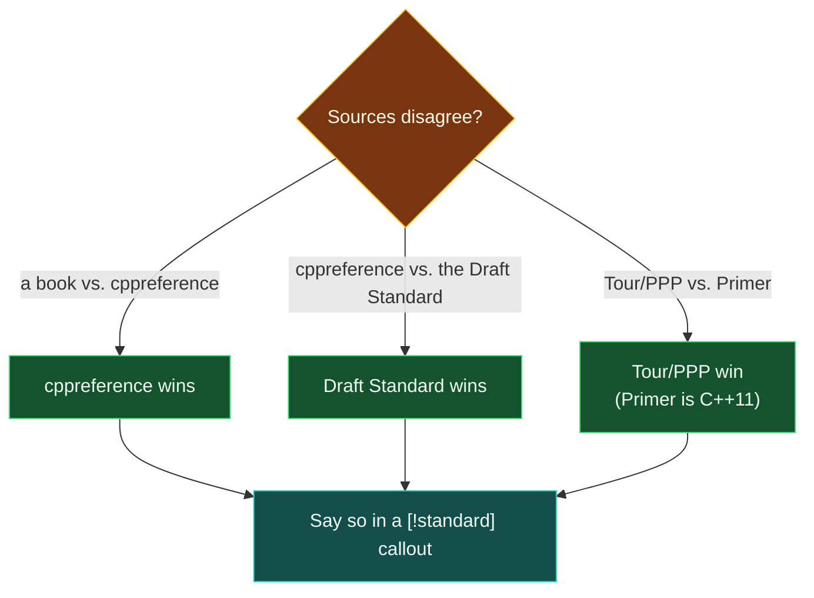

# Guide — cppreference, the Draft Standard and the Core Guidelines

> [!essence]
> A book fixes a moment: the Primer explains C++11, the Tour explains roughly C++20, and neither updates itself when the committee ships another release. cppreference, the draft Standard and the Core Guidelines are how the Compendium checks a book's claim against *this year's* C++ — the first for what a name means and since when, the second for what the Standard actually requires, the third for what to do where the Standard deliberately leaves the choice to the programmer.

## Purpose

The Compendium's non-negotiables rank correctness over coverage: if a claim is in doubt, "verify against cppreference or the draft standard, or leave the claim out" (Charter §8.1). The Style Guide turns this into an order of precedence for when sources disagree: the Standard, then cppreference, then Stroustrup's Tour and PPP, then the Primer last, because "the Primer predates C++14" (Style Guide §4.4). This guide is the map to the top two rungs of that ladder, plus a fourth resource — the Core Guidelines — that sits beside the ladder rather than on it, since it is advice, not a normative text.

The four books this vault indexes were each fixed at a moment. Even the Tour, the newest, targets C++20 and only "overrepresent[s]" — its own word — a handful of anticipated C++23 features (Tour §Preface, p. xii). A reader who learns C++ only from a book therefore inherits that book's publication date without knowing it. cppreference is a wiki maintained continuously against every ratified and drafted standard; the draft Standard at eel.is/c++draft is a browser rendering of WG21's actual working paper; and the Core Guidelines are a living document that Stroustrup's own preface points readers toward for further advice on writing good modern C++ (Tour §Preface, p. xii).

> [!tension] compatibility ⟷ evolution
> A note that cites only a book inherits that book's standard year. `auto` deduction rules changed between C++11 and C++17, `constexpr` grew a new permitted use in nearly every release, and whole headers (`<format>`, `<expected>`, `<flat_map>`) did not exist when the Primer went to press. cppreference's inline "(since C++NN)" / "(until C++NN)" tags are the working answer to that drift, which is why Directive item 6 requires checking any C++14-or-later claim against them rather than trusting the Primer alone.

## How to Use It

### cppreference

Two references share one site. `en.cppreference.com/w/cpp/language/*` covers the core language — declarations, expressions, templates, exceptions, everything that happens before `main` hands control to a library call. `en.cppreference.com/w/cpp/<area>/*` covers the standard library, organized by library area (`container`, `algorithm`, `string`, `thread`, …), not by header. The **Standard library headers** index (`/w/cpp/header`) is the header-to-facility map a Header Card's Quick Reference block is built from directly, so writing or checking one starts there.

Every declaration carries an inline version tag — `(since C++17)`, `(until C++20)`, `(constexpr since C++23)` — and each page's own revision-history table names the paper that made the change. This answers "does this compile before C++20?" in under a minute, without opening the draft Standard, which is exactly what Directive item 6 asks for when it requires every C++14+ behavior to be checked against cppreference because "the Primer is C++11."

cppreference is a wiki, not a normative text: it paraphrases the Standard, and a paraphrase can blur a subtlety the Standard states exactly (an overload-resolution tie-break, a `noexcept`-propagation rule). When a page's wording and the draft Standard's wording appear to disagree, the draft Standard wins (Style Guide §4.4), and the note that relies on it says so in a `[!standard]` callout.

Two housekeeping pages carry weight across the whole vault. **Compiler support** (`/w/cpp/compiler_support`) tracks which GCC, Clang or MSVC release ships which feature — the fact behind every "on mainstream compilers" hedge in [[Style Guide]] §2. The **Symbol index** (`/w/cpp/symbol_index`) is the fastest route from a bare name (`optional`, `visit`, `bit_cast`) to its page when the header isn't known yet.

### The Draft Standard (eel.is/c++draft)

eel.is/c++draft renders WG21's working paper in a browser, regenerated from the same LaTeX sources the committee edits, and it says so on its own front page: "this is *not* an ISO publication." It is nevertheless the single most authoritative text short of the ratified PDF, because it is the actual document the Standard is, not a description of it. The books agree this is where to look: the Tour notes that WG21, the ISO C++ committee, publishes the documents behind each standard online as a matter of course (Tour §19.1, p. 256).

One seam in the numbering is worth knowing before the first visit: clauses 1 through 15 are the core language (1 Scope … 6 Basics … 9 Declarations … 14 Exception handling … 15 Preprocessing directives), and clause 16 onward is the library, opening with "16 Library introduction" and continuing through the language-support, concepts and diagnostics clauses in roughly the grouping the language-reference navigation bar already uses. Every clause and sub-clause carries a short bracketed tag — `[intro.abstract]`, `[basic.life]`, `[class.copy.elision]` — that resolves to a URL (`eel.is/c++draft/basic.life`) and to nothing else. That tag, never a page number, is what a Compendium note cites for a normative point (Style Guide §4.1), which is also why Directive item 4 insists on quoting `[basic.life]` and `[basic.stc.general]` wherever *lifetime* and *storage* are being told apart.

Two habits keep this fast. First, don't read a clause top to bottom hunting for a rule: browser-search the page for the term already found on cppreference or in a book, since eel.is preserves the Standard's own cross-reference style — `[intro.object]` is linked from inside a dozen other clauses. Second, treat footnotes as normative text, not commentary: the Standard states some of its most load-bearing rules, the as-if rule among them, in a footnote rather than the main clause body.

### The C++ Core Guidelines

The Core Guidelines are not part of the Standard: a fully conforming compiler accepts code that breaks every rule in them. They exist for the gap the Standard leaves open on purpose — *given that the Standard permits several things here, which should I write?* PPP leans on exactly that gap: its own example code is written to follow the Guidelines and has been checked for type safety against them (PPP §2.8), and its chapter on declarations invokes the Guidelines directly, by rule ID `[CG: ES.20]`, to explain why an uninitialized built-in variable counts as a bug rather than a stylistic lapse (PPP §7.2).

Every rule has a short, stable ID: a section letter (or two) and a number — `P.1` ("Express ideas directly in code"), `I.2` ("Avoid non-const global variables"), `R.11` ("Avoid calling `new` and `delete` explicitly"), `ES.20` ("Always initialize an object"), `C.67`, `CP.1`, `Con.1`, `T.1`. A Compendium note cites a guideline the way PPP does, `[CG: R.11]`, inside a `[!rule]` callout, because the ID stays stable even when the surrounding prose is revised — and it is revised often: the document calls itself "a living document under continuous improvement," dated 14 June 2026 as fetched for this guide.

Two sections carry disproportionate weight for this vault. **R (Resource management)** states the ownership and smart-pointer defaults as a checklist; [[RAII]] is where this vault derives the same defaults from first principles, so read the Dossier for *why* and the Guidelines for the fast lookup. **ES (Expressions and statements)** holds the initialization and lifetime defaults that fall inside [[Map — Objects, Memory & Lifetime]]'s territory but that no compiler enforces on its own.

## Coverage Map
| Section | What it covers | Compendium notes |
|---|---|---|
| cppreference → Language | Core-language rules by name, each with since/until version tags | [[Map — What C++ Is]], [[The C++ Abstract Machine]] |
| cppreference → Standard library, by area | Every container, algorithm, string and I/O facility, grouped by library area rather than header | [[Map — Standard Library]] |
| cppreference → Standard library headers | The header-to-facility index a Header Card's Quick Reference is built from | [[Map — Standard Headers]] |
| cppreference → Compiler support | Which GCC/Clang/MSVC release ships which feature | [[The ISO Standard, Compilers and Conformance]] |
| Draft Standard, clauses 1–15 | The normative text behind a paraphrase: object model, lifetime, expressions, declarations | [[The C++ Abstract Machine]], [[Undefined Behavior]] |
| Draft Standard, clauses 16+ | Preconditions and complexity guarantees for library facilities | [[Map — Standard Library]] |
| Core Guidelines, R | Ownership and resource-management defaults, stated as a checklist | [[RAII]] |
| Core Guidelines, whole document | Rule-by-rule reading past what this guide summarizes | [[The C++ Core Guidelines]] |

## Connections
- **Prerequisites:** none. This guide is meta to the whole vault rather than downstream of any domain — it assumes only that the reader has just hit a citation in some other note.
- **This enables:** every verification step in [[Style Guide]] §4 and in Directive items 3–6 routes through here — precise clause citations in [[The C++ Abstract Machine]] and [[Undefined Behavior]], version-gated C++14+ claims anywhere in the Atlas, and every `[!rule]` callout that cites a Core Guidelines ID. The Header Cards product (Run Protocol §6b) leans on cppreference specifically for the "verify each label" step behind every Quick Reference block in [[Map — Standard Headers]].
- **Siblings:** [[Guide — C++ Primer (5th ed)]] and [[Guide — A Tour of C++ (3rd ed)]] are the book-side Source Guides written the same wave; together with this one they cover everything the Compendium is permitted to cite. [[The C++ Core Guidelines]] is the deeper, rule-by-rule Dossier this guide's Core Guidelines section defers to rather than duplicates.

## Sources
- Tour §Preface (p. xii): Stroustrup directs the reader to cppreference for the technical details of language and library facilities, and to the Core Guidelines for further advice on writing good modern C++.
- Tour §19.1 "History" (p. 256): notes that most of the documents from the ISO C++ standardization effort, i.e. the WG21 papers the draft Standard is built from, are published online.
- Tour §19.4 "Bibliography" (p. 272): lists cppreference (www.cppreference.com) as the online source for C++ language and standard-library facilities.
- PPP §2.8 "Type safety": states that the book's own example code follows the Core Guidelines and has been checked for type safety against them.
- PPP §7.2 "Declarations and definitions": cites Core Guidelines rule `[CG: ES.20]` when explaining why the language cannot default-initialize a built-in type on the programmer's behalf.
- cppreference, home and standard-library-header index: https://en.cppreference.com/w/cpp · https://en.cppreference.com/w/cpp/header
- cppreference, *Compiler support*: https://en.cppreference.com/w/cpp/compiler_support
- Draft Standard, table of contents and `[intro.abstract]`: https://eel.is/c++draft/ · https://eel.is/c++draft/intro.abstract
- The C++ Core Guidelines (B. Stroustrup and H. Sutter, eds.), fetched 2026-09-24: https://isocpp.github.io/CppCoreGuidelines/CppCoreGuidelines
