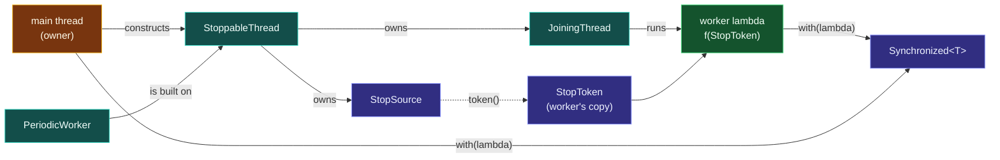

# Kit — Background Worker (C++14-17)

> [!essence]
> Four small, header-only building blocks that let a C++14/17 program **keep doing its own work while a background thread runs**. A thread that joins itself when it goes out of scope, a stop signal that wakes a sleeping worker immediately, a periodic job runner that holds on to exceptions thrown by its task, and a value that can only be touched under its own mutex. Together they give you the core of C++20's `std::jthread` without needing C++20.

## Purpose

A raw `std::thread` in C++14/17 has three sharp edges. The kit removes each one with a type, so the safe choice is also the easy one:

| Sharp edge of raw `std::thread` | What goes wrong | Kit type that removes it |
|---|---|---|
| Must be joined or detached before destruction | Forget once (or let an exception skip your `join()`) and the program calls `std::terminate` | `cc::JoiningThread`: joins in its destructor ([[RAII]] for threads) |
| No built-in way to ask a thread to stop | Ad-hoc `bool` flags cause data races; sleeping workers take a full interval to notice the flag | `cc::StopSource` / `cc::StopToken` + `StopToken::sleep_for`, which wakes instantly on a stop |
| An exception escaping the thread function | `std::terminate`, taking down the whole program | `cc::PeriodicWorker` catches it and hands it back via `rethrow_if_failed()` |
| Shared data needs a mutex *every* time | One forgotten lock is a [[Data Races and Race Conditions|data race]], which is undefined behavior | `cc::Synchronized<T>`: the data is unreachable except through a locked lambda |

The files live beside this note in `04 Practice/Kits/Background Worker/`. Obsidian hides `.hpp` files by default; open the folder in VS Code, or enable *Settings → Files and links → Detect all file extensions*.

```text
Kits/Background Worker/
├── include/cc/
│   ├── background.hpp        umbrella: include this for everything
│   ├── stop_token.hpp        StopSource, StopToken (C++20 stop_token in miniature)
│   ├── joining_thread.hpp    JoiningThread, StoppableThread (C++20 jthread in miniature)
│   ├── periodic_worker.hpp   PeriodicWorker: run a task every N ms
│   └── synchronized.hpp      Synchronized<T>: value + mutex, fused
├── examples/example_main.cpp main thread works while two workers run
├── tests/tests.cpp           8 self-checks (run under ThreadSanitizer)
└── CMakeLists.txt            INTERFACE library `cc_background` + example + tests
```

## How to Use It

**Build it.** Header-only. Add `include/` to your include path and link the platform's thread library:

```text
g++ -std=c++17 -Wall -Wextra -pthread -I include examples/example_main.cpp -o example
g++ -std=c++14 -pthread -fsanitize=thread -I include tests/tests.cpp -o tests && ./tests
cl  /std:c++17 /EHsc /W4 /I include examples\example_main.cpp          (MSVC)
```

With CMake, `add_subdirectory` the kit and `target_link_libraries(your_app PRIVATE cc_background)`.

**How the pieces compose.** The owner (your `main`) holds the stop source through the thread object. The worker holds only a token.



**Pattern 1: a loop that stops promptly.**

```cpp
// cc: fragment
cc::StoppableThread watcher([](cc::StopToken st) {
    while (st.sleep_for(std::chrono::milliseconds(200)))   // ① false the moment a stop is requested
        poll_device();
});                                                        // ② scope exit: request_stop() + join()
```
1. Using `sleep_for` on the token instead of `std::this_thread::sleep_for` is what makes shutdown instant: a stop request notifies a condition variable the sleeper waits on ([[Condition Variables]]).
2. No `join()` to forget. The destructor asks the worker to stop, then waits for it.

**Pattern 2: a periodic job next to your main work.**

```cpp
// cc: fragment
cc::Synchronized<std::vector<Reading>> readings;
cc::PeriodicWorker sampler(std::chrono::seconds(1), [&readings] {
    Reading r = read_sensor();                              // ① may throw
    readings.with([&](std::vector<Reading>& v) { v.push_back(r); });
});
run_user_interface();                                       // ② main thread keeps working
sampler.stop();
sampler.rethrow_if_failed();                                // ③ surface a worker exception here
```
1. If `read_sensor` throws, the worker stops cleanly instead of calling `std::terminate`.
2. The schedule is fixed-rate on `steady_clock`. A slow tick does not trigger a burst of catch-up ticks ([[chrono — Durations, Clocks, Time Points]]).
3. The exception is rethrown on the owner's thread, where it can be handled ([[Exceptions]]).

> [!trap] Lifetimes still matter
> Workers usually capture by reference (`[&readings]`). The captured objects must outlive the worker. Declare shared data **before** the thread objects, so they are destroyed **after** the threads are joined ([[Lambda Captures and Closure Objects]], [[Dangling Pointers and References]]).

> [!rule] Never let the protected value escape `with`
> `with` returns whatever your lambda returns. Return values, never references or pointers into the protected data. Otherwise the lock is gone while you still hold the reference.

> [!standard] Upgrade path to C++20
> `cc::StoppableThread` maps to `std::jthread`, `cc::StopSource`/`cc::StopToken` map to `std::stop_source`/`std::stop_token`, and `StopToken::sleep_for` maps to `std::condition_variable_any::wait_for(lock, stop_token, …)`. When you move to C++20, swap the types; the program structure stays the same.

## Coverage Map

| Header | Provides | Concepts it puts into practice |
|---|---|---|
| `stop_token.hpp` | `StopSource`, `StopToken`, interruptible `sleep_for` | [[Cooperative Cancellation with stop_token]] · [[Atomics]] · [[Condition Variables]] |
| `joining_thread.hpp` | `JoiningThread`, `StoppableThread` | [[Threads — thread and jthread]] · [[RAII]] · [[Move Semantics]] |
| `periodic_worker.hpp` | `PeriodicWorker` (fixed rate, exception capture) | [[Exceptions]] · [[chrono — Durations, Clocks, Time Points]] |
| `synchronized.hpp` | `Synchronized<T>` | [[Mutexes and Lock Guards]] · [[Data Races and Race Conditions]] · [[Deadlock]] |
| `tests/tests.cpp` | 8 behavioral checks | [[Sanitizers — ASan, UBSan, TSan]] |

**Verified:** all tests pass with GCC (C++14 and C++17, `-Wall -Wextra -pedantic -Werror`) under ThreadSanitizer, AddressSanitizer and UBSan. The headers and tests also compile cleanly with MSVC (`/std:c++14` and `/std:c++17`, `/W4 /WX`) and Clang (`-std=c++14 -Werror`).

> [!trap] ThreadSanitizer on GCC 11
> On GCC 11, ThreadSanitizer reports a spurious *"double lock of a mutex"* in `StopSource::request_stop`. That TSan build does not intercept `pthread_cond_clockwait`, which libstdc++ uses inside `condition_variable::wait_for`, so it believes the sleeping thread still holds the mutex. GCC 13 (and recent Clang) run the same tests cleanly under TSan. Use a newer compiler for race checking. On a VM that reports *"unexpected memory mapping"*, run the test binary with `setarch $(uname -m) -R ./tests`.

## Connections

- **Domain:** [[Map — Concurrency]].
- **Header cards (signatures and recipes):** [[Header — thread and stop_token]] · [[Header — atomic]] · [[Header — chrono]].
- **Next steps:** [[Futures, Promises and async]] (a result from a background task) · [[Thread Pools and Task Queues]] (many tasks, few threads).
- **Practice:** *Continuum #29 Multithreaded Producer-Consumer*: rebuild its consumer on `StoppableThread` + `Synchronized<std::queue<T>>` · *#35 Multithreaded Chat/Web Server*: use `PeriodicWorker` for housekeeping (timeouts, stats) · [[Continuum Bridge]].
- **Process-based alternative (Option A):** launching a *separate program* uses OS APIs (`CreateProcessW` on Windows, `posix_spawn` on POSIX). It is not covered by this kit.

## Sources

- Tour §18.2 "Tasks and threads" (p. 238), §18.3 "Sharing Data" (p. 241), §18.4 "Waiting for Events" (p. 243): threads, mutexes and condition variables from the language's designer.
- Pikus ch. 8 "Concurrency in C++" (p. 293): what the standard concurrency facilities cost and guarantee.
- cppreference, *std::thread* · *std::jthread* · *std::stop_token* · *std::condition_variable::wait_for*: https://en.cppreference.com/w/cpp/thread
- C++ Core Guidelines CP.25 "Prefer `gsl::joining_thread` over `std::thread`", CP.26 "Don't `detach()` a thread", CP.20 "Use RAII, never plain `lock()`/`unlock()`": https://isocpp.github.io/CppCoreGuidelines/CppCoreGuidelines
