# Path — Course Companion

> [!essence]
> The Atlas and the **CPP Project Continuum** (35 practice projects) are two halves of one curriculum. This path is the bridge walked in the other direction: for each project in Continuum Tiers 1–5, it names the Compendium notes a learner should read first, and it tells you honestly which projects the Atlas can support *today* versus which still wait on a missing note.

## Destination

The Continuum groups its 35 projects into seven tiers. This path covers **Tiers 1–5** (projects 1–28) — foundations through modern C++ and the STL — because that is exactly the span the Charter's Roadmap calls **Phase 3 · Proficiency**: "~100 working-knowledge notes. Covers everything the Continuum's Tiers 1–5 exercise." Tiers 6–7 (29–35, advanced systems work and the capstones) belong to Phase 4 and are out of scope for this path; they get their own Course Companion once Phase 3 closes.

Arriving at this destination does not mean every note in Tiers 1–5's footprint is `reviewed` or `evergreen` — the [[Framework]] life cycle treats `draft` as a fully written, checked note, and most of the notes below are drafts. It means a learner can sit down with a project, follow the reading list, and have every concept the project exercises already explained somewhere in the Atlas before they need it. A project is only called **ready** below when that is literally true: every note tagged against it in [[Continuum Bridge]] exists as a written file (`draft`, `revise`, `reviewed` or `evergreen` — anything past `○ planned`). Where it isn't true, the blocking notes are named so the next Builder run (or the owner, reading this page) knows exactly what to write next.

This page does not replace [[Continuum Bridge]], which is the generated, exhaustive project↔topic index. It is a *curated route* through that index: one coherent walk, in dependency order, with a reason for each step.

## Route

The Atlas's 17 domains are not read in registry order; they are read in the order a learner actually needs them. For the span Tiers 1–5 touch, that order runs through the domain Maps below, each one the front door to everything beneath it.

```mermaid
flowchart LR
    D00["Map — What C++ Is<br/><i>D00 · the contract</i>"]:::concept
    D01["Map — Program<br/>Structure & Build<br/><i>D01</i>"]:::concept
    D02["Map — Types<br/>& Values<br/><i>D02</i>"]:::concept
    D03["Map — Expressions<br/>& Control<br/><i>D03</i>"]:::concept
    D05["Map — Functions<br/><i>D05</i>"]:::concept
    D04["Map — Objects, Memory<br/>& Lifetime<br/><i>D04</i>"]:::focus
    D06["Map — Classes &<br/>Encapsulation<br/><i>D06</i>"]:::concept
    D07["Map — Ownership &<br/>Move Semantics<br/><i>D07</i>"]:::concept
    D08["Map — Inheritance &<br/>Polymorphism<br/><i>D08</i>"]:::concept
    D10["Map — Standard<br/>Library<br/><i>D10</i>"]:::concept
    FIN["D09 Generic · D11 Errors<br/>D15 Design & Idioms<br/><i>Tier 5 finishers</i>"]:::mech
    D00 --> D01 --> D02 --> D03 --> D05 --> D04 --> D06 --> D07 --> D08 --> D10 --> FIN
    classDef concept fill:#312e81,stroke:#818cf8,color:#eef2ff
    classDef focus fill:#78350f,stroke:#fbbf24,color:#fffbeb
    classDef mech fill:#134e4a,stroke:#2dd4bf,color:#f0fdfa
```

[[Map — Objects, Memory & Lifetime]] is the hinge of the whole route (styled `focus` above): everything before it — structure, types, expressions, functions — is preparation for the question of *where things live*, and everything after it — classes, ownership, inheritance, generics — is an answer built on that question.

| # | Note | Why this next |
|---|---|---|
| 1 | [[Map — What C++ Is]] | Frames the Three Lenses (source / abstract machine / real machine) every later note speaks in. Read this before anything else, including Project 1. |
| 2 | [[Map — Program Structure & Build]] | Project 1 (*Hello, Compiler*) asks what a compiler does to a file before it asks what the file says. |
| 3 | [[Map — Types & Values]] | Projects 2 and 10 are built on converting and reinterpreting bits; you need the type model before you need `switch`. |
| 4 | [[Map — Expressions & Control]] | Projects 2–3 are expressions and control flow directly: precedence, associativity, loops. |
| 5 | [[Map — Functions]] | Project 5 (a REPL) and Project 6 (a header refactor) turn repeated logic into named, reusable units — the point where "a program" becomes "several functions that cooperate." |
| 6 | [[Map — Objects, Memory & Lifetime]] | Project 11 is the Tier 3 hinge: pointers, storage duration and dangling references make no sense until lifetime is a concept, not an intuition. |
| 7 | [[Map — Classes & Encapsulation]] | Project 17 is the first project where an invariant (a non-negative balance) is the actual assignment, not an accident of correct code. |
| 8 | [[Map — Ownership & Move Semantics]] | Projects 12, 22 and 25 each replace a hand-rolled resource manager with RAII and then with move semantics — read this before writing the second `~Resource()`. |
| 9 | [[Map — Inheritance & Polymorphism]] | Projects 18, 20 and 21 need the vptr/vtable cost model *before* `virtual` is used as a reflex. |
| 10 | [[Map — Standard Library]] | Projects 7 and 23 replace code written in steps 3–9 with `vector`, `string` and the algorithms library — the payoff for everything above. |
| 11 | [[Map — Generic Programming]] | Project 24 asks you to build the kind of container the Standard Library hid from you in step 10. |
| 12 | [[Map — Errors & Contracts]] | Project 26 needs a real exception hierarchy and an exception-safety vocabulary, not `try`/`catch` by feel. |
| 13 | [[Map — Design & Idioms]] | Project 28 is graded on interface design, not just output; this map is the frame for that judgment. |

## Milestones

Each table below is one Continuum tier. **Status** is computed, not estimated: a project is `✓ Ready` only if every note [[Continuum Bridge]] lists against it is written (at least `draft`); otherwise it is `✗ Blocked`, naming exactly what's missing. This reflects the registry as of Builder run #147 (2026-10-02) and will drift as new notes land — re-run `cc.py status` or re-read [[Continuum Bridge]] for the current picture.

> [!standard] Reading note
> "Notes to read first" repeats [[Continuum Bridge]]'s own list for that project, map entries included. A short list (Project 4, 8, 14) means the registry has not yet tagged every concept that project actually uses, not that the project is trivial — see the open items this creates for the Editor, below.

### Tier 1 — Foundations

| # | Project | Status | Notes to read first |
|---|---|---|---|
| 01 | Hello, Compiler | ✗ Blocked — missing [[CMake Fundamentals]] | [[Map — Program Structure & Build]], [[Map — Tooling & Engineering]], [[The Compilation Pipeline]], [[Translation Units]], [[Compilers and Essential Flags]], [[Warnings as Guardrails]], [[CMake Fundamentals]] |
| 02 | Unit & Temperature Converter Suite | ✗ Blocked — missing [[switch and Fallthrough]] | [[Map — Types & Values]], [[Map — Expressions & Control]], [[Fundamental Types]], [[Integer Representation and Two's Complement]], [[Anatomy of an Expression]], [[Precedence and Associativity]], [[Control Flow — Selection and Iteration]], [[switch and Fallthrough]] |
| 03 | Number Guessing Game | ✗ Blocked — missing [[Stream State and Robust Input]], [[Random Number Generation]] | [[Map — Expressions & Control]], [[Anatomy of an Expression]], [[Precedence and Associativity]], [[Control Flow — Selection and Iteration]], [[Stream State and Robust Input]], [[Random Number Generation]] |
| 04 | Grade & GPA Calculator | ✓ Ready | [[array]] |
| 05 | Console Calculator REPL | ✗ Blocked — missing [[Stream State and Robust Input]], [[String Streams]] | [[Map — Functions]], [[Anatomy of a Function]], [[Function Overloading]], [[Stream State and Robust Input]], [[String Streams]], [[Exceptions]], [[Functions and Parameters — The Complete Picture]] |

### Tier 2 — Core Programming

| # | Project | Status | Notes to read first |
|---|---|---|---|
| 06 | Function Library & Header Refactor | ✗ Blocked — missing [[assert and static_assert]] | [[Map — Program Structure & Build]], [[Map — Functions]], [[Translation Units]], [[The Preprocessor]], [[Headers and Include Guards]], [[Declarations vs Definitions]], [[References]], [[Pointers vs References]], [[Anatomy of a Function]], [[Parameter Passing — Value, Reference, Pointer]], [[Function Overloading]], [[assert and static_assert]], [[Functions and Parameters — The Complete Picture]] |
| 07 | Word & Text Analyzer | ✗ Blocked — missing [[Ordered Associative Containers — map and set]], [[IO Streams Architecture]], [[File IO]] | [[Map — Standard Library]], [[vector]], [[string]], [[Ordered Associative Containers — map and set]], [[IO Streams Architecture]], [[File IO]] |
| 08 | Matrix Operations Toolkit | ✗ Blocked — missing [[Preconditions, Postconditions and Contracts]] | [[Preconditions, Postconditions and Contracts]] |
| 09 | Recursion Lab: Towers of Hanoi & Maze Solver | ✗ Blocked — missing [[Recursion]] | [[Map — Functions]], [[Anatomy of a Function]], [[The Call Stack and Stack Frames]], [[Recursion]], [[Functions and Parameters — The Complete Picture]] |
| 10 | Caesar & Vigenere Cipher Toolkit | ✗ Blocked — missing [[Bitwise Operations and the bit Header]], [[File IO]] | [[Map — Types & Values]], [[Bitwise Operations and the bit Header]], [[File IO]] |

### Tier 3 — Memory & Data Structures

| # | Project | Status | Notes to read first |
|---|---|---|---|
| 11 | Pointer & Array Internals Lab | ✗ Blocked — missing [[Sanitizers — ASan, UBSan, TSan]], [[Buffer Overruns and Out-of-Bounds Access]] | [[Map — Objects, Memory & Lifetime]], [[Map — Tooling & Engineering]], [[Process Memory Layout — Stack, Heap, Static]], [[Storage Duration]], [[Object Lifetime]], [[Pointers]], [[Reading Uninitialized Variables]], [[Pointer Arithmetic and Arrays]], [[Pointers vs References]], [[nullptr and Null Pointers]], [[Built-in Arrays and Array-to-Pointer Decay]], [[Memory Leaks]], [[Dangling Pointers and References]], [[Double Free and Mismatched new-delete]], [[Sanitizers — ASan, UBSan, TSan]], [[Buffer Overruns and Out-of-Bounds Access]] |
| 12 | Build-Your-Own Dynamic Array | ✗ Blocked — missing [[Rule of Zero, Three and Five]], [[How vector Grows — Capacity and Amortized Cost]] | [[Map — Objects, Memory & Lifetime]], [[Map — Classes & Encapsulation]], [[Map — Ownership & Move Semantics]], [[Map — Standard Library]], [[Dynamic Memory — new and delete]], [[Constructors]], [[Destructors]], [[Rule of Zero, Three and Five]], [[Copy Semantics — Deep vs Shallow Copy]], [[vector]], [[How vector Grows — Capacity and Amortized Cost]] |
| 13 | Singly & Doubly Linked List Library | ✓ Ready | [[Map — Objects, Memory & Lifetime]], [[Pointers vs References]], [[Dangling Pointers and References]] |
| 14 | Stack & Queue Library + Applications | ✗ Blocked — missing [[Container Adaptors — stack, queue, priority_queue]] | [[Container Adaptors — stack, queue, priority_queue]] |
| 15 | Binary Search Tree Explorer | ✗ Blocked — missing [[Recursion]] | [[Recursion]] |
| 16 | Student Record System | ✗ Blocked — missing [[IO Streams Architecture]], [[File IO]] | [[IO Streams Architecture]], [[File IO]] |

### Tier 4 — Object-Oriented Programming

| # | Project | Status | Notes to read first |
|---|---|---|---|
| 17 | Bank Account Simulator | ✓ Ready | [[Map — Types & Values]], [[Map — Classes & Encapsulation]], [[const and Const-Correctness]], [[Classes as User-Defined Types]], [[Encapsulation and Class Invariants]], [[Constructors]], [[Overloading in Classes — Constructors, Members and Operators]] |
| 18 | Shape Hierarchy & Polymorphic Area Calculator | ✓ Ready | [[Map — Inheritance & Polymorphism]], [[Inheritance]], [[Virtual Functions]], [[Virtual Dispatch — vptr and vtable]], [[Abstract Classes and Interfaces]], [[Virtual Destructors]], [[Object Slicing]], [[override and final]] |
| 19 | Complex Number & Vector Math Library | ✗ Blocked — missing [[Operator Overloading]], [[Value Semantics]] | [[Map — Types & Values]], [[Map — Classes & Encapsulation]], [[const and Const-Correctness]], [[Operator Overloading]], [[Overloading in Classes — Constructors, Members and Operators]], [[Value Semantics]] |
| 20 | Employee Management System | ✓ Ready | [[Map — Ownership & Move Semantics]], [[Map — Inheritance & Polymorphism]], [[Owning vs Observing Pointers]], [[Inheritance]], [[Composition vs Inheritance]] |
| 21 | Game Entity System | ✗ Blocked — missing [[RTTI and dynamic_cast]], [[Multiple and Virtual Inheritance]] | [[Map — Inheritance & Polymorphism]], [[Virtual Dispatch — vptr and vtable]], [[Abstract Classes and Interfaces]], [[RTTI and dynamic_cast]], [[Multiple and Virtual Inheritance]] |
| 22 | Rule-of-Five Resource Manager | ✗ Blocked — missing [[Rule of Zero, Three and Five]], [[noexcept and Why Move Must Not Throw]], [[Benchmarking Correctly]] | [[Map — Classes & Encapsulation]], [[Map — Ownership & Move Semantics]], [[Value Categories]], [[Rule of Zero, Three and Five]], [[Rvalue References]], [[Move Semantics]], [[noexcept and Why Move Must Not Throw]], [[Benchmarking Correctly]] |

### Tier 5 — Modern C++ & the STL

| # | Project | Status | Notes to read first |
|---|---|---|---|
| 23 | STL Container & Algorithm Playground | ✗ Blocked — missing [[Lambda Expressions]], [[The Algorithms Library]] | [[Map — Functions]], [[Map — Standard Library]], [[Lambda Expressions]], [[STL Architecture — Containers, Iterators, Algorithms]], [[Iterators]], [[The Algorithms Library]], [[Iterator Categories and Concepts]] |
| 24 | Generic Data Structure Library | ✗ Blocked — missing [[Concepts and Constraints]], [[Full and Partial Specialization]] | [[Map — Generic Programming]], [[Function Templates]], [[Class Templates]], [[Concepts and Constraints]], [[Full and Partial Specialization]], [[Iterator Categories and Concepts]] |
| 25 | Smart Pointer Refactor Lab | ✗ Blocked — missing [[weak_ptr and Reference Cycles]] | [[Map — Ownership & Move Semantics]], [[Value Categories]], [[Memory Leaks]], [[Dangling Pointers and References]], [[Double Free and Mismatched new-delete]], [[Ownership — Who Releases What]], [[RAII]], [[unique_ptr]], [[shared_ptr and Reference Counting]], [[weak_ptr and Reference Cycles]] |
| 26 | Custom Exception Hierarchy & Robust CSV Parser | ✗ Blocked — missing [[Exception Safety Guarantees]], [[Designing Exception Hierarchies]] | [[Map — Ownership & Move Semantics]], [[Map — Errors & Contracts]], [[Ownership — Who Releases What]], [[RAII]], [[Exception Safety Guarantees]], [[Error Handling Strategies Compared]], [[Exceptions]], [[Designing Exception Hierarchies]] |
| 27 | Task Manager with Lambdas & std::function | ✗ Blocked — missing [[Lambda Expressions]], [[Callables and std-function]] | [[Map — Functions]], [[Lambda Expressions]], [[Callables and std-function]], [[Functions and Parameters — The Complete Picture]] |
| 28 | Mini JSON Parser / Key-Value Store Engine | ✗ Blocked — missing [[variant and visit]], [[Visitor — Classic vs variant]] | [[Map — Design & Idioms]], [[variant and visit]], [[Designing Interfaces — Easy to Use Correctly]], [[Visitor — Classic vs variant]] |

**Scorecard:** 5 of 28 Tier 1–5 milestones are ready today (04, 13, 17, 18, 20). The single highest-leverage note is [[Recursion]]: it is the *only* blocker of 09 and 15, so writing it makes two milestones ready at once. [[File IO]] appears in three blocker lists (07, 10, 16) and [[Stream State and Robust Input]] in two (03, 05), but none of those projects becomes ready from that note alone; each also waits on a second note named in its row. This matches the Editor's current pin order in [[Directives]] exactly — Stream State and Robust Input, File IO, Recursion and switch and Fallthrough are pinned precisely because they are this path's biggest blockers.

## Connections

- **Prerequisite:** [[Map — What C++ Is]] — orients a reader before any route, including this one.
- **Source of truth:** [[Continuum Bridge]] — the generated, exhaustive project↔topic index this path curates into a single walk. When they disagree, Continuum Bridge is more current; this path is re-derived from it, not the other way around.
- **Enables:** every Tier 1–5 project above. A ready milestone means a learner can start that project today with full Atlas support; a blocked one names its own fix.
- **Siblings:** [[Kit — Background Worker (C++14-17)]] is a Tier 6 practice kit outside this path's scope (Phase 4). A second Course Companion for Tiers 6–7 is planned once Phase 3's coverage closes.
- **For the Editor:** Projects 04, 08 and 14 have unusually short reading lists (one note each). That is more likely a registry gap (concepts not yet tagged with `pr:`) than evidence those projects are thin — worth a registry pass once the Tier 1–3 pins above are cleared.
