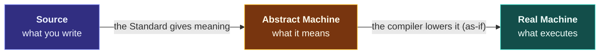

# The CPP Compendium

> [!essence]
> A conceptual atlas of C++. Every feature is explained as **the answer to a problem**, seen through **three lenses** (the source you write, the abstract machine that defines its meaning, and the real machine that runs it), and placed on **one map** of the language.

## The frame

Every note is written inside the same two frames, so hundreds of notes read as one work. Details are in the [[Charter]].

> [!tension] The Five Tensions: every C++ design decision takes a position on these
> **abstraction ⟷ control** · **value ⟷ identity** · **compile time ⟷ run time** · **safety ⟷ performance** · **compatibility ⟷ evolution**

## The Atlas

Open **[[Atlas.canvas|the Atlas canvas]]** to see the whole language on one board. Each domain answers one question:

<!-- cc:auto:home-domains -->
| | Domain | The question it answers | Progress |
|---|---|---|---|
| `D00` | [[Map — What C++ Is\|What C++ Is]] | What contract does C++ make between the programmer, the compiler and the machine? | `█░░░░░░░` 1/9 |
| `D01` | [[Map — Program Structure & Build\|Program Structure & Build]] | How does text in many files become one running program? | `░░░░░░░░` 1/18 |
| `D02` | [[Map — Types & Values\|Types & Values]] | How are meaning and operations attached to raw bits? | `░░░░░░░░` 1/25 |
| `D03` | [[Map — Expressions & Control\|Expressions & Control]] | How does a program compute a value and decide what to do next? | `█░░░░░░░` 1/12 |
| `D04` | [[Map — Objects, Memory & Lifetime\|Objects, Memory & Lifetime]] | Where does an object live, how long does it live, and who can reach it? | `█░░░░░░░` 4/26 |
| `D05` | [[Map — Functions\|Functions]] | How is computation named, parameterised, reused and passed around? | `░░░░░░░░` 1/16 |
| `D06` | [[Map — Classes & Encapsulation\|Classes & Encapsulation]] | How do we build new types that protect their own invariants? | `░░░░░░░░` 0/19 |
| `D07` | [[Map — Ownership & Move Semantics\|Ownership & Move Semantics]] | Who is responsible for releasing a resource, and how does responsibility transfer? | `█░░░░░░░` 2/19 |
| `D08` | [[Map — Inheritance & Polymorphism\|Inheritance & Polymorphism]] | How can one piece of code work with many types chosen at run time? | `█░░░░░░░` 2/15 |
| `D09` | [[Map — Generic Programming\|Generic Programming]] | How can one piece of code work with many types chosen at compile time? | `░░░░░░░░` 0/16 |
| `D10` | [[Map — Standard Library\|Standard Library]] | Which solved problems ship with the language, and how are they composed? | `░░░░░░░░` 0/30 |
| `D11` | [[Map — Errors & Contracts\|Errors & Contracts]] | What happens when an operation cannot do what it promised? | `░░░░░░░░` 0/11 |
| `D12` | [[Map — Concurrency\|Concurrency]] | How do multiple threads of execution share memory without corrupting it? | `░░░░░░░░` 0/17 |
| `D13` | [[Map — Performance & the Machine\|Performance & the Machine]] | What does the hardware actually do with our code, and how do we make it fast? | `░░░░░░░░` 0/15 |
| `D14` | [[Map — Tooling & Engineering\|Tooling & Engineering]] | Which tools turn correct-looking code into verified, maintainable software? | `░░░░░░░░` 0/11 |
| `D15` | [[Map — Design & Idioms\|Design & Idioms]] | Which recurring shapes of solution survive contact with real programs? | `░░░░░░░░` 0/14 |
| `D16` | [[Map — Evolution of C++\|Evolution of C++]] | How did the language get here, and where is it going? | `░░░░░░░░` 0/10 |
| `SRC` | Sources | What should be read, in what order, and for what? | `░░░░░░░░` 0/5 |
| `PRX` | Practice | How does knowledge become skill? | `░░░░░░░░` 0/3 |
| `HDR` | [[Map — Standard Headers\|Standard Headers]] | Where does each standard facility live, and what exactly does its header promise? | `██░░░░░░` 14/58 |
<!-- cc:end -->

## Progress

<!-- cc:auto:home-stats -->
| Planned | Draft | Revise | Reviewed | Evergreen | Total | Builder runs | Editor runs |
|---|---|---|---|---|---|---|---|
| 322 | 22 | 0 | 5 | 0 | 349 | 8 | 1 |

`██░░░░░░░░░░░░░░░░░░` **8%** of the Atlas written · last build 2026-09-23
<!-- cc:end -->

**Up next (Builder queue):**
<!-- cc:auto:home-next -->
1. [[Map — Classes & Encapsulation]] · *map* · `D06` — wave 0
2. [[Map — Generic Programming]] · *map* · `D09` — wave 0
3. [[Map — Standard Library]] · *map* · `D10` — wave 0
4. [[Map — Errors & Contracts]] · *map* · `D11` — wave 0
5. [[Map — Concurrency]] · *map* · `D12` — wave 0
6. [[Map — Performance & the Machine]] · *map* · `D13` — wave 0
<!-- cc:end -->

**Recently written:**
<!-- cc:auto:home-recent -->
- ◐ [[Map — Functions]] · *map* · updated 2026-09-23
- ◐ [[Map — Expressions & Control]] · *map* · updated 2026-09-23
- ● [[Value Categories]] · *concept* · updated 2026-09-23
- ◐ [[Map — Types & Values]] · *map* · updated 2026-09-23
- ◐ [[Header — cmath]] · *header* · updated 2026-09-23
- ◐ [[Header — cctype]] · *header* · updated 2026-09-23
- ◐ [[Map — Standard Headers]] · *map* · updated 2026-09-23
- ◐ [[Header — conio (non-standard)]] · *header* · updated 2026-09-23
- ◐ [[Header — sstream]] · *header* · updated 2026-09-23
- ◐ [[Header — ios]] · *header* · updated 2026-09-23
<!-- cc:end -->

## Start here

| If you want to… | Go to |
|---|---|
| Understand the strategy and the frame | [[Charter]] |
| Learn how notes are structured | [[Framework]] · [[Style Guide]] · [[Visual Language]] |
| See the best examples of each note type | [[Value Categories]] · [[Virtual Dispatch — vptr and vtable]] · [[RAII]] · [[Dangling Pointers and References]] · [[Pointers vs References]] · [[Map — Objects, Memory & Lifetime]] |
| Practise | [[Continuum Bridge]] (the 35 CPP Project Continuum projects ↔ concepts) |
| Read the books well | the `Guide —` notes in `03 Sources` |
| Check status | [[Coverage]] · the `00 System/Dashboards` bases · latest brief in `00 System/Briefs` |
| Steer the agents | edit [[Directives]] (pins, focus, holds): the Builder obeys it every hour |

## How the Compendium grows

An hourly **Builder** writes and verifies one note per run ([[Run Protocol]]). A daily **Editor-in-Chief** audits the work against a rubric, fixes or returns it, reorders the queue and publishes a **Daily Brief** ([[Audit Protocol]]). Every change is a git commit, recorded in the Ledger (`00 System/Ledger`).

> [!rule] You can edit anything, any time
> Your edits always win. Agents never overwrite a note you have uncommitted changes in, and they commit your edits as they are.
